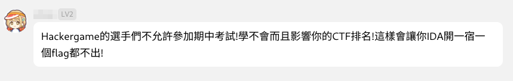
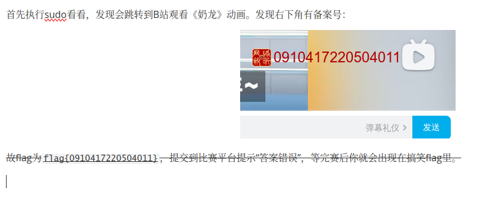
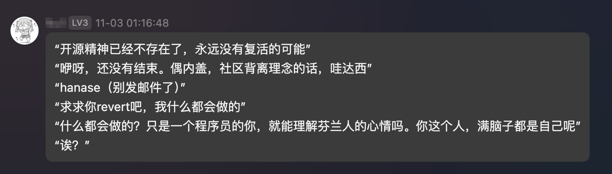

# 花絮

## Y*u





## T-5 文案提供感谢


## 来自组委会的吐槽


## Large Language Man


## 如你所愿



## 小红书领域大神


## 神人 TV

> [!NOTE]
>
> 在比赛开始前，为防止部分选手提前访问到题目，在去年部署题目服务器的 IP 上做点手脚：





## 口球 TV


## 作弊 TV


> [!WARNING]
>
> 比赛须知：
>
> > (...)
> >
> > 一人一个账号。无论出于何种理由和目的，以下行为均属于作弊行为：一人注册和使用多个账号参加比赛、多人共享一个账号参加比赛、登录他人账号。
> >
> > (...)


## 😎 奶茶 TV


---

## 选手花絮

> [!NOTE]
>
> 欢迎大家通过 Pull Request 的方式来向我们提交花絮！不过，提交之前，请将个人信息打码处理哦！

### ZFS（藏裤裆的 flag、花絮 来自[Palve](players/Palve/README.md)

作为 zfs ~~资深玩家~~，那么恢复几个文件肯定是绰绰有余，先给对应的镜像拖下来挂载到 mirrors 上（敲重点，~~后边要考~~）。拿到对应的 pool 之后先查看对应的快照 `zfs list -t snapshot` ，恢复其中的快照之后还是没看到对应的文件（挠头

既然是 zfs，肯定可以 `zfs send` ，默认情况下是明文发送的，那么手搓一个 stream 文件直接 grep 就能得到 flag

第二问我用 `testdisk` 恢复出来一个 shell script (f0008452.sh)，不会做，放弃（我怎么没用想到用 zdb 啊 悲）

```bash
#!/bin/sh
flag_key="hg2024_$(stat -c %X.%Y flag1.txt)_$(stat -c %X.%Y "$0")_zfs"
echo "46c518b175651d440771836987a4e7404f84b20a43cc18993ffba7a37106f508  -" > /tmp/sha256sum.txt
printf "%s" "$flag_key" | sha256sum --check /tmp/sha256sum.txt || exit 1
printf "flag{snapshot_%s}\n" "$(printf "%s" "$flag_key" | sha1sum | head -c 32)"
```

在做完这道题之后，**下意识**的执行了以下命令，进一步导致 mirrors 体面

```bash
sudo zfs unmount -a
```

其实执行之后发现有一段时间的卡顿，遂立即 `CTRL+C` 停止，幸运的是，hg2024 被成功 unmount 了，不幸的是，ubuntu 这个 repo 也被 unmount 掉了，其他 repo 暂时不受影响。至此，当事人并未发现任何异常，也没有检查原有的 dataset 的挂载状态便登出了服务器，直到...... 邮件一记[重锤](https://github.com/NYIST-CIPS/issues/issues/11)狠狠敲在当事人脑门。

见以下聊天记录	**hg 如何让几百公里外的镜像站体面**

```
Palve, [2024/11/2 21:41]
草

Palve, [2024/11/2 21:41]
我uuu的源呢

群友 A, [2024/11/2 21:41]
🤣🤣🤣

群友 B, [2024/11/2 21:42]
挂上了吗？

Palve, [2024/11/2 21:43]
好了

Palve, [2024/11/2 21:43]
为什么会掉mount point

群友 C, [2024/11/2 21:44]
因为你在老的inode上面

Palve, [2024/11/2 21:46]
破案了

Palve, [2024/11/2 21:47]
那会做 hackergame 的时候卸载 hg2024 这个 pool 时错误的下意识执行了 sudo zfs unmount -a

群友 D, [2024/11/2 21:48]
不是，你用 mirrors 服务器做 hg 题目吗

群友 A, [2024/11/2 21:49]
怎么大家都这么坏人

Palve, [2024/11/2 21:49]
包的（

Palve, [2024/11/2 21:50]
手头有zfs模块的就剩mirrors了

群友 C, [2024/11/2 21:50]
不是，你用 mirrors 服务器做 hg 题目吗

Palve, [2024/11/2 21:50]
我还用mirrors的机器编译kernel

Palve, [2024/11/2 21:50]
还有其他妙妙二进制

群友 E, [2024/11/2 21:50]
编译东西还好吧

群友 E, [2024/11/2 21:51]
你拿这个 zfs 直接做题，还 umount -a。。。

群友 E, [2024/11/2 21:51]
艺高人胆大，但是就怕一不小心就翻车了

Palve, [2024/11/2 21:51]
我当时执行完之后就 CTRL+C 了

Palve, [2024/11/2 21:52]
最终只有这一个 repo 被成功 unmount

群友 E, [2024/11/2 21:53]
《hg 如何让几百公里外的镜像站体面》


```

### 你这辈子就是被 Hackergame 毁了

> 摘自 [@PRO-2684 的 WP](https://pro-2684.github.io/?page=hg2024#%E8%8A%B1%E7%B5%AE)

你这辈子就是被 Hackergame 毁了。

你和妹子一起去打印资料，妹子说打印机好神奇，你却开始操作图书馆的智能终端，点开搜索界面开始搜「程序员的自我修养」，口若悬河地说这本书是科大图书馆 $2018$ 年的月度热搜第一，而这一切都归功于你最爱玩的网安原神。

弄好资料后妹子邀请你一起玩，你们决定先去中关村公园逛一逛。你和妹子一起坐地铁去西二旗站，一群人挤在地铁里，妹子害羞地贴在你身旁正要开口说什么，你却打断她说：你知道吗，中关村公园边上的积水潭医院就是「旅行照片 4.0」的取景地，为了找到这个医院我可是先从门锁画质的图片中定位到了 `CRH6F-A`，然后沿着怀柔线找了 $114$ 个小时。

快到公园时，妹子说自己在 🍠 浏览了有趣的故事想跟你分享，你跟妹子说：

1. 小红书搜“科里科气科创驿站”，排除几个错误答案
2. 小红书搜“中科大 ACG音乐节”
3. 小红书搜“打卡 六安 公园 彩虹路”
4. 小红书搜“打卡 石头 喷泉” ，这个需要手动往后翻一翻看看
5. 小红书搜“红色 四节 高铁”

到了景点后，妹子正在看着景点的中英文介绍，你却跟妹子说，这一段文字的信息熵疑似有点低了，可以用 *XZRJification Standard*，不断除掉多余的 e 和辅音字母，例如 [`creat`](https://stackoverflow.com/questions/8390979/why-create-system-call-is-called-creat) 和 [`referer`](https://stackoverflow.com/questions/8226075/why-http-referer-is-single-r-not-http-referrer)，最后还可以通过哈希保证信息的 integrity。

玩到了晚上后，妹子邀请你一起去饭店喝酒。喝到微醺的时候，妹子说，这么晚了等下去我家吧，你可以做你任何想做的事情喔。你问，真的吗？那我太高兴了。于是你给妹子科普，为了让 C++ 程序更加 international，最好不要用 `char` 存文件名，应该改用 `wchar_t`；但是某些版本的编译器及其自带的头文件中，文件名必须是 `char` 类型的 - 欸🤓👆，我们可以直接使用 `(char*)` 进行强制类型转换。

妹子一脸黑线的看着你，心中 $\texttt{0x6874}$ 只 `晥慬g` 在奔腾，你看着妹子的 `$input`，发现它 `=~ [$FORBIDDEN_CHARS]`，于是你回了句：

```text
Not Powerful Enough :)
```

### 余胜军说CTF

