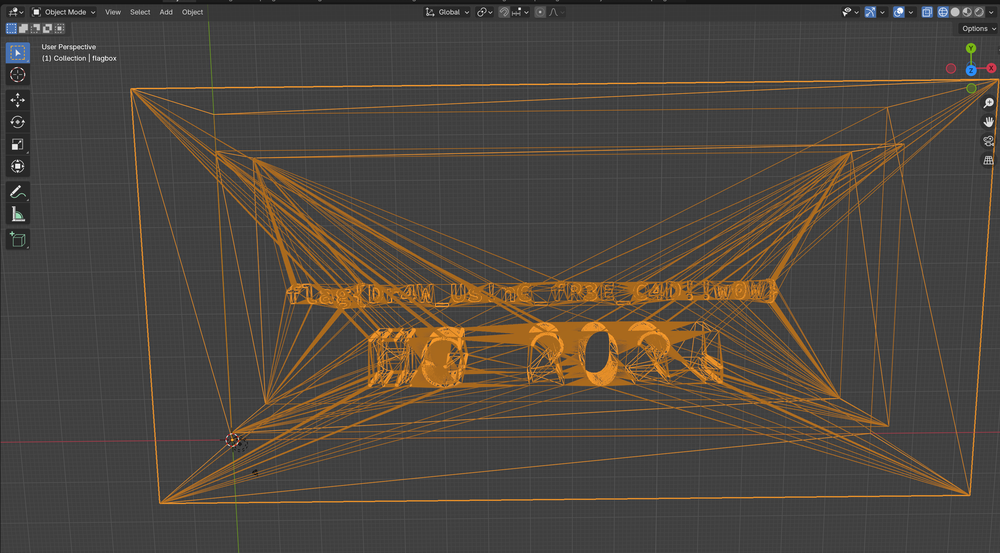
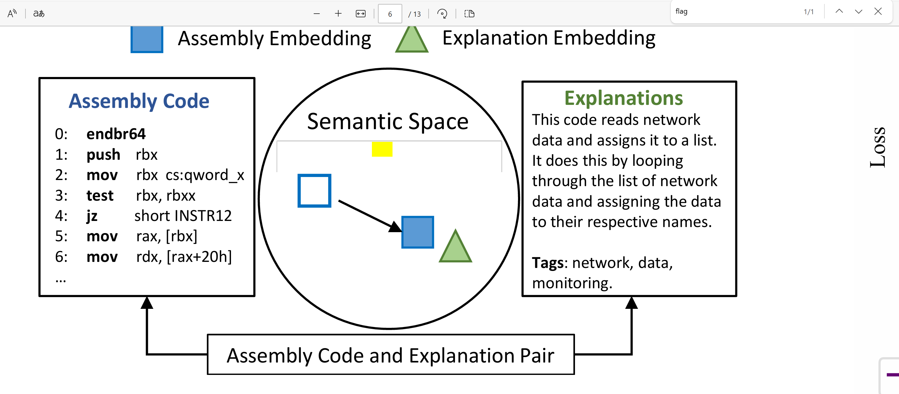
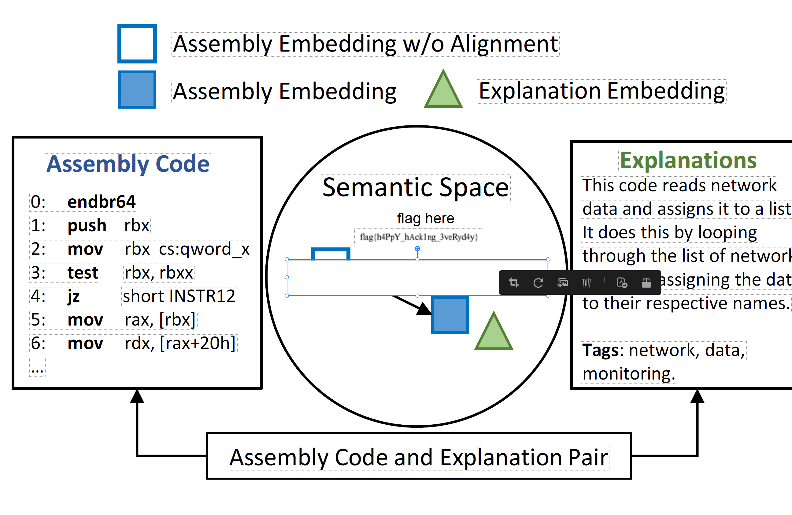
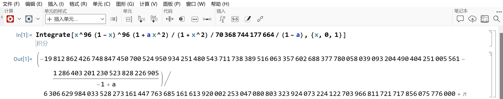

# Frank's Hackergame 2024 Writeup

> 好玩呢喵，明年也要再来呢喵

大一小蒟蒻，头回认真打CTF，感觉自己竟然没那么废物了（*

连着一个礼拜下来做题很爽（指被一堆 DDL 追赶的情况下高强度熬夜），特别鸣谢 **GPT** 老师！（救命恩人

认识到了好多大佬！明年再见米娜wwww

> 当前分数：4200，总排名：81 / 2460，浙江大学组内排名：7 / 44
> AI：150，binary：0，general：1500，math：1450，web：1100

## 签到

直接**等不及了，马上启动！**，发现链接跳转到`?pass=false`，于是改成`true`，就出flag了

> flag{WeLC0M3-7o-H@cK3RgaME-And-EnJOY-hAcKiNG-2024}

## 喜欢做签到的 CTFer 你们好呀

感觉，难点在于找  CTF 战队的招新主页（雾

Google 半天没搜到，然后翻微信公众号找到 Nebula 但没找到招新网页，最后找半天才看到主页**承办单位**里有🫠

点开[招新网页](https://www.nebuu.la/)，直接执行 `help`，然后提权 `sudo`，就~~启动B站大会员看了一下午奶龙了~~

实际上先出的第二个 flag，习惯性 `ls -a`，看到隐藏的文件，`cat .flag` 就可以拿到第二个 flag 了

第一个根据 `help` 提示挨个执行一遍，就可以在 `env` 里看到存在环境变量了

> flag{actually_theres_another_flag_here_trY_to_f1nD_1t_y0urself___join_us_ustc_nebula}
>
> flag{0k_175_a_h1dd3n_s3c3rt_f14g___please_join_us_ustc_nebula_anD_two_maJor_requirements_aRe_shown_somewhere_else}

## 猫咪问答（Hackergame 十周年纪念版）

1. 第一题进 LUG 的 [Hackergame](https://lug.ustc.edu.cn/wiki/lug/events/hackergame/) 活动记录，点开[第二届](https://lug.ustc.edu.cn/wiki/sec/contest.html)就是
2. 这题还挺麻烦，我是翻了近五年的 Writeup，然后最接近是 19 年的，就去 LUG 上找到了这篇 [post](https://lug.ustc.edu.cn/news/2019/12/hackergame-2019/)，文中就提到了注册人数
3. 打开 [18 年的 Writeup](https://github.com/ustclug/hackergame2018-writeups/tree/master)，实际上我没翻到下面的花絮，直接点开了那年的**猫咪问答**，凭借~~敏锐的嗅觉~~看到了中文书名，填了就是
4. 进了 [USENIX Security 24‘](https://www.usenix.org/conference/usenixsecurity24) 的官网，但是翻论文没找到这篇，索性直接 Google USTC USENIX Security，然后找到了文件，最后丢给 GPT 帮我找下多少种就好
5. 最容易的一题，随便找个新闻都能跳转到 commit 记录
6. 去 Huggingface 上申请被拒，试了换国籍也不行，于是就换到 ModelScope 下载下来，现学下 tokenizer 就出来了（但我跑出来结果是 1836，就加加减减试了下出来了

> flag{α_gØOD_c4T_iS_th3_CaT_wHo_C4N_pAS$_7he_Qu!Z}
>
> flag{7EИ_ye4rS_Øf_haCk3rg@Me_ØM3De7oบ_W1th_NEK0_QU1Z}

## 打不开的盒

直接丢到 Blender，打开 X-ray 就可以看到内部了



> flag{Dr4W_Us!nG_fR3E_C4D!!w0W}

## 每日论文太多了！

浏览器打开后 Ctrl + F 搜索 flag，可以看到下面有一块被标记了



大抵是被白色色块挡住了，丢进 Adobe Acrobat，编辑 PDF，移开色块就可以看到 flag 了


话说，原来，正式论文可以这样的吗（... 别 Go 了，还再 Go

> flag{h4PpY_hAck1ng_3veRyd4y}

## 比大小王

鉴定为**最热最新时尚潮流**，之前 ZJUCTF 才做过这样的题，真是刺激又好玩啊（！

打开 Console，看了眼 script 的内容，发现是通过一个 submit 的函数调用提交答案的，那我手动提交不就好了，直接在 Console 里写代码

```javascript
for (var i in state.values) {
    if (state.values[i][0]<state.values[i][1]) state.inputs.push('<')
    if (state.values[i][0]>state.values[i][1]) state.inputs.push('>')
}
inputs = state.inputs
submit(inputs)
```

然后会提示**时空穿越**，猜测服务器也有一个计时器，那就等个几秒快结束提交就好了

> flag{!-4m-The-HACKeR-k1N9-0F-cOMp@rINg-nUM63rs-2024}

## 旅行照片 4.0

不要图寻了，图寻这种事情，不要啊啊啊啊啊啊啊啊啊啊！

1. 校门我甚至懒得搜，直接开试，第一个就试了**东校区西门**然后结束（怎么还有小红书大法，🍠 is all you need）ACG 音乐会可以搜到 B 站的视频，简介里就有日期
2. 可以看到垃圾桶有模糊的**六安**字样，带着六安搜彩虹跑道，可以找到这篇[新闻](https://www.sohu.com/a/498872898_100023473)，第二问 Google 搜图就可以看到景点地区了
3. 我不玩 まいてつ（不是铁道迷呜呜呜。。。一开始没注意到车型，把全国动车运用所翻了一遍没翻到，最后其实四编组算提示了，搜一下车型，对着涂装可以看到是怀密号，对着卫星图从起始站北京北往上拉一点就是，红房子和医院的弯角还是很明显的


## Node.js is Web Scale

查看源代码，可以看到这一段处理输入的

```javascript
// POST /set - Set a key-value pair in the store
app.post("/set", (req, res) => {
  const { key, value } = req.body;

  const keys = key.split(".");
  let current = store;

  for (let i = 0; i < keys.length - 1; i++) {
    const key = keys[i];
    if (!current[key]) {
      current[key] = {};
    }
    current = current[key];
  }

  // Set the value at the last key
  current[keys[keys.length - 1]] = value;

  res.json({ message: "OK" });
});
```

`keys` 是直接 `split` 的，那就可以嵌套键了，上原型链污染，设置 key 为 `__proto__.injection`，value 为 `cat /flag`，再访问 `/execute?cmd=injection` 就可以拿到 flag 了

> flag{n0_pr0topOIl_50_U5E_new_Map_1n5teAD_Of_0bject2kv_500da5d6df}

## PaoluGPT

第一问从词条里找 flag，就写了个爬虫速速结束，没什么好说的，藏在 `6f85a472-7011-4285-a482-a365e44b5ed5` 里

第二问看源文件的 SQL 语句

```python
@app.route("/list")
def list():
    results = execute_query("select id, title from messages where shown = true", fetch_all=True)
    messages = [Message(m[0], m[1], None) for m in results]
    return render_template("list.html", messages=messages)
```

诶，怎么有个 `show = true`，那必定藏在 `show = false` 了，**SQL 注入**启动，访问 `/view?conversation_id=' or shown = false --'` 拉到底部就是第二个 flag

> flag{zU1_xiA0_de_11m_Pa0lule!!!_59fa92ae85}
>
> flag{enJ0y_y0uR_Sq1_&_1_would_xiaZHOU_hUI_guo_0c58320fa6}

## 强大的正则表达式

第一问想到判定 16 能否被整除看尾数是不是 16 的倍数，枚举一下尾数就好了

```
(0|1|2|3|4|5|6|7|8|9)*(0000|0016|0032|0048|0064|0080|0096|0112|0128|0144|0160|0176|0192|0208|0224|0240|0256|0272|0288|0304|0320|0336|0352|0368|0384|0400|0416|0432|0448|0464|0480|0496|0512|0528|0544|0560|0576|0592|0608|0624|0640|0656|0672|0688|0704|0720|0736|0752|0768|0784|0800|0816|0832|0848|0864|0880|0896|0912|0928|0944|0960|0976|0992|1008|1024|1040|1056|1072|1088|1104|1120|1136|1152|1168|1184|1200|1216|1232|1248|1264|1280|1296|1312|1328|1344|1360|1376|1392|1408|1424|1440|1456|1472|1488|1504|1520|1536|1552|1568|1584|1600|1616|1632|1648|1664|1680|1696|1712|1728|1744|1760|1776|1792|1808|1824|1840|1856|1872|1888|1904|1920|1936|1952|1968|1984|2000|2016|2032|2048|2064|2080|2096|2112|2128|2144|2160|2176|2192|2208|2224|2240|2256|2272|2288|2304|2320|2336|2352|2368|2384|2400|2416|2432|2448|2464|2480|2496|2512|2528|2544|2560|2576|2592|2608|2624|2640|2656|2672|2688|2704|2720|2736|2752|2768|2784|2800|2816|2832|2848|2864|2880|2896|2912|2928|2944|2960|2976|2992|3008|3024|3040|3056|3072|3088|3104|3120|3136|3152|3168|3184|3200|3216|3232|3248|3264|3280|3296|3312|3328|3344|3360|3376|3392|3408|3424|3440|3456|3472|3488|3504|3520|3536|3552|3568|3584|3600|3616|3632|3648|3664|3680|3696|3712|3728|3744|3760|3776|3792|3808|3824|3840|3856|3872|3888|3904|3920|3936|3952|3968|3984|4000|4016|4032|4048|4064|4080|4096|4112|4128|4144|4160|4176|4192|4208|4224|4240|4256|4272|4288|4304|4320|4336|4352|4368|4384|4400|4416|4432|4448|4464|4480|4496|4512|4528|4544|4560|4576|4592|4608|4624|4640|4656|4672|4688|4704|4720|4736|4752|4768|4784|4800|4816|4832|4848|4864|4880|4896|4912|4928|4944|4960|4976|4992|5008|5024|5040|5056|5072|5088|5104|5120|5136|5152|5168|5184|5200|5216|5232|5248|5264|5280|5296|5312|5328|5344|5360|5376|5392|5408|5424|5440|5456|5472|5488|5504|5520|5536|5552|5568|5584|5600|5616|5632|5648|5664|5680|5696|5712|5728|5744|5760|5776|5792|5808|5824|5840|5856|5872|5888|5904|5920|5936|5952|5968|5984|6000|6016|6032|6048|6064|6080|6096|6112|6128|6144|6160|6176|6192|6208|6224|6240|6256|6272|6288|6304|6320|6336|6352|6368|6384|6400|6416|6432|6448|6464|6480|6496|6512|6528|6544|6560|6576|6592|6608|6624|6640|6656|6672|6688|6704|6720|6736|6752|6768|6784|6800|6816|6832|6848|6864|6880|6896|6912|6928|6944|6960|6976|6992|7008|7024|7040|7056|7072|7088|7104|7120|7136|7152|7168|7184|7200|7216|7232|7248|7264|7280|7296|7312|7328|7344|7360|7376|7392|7408|7424|7440|7456|7472|7488|7504|7520|7536|7552|7568|7584|7600|7616|7632|7648|7664|7680|7696|7712|7728|7744|7760|7776|7792|7808|7824|7840|7856|7872|7888|7904|7920|7936|7952|7968|7984|8000|8016|8032|8048|8064|8080|8096|8112|8128|8144|8160|8176|8192|8208|8224|8240|8256|8272|8288|8304|8320|8336|8352|8368|8384|8400|8416|8432|8448|8464|8480|8496|8512|8528|8544|8560|8576|8592|8608|8624|8640|8656|8672|8688|8704|8720|8736|8752|8768|8784|8800|8816|8832|8848|8864|8880|8896|8912|8928|8944|8960|8976|8992|9008|9024|9040|9056|9072|9088|9104|9120|9136|9152|9168|9184|9200|9216|9232|9248|9264|9280|9296|9312|9328|9344|9360|9376|9392|9408|9424|9440|9456|9472|9488|9504|9520|9536|9552|9568|9584|9600|9616|9632|9648|9664|9680|9696|9712|9728|9744|9760|9776|9792|9808|9824|9840|9856|9872|9888|9904|9920|9936|9952|9968|9984)
```

第二问去 Google 了相关内容，找到一篇 [Stack Overflow](https://stackoverflow.com/questions/12403842/check-number-divisibility-with-regular-expressions)，里面介绍了 DFA 的有关内容，但我没学过加上时间紧张，直接找了[轮子](https://s3.boskent.com/divisibility-regex/divisibility-regex.html)生成了，轮子大法好（！

```
(0|1101|111(011)*0101|(1000|111(011)*(1|00)00)(10|01(011)*(1|00)00)*(001|01(011)*0101)|(1001|111(011)*(1|00)01|(1000|111(011)*(1|00)00)(10|01(011)*(1|00)00)*(11|01(011)*(1|00)01))11|(1010|111(011)*(1|00)10|(1000|111(011)*(1|00)00)(10|01(011)*(1|00)00)*01(011)*(1|00)10|(1001|111(011)*(1|00)01|(1000|111(011)*(1|00)00)(10|01(011)*(1|00)00)*(11|01(011)*(1|00)01))00)(0(011)*(1|00)10|(1|0(011)*(1|00)00)(10|01(011)*(1|00)00)*01(011)*(1|00)10|(0(011)*(1|00)01|(1|0(011)*(1|00)00)(10|01(011)*(1|00)00)*(11|01(011)*(1|00)01))00)*(0(011)*0101|(1|0(011)*(1|00)00)(10|01(011)*(1|00)00)*(001|01(011)*0101)|(0(011)*(1|00)01|(1|0(011)*(1|00)00)(10|01(011)*(1|00)00)*(11|01(011)*(1|00)01))11)|(1011|111(011)*(1|00)11|(1000|111(011)*(1|00)00)(10|01(011)*(1|00)00)*01(011)*(1|00)11|(1001|111(011)*(1|00)01|(1000|111(011)*(1|00)00)(10|01(011)*(1|00)00)*(11|01(011)*(1|00)01))01|(1010|111(011)*(1|00)10|(1000|111(011)*(1|00)00)(10|01(011)*(1|00)00)*01(011)*(1|00)10|(1001|111(011)*(1|00)01|(1000|111(011)*(1|00)00)(10|01(011)*(1|00)00)*(11|01(011)*(1|00)01))00)(0(011)*(1|00)10|(1|0(011)*(1|00)00)(10|01(011)*(1|00)00)*01(011)*(1|00)10|(0(011)*(1|00)01|(1|0(011)*(1|00)00)(10|01(011)*(1|00)00)*(11|01(011)*(1|00)01))00)*(0(011)*(1|00)11|(1|0(011)*(1|00)00)(10|01(011)*(1|00)00)*01(011)*(1|00)11|(0(011)*(1|00)01|(1|0(011)*(1|00)00)(10|01(011)*(1|00)00)*(11|01(011)*(1|00)01))01))(001|(1|000)(0(011)*(1|00)10|(1|0(011)*(1|00)00)(10|01(011)*(1|00)00)*01(011)*(1|00)10|(0(011)*(1|00)01|(1|0(011)*(1|00)00)(10|01(011)*(1|00)00)*(11|01(011)*(1|00)01))00)*(0(011)*(1|00)11|(1|0(011)*(1|00)00)(10|01(011)*(1|00)00)*01(011)*(1|00)11|(0(011)*(1|00)01|(1|0(011)*(1|00)00)(10|01(011)*(1|00)00)*(11|01(011)*(1|00)01))01))*(011|(1|000)(0(011)*(1|00)10|(1|0(011)*(1|00)00)(10|01(011)*(1|00)00)*01(011)*(1|00)10|(0(011)*(1|00)01|(1|0(011)*(1|00)00)(10|01(011)*(1|00)00)*(11|01(011)*(1|00)01))00)*(0(011)*0101|(1|0(011)*(1|00)00)(10|01(011)*(1|00)00)*(001|01(011)*0101)|(0(011)*(1|00)01|(1|0(011)*(1|00)00)(10|01(011)*(1|00)00)*(11|01(011)*(1|00)01))11))|(1100|111(011)*0100|(1000|111(011)*(1|00)00)(10|01(011)*(1|00)00)*(000|01(011)*0100)|(1001|111(011)*(1|00)01|(1000|111(011)*(1|00)00)(10|01(011)*(1|00)00)*(11|01(011)*(1|00)01))10|(1010|111(011)*(1|00)10|(1000|111(011)*(1|00)00)(10|01(011)*(1|00)00)*01(011)*(1|00)10|(1001|111(011)*(1|00)01|(1000|111(011)*(1|00)00)(10|01(011)*(1|00)00)*(11|01(011)*(1|00)01))00)(0(011)*(1|00)10|(1|0(011)*(1|00)00)(10|01(011)*(1|00)00)*01(011)*(1|00)10|(0(011)*(1|00)01|(1|0(011)*(1|00)00)(10|01(011)*(1|00)00)*(11|01(011)*(1|00)01))00)*(0(011)*0100|(1|0(011)*(1|00)00)(10|01(011)*(1|00)00)*(000|01(011)*0100)|(0(011)*(1|00)01|(1|0(011)*(1|00)00)(10|01(011)*(1|00)00)*(11|01(011)*(1|00)01))10)|(1011|111(011)*(1|00)11|(1000|111(011)*(1|00)00)(10|01(011)*(1|00)00)*01(011)*(1|00)11|(1001|111(011)*(1|00)01|(1000|111(011)*(1|00)00)(10|01(011)*(1|00)00)*(11|01(011)*(1|00)01))01|(1010|111(011)*(1|00)10|(1000|111(011)*(1|00)00)(10|01(011)*(1|00)00)*01(011)*(1|00)10|(1001|111(011)*(1|00)01|(1000|111(011)*(1|00)00)(10|01(011)*(1|00)00)*(11|01(011)*(1|00)01))00)(0(011)*(1|00)10|(1|0(011)*(1|00)00)(10|01(011)*(1|00)00)*01(011)*(1|00)10|(0(011)*(1|00)01|(1|0(011)*(1|00)00)(10|01(011)*(1|00)00)*(11|01(011)*(1|00)01))00)*(0(011)*(1|00)11|(1|0(011)*(1|00)00)(10|01(011)*(1|00)00)*01(011)*(1|00)11|(0(011)*(1|00)01|(1|0(011)*(1|00)00)(10|01(011)*(1|00)00)*(11|01(011)*(1|00)01))01))(001|(1|000)(0(011)*(1|00)10|(1|0(011)*(1|00)00)(10|01(011)*(1|00)00)*01(011)*(1|00)10|(0(011)*(1|00)01|(1|0(011)*(1|00)00)(10|01(011)*(1|00)00)*(11|01(011)*(1|00)01))00)*(0(011)*(1|00)11|(1|0(011)*(1|00)00)(10|01(011)*(1|00)00)*01(011)*(1|00)11|(0(011)*(1|00)01|(1|0(011)*(1|00)00)(10|01(011)*(1|00)00)*(11|01(011)*(1|00)01))01))*(010|(1|000)(0(011)*(1|00)10|(1|0(011)*(1|00)00)(10|01(011)*(1|00)00)*01(011)*(1|00)10|(0(011)*(1|00)01|(1|0(011)*(1|00)00)(10|01(011)*(1|00)00)*(11|01(011)*(1|00)01))00)*(0(011)*0100|(1|0(011)*(1|00)00)(10|01(011)*(1|00)00)*(000|01(011)*0100)|(0(011)*(1|00)01|(1|0(011)*(1|00)00)(10|01(011)*(1|00)00)*(11|01(011)*(1|00)01))10)))(1|0(001|(1|000)(0(011)*(1|00)10|(1|0(011)*(1|00)00)(10|01(011)*(1|00)00)*01(011)*(1|00)10|(0(011)*(1|00)01|(1|0(011)*(1|00)00)(10|01(011)*(1|00)00)*(11|01(011)*(1|00)01))00)*(0(011)*(1|00)11|(1|0(011)*(1|00)00)(10|01(011)*(1|00)00)*01(011)*(1|00)11|(0(011)*(1|00)01|(1|0(011)*(1|00)00)(10|01(011)*(1|00)00)*(11|01(011)*(1|00)01))01))*(010|(1|000)(0(011)*(1|00)10|(1|0(011)*(1|00)00)(10|01(011)*(1|00)00)*01(011)*(1|00)10|(0(011)*(1|00)01|(1|0(011)*(1|00)00)(10|01(011)*(1|00)00)*(11|01(011)*(1|00)01))00)*(0(011)*0100|(1|0(011)*(1|00)00)(10|01(011)*(1|00)00)*(000|01(011)*0100)|(0(011)*(1|00)01|(1|0(011)*(1|00)00)(10|01(011)*(1|00)00)*(11|01(011)*(1|00)01))10)))*0(001|(1|000)(0(011)*(1|00)10|(1|0(011)*(1|00)00)(10|01(011)*(1|00)00)*01(011)*(1|00)10|(0(011)*(1|00)01|(1|0(011)*(1|00)00)(10|01(011)*(1|00)00)*(11|01(011)*(1|00)01))00)*(0(011)*(1|00)11|(1|0(011)*(1|00)00)(10|01(011)*(1|00)00)*01(011)*(1|00)11|(0(011)*(1|00)01|(1|0(011)*(1|00)00)(10|01(011)*(1|00)00)*(11|01(011)*(1|00)01))01))*(011|(1|000)(0(011)*(1|00)10|(1|0(011)*(1|00)00)(10|01(011)*(1|00)00)*01(011)*(1|00)10|(0(011)*(1|00)01|(1|0(011)*(1|00)00)(10|01(011)*(1|00)00)*(11|01(011)*(1|00)01))00)*(0(011)*0101|(1|0(011)*(1|00)00)(10|01(011)*(1|00)00)*(001|01(011)*0101)|(0(011)*(1|00)01|(1|0(011)*(1|00)00)(10|01(011)*(1|00)00)*(11|01(011)*(1|00)01))11)))*
```

顺便提醒一下，不要粘到浏览器 xterm 里，应该是单行过长被截了（？），会过不掉，要在本地开 nc 连接

> flag{p0werful_r3gular_expressi0n_easy_567f2ca9cb}
>
> flag{pow3rful_r3gular_expressi0n_medium_b1fe90f726}

## 惜字如金 3.0

只会做第一问，代码补全就好了

crc 不会不会跑路了

> flag{C0mpl3ted-Th3-Pyth0n-C0de-N0w}

## 优雅的不等式

思路来源于[如何优雅地证明 $\pi$ 的立方大于 31](https://www.bilibili.com/video/BV1nb4y1u72V?spm_id_from=333.788.recommend_more_video.0&vd_source=37c11ab2b88c5affc6c25ad1ef9b0f40)，大佬讲了注意力的来源（*
$$
\begin{gathered}
2 m \equiv n \bmod 4 \Rightarrow \int_0^1 \frac{x^m(1-x)^n\left(a+b x^2\right)}{1+x^2} d x=z-\pi \\
(m, n)=(3,2),(5,2),(4 k, 4 k) \cdots
\end{gathered}
$$
一开始试的 $m=5$ 和 $n=2$，然后可以通过 Easy，Hard 精度不够

于是开了 Mathematica 帮我算了算



然后丢给 Sympy 就好了（不给 Sympy 上压力

```python
import numpy as np
import sympy
import pwn
import time

r=pwn.remote('202.38.93.141', 14514)
time.sleep(2)
print(r.recv())
r.sendline(token)
time.sleep(2)
x,a = sympy.symbols('x,a')
eq = (-19812862426748847450700524950934251480543711738389516063357602688377780058039093204490404251005561 - 1286403201230523828226905/(-1 + a))/6306629984033528273161447763685161613920002253047080803323924073224122703966811721717856075776000

for i in range(40):
    data = str(r.recv(),encoding='UTF-8')
    print(data)
    index1 = data.find('=')
    index2 = data.find('Enter')
    x,a = sympy.symbols('x,a')
    frac = sympy.sympify(data[index1+1:index2-1])
    aans = sympy.solve(eq+frac, a)
    ans = sympy.simplify(x**96*(1 - x)**96*(1 + aans[0]*x**2)/(1 + x**2)/70368744177664/(1 - aans[0]))
    print('-----------    %d    -----------' % (i+1))
    print(ans)
    r.sendline(str(ans).encode('UTF-8'))
    if i == 39:
        r.interactive()
    time.sleep(1)
```

ATTENTION is all you need!

> flag{y0u_ar3_g0od_at_constructi0n_5cabc06d44}
>
> flag{y0u_ar3_7he_Ramanujan_0f_in3quality_2ed901d52c}

## 不太分布式的软总线

这题会面向 GPT 编程就行了，全问 ChatGPT，结束三问（怎么不会 DBus 也能做（速速出 AIGC

就不粘代码了，爬去学学 DBus

> flag{every_11nuxdeskT0pU5er_uSeDBUS_bUtn0NeknOwh0w_3b92499170}
>
> flag{n5tw0rk_TrAnSpaR5Ncy_d0n0t_11k5_Fd_3912144896}
>
> flag{prprprprprCTL_15your_FRiEND_5b294e4167}

## 关灯

> 到底是谁在关第四盏灯啊？

经典的 Lights Out 问题，但拓展到了三维，照葫芦画瓢解线性方程组就可以了

由于是布尔方程组，不知道 GF(2) 的我，找不到轮子，就手写高斯消元了

```python
from numba import njit
import numpy as np

@njit
def gaussin(X, n):
    for k in range(0, n):
        i = k
        while i<n and X[i,k]==0:
            i+=1
        if i==n:
            continue
        if i!=k:
            tmp = X[i, :].copy()
            X[i, :] = X[k, :]
            X[k, :] = tmp
        for i in range(n):
            if k!=i and X[i][k]:
                X[i][k:] = X[k][k:]^X[i][k:]
    return(X[:,n])

@njit
def initial(n):
    A = np.zeros((n**3, n**3), dtype=np.uint)
    for x in range(n):
        for y in range(n):
            for z in range(n):
                i = x * n**2 + y * n + z
                A[i, i] = 1
                neighbors = [
                    (x + 1, y, z), (x - 1, y, z),
                    (x, y + 1, z), (x, y - 1, z),
                    (x, y, z + 1), (x, y, z - 1)
                ]
                for nx, ny, nz in neighbors:
                    if 0 <= nx < n and 0 <= ny < n and 0 <= nz < n:
                        j = nx * n**2 + ny * n + nz
                        A[j, i] = 1
    return A

initial(1)
gaussin(np.array([[1,1]]),1)

init_st = input()

n = int(np.cbrt(len(init_st)))
A = initial(n)
B = np.transpose(np.array([[int(char) for char in init_st]],dtype=np.uint))

C = np.hstack((A, B))
ans = gaussin(C,n**3)
print(''.join(map(str,ans)))
```

当然，直接开了 $n^6$ 的数组必然是会爆内存的，可以稀疏矩阵优化一下，不过应对前 3 问够了，第 4 问算法优化也不太会（可怜一下大一上还没上线代的孩子*

> flag{bru7e_f0rce_1s_a1l_y0u_n3ed_89a32e6416}
>
> flag{prun1ng_1s_u5eful_36f0359859}
>
> flag{lin3ar_alg3bra_1s_p0werful_f3cdb5f0d2}

## 禁止内卷

不看题的孩子早遭罪，看到可以计算平方差，用平方差公式就试两次就能出真实值了，但是，欸：

```python
def get_answer():
    # scoring with answer
    # I could change answers anytime so let's just load it every time
    with open("answers.json") as f:
        answers = json.load(f)
        # sanitize answer
        for idx, i in enumerate(answers):
            if i < 0:
                answers[idx] = 0
    return answers
```

sanitize 这种事不要啊啊啊啊！然后思路转回到 flask 上，没用过 flask，看了几篇文章试图获得 debug console 无果，然后注意到路径没过滤，就尝试上传文件覆盖掉这个 `app.py` 就可以了

```python
import httpx

files = {'file': ('../web/app.py',open('app.py','rb'))}
r = httpx.post('/submit',files=files,follow_redirects=True)
print(r.text)
```

用了 httpx 篡改请求，发送覆盖就可以直接出 flag 了

> flag{uno!!!!_esrever_now_U_run_MY_c0de1b501d76a8}

## 零知识数独

第一问纯做数独，随便找个 sudoku solver 就可以解决（能不动脑子的才不会翻网页源代码呢（哼

第二问算是一个对零知识的 intro，看一下 snarkjs 的文档学一下就行（不知道我用 circom 编译后为什么会报错，可以直接用下面这条指令

```bash
snarkjs g16f input.json sudoku.wasm sudoku.zkey proof.json public.json
```

`input.json` 的格式观察一下 `sudoku.circom` 就可以得到

（第三问找漏洞失败了

> flag{SUD0KU_M45T3R_You_Have_Shown_Y0ur_Know1edge_ac5207a9}
>
> flag{you_are_a_5udoku_expert_and_pr0ved_your_kn0wledge_52c069e53d}

## 先不说关于我从零开始独自在异世界转生成某大厂家的 LLM 龙猫女仆这件事可不可能这么离谱，发现 Hackergame 内容审查委员会忘记审查题目标题了ごめんね，以及「这么长都快赶上轻小说了真的不会影响用户体验吗🤣」

> 是的，用户体验极差
>
> 笑点解析：xxxx

丢给 ChatGPT，转出来，关键在于对 `xxxx` 的还原，GPT 给的是 `race`，我瞪着看了十分钟才找出来应该是 `game`，害人不浅啊（

>flag{llm_lm_lm_koshitantan_fa7b655c38bc8847}

## 碎碎念

算是第一回正式参加 CTF，学到很多，也有太多赛后拍断大腿的题目（

感觉很久没有真么专注地做东西的一个礼拜，找回了高中丢掉的一些东西

米娜明年再见~
