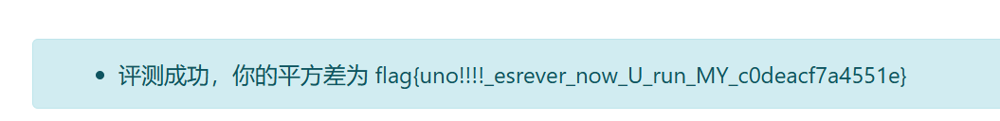

# 犬戎's Writeup for Hackergame 2024

看了官方 Writeup 之后觉得自己没什么要写的了

这里就更着重强调一些个人的非预期 / 独特 (?) 的解法吧！

本文采用 [CC0 1.0 Universal](https://creativecommons.org/publicdomain/zero/1.0/) 进行授权

## 猫咪问答 Q4 & Q6

对不起第四问和第六问我是爆破的（对手指）

[代码见此](catquiz/crack.py)

## 旅行照片 Q5

截取这个部分进行谷歌识图


第一条直接是这个


不能说很像，简直就是一模一样

## PowerfulShell

可是我拿到 0 了耶

```sh
__=~                    # /players
___=$[]                 # 0
____=$-                 # hB

${__:7:1}               # s
${____:___:1}           # h
${__:7:1}${____:___:1}  # sh
```

## 强大的正则表达式

其实做的时候是打算打完了洋洋洒洒写一篇博客的，但完赛了发现对于看过龙书的人来说简直 trivial 所以瞬间就不想写了。:(

## 优雅的不等式 

我使用的是这个积分

$$
\int_0^1 \frac{x^{2n} \left( 1 - x^2 \right)^n \left(a + b x^2\right)}{1 + x^2} \mathrm{d}x
$$

结果是 $p\pi - q$ 的形式，积出来然后解方程就可以解出 $a, b$ 了

注意由于要满足 $a + bx^2 > 0$，所以 $a > 0$ 且 $a + b > 0$，需要 $n$ 足够大；其中 $p, q$ 越大，所需的 $n$ 也会越大

最初的想法是对于每一个测试点都可以不断枚举 $n$，然而先帝创业未半而 `SIGKILL`

试了一下发现题目环境给的测试点所对应的 $n$ 单调不减，那就按单调不减来写了懒得证（喂。）

代码见此
- [interact.py](attention/interact.py)
- [algo.py](attention/algo.py)

## 不太分布式的软总线

大家都是用 C 写的，这里给一个 Rust 版吧

[代码见此](dbus/main.rs)

## 禁止内卷

替换 `app.py` 没什么好说的；

但笑点解析：

```json
[37, 43, 32, 38, 58, 52, 45, 46, 0, 0, 0, 0, 30, 36, 50, 49, 36, 53, 36, 49, 30, 45, 46, 54, 30, 20, 30, 49, 52, 45, 30, 12, 24, 30, 34, 0, 35, 36, 32, 34, 37, 0, 32, 0, 0, 0, 0, 36, 60]
```
然后得到 `flag{unoAAAA_esrever_now_U_run_MY_cAdeacfAaAAAAe}` 全是 A！

因为我偷懒直接输出 `answers` 变量而不是 `answers.json` 了，结果拿到的数据全是零蛋！然后我还没反应过来 sanitize 其实是在 `app.py` 里进行的，以为 `answers.json` 肯定也被 sanitize 过（有笨蛋）

总之是另寻他路了；`ls` 了一下发现有个 `prerun.py`，看一下发现有这两行

```python
with open("/flag") as f: 
    flag = f.read().strip()
```

然后我的手就直接伸到 `/flag` 那里去了：

```python
flag = open("/flag", "r").read()
flash(f"评测成功，你的平方差为 {flag}")
```



## Epilogue
欢迎来我的博客玩！[犬窝闲谭](https://inuebisu.cn)