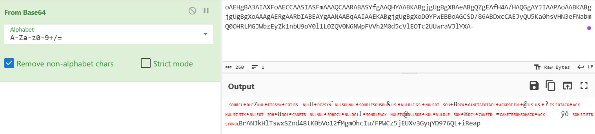
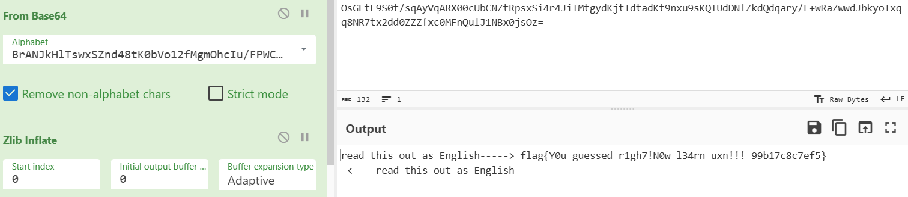

# Hackergame 2024 Writeup by lone

> 博客：https://thely314.github.io/

## 签到
注意到 ?pass=false，改成true即可

## 喜欢做签到的 CTFer 你们好呀
到中科大校 CTF 战队页 https://www.nebuu.la/ ，是终端风格

习惯性`ls -lah`，找到第二个flag(草)；help看看支持什么操作，`env`找到第一个flag

## 猫咪问答（Hackergame 十周年纪念版）
搜索引擎启动

1.在 Hackergame 2015 比赛开始前一天晚上开展的赛前讲座是在哪个教室举行的？（30 分）

https://lug.ustc.edu.cn/wiki/lug/events/hackergame/

搜了一会，才知道那时候不叫Hackergame

https://lug.ustc.edu.cn/wiki/sec/contest.html

确定 3A204

2.众所周知，Hackergame 共约 25 道题目。近五年（不含今年）举办的 Hackergame 中，题目数量最接近这个数字的那一届比赛里有多少人注册参加？（30 分）
2023：29题，超过 4100 人

2022：33题，超过 4500 人

2021：31题，4023人注册

2020：31题，3733人注册

2019：28题，2682人注册

确定 2682（话说今年怎么这么多题）

3.Hackergame 2018 让哪个热门检索词成为了科大图书馆当月热搜第一？（20 分）

程序员的自我修养

4.在今年的 USENIX Security 学术会议上中国科学技术大学发表了一篇关于电子邮件伪造攻击的论文，在论文中作者提出了 6 种攻击方法，并在多少个电子邮件服务提供商及客户端的组合上进行了实验？（10 分）

https://www.usenix.org/system/files/usenixsecurity24-ma-jinrui.pdf

第一眼以为 20 + 16 = 36，没成功，再看一眼发现是 336 combinations

5.10 月 18 日 Greg Kroah-Hartman 向 Linux 邮件列表提交的一个 patch 把大量开发者从 MAINTAINERS 文件中移除。这个 patch 被合并进 Linux mainline 的 commit id 是多少？（5 分）
https://github.com/torvalds/linux/commit/6e90b675cf942e50c70e8394dfb5862975c3b3b2

只需要前六位 6e90b6

6.大语言模型会把输入分解为一个一个的 token 后继续计算，请问这个网页的 HTML 源代码会被 Meta 的 Llama 3 70B 模型的 tokenizer 分解为多少个 token？（5 分）

（未完成）搜索力度不足，没找到在线的 tokenizer（难绷），解法移步官解

## 打不开的盒
找个在线查看器，看看剖面 https://3dconvert.nsdt.cloud/

## 每日论文太多了！（未完成）
（其实没做完最后一步）搜索论文找到`flag here`，看图片有毛边没对齐，估计在图片下面

然后移走图片没看到 flag（因为把 flag 所在图片一起选中移走了）

## 比大小王
删掉前端机器人方的计分代码，再写一段自动做题提交
```html
  let choice = '';
  if (state.value1 < state.value2) {
    state.score1++;
    choice = '<';
  }
  else if(state.value1 > state.value2) {
    state.score1++;
    choice = '>';
  }
  state.value1 = state.values[state.score1][0];
  state.value2 = state.values[state.score1][1];
  state.inputs.push(choice);
  if (state.score1 === 100) {
    submit(state.inputs);
  }
```

## 旅行照片 4.0
### ...LEO 酱？……什么时候

看图是科里科气科创驿站(科大站)

https://www.ustc.edu.cn/__local/E/1D/C2/D8FA8F6B58664E70A761F93FE7A_A2797589_73D4A.jpg

以为会有中校区东门，试了一下结果是东校区西门

在b站找到中科大LEO学生动漫协会，翻动态找到2024年5月19日

### 诶？我带 LEO 酱出去玩？真的假的？

Google image 真好用吧
说实话看不清第一张图垃圾桶上面的字，多试几个 Google image 找的图，确定中央公园

第二张图很特别，Google image 稳定找到坛子岭

### 尤其是你才是最该多练习的人（未完成）
没找到，没想到能直接从四编组动车入手……

## 不宽的宽字符（未完成）
想到通过构造好字符串截断，然后强转到`Z:\theflag`，然后手动拼一直没拼好

不熟悉 python 导致的，移步官解

## PowerfulShell（未完成）
想试试编码转码绕过过滤字符的，结果发现没有合法符号能实现编码转义

官解震撼到了，shell还有这特性

## PaoluGPT
链接太多，先没想sql注入，看网页结构简单，先python脚本遍历找找，找到第一个flag
```python
import re
import requests

# 从本地文件读取响应体内容
with open("./response_body.txt", "r") as file:
    response_body = file.read().decode('gbk', errors='replace')

# 解析响应体中的url链接
urls = re.findall(r'<a href="(.*?)"', response_body)

# 遍历链接内容并搜索目标字符串flag
for url in urls:
    try:
        # 获取链接的页面内容
        r = requests.get(url)
        page_content = r.content.decode('gbk', errors='replace')

        # 在页面内容中搜索目标字符串flag
        if "flag" in page_content:
            flag = re.search(r'flag{.*?}', page_content).group()
            print(f"Found flag: {flag} in {url}")
    except Exception as e:
        print(f"Error accessing {url}: {e}")
```
注意到
```sql
select id, title from messages where shown = true
select title, contents from messages where id = 'conversation_id'
```

发现注入点，构造`' or shown = false --`,拿到第二个flag

## 强大的正则表达式（未完成）
是挺强大的，二进制数四个最低位数均为0时，可被16整除，没想到十进制$10000 = 16 * 625$，所以其实尾数匹配可以拿到第一个flag，后面的就不会了，请移步官解

## 惜字如金 3.0（未完成B、C）
只做完第一问，按语法和惜字如金规则补全，比以往简单，第二问只会爆破，还没爆破完()

## 优雅的不等式（未完成）
当时没找到好的资料，路走歪了，sympy没解完。附上好的资料：

https://zhuanlan.zhihu.com/p/669285539

## 零知识数独（未完成）
第一个flag居然真的只需要做个正常数独，怎么有人忘记去试试呢()

## 神秘代码 2（未完成）
拿到两条字符串，都鉴定为base64加密，但第一个解出来不像题面的字节码，第二个解出来也不符合zlib压缩加密

第一个解出的字节码有一段可读字符，但当时真没看出来是base64字母表


基于字母表，base64 + zlib解密，得到flag


**意外发现今年没怎么用LLM辅助（忘记用了），很多题是可以交给LLM的**
