## Hackergame 2024 Writeup

####  签到

一开始我还想保存网页取出答案然后粘贴进去，发现禁止粘贴。

然后发现可以【等不及了，马上启动】，启动之后发现URL里有个`pass=false`，改为true直接跳转到成功页。


#### 喜欢做签到的 CTFer 你们好呀

首先搜索中国科学技术大学校内CTF战队：

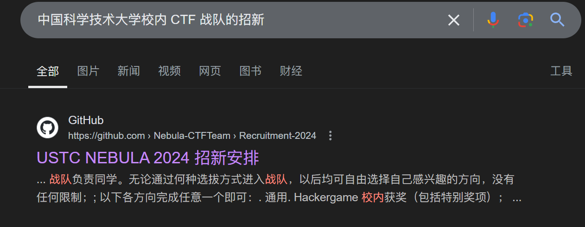

视奸Github主页得到网站：

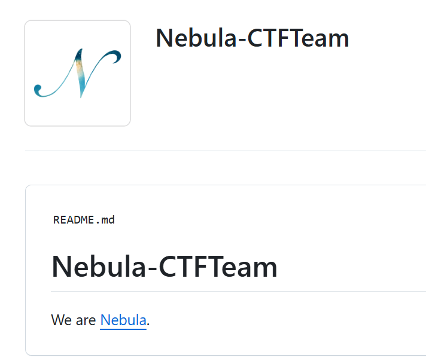

进去后发现是个网页终端，扣个help看看情况，然后一个个尝试命令，发现env里有第一个flag；


第二个我转了半天圈之后，想到这既然是个Web题，就开始开F12观察网络交互，然后发现这应该是个纯前端的页面，就开始在js文件搜索flag：


发现原来是ls的时候有个隐藏目录，直接用cat拿到flag2。


#### 猫咪问答（Hackergame 十周年纪念版）

第一小问有点刁钻，因为Hackergame2015不叫2015。

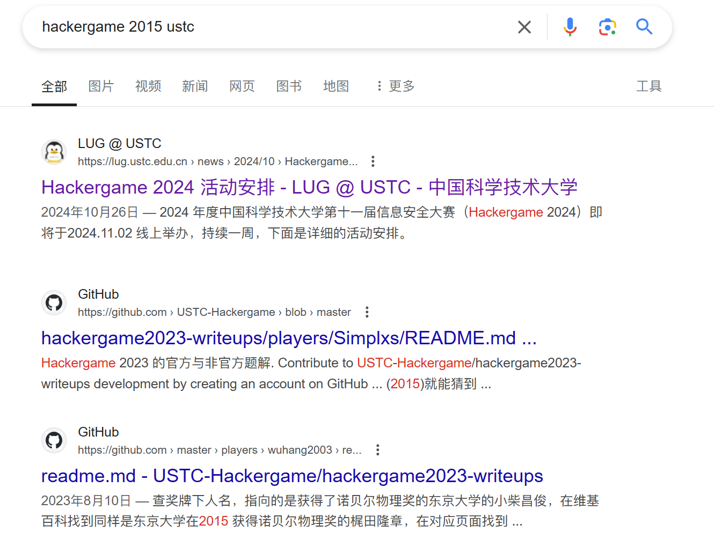

直接用2015搜索没有什么结果，后来才翻到那会儿叫第二届信息安全竞赛：

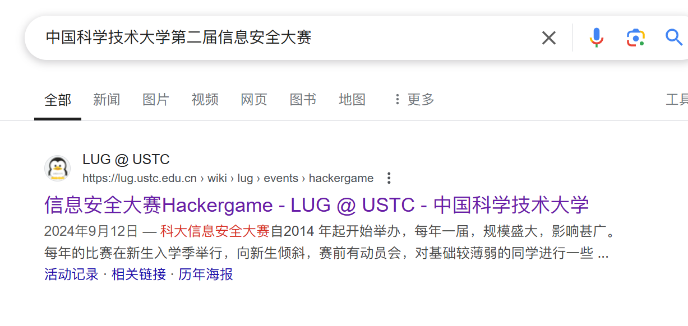

点进去有第二届的存档，才找到教室名。


第二小问，直接对比每年的题目数量：

2019 28
2020 31
2021 31
2022 33
2023 39

找到2019届的存档帖子，参赛人数2682人。

第三小问找2018年的存档Github仓库，搜图书馆就有结果。

第四小问需要阅读论文，一开始我把参与者看成了组合，填了个50，然后又以为是16个邮件服务商*20个客户端，应该是320，再集中注意力仔细阅读才发现是336。

第五小问由于之前就关注过新闻，直接搜linux remove maintainer就能找到原始Patch。

第六小问搜索Llama 3 70B tokenizer online，找了个[在线的tokenizer](https://lunary.ai/llama3-tokenizer)算出结果。


#### 打不开的盒

找了个在线的stl文件编辑器，改成空心的，再扭两下就能看到flag。


#### 每日论文太多了！

反复阅读了三四遍这个论文，不得要领，试了试从元数据里找文件作者，无果；又试了试文内搜索flag，看到了在某张图片附近有个白色的flag文字，附近有一串汇编代码，这串代码似乎和旁边的注释没什么关系，但也没有给什么flag的信息；

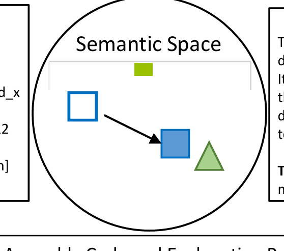

但是能看出这下面似乎有什么东西被这个图标挡住了，最后急眼了，直接找了个把pdf内图片拆出来的工具，果然flag是放在了图片里。

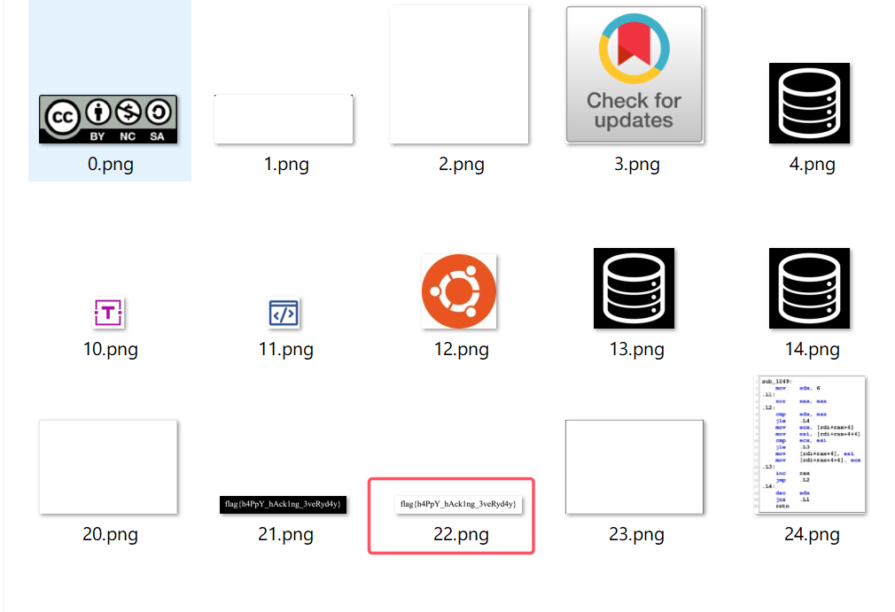

####  比大小王

点击开始之后一看对手一秒十题，就感觉不太对劲，打开F12一看有接口请求，从`/game`接口的发起方定位到核心逻辑：

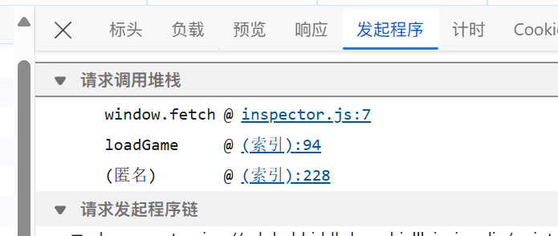

果然翻翻附近就有个submit方法，把`game`接口复制成fetch，然后改改，改成submit接口，再把网页内容和/game返回的结果扔给GPT，让GPT帮我补全计算答案的部分:

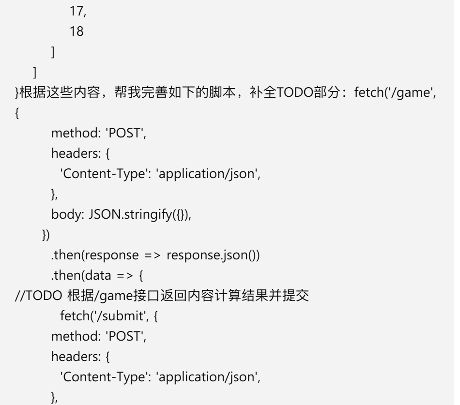

结果发现后端会返回检测到时间穿越，集中注意力仔细观察后，发现`/game`接口会返回开始时间，继续提醒GPT让他修改：


扔到控制台执行即可。


#### 旅行照片 4.0

其实我个人是不太喜欢在CTF做OSINT的，因为要对上电波很难（被隔壁GG的铁道折磨），但这次的旅行照片还好？

##### ...LEO 酱？……什么时候

搜索科大硅谷和科里科气创业园，在合肥有很多结果，但我想了想既然是中科大的CTF应该不会离学校太远，因此找了一个离学校最近的，叫【中国蜀山科里科气科创驿站(科大站)】的地方，看百度地图的相册，确实是这里：


找到校门即可。

至于科大的ACG音乐会


视奸微博可知是今年5月19日。

##### 诶？我带 LEO 酱出去玩？真的假的？

图1可以隐约看到几个字：


想了想， 这种城市绿道建好应该有当地新闻，直接搜索


感觉一个城市里应该没有太多这种比较大的公园，随便输了个中央公园，直接蒙对。

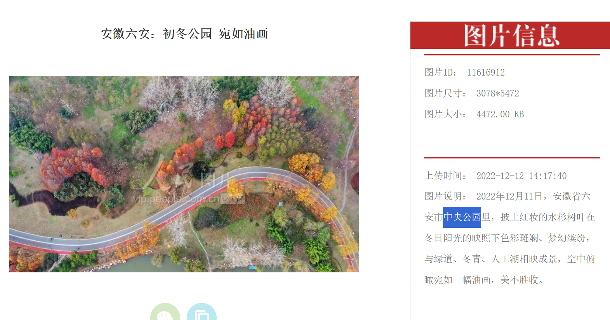

照片2用百度识图，可以找到这篇新闻：


下方赫然

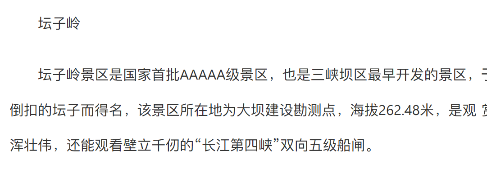

##### 尤其是你才是最该多练习的人

根据题目给的四编组动车的提示，搜索图片，匹配粉色涂装和车头小车窗的只有：怀密线，根据相关新闻可以搜出车型。

虽然图片里像停保基地，但我实际上没有找到这个基地，而是根据怀密线的路线查看每个站的卫星地图，发现拥有和照片类似规模的只有 北京北站，接下来就是根据附近的医院开始蒙答案，蒙到了一个积水潭：


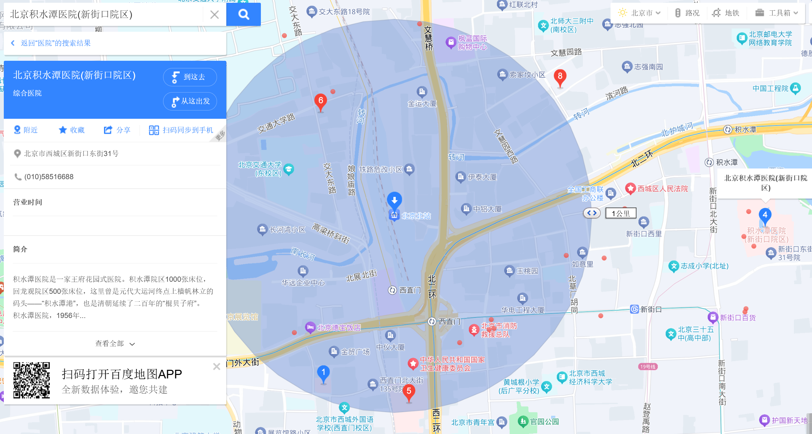


#### PowerfulShell

其实一开始看到这么多禁用字符的时候，我是绝望的，一看什么`.`啊 `/`啊都没了，想路径穿越也不太可能。

慢慢查着eval的资料，得知它有个俗称【二次解析】的操作，也就是会先把变量名之类的取出来拼成命令名，再执行；

翻了[Bash scripting cheatsheet](https://devhints.io/bash)之后我留意到可以用下划线和波浪号，而~里返回了`/players`，$-里又返回了`hB`，那s和h不就是sh嘛！

接下来就是无聊的截取字符串阶段：


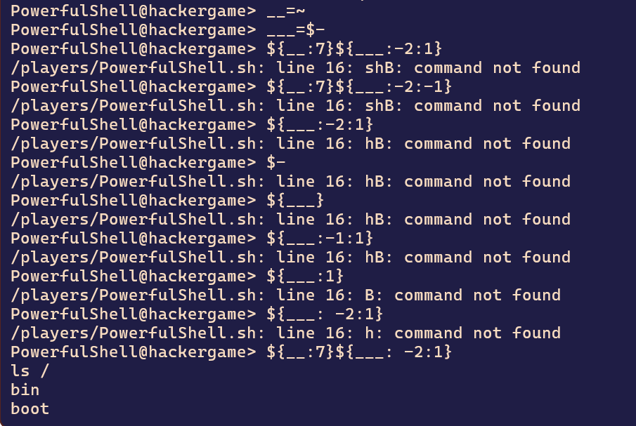


#### Node.js is Web Scale

拿到代码看了一会，发现留了执行命令的口子，但命令仅限于预先设定好的对象里。


直接把源码扔给GPT询问有没有RCE的思路，GPT提示我`execSync`的入参可以执行代码（这我当然知道），再告诉GPT这个入参受到限制，终于得到了思路：

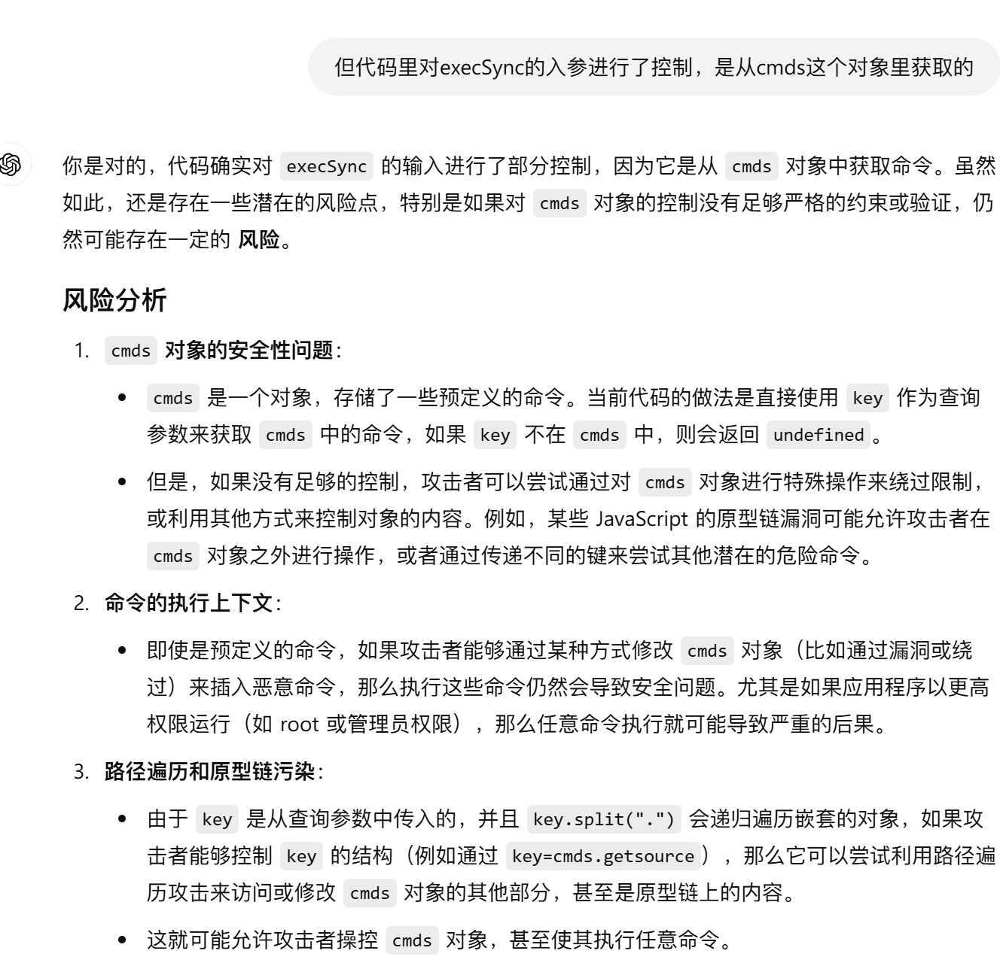

这下虽然不干前端，但也想到了`__proto__`这个原型链污染机制，可以构造payload了，`__proto__.getsource2 = cat /flag`，这样污染之后`cmds`对象也会多一个getsource2 属性。

看到OK的时候上面没有出现内容就知道成功了：

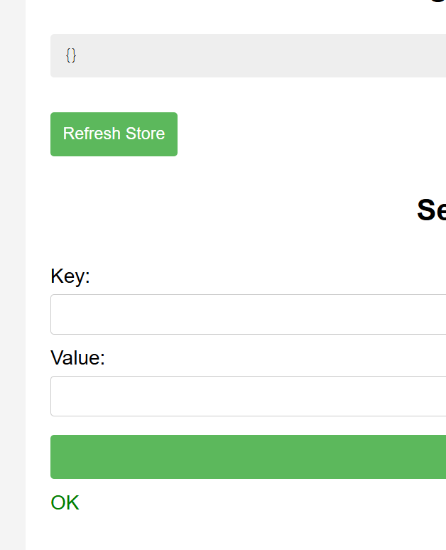

访问`/execute?cmd=getsource2`即可：


#### PaoluGPT

观察代码，发现分为一个业务（main.py）和一个db操作（database.py）两个python文件，db里没有太多特殊逻辑，仅仅读写了一个sqlite文件，而业务里有两个SQL，其中一个能接受入参：

```sql
"select title, contents from messages where id = '{conversation_id}'
```

这里可以看出仅做了简单的拼接，而另一个SQL里有`shown=true`的查询条件，直接构造查询入参：

```sql
' OR shown=false --
```

找到第二个flag。

既然flag在正文里，那第一个flag也好找了，直接用contents做like查询，再把刚才第二个flag的文章过滤掉：

```sql
' OR contents like '%flag%' AND contents not like '%df9b340da4%' --
```


#### 惜字如金 3.0

这题只做了第一小问，拿到python文件，根据语法报错，补上少掉的e啊、little的t之类的，白嫖了150分。

第二小问我发现要还原CRC用的多项式，直接放弃！


#### 关灯

直接把代码扔给GPT，让它生成一个求解代码：

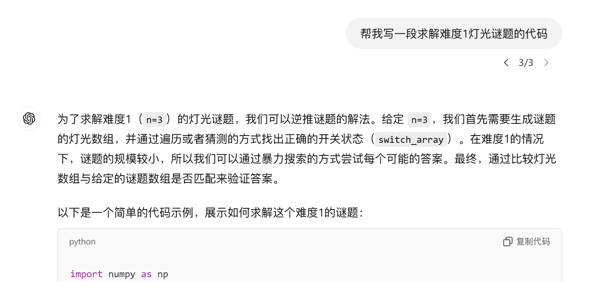

结果它给了一个暴力搜索的答案，连难度1都过不去，哪怕我开了多进程也过不去。

接下来我又从网上找到了一篇用线性代数解关灯问题的文章，作为提示词扔给GPT：

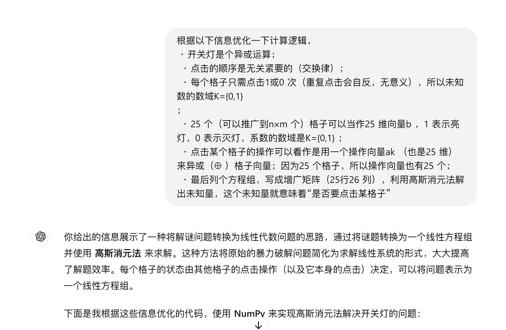

成功过掉前面三问。

哎，GPT让我这种基本不懂数学的也能混math分，出题人看到了估计要气死（


#### 零知识数独

直接从Github找了一个解数独的python代码[pampa0629/sudu: 用python+numpy解数独](https://github.com/pampa0629/sudu)混下第一小题，哎，混分