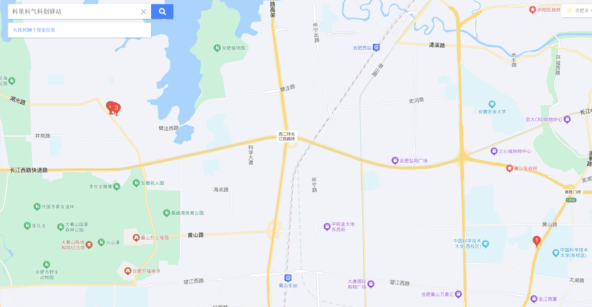
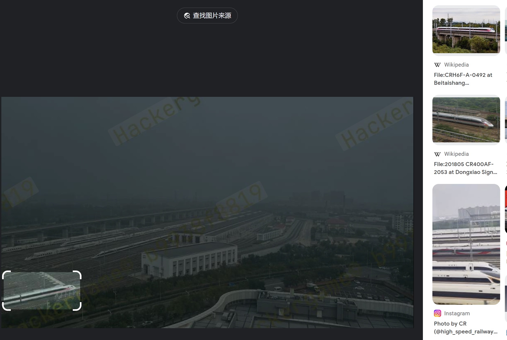
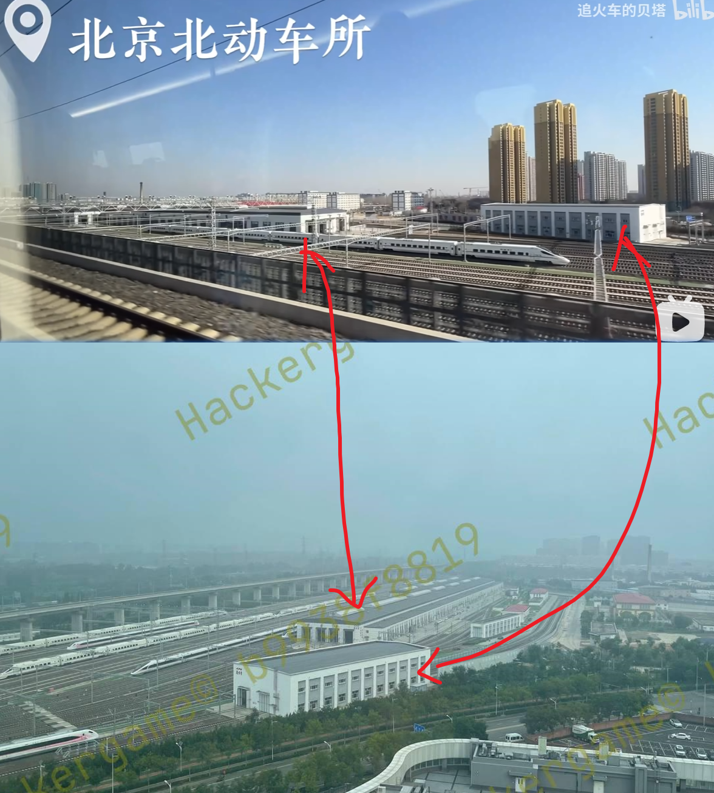

# 鸟桃 writeup

总分5500， 总排名：38 / 2460 ，组内排名：6 / 389

今年应该是第四次打hackergame了，前两次码力不强同时也是在试水，第三年摸到了hackergame校内三等奖的最后一名，今年摸到了二等奖的最后一名，明年可以摸到一等奖的最后一名吗（bushi

因为有点懒所以随便记一下解法吧（？

## 先不说关于我从零开始独自在异世界转生成某大厂家的 LLM 龙猫女仆这件事可不可能这么离谱，发现 Hackergame 内容审查委员会忘记审查题目标题了ごめんね，以及「这么长都快赶上轻小说了真的不会影响用户体验吗🤣」

因为是本 writeup 唯一有含金量的地方所以放到前面了

flag1 直接生成配合gpt等大模型还算能猜出来的所以不表，直接flag2

本质是一个猜词游戏，但需要猜的符合分布，所以直接dfs配合混淆条件进行剪枝，可以得到符合条件的解

先把 qwen 的 conv_template 抠出来之后换成 prompt 的形式（这一步也可以在 llama_cpp 里面打断点得到），然后带着温度来一步步预测下一个token来dfs确保可以获得多样性的结果

```python
import random
from llama_cpp import Llama

llm = Llama(
    model_path="llm_censored_docker/qwen2.5-3b-instruct-q8_0.gguf",
    n_ctx=1024,
    seed=random.SystemRandom().randint(0, 2**64),
    verbose=False,
)

prompt = "<|im_start|>system\nYou are a professional CTF player.<|im_end|>\n<|im_start|>user\nWrite a short article for Hackergame 2024 (中国科学技术大学 (University of Science and Technology of China) 第十一届信息安全大赛) in English. The more funny and unreal the better. About 500 words.<|im_end|>\n<|im_start|>assistant\n"


def tok(t):
    return llm.tokenize(
        t.encode("utf-8"),
        add_bos=False,
        special=True,
    )

prompt = tok(prompt)
target_chars = "hkrgameofustcx "

def dfs(prompt, text, depth=5):
    if "x" not in text:
        # 如果没有需要替换的字符，直接返回完整的 prompt
        return text

    line = "NOT FOUND"
    for _ in range(depth):
        token = llm.create_completion(
            prompt, max_tokens=1
        )["choices"][0]["text"]
        if len(token) > len(text):
            continue
        comp_text, next_text = text[: len(token)], text[len(token) :]
        if all([g in target_chars if r == "x" else g == r for g, r in zip(token, comp_text)]):
            next_prompt = prompt + tok(token)

            line = dfs(next_prompt, next_text, depth)
            if line != "NOT FOUND":
                return token + line

    return "NOT FOUND"

# 读取文件并处理每一行
with open(
    "llm_censored_docker/censor_lv2/after.txt", "r"
) as f:
    texts_after = f.readlines()

for line in texts_after:
    if "x" in line:
        for depth in range(5, 101, 5):
            next = dfs(prompt, line, depth)
            if next != "NOT FOUND":
                line = next
                break
        else:
            print("NOT FOUND")
            exit(1)
    print(line, end="")
    prompt = prompt + tok(line)
```

问题来了，这样获得的文本虽然符合条件但大概率是不符合 hash 的

实际上观察多次生成后文本的diff，发现两个文本之间的不同之处仅仅是几个词的变化，比如 `our <-> the`， `show off <-> showcase`，因此只需要生成足够多的文章，然后对不同之处排列一遍找到 hash 正确的值即可

```python
import os
import hashlib

os.chdir("llm_censored_docker/censor_lv2")
num = 6 # 只用了六篇输出

file_list = [f"before{i}.txt" for i in range(1, num + 1)]

texts = []
for file in file_list:
    texts.append(open(file, "r").read())

diff = {}
# {index: set(diff_char_ses)}

# 生成diff表
for i in range(1, num):
    origin_text = texts[i]
    for j in range(i + 1, num):
        diff_text = texts[j]

        diff_index = [
            index for index, (c1, c2) in enumerate(zip(origin_text, diff_text)) if c1 != c2
        ]

        # width小于5的diff合并
        width = 5
        diff_merge = []
        last_index_begin = -1000
        last_index_end = -1000
        for index in diff_index:
            if index - last_index_end > width:
                if last_index_begin != -1000:
                    diff_merge.append((last_index_begin, last_index_end))
                last_index_begin = index
            last_index_end = index
        if last_index_begin != -1000:
            diff_merge.append((last_index_begin, last_index_end))
        for begin, end in diff_merge:
            if begin not in diff:
                diff[begin] = set()
            diff[begin].add(origin_text[begin : end + 1])
            diff[begin].add(diff_text[begin : end + 1])

sha = "f0d1d40fdef63ea6a6dc97ba78a59512deb07ad9ecad1e3fd16c83151d51fe58"
getsha = lambda text: hashlib.sha256(text.encode()).hexdigest()

diff = [[key, list(value)] for key, value in diff.items()]

num_options = len(diff)

# 遍历diff表
def generate_and_compare(texts, diff, target_sha):
    for i in range(2**num_options):
        binary_repr = bin(i)[2:].zfill(num_options)  # 生成二进制表示

        # 创建一个复制的原始文本
        modified_text = texts[0]

        # 遍历所有diff项并根据binary_repr选择每个diff项的内容
        for i, (index, diff_options) in enumerate(diff):
            # binary_repr[index] 取值为 '0' 或 '1'
            choice = int(binary_repr[i])  # '0' -> 0, '1' -> 1
            option = diff_options[choice]  # 根据选择选择diff的选项

            # 用选项替换文本中的相应部分
            modified_text = modified_text[:index] + option + modified_text[index + len(option) :]

        # 计算修改后的文本的SHA-256哈希
        current_sha = getsha(modified_text)

        # 如果哈希值匹配目标哈希，则输出文本
        if current_sha == target_sha:
            print(f"Match found with binary {binary_repr}!")
            print(modified_text)
            return modified_text  # 返回匹配的文本

    print("No match found.")
    return None  # 没有找到匹配的文本

generate_and_compare(texts, diff, sha)
```

## 旅行照片 4.0

很快啊，马上来做了，我一直都是旅行照片的粉丝啊.jpg

### ...LEO 酱？……什么时候

百度地图搜了一下科里科气科创驿站，只有一个红点（右下角）离科大很近，即可秒了**东校区西门**



在leo酱的 [动态](https://t.bilibili.com/932398865548574741) 里找到了随机宅舞的预告，但是恰好有acg音乐会，那就得到了答案**2024/05/19**


### 诶？我带 LEO 酱出去玩？真的假的？

好难一道题，谷歌图解不出来，但是谷歌图解告诉我们上面的路的中央线叫“彩虹划线”，配合右下角关键词“六安”找到一篇[新（旧）闻](https://www.sohu.com/a/498872898_100023473)，说是中央公园，在六安地图上搜到了**中央森林公园**，所以就是答案

下一个问题是谷歌搜图强势区，略过不表

### 尤其是你才是最该多练习的人

同样谷歌搜图，把框限定在左下角的火车上，就可以确定车型（下图右上角wiki），还告诉我们是怀密线



本来以为这里是车站啥的，然后在全景图上找了半天车站也没找到相似的走向，最后在阿b里面怀密线相关的vlog中找到了相关信息，[视频](https://www.bilibili.com/video/BV12z421Z74c)的4:23中找到了和照片两个建筑的布局相同的类似建筑，通过地图验证后可以认为是正确的，那么就可以找到最近的医院，照片应该也是在医院顶楼拍的



### 碎碎念

感觉今年的旅行照片多多少少有点散了，各部分没有很强的关联性，还是比较喜欢一次旅游能留下的那种比较成体系的照片（

## 无法获得的秘密

明明看到一个简直是秒解的[编码形式](https://github.com/sz3/cimbar)，但为什么传不上去，多洗爹

总之试了一下15min用模拟键盘输入的方法传base64文件传不了500k这样的数据，纯传需要45min左右

所以最后还是只传了一个45k的qrcode的python库，base64之后大小58k，大概四分钟能传上去，然后将文件转化三千五百左右的二维码录屏解码得到文件，正好快到十五分钟，真是极极又限限啊

```python
# encoder
import base64
import qrcode
import time


def encode_file_to_terminal_qr(filepath, chunk_size=200):
    # 读取二进制文件并进行Base64编码
    with open(filepath, "rb") as f:
        b64_data = base64.b64encode(f.read()).decode("utf-8")

    # 将Base64字符串分块，并生成控制台QR码
    for i in range(0, len(b64_data), chunk_size):
        print(f"--- Frame {i // chunk_size} / {len(b64_data)//chunk_size +1} ---\n")
        chunk = b64_data[i : i + chunk_size]
        qr = qrcode.QRCode()
        qr.add_data(chunk)
        qr.print_ascii(invert=True)  # 在控制台打印二维码

        # 可以加入延时，确保录屏每帧都能记录到
        time.sleep(0.1)

filepath = "/secret"

print("begin output for 3s after")

time.sleep(3)

encode_file_to_terminal_qr(filepath)
```

```python
# decoder
import cv2
from pyzbar.pyzbar import decode
from PIL import Image
import base64
import numpy as np


def extract_qr_data_from_video(video_path, output_file):
    # 初始化视频读取对象
    cap = cv2.VideoCapture(video_path)

    last_data = None  # 保存上一个QR码内容
    last_image = None
    output_data = []  # 收集非重复的QR码内容

    frame_count = 0
    while cap.isOpened():
        ret, frame = cap.read()
        if not ret:
            break

        # 转换帧为灰度图像以便解析QR码
        gray = cv2.cvtColor(frame, cv2.COLOR_BGR2GRAY)
        # 假设 gray 是当前帧，last_image 是上一帧
        if last_image is not None:
            diff = cv2.absdiff(gray, last_image)  # 计算两帧的绝对差异
            non_zero_diff = np.count_nonzero(diff)  # 计算非零差异的像素数
            ratio = non_zero_diff / gray.size
            last_image = gray

            if ratio < 0.1:
                frame_count += 1
                continue
        else:
            last_image = gray

        pil_img = Image.fromarray(gray)

        # 解析QR码
        decoded_objects = decode(gray)

        # 如果检测到QR码
        if decoded_objects:
            qr_data = decoded_objects[0].data.decode("utf-8")

            # 若当前QR码内容与上次不同，添加到输出列表
            if qr_data != last_data:
                output_data.append(qr_data)
                last_data = qr_data  # 更新last_data
                print(f"Frame {frame_count}: QR data added.")
            else:
                print(f"Frame {frame_count}: Duplicate QR data skipped.")

        frame_count += 1

    cap.release()

    # 将收集的所有QR码数据连接成完整的Base64字符串
    full_b64_data = ''.join(output_data)

    # Base64解码并保存为原始文件
    binary_data = base64.b64decode(full_b64_data)
    with open(output_file, "wb") as f:
        f.write(binary_data)

    print(f"File has been reconstructed and saved as {output_file}")

video_path = "/hackergame/无法获得的秘密/QQ2024118-164211_1.mp4" # 没错是qq录屏
output_file = "/hackergame/无法获得的秘密/output.jpg"
extract_qr_data_from_video(video_path, output_file)
```

模拟键盘输入的方法还会时不时出现输入错位的情况，很申必，还得时不时sleep一下防止太快催人跑，做得很折磨

## 最后是属于大模型的荣誉时刻

挺多题甚至都不是大模型辅助，都是直接通过逼问大模型问出来的，在这里稍微列个表（

- Node.js is Web Scale：来自【通义千问】“JavaScript对象的`__proto__`属性允许修改对象的原型链。攻击者可以利用这一点来修改`cmds`对象的原型，从而影响所有对象的行为。”
- 看不见的彼方：交换空间（flag1）：来自【gpt-4o】，帮我直接把socket通信和相关的cpp代码做完了，但flag2还是需要自己手改一下，不能直接问出来
- 链上转账助手（flag1、2）：没看懂题目，也没看懂解答，但【gpt-4o】也干了
- 不太分布式的软总线（flag1、2）：本来就是一知半解，但【gpt-4o】也告诉了我两个解法，第三个在 `get_flag3.cpp` 上面改也是勉强出来了

## 总结

好玩，爱玩，多玩。期待明年的hackergame喵